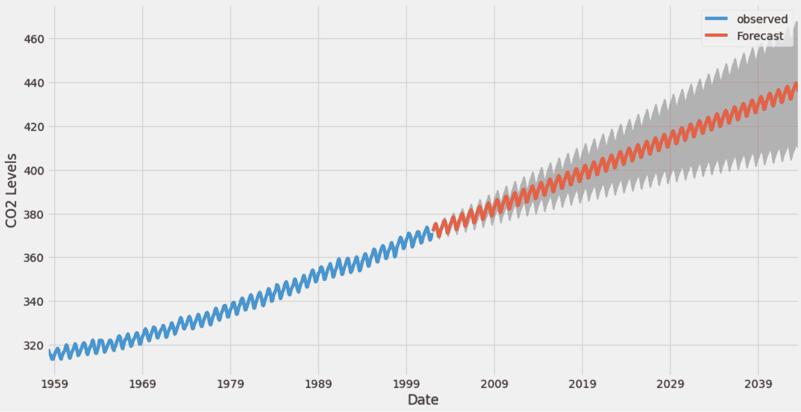
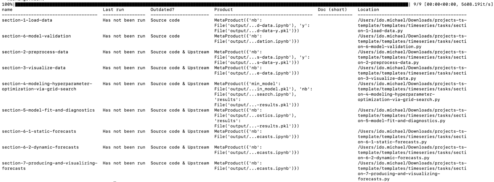
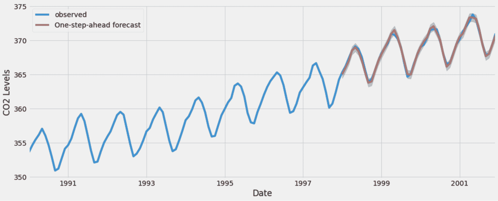
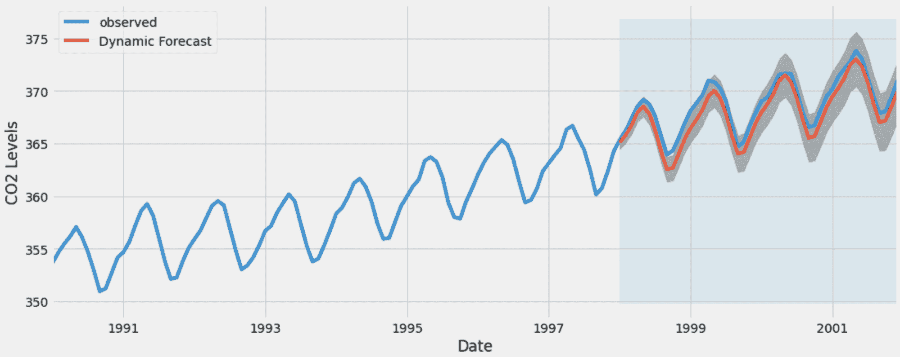

# 使用 Ploomber、Arima、Python 和 Slurm 进行时间序列预测

> 原文：[`www.kdnuggets.com/2022/03/time-series-forecasting-ploomber-arima-python-slurm.html`](https://www.kdnuggets.com/2022/03/time-series-forecasting-ploomber-arima-python-slurm.html)



在这篇博客中，我们将回顾如何将一个用于时间序列预测的原始 .ipynb 笔记本，模块化为一个 [Ploomber](https://ploomber.io/) 管道，并在 Slurm 上运行并行作业。你可以按照本指南中的步骤自行部署。我们使用了 [这份笔记本](https://github.com/williewheeler/time-series-demos/blob/master/arima/arima-python.ipynb) 由 Willie Wheeler 提供。

* * *

## 我们的前三个课程推荐

 1\. [Google 网络安全证书](https://www.kdnuggets.com/google-cybersecurity) - 快速进入网络安全职业的快车道。

 2\. [Google 数据分析专业证书](https://www.kdnuggets.com/google-data-analytics) - 提升你的数据分析技能

 3\. [Google IT 支持专业证书](https://www.kdnuggets.com/google-itsupport) - 支持你的组织 IT

* * *

# 简短的笔记本解释

这个笔记本由 8 个任务组成，我们将在下面的图表中看到。它包括建模的大多数基本步骤——获取数据、清洗数据、拟合、超参数调优、验证和可视化。作为捷径，我使用了 [Soorgeon](https://github.com/ploomber/soorgeon) 工具将笔记本自动模块化成 Ploomber 管道。这将所有依赖项提取到一个 requirements.txt 文件中，将标题拆分为独立任务，并根据这些模块化任务创建了一个管道。使用 Ploomber 的主要好处是它允许我更快地进行实验，因为它会缓存先前运行的结果，并且可以轻松地将并行作业提交到 SLURM 以微调模型。

# 本地运行管道？

首先运行这个命令来在本地克隆示例（如果你还没有 ploomber，首先 [安装 Ploomber](https://docs.ploomber.io/en/latest/get-started/install.html)）：

```py
ploomber examples -n templates/timeseries -o ts
cd ts
```

现在你在本地有了管道，你可以进行一个完整性检查并运行：

```py
ploomber status
```

这应该会展示管道的所有步骤及其状态（**尚未运行**），这是一个参考输出：



如果你只对时间序列部分感兴趣，你也可以在本地构建管道。接下来，我们将看到如何在 Slurm 集群上开始执行，并且如何进行并行运行。

# 在 Slurm 上编排

为了简化，我们将展示如何使用 Docker 启动一个 SLURM 集群，但如果你有现成的集群可以使用，也可以使用那个。我们创建了一个名为 Soopervisor 的工具，它允许我们将管道部署到 SLURM 以及其他平台如 Kubernetes、Airflow 和 AWS Batch。我们将遵循[Slurm 指南](https://soopervisor.readthedocs.io/en/latest/tutorials/slurm.html)。

你必须有一个正在运行的 docker 代理才能启动集群，[在这里阅读更多](https://docs.docker.com/get-docker/)关于如何开始使用 Docker。

## 第一步

创建一个 docker-compose.yml。

```py
wget https://raw.githubusercontent.com/ploomber/projects/master/templates/timeseries/docker-compose.yml
```

一旦完成，启动集群：

```py
docker-compose up -d
```

现在我们可以通过以下命令连接到集群：

```py
docker-compose exec slurmjupyter /bin/bash
```

## 第二步

现在我们已经进入集群，我们需要对其进行引导，并确保我们拥有要运行的管道。

获取引导脚本并运行，这是引导集群的脚本：

```py
wget https://raw.githubusercontent.com/ploomber/projects/master/templates/timeseries/start.sh
chmod 755 start.sh
./start.sh
```

获取时间序列管道模板：

```py
ploomber examples -n templates/timeseries -o ts
cd ts
```

安装需求并通过 soopervisor 添加：

```py
ploomber install
soopervisor add cluster –backend slurm
```

这将创建一个包含 soopervisor 用于提交 Slurm 任务的模板（template.sh）的集群目录。

我们执行导出命令以转换管道并将作业提交到集群。完成后，我们可以在`output`文件夹中查看所有输出：

```py
soopervisor export cluster
ls -l ./output
```

我们可以看到这里一些由模型生成的预测：





请注意，如果你再次运行，只有变化的任务会运行（有一个缓存来管理它）。完成后，不要忘记关闭集群：

```py
docker-compose stop
```

# 总结

本博客展示了如何将时间序列作为模块化管道运行，这样可以扩展到分布式集群训练。我们从一个笔记本开始，转移到管道中，并在 SLURM 集群上执行。一旦我们过了单个用户在笔记本上的阶段（例如团队或生产任务），确保能够扩展、协作并可靠地执行工作就变得很重要。由于数据科学是一个迭代过程，Ploomber 为你提供了一个简单的机制来标准化工作，并在开发和生产环境之间快速移动。

确保与我们以及其他数百名社区成员[通过 slack](https://ploomber.io/community)进行连接。

如果你有任何反馈或评论，我很乐意听取！

**[Ido Michael](https://www.linkedin.com/in/ido-michael/)** 共同创立了 Ploomber，旨在帮助数据科学家更快地构建。他曾在 AWS 领导数据工程/科学团队。在这些客户合作中，他与团队一起独立构建了数百个数据管道。来自以色列的他来到纽约，获得了哥伦比亚大学的硕士学位。在发现项目常常需要将约 30%的时间用于将开发工作（原型）重构为生产管道后，他专注于构建 Ploomber。

### 相关话题

+   [时间序列分析：Python 中的 ARIMA 模型](https://www.kdnuggets.com/2023/08/times-series-analysis-arima-models-python.html)

+   [使用 statsmodels 和 Prophet 进行时间序列预测](https://www.kdnuggets.com/2023/03/time-series-forecasting-statsmodels-prophet.html)

+   [利用 XGBoost 进行时间序列预测](https://www.kdnuggets.com/2023/08/leveraging-xgboost-timeseries-forecasting.html)

+   [Ploomber 与 Kubeflow：简化 MLOps](https://www.kdnuggets.com/2022/02/ploomber-kubeflow-mlops-easier.html)

+   [从 Google Colab 到 Ploomber 管道：利用 GPU 实现大规模机器学习](https://www.kdnuggets.com/2022/03/google-colab-ploomber-pipeline-ml-scale-gpus.html)

+   [用最先进的深度学习技术进行可解释的预测和即时预测](https://www.kdnuggets.com/2021/12/sota-explainable-forecasting-and-nowcasting.html)
