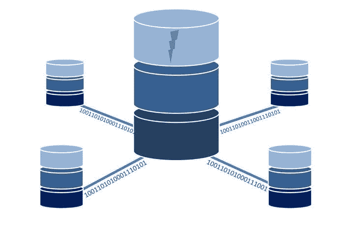
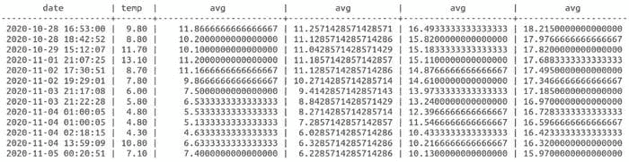

# 使用 SQL 处理时间序列

> 原文：[`www.kdnuggets.com/2021/04/time-series-using-sql.html`](https://www.kdnuggets.com/2021/04/time-series-using-sql.html)

评论

**由 [Michael Grogan](http://michael-grogan.com/)，数据科学顾问**



来源：[Tumisu](https://pixabay.com/users/tumisu-148124/) 提供的照片，来自 [Pixabay](https://pixabay.com/illustrations/database-data-computer-network-1954920/)

Python 或 R 等工具通常用于进行深入的时间序列分析。

然而，了解如何使用 SQL 处理时间序列数据是必不可少的，特别是当处理非常大的数据集或不断更新的数据时。

这里有一些可以在 SQL 中调用的有用命令，用于更好地处理数据表中的时间序列数据。

### 背景

在这个例子中，我们将处理在不同时间和地点收集的天气数据。

PostgreSQL 数据库表中的数据类型如下：

```py
weather=# SELECT COLUMN_NAME, DATA_TYPE FROM INFORMATION_SCHEMA.COLUMNS WHERE TABLE_NAME = 'weatherdata';
 column_name |          data_type          
-------------+-----------------------------
 date        | timestamp without time zone
 mbhpa       | integer
 temp        | numeric
 humidity    | integer
 place       | character varying
 country     | character varying
 realfeel    | integer
 timezone    | integer
(8 rows)
```

如你所见，*date* 被定义为没有时区的时间戳数据类型（我们在本文中也会讨论这一点）。

我们关注的变量是 temp（温度）——我们将探讨如何使用 SQL 更直观地分析这个变量。

### 计算移动平均值

这是数据表中一些列的片段：

```py
 date         | mbhpa | temp  | humidity 
---------------------+-------+-------+----------
 2020-10-12 18:33:24 |  1010 | 13.30 |       74
 2020-10-15 02:12:54 |  1017 |  7.70 |       75
 2020-10-14 23:53:42 |  1016 |  8.80 |       75    
 2020-10-15 11:03:25 |  1016 |  9.70 |       75      
 2020-10-15 13:05:23 |  1017 | 12.30 |       74    
 2020-10-15 18:47:25 |  1015 | 12.10 |       74     
 2020-10-16 23:23:23 |  1011 |  9.10 |       75   
 2020-10-20 10:25:15 |   967 | 13.80 |       83   
 2020-10-27 16:30:30 |   980 | 12.00 |       75   
 2020-10-29 15:12:07 |   988 | 11.70 |       75   
 2020-10-28 18:42:52 |   990 |  8.80 |       77
```

假设我们希望计算不同时间段的温度移动平均值。

为此，我们首先需要确保数据按日期排序，并决定在平均窗口中包含多少期。

首先，使用 7 期移动平均值，并按日期排序所有温度值。

```py
>>> select date, avg(temp) OVER (ORDER BY date ROWS BETWEEN 6 PRECEDING AND CURRENT ROW) FROM weatherdata where place='Place Name';        date         |         avg         
---------------------+---------------------
 2020-11-12 16:36:40 |  8.8285714285714286
 2020-11-14 15:45:08 |  9.8142857142857143
 2020-11-15 08:53:26 | 10.3857142857142857
 2020-11-17 10:50:32 | 11.2285714285714286
 2020-11-18 14:18:58 | 11.8000000000000000
 2020-11-25 14:54:11 | 11.6285714285714286
 2020-11-25 19:00:21 | 10.9142857142857143
 2020-11-25 19:05:31 | 10.2000000000000000
 2020-11-25 23:41:34 |  9.2857142857142857
 2020-11-26 15:03:10 |  9.4857142857142857
 2020-11-26 17:18:33 |  8.3428571428571429
 2020-11-26 21:30:39 |  7.9142857142857143
 2020-11-26 22:29:17 |  7.6142857142857143
```

现在，让我们添加 30 期和 60 期的移动平均值。我们将把这些平均值与 7 期移动平均值一起存储在一个表中。

```py
>>> select date, temp, avg(temp) OVER (ORDER BY date ROWS BETWEEN 2 PRECEDING AND CURRENT ROW), avg(temp) OVER (ORDER BY date ROWS BETWEEN 6 PRECEDING AND CURRENT ROW), avg(temp) OVER (ORDER BY date ROWS BETWEEN 29 PRECEDING AND CURRENT ROW), avg(temp) OVER (ORDER BY date ROWS BETWEEN 59 PRECEDING AND CURRENT ROW) FROM weatherdata where place='Place Name';
```



来源：作者创建的输出

有关如何在 SQL 中计算移动平均值的更多信息，请参见 [sqltrainingonline.com](https://www.sqltrainingonline.com/sql-moving-average/) 提供的资源。

### 处理时区

你会注意到时间戳包含日期和时间。虽然在表中仅存储一个地点时这样没问题，但处理跨多个时区的地点时情况会变得相当复杂。

请注意，表中创建了一个名为*timezone*的整数变量。

假设我们正在分析不同地点的天气模式，这些地点的时间范围在输入时间之前——在这种情况下，所有数据点都是以 GMT 时间输入的。

```py
 date          | timezone 
---------------------+----------
 2020-05-09 15:29:00 |       11
 2020-05-09 17:05:00 |       11
 2020-05-09 17:24:00 |       11
 2020-05-10 13:02:00 |       11
 2020-05-13 19:13:00 |       11
 2020-05-10 13:04:00 |       11
 2020-05-10 15:47:00 |       11
 2020-05-13 19:10:00 |       11
 2020-05-14 17:17:00 |       11
 2020-05-09 15:20:00 |        5
 2020-05-09 17:04:00 |        5
 2020-05-09 17:25:00 |        5
 2020-05-09 18:12:00 |        5
 2020-05-10 13:02:00 |        5
 2020-05-10 15:50:00 |        5
 2020-05-10 20:32:00 |        5
 2020-05-11 17:31:00 |        5
 2020-05-13 19:11:00 |        5
 2020-05-17 21:41:00 |       11
 2020-05-15 14:08:00 |       11
 2020-05-14 16:55:00 |        5
 2020-05-15 14:10:00 |        5
(22 rows)
```

新时间可以按如下方式计算：

```py
weather=# select date + interval '1h' * timezone from weatherdata;
      ?column?       
---------------------
 2020-05-10 02:29:00
 2020-05-10 04:05:00
 2020-05-10 04:24:00
 2020-05-11 00:02:00
 2020-05-14 06:13:00
 2020-05-11 00:04:00
 2020-05-11 02:47:00
 2020-05-14 06:10:00
 2020-05-15 04:17:00
 2020-05-09 20:20:00
 2020-05-09 22:04:00
 2020-05-09 22:25:00
 2020-05-09 23:12:00
 2020-05-10 18:02:00
 2020-05-10 20:50:00
 2020-05-11 01:32:00
 2020-05-11 22:31:00
 2020-05-14 00:11:00
 2020-05-18 08:41:00
 2020-05-16 01:08:00
 2020-05-14 21:55:00
 2020-05-15 19:10:00
(22 rows)
```

现在，我们可以将新的时间存储为更新后的变量，我们将其命名为*newdate*。

```py
>>> select date + interval '1h' * (timezone+1) as newdate, temp, mbhpa from weatherdata;      newdate       | temp | mbhpa
--------------------+------+-------
2020-05-10 03:29:00 |  4.2 |  1010
2020-05-10 05:05:00 |  4.1 |  1009
2020-05-10 05:24:00 |  3.8 |  1009
```

该子句允许我们生成更新的时间（这些时间将反映记录变量（如温度、气压等）时的实际时间）。

### 内连接和 Having 子句

你会在上述表格中注意到温度值包括了多个地方。

假设风速也在一个单独的表中为每个地方计算。

在这种情况下，我们希望计算每个列出的地方在风速高于 20 时的平均温度。

可以通过以下方式使用**内连接**和**having**子句来实现：

```py
>>> select t1.place, avg(t1.temp), avg(t2.gust) from weatherdata as t1 inner join wind as t2 on t1.place=t2.place group by t1.place having avg(t2.gust)>'20';      place      |         avg          |         avg          
-----------------+----------------------+----------------------
 Place 1         |        17.3          |        22.4
 Place 2         |        14.3          |        26.8
 Place 3         |        7.1           |        27.1
```

### 结论

在本文中，你已接触到一些使用 SQL 处理时间序列数据的入门示例。

具体来说，你学习了如何：

+   计算移动平均值

+   与不同的时区工作

+   计算不同数据子集的平均值

感谢你的时间，任何问题或反馈都非常欢迎。

*免责声明：本文是基于“现状”写成的，不提供任何保证。本文旨在提供数据科学概念的概述，不应被解读为专业建议。本文中的发现和解释仅代表作者观点，与本文提到的任何第三方无关。*

**简历：[Michael Grogan](http://michael-grogan.com/)** 是一名数据科学顾问。他在时间序列分析、统计学、贝叶斯建模和使用 TensorFlow 的机器学习方面拥有专业知识。

[原文](https://towardsdatascience.com/working-with-time-series-using-sql-34e70ce48025)。经许可转载。

**相关：**

+   多维多传感器时间序列数据分析框架

+   使用 Python 进行拒绝采样

+   深度学习正变得过度使用

* * *

## 我们的前三个课程推荐

 1\. [谷歌网络安全证书](https://www.kdnuggets.com/google-cybersecurity) - 快速开启网络安全职业生涯。

 2\. [谷歌数据分析专业证书](https://www.kdnuggets.com/google-data-analytics) - 提升你的数据分析技能

 3\. [谷歌 IT 支持专业证书](https://www.kdnuggets.com/google-itsupport) - 支持你的组织 IT 事务

* * *

### 相关主题更多内容

+   [停止学习数据科学以寻找目的，并找到目的以...](https://www.kdnuggets.com/2021/12/stop-learning-data-science-find-purpose.html)

+   [90 亿美元 AI 失败案例分析](https://www.kdnuggets.com/2021/12/9b-ai-failure-examined.html)

+   [数据科学学习统计的顶级资源](https://www.kdnuggets.com/2021/12/springboard-top-resources-learn-data-science-statistics.html)

+   [成功数据科学家的五个特征](https://www.kdnuggets.com/2021/12/5-characteristics-successful-data-scientist.html)

+   [什么使 Python 成为初创企业的理想编程语言](https://www.kdnuggets.com/2021/12/makes-python-ideal-programming-language-startups.html)

+   [每位数据科学家都应该知道的三个 R 库（即使你使用 Python）](https://www.kdnuggets.com/2021/12/three-r-libraries-every-data-scientist-know-even-python.html)
