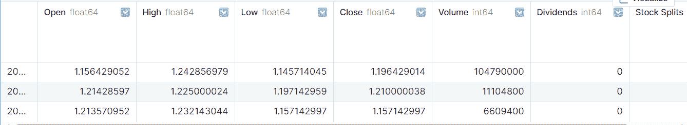
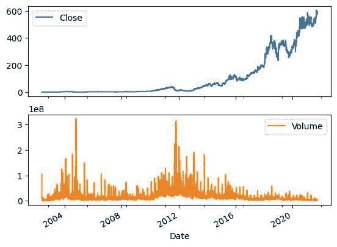
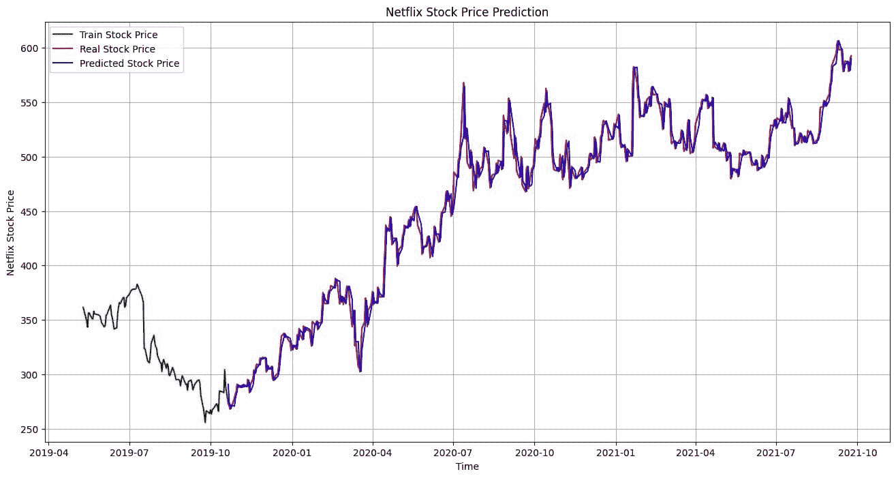

# 时间序列分析：Python 中的 ARIMA 模型

> 原文：[`www.kdnuggets.com/2023/08/times-series-analysis-arima-models-python.html`](https://www.kdnuggets.com/2023/08/times-series-analysis-arima-models-python.html)

时间序列分析广泛用于预测和预测时间序列中的未来点。自回归积分移动平均（ARIMA）模型广泛用于时间序列预测，并被认为是最受欢迎的方法之一。在本教程中，我们将学习如何在 Python 中构建和评估 ARIMA 模型以进行时间序列预测。

# 什么是 ARIMA 模型？

* * *

## 我们的前三名课程推荐

 1\. [Google 网络安全证书](https://www.kdnuggets.com/google-cybersecurity) - 快速进入网络安全职业生涯。

 2\. [Google 数据分析专业证书](https://www.kdnuggets.com/google-data-analytics) - 提升数据分析技能

 3\. [Google IT 支持专业证书](https://www.kdnuggets.com/google-itsupport) - 支持组织的 IT 工作

* * *

ARIMA 模型是一种用于分析和预测时间序列数据的统计模型。ARIMA 方法专门针对时间序列中常见的结构，提供了一种简单而强大的方法来进行熟练的时间序列预测。

ARIMA 代表自回归积分移动平均。它结合了三个关键方面：

+   **自回归（AR）**：一个使用当前观测值与滞后观测值之间的相关性的模型。滞后观测值的数量被称为滞后阶数或 p。

+   **积分（I）**：使用原始观测值的差分来使时间序列平稳。差分操作的次数称为 d。

+   **移动平均（MA）**：模型考虑当前观测值与应用于过去观测值的移动平均模型残差误差之间的关系。移动平均窗口的大小是阶数或 q。

ARIMA 模型用 ARIMA(p,d,q) 进行定义，其中 p、d 和 q 被替换为整数值以指定所使用的确切模型。

**采用 ARIMA 模型时的关键假设：**

+   时间序列是从一个潜在的 ARIMA 过程生成的。

+   参数 p、d、q 必须根据原始观测值适当地指定。

+   在拟合 ARIMA 模型之前，时间序列数据必须通过差分处理使其平稳。

+   如果模型拟合良好，残差应该是无相关性且呈正态分布的。

总结而言，ARIMA 模型提供了一种结构化和可配置的方法，用于时间序列数据建模，例如预测。接下来我们将探讨如何在 Python 中拟合 ARIMA 模型。

# Python 代码示例

在本教程中，我们将使用来自 Kaggle 的[Netflix 股票数据](https://www.kaggle.com/datasets/kalilurrahman/netflix-stock-data-live-and-latest)来预测 Netflix 的股票价格，使用 ARIMA 模型。

## 数据加载

我们将使用“Date”列作为索引加载我们的股票价格数据集。

```py
import pandas as pd

net_df = pd.read_csv("Netflix_stock_history.csv", index_col="Date", parse_dates=True)
net_df.head(3)
```



## 数据可视化

我们可以使用 pandas 的'plot'函数来可视化股票价格和成交量随时间的变化。显然，股票价格在指数增长。

```py
net_df[["Close","Volume"]].plot(subplots=True, layout=(2,1));
```



## 滚动预测 ARIMA 模型

我们的数据集已经分成训练集和测试集，并且我们开始训练一个 ARIMA 模型。然后进行了第一次预测。

我们使用通用 ARIMA 模型得到了不佳的结果，因为它产生了一条平坦的线。因此，我们决定尝试滚动预测方法。

**注意：** 代码示例是 BOGDAN IVANYUK 的[notebook](https://www.kaggle.com/code/bogdanbaraban/ar-arima-lstm#ARIMA-model)的修改版本。

```py
from statsmodels.tsa.arima.model import ARIMA
from sklearn.metrics import mean_squared_error, mean_absolute_error
import math

train_data, test_data = net_df[0:int(len(net_df)*0.9)], net_df[int(len(net_df)*0.9):]

train_arima = train_data['Open']
test_arima = test_data['Open']

history = [x for x in train_arima]
y = test_arima
# make first prediction
predictions = list()
model = ARIMA(history, order=(1,1,0))
model_fit = model.fit()
yhat = model_fit.forecast()[0]
predictions.append(yhat)
history.append(y[0])
```

处理时间序列数据时，由于对先前观测值的依赖，通常需要进行滚动预测。一种方法是在接收到每个新观测值后重新创建模型。

为了跟踪所有观测值，我们可以手动维护一个名为 history 的列表，该列表最初包含训练数据，并在每次迭代中追加新的观测值。这种方法可以帮助我们获得准确的预测模型。

```py
# rolling forecasts
for i in range(1, len(y)):
    # predict
    model = ARIMA(history, order=(1,1,0))
    model_fit = model.fit()
    yhat = model_fit.forecast()[0]
    # invert transformed prediction
    predictions.append(yhat)
    # observation
    obs = y[i]
    history.append(obs) 
```

## 模型评估

我们的滚动预测 ARIMA 模型相比于简单实现显示了 100%的改进，结果令人印象深刻。

```py
# report performance
mse = mean_squared_error(y, predictions)
print('MSE: '+str(mse))
mae = mean_absolute_error(y, predictions)
print('MAE: '+str(mae))
rmse = math.sqrt(mean_squared_error(y, predictions))
print('RMSE: '+str(rmse))
```

```py
MSE: 116.89611817706545
MAE: 7.690948135967959
RMSE: 10.811850821069696
```

让我们可视化并比较实际结果和预测结果。很明显，我们的模型进行了非常准确的预测。

```py
import matplotlib.pyplot as plt
plt.figure(figsize=(16,8))
plt.plot(net_df.index[-600:], net_df['Open'].tail(600), color='green', label = 'Train Stock Price')
plt.plot(test_data.index, y, color = 'red', label = 'Real Stock Price')
plt.plot(test_data.index, predictions, color = 'blue', label = 'Predicted Stock Price')
plt.title('Netflix Stock Price Prediction')
plt.xlabel('Time')
plt.ylabel('Netflix Stock Price')
plt.legend()
plt.grid(True)
plt.savefig('arima_model.pdf')
plt.show() 
```



# 结论

在本简短教程中，我们概述了 ARIMA 模型及其在 Python 中实现时间序列预测的方法。ARIMA 方法提供了一种灵活且结构化的方式来建模依赖于先前观测值以及过去预测错误的时间序列数据。如果你对 ARIMA 模型和时间序列分析的全面分析感兴趣，我建议查看基于时间序列分析的股票市场预测。

**[Abid Ali Awan](https://www.polywork.com/kingabzpro)** ([@1abidaliawan](https://www.linkedin.com/in/1abidaliawan/)) 是一位认证数据科学专家，热衷于构建机器学习模型。目前，他专注于内容创作，并撰写有关机器学习和数据科学技术的技术博客。Abid 拥有技术管理硕士学位和电信工程学士学位。他的愿景是利用图神经网络为面临心理健康问题的学生开发 AI 产品。

### 更多相关主题

+   [使用 Ploomber、Arima、Python 和 Slurm 进行时间序列预测](https://www.kdnuggets.com/2022/03/time-series-forecasting-ploomber-arima-python-slurm.html)

+   [市场数据和新闻：时间序列分析](https://www.kdnuggets.com/2022/06/market-data-news-time-series-analysis.html)

+   [使用 KNIME 进行无代码时间序列分析](https://www.kdnuggets.com/2022/10/packt-codeless-time-series-analysis-knime.html)

+   [创建时间序列比率分析仪表板](https://www.kdnuggets.com/2023/06/wolfer-create-time-series-ratio-analysis-dashboard.html)

+   [KDnuggets 新闻，6 月 29 日：数据科学的 20 个基础 Linux 命令……](https://www.kdnuggets.com/2022/n26.html)

+   [如何在 R 中进行时间序列分析](https://www.kdnuggets.com/how-to-conduct-time-series-analysis-in-r)
