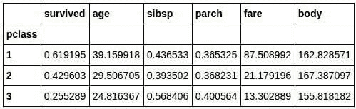
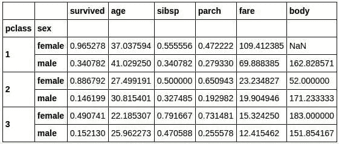
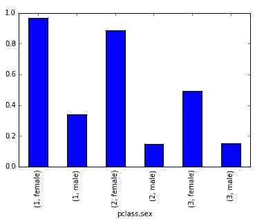
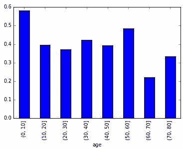

# 你能在泰坦尼克号上幸存吗？Python 中机器学习的指南第一部分

> 原文：[`www.kdnuggets.com/2016/07/titanic-machine-learning-guide-part-1.html`](https://www.kdnuggets.com/2016/07/titanic-machine-learning-guide-part-1.html)

**Patrick Triest，SocialCops**。

如果机器可以学习，会怎么样呢？

这一直是自机器出现以来科学幻想和哲学中最引人入胜的问题之一。随着现代技术的发展，这些问题不再仅仅是创造性的猜测，机器学习无处不在。从决定你可能想要在 Netflix 上观看的下一部电影到预测股票市场趋势，机器学习对现代数据理解产生了深远的影响。

本教程旨在提供一个易于理解的机器学习技术应用于你自己项目和数据集的入门指南。在短短 20 分钟内，你将学习如何使用 Python 应用不同的机器学习技术，从决策树到深度神经网络，处理一个样本数据集。这是一个实用的，而非概念性的介绍；要全面了解机器学习的能力，我强烈建议你寻找解释这些技术底层实现的资源。

对于我们的样本数据集：RMS Titanic 的乘客。我们将使用一个开放数据集，该数据集提供了 1912 年那次臭名昭著的海上航行中乘客的数据。通过检查如阶级、性别和年龄等因素，我们将尝试不同的机器学习算法，并构建一个程序来预测某个乘客是否能在这场灾难中幸存下来。

**设置你的机器学习实验室**

学习机器学习的最佳方法是按照本教程在你的本地计算机上操作。为此，如果你还没有安装以下几个软件包，你需要先进行安装。

+   [Python](https://www.python.org)（本教程使用了版本 3.4.2）

+   [SciPy 生态系统](https://www.scipy.org)（NumPy、SciPy、Pandas、IPython、matplotlib）

+   [SciKit-Learn](http://scikit-learn.org/stable/)

+   [TensorFlow](https://www.tensorflow.org)

对于每个软件包的安装有多种选择。我推荐使用“pip” [Python 包管理器](https://pip.pypa.io/en/stable/)，你可以简单地运行“pip3 install <packagename>”来安装每个依赖包。</packagename>

对于实际编写和运行代码，我推荐使用 IPython，它允许你运行模块化的代码块并立即查看输出值和数据可视化，同时将 [Jupyter Notebook](https://jupyter.org) 作为图形界面。

你还需要我们将要分析的 Titanic 数据集，你可以在这里找到： [biostat.mc.vanderbilt.edu/wiki/pub/Main/DataSets/titanic3.xls](http://biostat.mc.vanderbilt.edu/wiki/pub/Main/DataSets/titanic3.xls)

**初步了解数据：谁在泰坦尼克号上幸存下来，为什么？**

首先导入所需的 Python 依赖包。

```py
import matplotlib.pyplot as plt
%matplotlib inline
import random
import numpy as np
import pandas as pd
from sklearn import datasets, svm, cross_validation, tree, preprocessing, metrics
import sklearn.ensemble as ske
import tensorflow as tf
from tensorflow.contrib import skflow

```

[点击这里查看概要](https://gist.github.com/triestpa/3b384a15076aeb4ec9cc7bb8c5e494c7)

一旦我们将电子表格文件读入 Pandas 数据框（可以想象成一个超级强大的 Excel 表格），我们可以使用 head() 命令查看前五行数据。

```py
titanic_df = pd.read_excel('titanic3.xls', 'titanic3', index_col=None, na_values=['NA'])
titanic_df.head()

```

[点击这里查看概要](https://gist.github.com/triestpa/63916ed9026f4d94d59453d53784703b)


列标题变量的含义如下：

+   **survival** - 生存状态（0 = 否；1 = 是）

+   **class** - 乘客等级（1 = 一等；2 = 二等；3 = 三等）

+   **name** - 姓名

+   **sex** - 性别

+   **age** - 年龄

+   **sibsp** - 登船的兄弟姐妹/配偶数量

+   **parch** - 登船的父母/子女数量

+   **ticket** - 票号

+   **fare** - 乘客票价

+   **cabin** - 舱房

+   **embarked** - 登船港口（C = 瑟堡；Q = 皇后镇；S = 南安普顿）

+   **boat** - 救生艇（如果幸存）

+   **body** - 遇难者的遗体编号（如果未生还且遗体已被找到）

现在我们已将数据放入数据框中，可以开始使用强大的单行 Pandas 函数进行高级数据分析。首先，让我们检查一下泰坦尼克号乘客的整体生存机会。

```py
titanic_df['survived'].mean()

# 0.3819709702062643

```

[点击这里查看概要](https://gist.github.com/triestpa/4c8a7694a2b7fee5633d99b2a421d5ef)

计算结果显示，只有 38%的乘客幸存。这并不是最好的几率。造成如此大量人员伤亡的原因是泰坦尼克号仅配备了 20 只救生艇，这远远不够 1,317 名乘客和 885 名船员。所有乘客都不可能有相同的生存机会，因此我们将继续分析数据，以考察决定谁获得救生艇位置和谁没有的社会动态。

在 20 世纪初，社会阶层严重分化，尤其是在泰坦尼克号上，奢华的一等舱区域对二等舱的中产阶级乘客完全封闭，尤其是对那些持有三等舱“经济票”的乘客。为了了解每个等级的组成情况，我们可以按等级分组数据，并查看每列的平均值：

```py
titanic_df.groupby('pclass').mean()

```

[点击这里查看概要](https://gist.github.com/triestpa/b939b78f9c6b37d82f91f72dc36b9185)



我们可以从这些数据中得出一些有趣的见解。例如，一等舱乘客的生存机会为 62%，而三等舱乘客的生存机会为 25.5%。此外，低等级舱的乘客通常较年轻，一等舱的票价显著高于二等和三等舱。一等舱的平均票价为 87.5 英镑，相当于 2016 年的 13,487 美元。

我们可以通过对等级和性别进行分组来扩展统计分析。

```py
class_sex_grouping = titanic_df.groupby(['pclass','sex']).mean()
class_sex_grouping

```

[点击这里查看要点](https://gist.github.com/triestpa/7eebb009c3529d3cfb132bd495a8f6f6)



```py
class_sex_grouping['survived'].plot.bar()

```

[点击这里查看要点](https://gist.github.com/triestpa/7eebb009c3529d3cfb132bd495a8f6f6)

在泰坦尼克号沉没时，官员们以严格的海事传统优先考虑允许谁进入救生艇，首先撤离妇女和儿童。我们的统计结果清晰地反映了这一政策的第一部分，因为在所有舱位中，女性的生存概率远高于男性。我们还可以看到，女性的平均年龄低于男性，更有可能与家人一起旅行，并且票价略高。

“妇女和儿童优先”政策的第二部分的有效性可以通过按年龄划分的生存率来推断。

```py
group_by_age = pd.cut(titanic_df["age"], np.arange(0, 90, 10))
age_grouping = titanic_df.groupby(group_by_age).mean()
age_grouping['survived'].plot.bar()

```

[点击这里查看要点](https://gist.github.com/triestpa/775c689998337c7afafa9fc7cfe2511c)

在这里我们可以看到，儿童确实是最有可能幸存的年龄组，尽管这个百分比仍然悲惨地低于 60%。

**简历： [Patrick Triest](https://www.linkedin.com/in/triestpa)** 是一位 23 岁的安卓开发者 / 物联网工程师 / 数据科学家 / 渴望开创者，来自波士顿，目前在 SocialCops 工作。他对学习上瘾，有时在发现特别有趣的东西后，他会非常兴奋并写下他的想法。

[原文](http://blog.socialcops.com/engineering/machine-learning-python)。经许可转载。

**相关：**

+   7 步掌握 Python 机器学习

+   数据科学和机器学习的前 10 名 IPython 笔记本教程

+   R 学习路径：7 步从初学者到专家

* * *

## 我们的三大课程推荐

 1\. [谷歌网络安全证书](https://www.kdnuggets.com/google-cybersecurity) - 快速通道进入网络安全职业。

 2\. [谷歌数据分析专业证书](https://www.kdnuggets.com/google-data-analytics) - 提升你的数据分析水平

 3\. [谷歌 IT 支持专业证书](https://www.kdnuggets.com/google-itsupport) - 支持你的组织的 IT

* * *

### 更多相关主题

+   [数据科学家需要专注于特定领域才能在技术寒冬中生存](https://www.kdnuggets.com/2023/08/data-scientists-need-specialize-survive-tech-winter.html)

+   [如果我要重新开始学习数据科学，我会怎么做？](https://www.kdnuggets.com/2020/08/start-learning-data-science-again.html)

+   [什么时候集成技术会是一个好的选择？](https://www.kdnuggets.com/2022/07/would-ensemble-techniques-good-choice.html)

+   [数据科学面试指南 - 第二部分：面试资源](https://www.kdnuggets.com/2022/04/data-science-interview-guide-part-2-interview-resources.html)

+   [数据科学面试指南 - 第一部分：结构](https://www.kdnuggets.com/2022/04/data-science-interview-guide-part-1-structure.html)

+   [想成为数据科学家？第一部分：你需要掌握的 10 项硬技能](https://www.kdnuggets.com/want-to-become-a-data-scientist-part-1-10-hard-skills-you-need)
