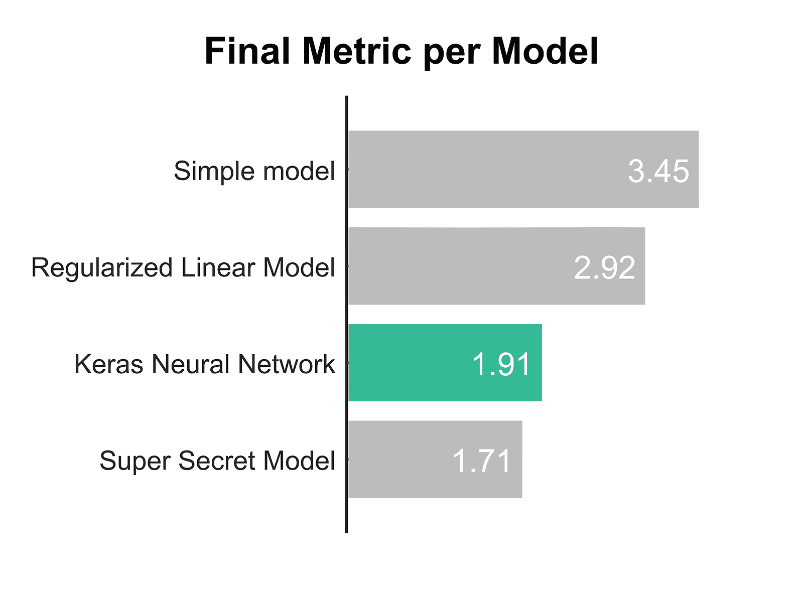

# 今天我在午休时间用 Keras 构建了一个神经网络

> 原文：[`www.kdnuggets.com/2017/12/today-built-neural-network-during-lunch-break-keras.html`](https://www.kdnuggets.com/2017/12/today-built-neural-network-during-lunch-break-keras.html)

 评论

**由 [Matthijs Cox](https://www.linkedin.com/in/matthijscox/)，纳米技术数据科学家**


> 从想法到结果的最短延迟是进行良好研究的关键。
> 
> - Keras.io

所以昨天有人告诉我你可以在 Keras 中在 15 分钟内构建一个（深度）神经网络。当然，我完全不相信。上次我尝试（可能是 2 年前？）时，这仍然是相当费力的工作，需要全面的编程和数学知识。那时确实需要精湛的工艺。

所以在晚上我花了一些时间研究 [Keras 文档](https://keras.io/)，我必须说它看起来足够简单。但是当我尝试时肯定会遇到一些困难，对吧？适应这些包有时可能需要几个月。

**第二天早晨**

所以第二天我开始在自己的数据上玩 Keras。首先，我重构了一些我们内部包中的代码，以将数据转换为表格形式。这让我感到沮丧了一段时间。最后，这和回答我的电子邮件以及问题占用了我大部分的早晨。完成这些后，我可以轻松地将一些数据导出为 csv 文件，并用 Pandas 读取它，转换为 Numpy 数组，我们就准备好了。

**午休时间**

由于这完全是一个爱好项目，我部分牺牲了午休时间来构建模型。Keras 和 Tensorflow 安装得很快，自从上次我尝试在 Windows 笔记本上安装 Tensorflow 后，这非常简单。然后我几乎是复制粘贴了 Keras 文档中的代码。我甚至不打算建立一个 github 仓库，这就是我做的所有事情：

```py
from keras.models import Sequential
from keras.layers import Dense
import numpy as np

model = Sequential()
model.add(Dense(units=64, activation=’relu’, input_dim=1424))
model.add(Dense(units=2696))
model.compile(loss='mse', optimizer='adam')

model.fit(predictors[0:80,], estimator[0:80,], 
     validation_data=(predictors[81:,],estimator[81:,]), 
     epochs=80, batch_size=32)
np.savetxt("keras_fit.csv", model.predict(data), delimiter=",")
```

这是什么？我在构建模型，添加一些密集层，完成它，拟合数据，并进行预测。全部用不到 10 行代码。我今天没有进行任何超参数优化或智能层架构。但我必须说；哇，真的很简单！

**下午**

现在我对实际性能非常好奇，所以我必须对一些基准进行测试。不过别告诉我的经理们我在花时间做这个哦！（开玩笑的，他们鼓励探索和学习。）所以我将数据加载回我的测试框架中，并运行一些其他算法。以下是我的最终性能指标的结果。



在不到一个小时的模型构建时间内，这真是太令人尴尬地好。我们花了 1.5 年时间研发的超级秘密模型仍然超越了它（幸运的是）。除此之外，任何神经网络的一个大缺点当然是它完全是一个黑匣子，不知道它实际学到了什么。而我们的秘密模型使用的是我们后来可以作为人类诊断的模式识别。

**结论**

这也是我最快完成的文章，完全是在热情的状态下写的。现在，我在一天的最后几分钟里写这篇文章，向任何开发 Keras 的人表示热烈的掌声。以下是我的结论：

+   Keras API：棒极了！

+   Keras 文档：棒极了！

+   Keras 结果：棒极了！

如果你正在考虑进行一些深度/机器学习，我一定建议从 Keras 开始。快速上手非常有趣，之后你可以学习和微调细节。

**简介： [Matthijs Cox](https://www.linkedin.com/in/matthijscox/)** 是一名纳米技术数据科学家，自豪的父亲和丈夫，图形设计师和业余作家。

[原文](https://towardsdatascience.com/today-i-built-a-neural-network-during-my-lunch-break-with-keras-65dae2c5d690)。经授权转载。

**相关：**

+   掌握 Keras 深度学习的 7 个步骤

+   Keras 速查表：Python 中的深度学习

+   Keras 教程：使用神经网络识别井字棋赢家

* * *

## 我们的 Top 3 课程推荐

 1\. [谷歌网络安全证书](https://www.kdnuggets.com/google-cybersecurity) - 快速进入网络安全职业。

 2\. [谷歌数据分析专业证书](https://www.kdnuggets.com/google-data-analytics) - 提升你的数据分析技能

 3\. [谷歌 IT 支持专业证书](https://www.kdnuggets.com/google-itsupport) - 支持你所在组织的 IT

* * *

### 更多相关内容

+   [使用 TensorFlow 和 Keras 构建和训练你的第一个神经网络](https://www.kdnuggets.com/2023/05/building-training-first-neural-network-tensorflow-keras.html)

+   [5 门免费课程助你入门数据分析](https://www.kdnuggets.com/5-free-courses-to-break-into-data-analytics)

+   [通过构建 15 个神经网络项目来学习深度学习 2022](https://www.kdnuggets.com/2022/01/15-neural-network-projects-build-2022.html)

+   [使用 AIMET 进行神经网络优化](https://www.kdnuggets.com/2022/04/qualcomm-neural-network-optimization-aimet.html)

+   [使用 PyTorch 构建卷积神经网络](https://www.kdnuggets.com/building-a-convolutional-neural-network-with-pytorch)

+   [神经网络预测中排列的重要性](https://www.kdnuggets.com/2022/12/importance-permutation-neural-network-predictions.html)
