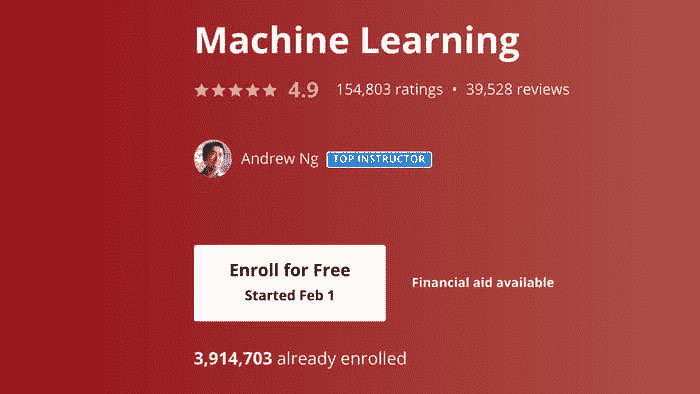

# 学习人工智能是否已经太晚？

> 原文：[`www.kdnuggets.com/2021/03/too-late-learn-ai.html`](https://www.kdnuggets.com/2021/03/too-late-learn-ai.html)

评论

**由[Frederik Bussler](https://www.linkedin.com/in/frederikbussler/)，Obviously AI 的增长营销负责人**

### 人工智能饱和

* * *

## 我们的三大课程推荐

 1\. [谷歌网络安全证书](https://www.kdnuggets.com/google-cybersecurity) - 快速进入网络安全职业。

 2\. [谷歌数据分析专业证书](https://www.kdnuggets.com/google-data-analytics) - 提升你的数据分析能力

 3\. [谷歌 IT 支持专业证书](https://www.kdnuggets.com/google-itsupport) - 支持你的组织的 IT

* * *

我定期分享学习人工智能和数据科学的资源，无论是来自谷歌或哈佛的课程，还是完整的 YouTube 教程。

与此同时，我听到的担忧是：*“学习人工智能和数据科学是否已经太晚？”*

令人担忧的是，随着数百万学生学习机器学习，这个领域正在变得饱和。毕竟，人工智能职位的数量有限，尤其是在全球经济衰退期间。

Andrew Ng 在 Coursera 上的著名机器学习课程有接近 400 万学生。

截至撰写时，如果你在 LinkedIn 工作中搜索“机器学习”，你会发现略超过 100,000 个职位。

很明显，学生数量远远超过了开放职位——仅仅是查看单个 Coursera 课程中的学生数量，比例接近 40:1。

### 为什么仍然值得

尽管如此，学习人工智能仍然是值得的，原因有很多。

### 企业家精神

首先，让我们谈谈企业家精神。人工智能的构建和部署比以往任何时候都更加容易和快速——特别是考虑到像[Obviously.AI](http://obviously.ai/)这样的无代码 AI 工具——这意味着员工有机会通过将人工智能添加到他们的技能集中来创造更多的价值。

这些在组织中寻找人工智能应用案例的企业家精神者并没有增加 LinkedIn 上的职位空缺数量，但有无数的例子。

对任何员工来说，成为一名 AI 企业家精神者有着巨大的激励：有可能自动化他们工作中的重复、无聊部分，并专注于创意和以人为本的任务。更不用说，人工智能技能可以提升你的薪资和职业生涯。

例如，营销人员可以利用人工智能预测客户行为、构建用户画像并识别主要人群。零售员工可以优化产品组合、预测库存消耗、预测人员需求等。保险员工可以利用人工智能预测保险索赔、诉讼风险、代位求偿机会等。

对于 AI 企业家精神者来说，可能性是无穷无尽的。

### 创业精神

还有一个巨大的机会领域未包含在~100K 的机器学习工作中：创业。

创业是企业家精神的风险性反面。它意味着走自己的路，在市场中寻找增加价值的新方法，通常没有任何形式的支持、帮助或稳定性。

与此同时，这种高风险带来了高回报的潜力。

假设你加入了一家硅谷初创公司，成为第 30 名员工（仍然处于早期阶段），而且你是你领域中的顶级工程师之一。根据 Holloway，你可以期望获得[0.25%–0.5%的股份](https://www.holloway.com/g/equity-compensation/sections/typical-employee-equity-levels)。

如果你独自创业，作为创始人，你一开始就拥有 100%的股份。通过引入共同创始人、员工和投资者，这个数字会减少，但潜力却大得多。

### 持续学习

即使你对企业家精神、创业或获得新角色不感兴趣，持续学习仍然是值得提倡的。

人工智能现在遍布各个行业，从你在亚马逊、Spotify、Netflix 或 Tinder 上获得的推荐，到你在 Google 或 YouTube 上看到的搜索结果，甚至包括 COVID-19 追踪、疫苗开发和疫苗推广。

为了跟上最新技术的发展，并真正理解当今的世界，学习人工智能是必不可少的。

### 结论

学习人工智能是值得的，且始终如此。即使就业市场趋于饱和（目前还未饱和，因为仍有针对合格者的开放职位），创意型企业家和创业者始终有潜力。为了保持相关性，人工智能技能正迅速成为必备技能。

**简介：[Frederik Bussler](https://www.linkedin.com/in/frederikbussler/)** 是 Obviously AI 的增长营销负责人。他致力于将人工智能普及化。

[原文](https://pub.towardsai.net/is-it-too-late-to-learn-ai-dcd86e8f0c57)。经授权转载。

**相关：**

+   我们不需要数据科学家，我们需要数据工程师

+   利用自然语言处理提升你的简历

+   2021 年人工智能（AI）五大趋势

### 更多相关内容

+   [管理多个 Python 版本？Pyenv 来拯救你](https://www.kdnuggets.com/too-many-python-versions-to-manage-pyenv-to-the-rescue)

+   [使用 Python 和 Scikit-learn 简化决策树解释](https://www.kdnuggets.com/2017/05/simplifying-decision-tree-interpretation-decision-rules-python.html)

+   [停止学习数据科学以找到目标，并找到目标以……](https://www.kdnuggets.com/2021/12/stop-learning-data-science-find-purpose.html)

+   [通过构建 2022 年 15 个神经网络项目学习深度学习](https://www.kdnuggets.com/2022/01/15-neural-network-projects-build-2022.html)

+   [超越管道：图作为 Scikit-Learn 元估计器](https://www.kdnuggets.com/2022/09/graphs-scikitlearn-metaestimators.html)

+   [如何克服对数学的恐惧并学习数据科学中的数学](https://www.kdnuggets.com/2021/03/overcome-fear-learn-math-data-science.html)
