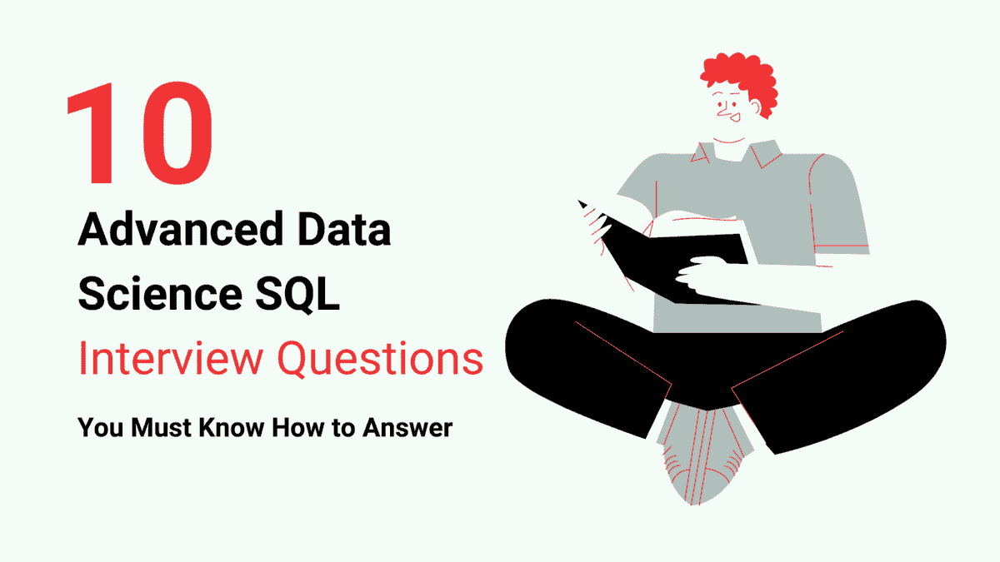

# 你必须知道如何回答的前 10 个高级数据科学 SQL 面试问题

> 原文：[`www.kdnuggets.com/2023/01/top-10-advanced-data-science-sql-interview-questions-must-know-answer.html`](https://www.kdnuggets.com/2023/01/top-10-advanced-data-science-sql-interview-questions-must-know-answer.html)



作者提供的图像

# 介绍

* * *

## 我们的前三课程推荐

 1\. [Google 网络安全证书](https://www.kdnuggets.com/google-cybersecurity) - 快速进入网络安全职业生涯。

 2\. [Google 数据分析专业证书](https://www.kdnuggets.com/google-data-analytics) - 提升数据分析技能

 3\. [Google IT 支持专业证书](https://www.kdnuggets.com/google-itsupport) - 支持组织的 IT

* * *

SQL（结构化查询语言）是一种用于管理和操作数据库的标准编程语言。它是任何数据专业人员的必备技能，因为它使他们能够有效地检索和分析存储在数据库中的数据。因此，SQL 是技术面试中的常见话题，适用于涉及数据工作的职位，如数据分析师、数据工程师和数据库管理员。

# 问题 01

## 查找第 nth 高薪资/支付或第 3 高薪资/支付的 SQL 查询

要查找第 nth 高薪资，你可以使用带有 DENSE_RANK() 函数的子查询来计算每个薪资的密集排名，然后筛选结果以仅包括排名等于 n 的行。

```py
SELECT 
  * 
FROM 
  (
    SELECT 
      name, 
      salary, 
      DENSE_RANK() OVER (
        ORDER BY 
          salary DESC
      ) as salary_rank 
    FROM 
      employees
  ) subquery 
WHERE 
  salary_rank = n;
```

你还可以使用 LIMIT 和 OFFSET 子句来查找第 nth 高薪资，如下所示：

```py
SELECT 
  name, 
  salary 
FROM 
  employees 
ORDER BY 
  salary DESC 
LIMIT 
  1 OFFSET (n - 1);
```

例如，要找到第 3 高的薪资，你可以使用以下查询：

```py
SELECT 
  name, 
  salary 
FROM 
  employees 
ORDER BY 
  salary DESC 
LIMIT 
  1 OFFSET 2;
```

# 问题 02

## 如何优化 SQL 查询以提高性能？

有几种方法可以优化 SQL 查询以提高性能，包括

**索引**

在某列或某些列上创建索引可以显著提高对这些列进行筛选的查询速度。

**分区**

将大型表分区为更小的部分可以提高仅需要访问数据子集的查询性能。

**规范化**

规范化涉及将数据库中的数据组织到仅存储一个位置，以减少冗余并完善数据的完整性。

**使用适当的数据类型**

为每列使用正确的数据类型可以提高对这些列进行筛选或排序的查询性能。

**使用适当的 JOIN 类型**

使用正确的 JOIN 类型（例如 INNER JOIN、OUTER JOIN、CROSS JOIN）可以提高多表联接查询的性能。

**使用适当的聚合函数**

使用适当的聚合函数（例如，SUM、AVG、MIN、MAX）可以提高对大型数据集执行计算的查询性能。一些聚合函数，类似于 COUNT，比其他函数更有效，因此选择适用的函数对查询非常重要。

# 问题 03

### 你如何在 SQL 中使用 LAG 和 LEAD 函数？能否给出它们使用的示例？

LAG() 和 LEAD() 函数是 SQL 中的窗口函数，允许你将行中的值与前一行或后一行的值进行比较。它们对计算累计总数或将表中的值与前一行或后一行的值进行比较非常有用。

**LAG() 函数**接受两个参数：要返回的列和向回查找的行数。例如

```py
SELECT 
  name, 
  salary, 
  LAG(salary, 1) OVER (
    ORDER BY 
      salary DESC
  ) as prev_salary 
FROM 
  employees;
```

**LEAD() 函数**的工作方式类似，但向前而不是向后。例如

```py
SELECT 
  name, 
  salary, 
  LEAD(salary, 1) OVER (
    ORDER BY 
      salary DESC
  ) as next_salary 
FROM 
  employees
```

# 问题 04

## 解释 SQL 中的 ETL 和 ELT 概念

ETL（提取、转换、加载）是一个用于 SQL 的过程，用于从一个或多个源中提取数据，将数据转换成适合分析或其他用途的格式，然后将数据加载到目标系统中，例如数据仓库或数据湖。

ELT（提取、加载、转换）与 ETL 类似，但转换阶段在数据加载到目标系统后进行，而不是之前进行。这允许目标系统执行转换，这可能比在 ETL 工具中执行转换更高效、更具扩展性。ELT 通常用于现代数据基础设施，这些基础设施使用强大的数据处理引擎（如 Apache Spark 或 Apache Flink）来执行转换阶段。

# 问题 05

## 你能解释 SQL 中 WHERE 和 HAVING 子句的区别吗？

WHERE 和 HAVING 子句都用于从 SELECT 语句中筛选行。它们之间的主要区别是 WHERE 子句用于在分组操作之前筛选行，而 HAVING 子句用于在分组操作之后筛选行。

```py
SELECT 
  department, 
  SUM(salary) 
FROM 
  employees 
GROUP BY 
  department 
HAVING 
  SUM(salary) > 100000;
```

在这个例子中，HAVING 子句用于筛选出部门中员工薪水总和少于 100000 的部门。这是在分组操作之后完成的，因此只影响表示每个部门的行。

```py
SELECT 
  * 
FROM 
  employees 
WHERE 
  salary > 50000;
```

在这个例子中，WHERE 子句用于筛选薪水少于 50000 的员工。这是在任何分组操作之前完成的，因此它影响 employees 表中的所有行。

# 问题 06

## 解释 SQL 中 TRUNCATE、DROP 和 DELETE 操作之间的区别

**TRUNCATE**

TRUNCATE 操作从表中删除所有行，但不会影响表的结构。它比 DELETE 更快，因为它不会生成任何撤销或重做日志，也不会触发任何删除触发器。

这是使用 TRUNCATE 语句的一个示例

```py
TRUNCATE TABLE employees;
```

该语句从 employees 表中删除所有行，但表的结构，包括列名和数据类型，保持不变。

**DROP**

DROP 操作从数据库中删除一个表，并删除表中的所有数据。它还删除与表相关的任何索引、触发器和约束。

这是一个使用 DROP 语句的示例

```py
DROP 
  TABLE employees;
```

该语句从数据库中删除 employees 表，并且表中的所有数据都被永久删除。表结构也被移除。

**DELETE**

DELETE 操作从表中删除一行或多行。它允许你指定一个 WHERE 子句以选择要删除的行。它还生成撤销和重做日志，并触发取消触发器。

这是一个使用`DELETE`语句的示例

```py
DELETE FROM 
  employees 
WHERE 
  salary & lt;
50000;
```

该语句删除 employees 表中所有工资低于 50000 的行。表结构保持不变，被删除的行可以通过撤销日志恢复。

# 问题 07

## 哪种更有效，连接还是子查询？

通常情况下，使用 JOIN 比使用子查询更高效，因为 JOIN 允许数据库通过利用连接表上的索引更高效地执行查询。

例如，考虑以下两个返回相同结果的查询：

```py
SELECT 
  * 
FROM 
  orders o 
WHERE 
  o.customer_id IN (
    SELECT 
      customer_id 
    FROM 
      customers 
    WHERE 
      country = 'US'
  );
```

```py
SELECT 
  * 
FROM 
  orders o 
WHERE 
  o.customer_id IN (
    SELECT 
      customer_id 
    FROM 
      customers 
    WHERE 
      country = 'US'
  );
```

第一个查询使用 JOIN 将 orders 和 customers 表结合在一起，然后使用 WHERE 子句筛选结果。第二个查询使用子查询从 customers 表中选择相关的客户 ID，然后使用 IN 运算符根据这些 ID 筛选 orders 表。

# 问题 08

## 如何在 SQL 中使用窗口函数？

在 SQL 中，窗口函数是对由窗口规范定义的一组行或“窗口”操作的函数。窗口函数用于在行之间执行计算，并且可以在 SELECT、UPDATE 和 DELETE 语句中使用，以及在 SELECT 语句的 WHERE 和 HAVING 子句中使用。

这是在 SELECT 语句中使用窗口函数的示例：

```py
SELECT 
  name, 
  salary, 
  AVG(salary) OVER (PARTITION BY department_id) as avg_salary_by_department 
FROM 
  employees
```

该语句返回一个包含三列的结果集：name、salary 和 avg_salary_by_department。avg_salary_by_department 列是使用 AVG 窗口函数计算的，该函数计算每个部门的平均工资。PARTITION BY 子句指定窗口按 department_id 分区，这意味着平均工资是针对每个部门单独计算的。

# 问题 09

## 解释规范化

规范化是将数据库组织成一种减少冗余和依赖的方式的过程。它是一种系统化的方法，用于分解表格以消除数据冗余并提高数据完整性。可以使用几种规范形式来规范化数据库。最常见的规范形式包括：

**第一范式 (1NF)**

+   表中的每个单元格包含一个单一的值，而不是一个值的列表

+   表中的每一列都有一个唯一的名称

+   表中不包含任何重复的列组

**第二范式 (2NF)**

+   它处于第一范式

+   它没有任何部分依赖（即，非主属性依赖于复合主键的一部分）

**第三范式 (3NF)**

+   它符合第二范式

+   它没有任何传递依赖（即，非主属性依赖于另一个非主属性）

**博伊斯-科德范式 (BCNF)**

+   它符合第三范式

+   每个决定因素（一个决定其他属性值的属性）都是候选键（一个可以作为主键的列或列集）

# 问题 10

## 解释 SQL 中的独占锁和更新锁

独占锁是一种锁，防止其他事务读取或写入被锁定的行。这种锁通常在事务需要修改表中的数据时使用，并希望确保没有其他事务可以同时访问该表。

更新锁是一种锁，允许其他事务读取被锁定的行，但防止它们更新或写入被锁定的行。这种锁通常在事务需要读取表中的数据时使用，但希望确保在当前事务完成之前，数据不会被其他事务修改。

**索尼亚·贾米尔** 目前在巴基斯坦最大的电信公司之一担任数据库分析师。除了全职工作，她还兼职做自由职业者。她的背景包括数据库管理方面的专业知识，并且有在本地和云环境中的 SQL Server 经验。她精通最新的 SQL Server 技术，并对数据管理和数据分析有着浓厚的兴趣。

### 更多相关话题

+   [如何回答数据科学编程面试问题](https://www.kdnuggets.com/2022/01/answer-data-science-coding-interview-questions.html)

+   [KDnuggets 新闻，5 月 4 日：9 门免费哈佛课程学习数据……](https://www.kdnuggets.com/2022/n18.html)

+   [15 个数据科学必知的 Python 编程面试问题](https://www.kdnuggets.com/2022/04/15-python-coding-interview-questions-must-know-data-science.html)

+   [25 个数据科学家高级 SQL 面试问题](https://www.kdnuggets.com/2022/10/25-advanced-sql-interview-questions-data-scientists.html)

+   [26 个你应该知道的数据科学面试问题](https://www.kdnuggets.com/26-data-science-interview-questions-you-should-know)

+   [24 个 SQL 面试问题，你可能会在下一个面试中遇到](https://www.kdnuggets.com/2022/06/24-sql-questions-might-see-next-interview.html)
