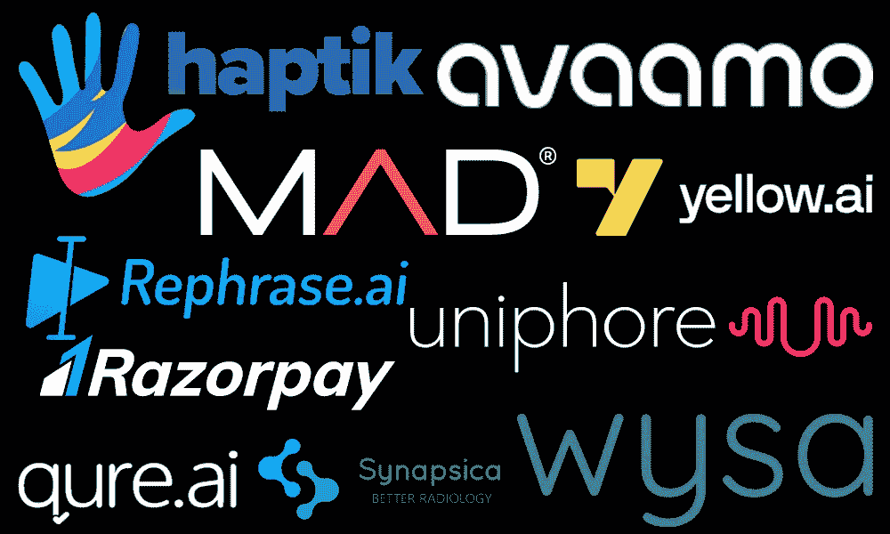

# 印度前 10 大 AI 初创公司

> 原文：[`www.kdnuggets.com/top-10-ai-startups-to-work-for-in-india`](https://www.kdnuggets.com/top-10-ai-startups-to-work-for-in-india)

作者提供的图片

人工智能（AI）正在全球范围内改变商业运作，印度正在迅速崛起成为创新 AI 初创企业的中心。这些本土公司在各个行业推动 AI 的应用，同时在国内培养了强大的人才库。在这篇博客中，我们将重点介绍在印度引起广泛关注的前 10 大 AI 初创公司，它们是开始或推进你 AI 职业生涯的绝佳选择。

* * *

## 我们的前三大课程推荐

 1\. [Google 网络安全证书](https://www.kdnuggets.com/google-cybersecurity) - 快速进入网络安全职业的快车道。

 2\. [Google 数据分析专业证书](https://www.kdnuggets.com/google-data-analytics) - 提升你的数据分析技能

 3\. [Google IT 支持专业证书](https://www.kdnuggets.com/google-itsupport) - 支持你的组织 IT 工作

* * *

> **注意：** 关于融资的数据来自于[ai-startups.org](https://www.ai-startups.org/country/India/)，而评分则来自于[Glassdoor](https://www.glassdoor.com/Reviews/Uniphore-Software-Systems-Reviews-E924913.htm)。

# Uniphore

融资：**$620.9M** (+/-)

Glassdoor 评分：**3.9**

[Uniphore](https://www.uniphore.com/about-us/) 是一家印度初创公司，将 AI 嵌入到商业运营的每个方面，使复杂任务变得简单。他们的企业级多模态机器学习模型和数据平台统一了语音、视频、文本和数据的所有元素。Uniphore 还将生成式 AI、知识 AI、情感 AI 和工作流自动化结合起来，作为企业的可靠副驾驶。这些先进的 AI 技术的结合，作为催化剂，创造了世界上最具吸引力的客户和员工体验。

# Yellow.ai

融资：**$102.2M** (+/-)

Glassdoor 评分：**3.8**

[Yellow.ai](https://yellow.ai/) 是一个无代码平台，将生成式 AI 与企业级 LLMs 结合，能够将聊天和语音自动化的时间从几天缩短至几分钟。其专有的 DAP 技术基于多 LLM 架构，并不断在数十亿次对话中进行训练，以提供规模、速度和准确性。

Yellow.ai 提供了一个对话服务云来自动化客户支持，一个对话商务云来实现对话商务，以及一个对话 EX 云来丰富员工体验。

# Razorpay

融资：**$74.7M** (+/-)

Glassdoor 评分：**3.8**

[Razorpay](https://razorpay.com/) 是一家印度初创公司，推动财务和业务增长。他们强大的支付网关使企业能够接受 100 多种支付方式，具有行业领先的成功率和卓越的结账体验。轻松集成、从第一天起即刻结算以及深入的报告功能提供了无缝的支付体验。

除了支付服务，Razorpay 还通过自动化向供应商和员工支付款项，帮助企业保持充足的运营资金。通过提升企业财务管理，Razorpay 使公司能够专注于核心业务。作为领先的金融科技公司，Razorpay 正在通过解决支付和结算需求来帮助印度企业扩展规模。

# Qure.ai

融资：**60.3 百万美元**（+/-）

Glassdoor 评分：**4.0**

[Qure AI](https://www.qure.ai/) 是一家印度初创公司，已被认可为全球最广泛采用的医疗 AI 公司之一。他们专注于肺部、心脏、神经和肌肉骨骼（MSK）疾病的 AI 解决方案。Qure.ai 提供一系列产品以改善医学诊断和患者护理。

包括以下内容：

+   胸部 X 光报告

+   结核病护理层级

+   肺结节管理

+   中风与创伤性脑损伤

+   MSK X 光报告

+   心力衰竭

通过提高效率和准确性，Qure.ai 改善了患者诊断，同时降低了护理成本。

# Avaamo

融资：**30.5 百万美元**（+/-）

Glassdoor 评分：**4.4**

[Avaamo](https://avaamo.ai/) 是一家印度初创公司，开发了一个基于云的对话 AI 平台，利用最新的神经网络、语音合成和深度学习技术。他们的技术使企业能够在语音、文本和其他渠道上以空前的速度和准确性自动化客户互动。凭借预构建的企业连接器、对话分析和快速部署能力，Avaamo 使组织能够在短短几周内执行对话 AI 项目。

# Mad Street Den

融资：**30 百万美元**（+/-）

Glassdoor 评分：**4.2**

[Mad Street Den®](https://www.madstreetden.com/) 开发了一个名为“Vue.ai”的企业 AI 平台，宣称“这是你将来唯一需要的 AI 堆栈”。他们的平台专注于提供业务成果，强调快速实施和生产力。Mad Street Den 鼓励企业摒弃冗长的 AI 转型计划，立即使用他们的平台。他们提供一个零延迟的企业 AI 平台，支持快速上线，使企业能够在访问数据后的 30 天内展示价值。

# Wysa

融资：**29.5 百万美元**（+/-）

Glassdoor 评分：**3.4**

[Wysa](https://www.wysa.com/) 是一个印度（全球）初创企业，提供了一种革命性的心理健康支持方法。他们的临床验证 AI 技术提供了作为护理第一步的即时帮助，随后为需要额外帮助的用户提供人工辅导。这种创新的方法已经产生了显著的影响，超过五亿次 AI 聊天对话与来自 95 个国家的超过五百万人的交流。

针对员工心理健康日益增长的关注，Wysa 在美国、英国以及其自身用户群体中进行了广泛的研究，揭示了对早期、匿名和无限护理的需求。

# Haptik

融资：**$11.2M** (+/-)

Glassdoor 评分：**3.5**

[Haptik](https://www.haptik.ai/) 是一个印度会话 AI 初创企业，利用生成式 AI 建立持久的客户关系。他们的平台通过跨渠道客户对话提供支持，启用个性化的营销互动，并激发销售以提高转化率。凭借在每个阶段都经过优化的全面客户体验套件，Haptik 能够迅速带来指数级的价值。其专有的 NLU 在人类般对话的准确性方面领先行业，以减少机器人失败。先进的行业特定 NLP 和 ML 确保了高精度。AI 驱动的分析通过 Smart Funnels 等功能从对话数据中发现实时洞察。

# Rephrase.ai

融资：**$10.6M** (+/-)

Glassdoor 评分：**3.9**

[Rephrase.ai](https://www.rephrase.ai/) 是一个由生成式 AI 驱动的开创性文本转视频生成平台。他们的平台 Rephrase Studio 通过使用户能够在几分钟内用数字化头像创建专业外观的视频，消除了视频制作的复杂性。这一三步流程包括选择数字化头像、添加所需的信息和渲染视频。利用 AI 的强大功能，Rephrase 能够无缝地将文本转换为逼真的视频。作为一个创新的印度初创企业，Rephrase.ai 正在通过其文本转视频平台改变沟通和创意，使制作引人入胜的视频内容变得简单且对每个人都可及。

# Synapsica

融资：**$4.2M** (+/-)

Glassdoor 评分：**4.6**

[Synapsica](https://synapsica.com/) 正在利用人工智能来革新脊柱报告和放射学。他们获得 FDA 批准的解决方案提供了针对 MRI、X 光等的端到端视觉和定量脊柱报告。Synapsica 的 AI 助手自动化重复任务、标准化测量，并生成基于证据的报告，从而提升放射科医生的生产力和报告准确性。这有助于医生做出更有信心的诊断。Synapsica 的算法具有高达 99%的精确度，提供智能的、平台无关的报告，并通过预测分析和自动量化实现可靠的跟踪。作为一家创新的印度健康科技初创公司，Synapsica 使放射科医生能够更高效地报告更多病例，同时为医生提供详细的、说明性的分析，以改善患者护理。

# 结论

人工智能在印度的快速增长催生了许多有前景的初创公司，它们处于将创新的人工智能解决方案带到全球企业的前沿。像 Uniphore、Yellow.ai 和 Haptik 这样的公司是对话式人工智能的先锋，而 Qure.ai 和 Synapsica 等初创公司则通过人工智能驱动的放射学和诊断推动医疗行业的变革。像 Razorpay 和 Mad Street Den 这样的公司则在应用人工智能以转变商业操作和结果方面领先。

这些初创公司凭借其尖端技术和快速市场进入能力，提供了令人兴奋的机会来参与具有影响力的项目。他们鼓励的工作文化和对创新的重视也使他们成为备受追捧的人工智能雇主。随着印度在科技领域的持续发展，这些初创公司有望在全球范围内颠覆各个行业，同时培养国内顶尖科技人才。

****[Abid Ali Awan](https://www.polywork.com/kingabzpro)**** ([@1abidaliawan](https://www.linkedin.com/in/1abidaliawan)) 是一位认证的数据科学专业人士，热衷于构建机器学习模型。目前，他专注于内容创作，并撰写有关机器学习和数据科学技术的技术博客。Abid 拥有技术管理硕士学位和电信工程学士学位。他的愿景是利用图神经网络为面临心理健康困扰的学生开发人工智能产品。

### 更多相关话题

+   [2022 年值得工作的 6 家数据科学初创公司](https://www.kdnuggets.com/2022/02/6-data-science-startups-work-2022.html)

+   [印度值得考虑的顶尖公司](https://www.kdnuggets.com/top-companies-in-india-to-consider-for-employment)

+   [是什么使 Python 成为初创公司的理想编程语言](https://www.kdnuggets.com/2021/12/makes-python-ideal-programming-language-startups.html)

+   [6 家重新定义 3D 工作流程的初创公司，使用 OpenUSD 和生成性人工智能](https://www.kdnuggets.com/6-startups-redefining-3d-workflows-with-openusd-and-generative-ai)

+   [作为数据科学家工作的 11 家最佳公司](https://www.kdnuggets.com/2021/12/11-best-companies-work-data-scientist.html)

+   [如何在没有工作经验的情况下获得你的第一份数据科学职位](https://www.kdnuggets.com/2021/02/first-job-data-science-without-work-experience.html)
