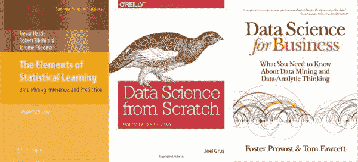

# 2016 年数据挖掘领域 Amazon 前十名书籍

> 原文：[`www.kdnuggets.com/2016/11/top-10-amazon-books-data-mining.html`](https://www.kdnuggets.com/2016/11/top-10-amazon-books-data-mining.html)

最近对数据科学、数据挖掘及相关学科的兴趣激增，书籍标题也随之激增。决定哪些书籍可能对你的职业生涯有用的最佳方法之一是查看其他人阅读的书籍。这篇文章详细列出了截至 2016 年 11 月 10 日 Amazon 的 [数据挖掘书籍](https://www.amazon.com/Best-Sellers-Books-Data-Mining/zgbs/books/3654/ref=zg_bs_nav_b_3_549646) 类别中最受欢迎的 10 本书，跳过重复的书名以及明显分类错误且对读者无用的书名。

*注意：KDnuggets 从 Amazon 获取的佣金为零——此列表仅为帮助读者评估有趣的书籍。*

* * *

## 我们的前三名课程推荐

 1\. [Google 网络安全证书](https://www.kdnuggets.com/google-cybersecurity) - 快速进入网络安全职业轨道。

 2\. [Google 数据分析专业证书](https://www.kdnuggets.com/google-data-analytics) - 提升你的数据分析技能

 3\. [Google IT 支持专业证书](https://www.kdnuggets.com/google-itsupport) - 支持你的组织进行 IT 工作

* * *

**1\. [统计学习的要素：数据挖掘、推断与预测，第 2 版](https://www.amazon.com/Elements-Statistical-Learning-Prediction-Statistics/dp/0387848576/ref=zg_bs_3654_1)**

**Trevor Hastie, Robert Tibshirani, Jerome Friedman**

4.1 星（[78 条评论](https://www.amazon.com/Elements-Statistical-Learning-Prediction-Statistics/dp/0387848576/ref=zg_bs_3654_1#customerReviews)）

精装本，$74.85

> 本书在一个共同的概念框架中描述了这些领域的重要思想。虽然方法是统计性的，但重点是概念而非数学。书中提供了许多示例，使用了大量的彩色图形。这是统计学家和任何对科学或工业中的数据挖掘感兴趣的人的宝贵资源。本书的覆盖面广泛，从监督学习（预测）到非监督学习。许多主题包括神经网络、支持向量机、分类树和提升——这是任何书籍中对这一主题的第一次全面论述。

**2\. [从零开始的数据科学：用 Python 学习的基本原理，第 1 版](https://www.amazon.com/Data-Science-Scratch-Principles-Python/dp/149190142X/ref=zg_bs_3654_2)**

**Joel Grus**

4.2 星（[65 条评论](https://www.amazon.com/Data-Science-Scratch-Principles-Python/dp/149190142X/ref=zg_bs_3654_2#customerReviews)）

平装书，$32.04

> 如果你具备数学天赋和一定的编程技能，作者 Joel Grus 将帮助你熟悉数据科学核心的数学和统计知识，以及你需要的入门数据科学家的黑客技能。今天的数据泛滥中蕴含着没人想到过的问题的答案。这本书为你提供了挖掘这些答案的诀窍。

**3\. [数据科学与商业：你需要了解的数据挖掘和数据分析思维 第 1 版](https://www.amazon.com/Data-Science-Business-Data-Analytic-Thinking/dp/1449361323/ref=zg_bs_3654_3)**

**福斯特·普罗沃斯特，汤姆·福塞特**

4.6 星（[152 条评论](https://www.amazon.com/Data-Science-Business-Data-Analytic-Thinking/dp/1449361323/ref=zg_bs_3654_3#customerReviews)）

平装书，$33.79

> 由著名数据科学专家 Foster Provost 和 Tom Fawcett 编写的《数据科学与商业》介绍了数据科学的基本原理，并指导你如何进行“数据分析思维”，以从你收集的数据中提取有用的知识和商业价值。这本指南还帮助你理解今天使用的许多数据挖掘技术。

**4\. [数据分析简明指南](https://www.amazon.com/Data-Analytics-Made-Accessible-Maheshwari-ebook/dp/B00K2I2JL8/ref=zg_bs_3654_4)**

**安尼尔·马赫什瓦里**

4.8 星（[175 条评论](https://www.amazon.com/Data-Analytics-Made-Accessible-Maheshwari-ebook/dp/B00K2I2JL8/ref=zg_bs_3654_4#customerReviews)）

Kindle 版，$7.48

> 这本书填补了关于数据分析和大数据日益增长领域的简明对话书籍的需求。易读且信息丰富，这本清晰的书涵盖了所有重要内容，配有具体的示例，并邀请读者加入这个领域。书中的章节是按照典型的一学期课程进行组织的，每章开头都有来自真实世界故事的案例。

**5\. [Python 机器学习](https://www.amazon.com/Python-Machine-Learning-Sebastian-Raschka-ebook/dp/B00YSILNL0/ref=zg_bs_3654_5)**

**塞巴斯蒂安·拉什卡**

4.3 星（[78 条评论](https://www.amazon.com/Python-Machine-Learning-Sebastian-Raschka-ebook/dp/B00YSILNL0/ref=zg_bs_3654_5)）

Kindle 版，$23.74

> 《Python 机器学习》让你进入预测分析的世界，并展示了为什么 Python 是世界领先的数据科学语言之一。如果你想更好地提问数据，或需要提升和扩展你的机器学习系统的能力，这本实用的数据科学书籍是无价的。它涵盖了广泛的强大 Python 库，包括 scikit-learn、Theano 和 Keras，并提供了从情感分析到神经网络的所有方面的指导和技巧，你很快就能回答你和你的组织面临的一些重要问题。

**6\. [数据智能：运用数据科学将信息转化为洞察力 第 1 版](https://www.amazon.com/Data-Smart-Science-Transform-Information/dp/111866146X/ref=zg_bs_3654_6)**

**约翰·W·福尔曼**

4.7 颗星（[105 条评论](https://www.amazon.com/Data-Smart-Science-Transform-Information/dp/111866146X/ref=zg_bs_3654_6#customerReviews)）

平装本，$31.99

> 数据科学无非是使用简单的步骤将原始数据处理成可操作的洞察。在《数据智能》中，作者和数据科学家约翰·福尔曼将展示如何在熟悉的电子表格环境中完成这一过程。

**7\. [Hadoop：权威指南 第 4 版](https://www.amazon.com/Hadoop-Definitive-Guide-Tom-White/dp/1491901632/ref=zg_bs_3654_8)**

**汤姆·怀特**

4.6 颗星（[41 条评论](https://www.amazon.com/Hadoop-Definitive-Guide-Tom-White/dp/1491901632/ref=zg_bs_3654_8#customerReviews)）

平装本，$36.24

> 本书仅使用 Hadoop 2，作者汤姆·怀特介绍了关于 YARN 以及若干 Hadoop 相关项目（如 Parquet、Flume、Crunch 和 Spark）的新章节。你将了解 Hadoop 的最新变化，并探索 Hadoop 在医疗系统和基因组数据处理中的新案例研究。

**8\. [R 实战：用 R 进行数据分析和图形绘制 第 2 版](https://www.amazon.com/Action-Data-Analysis-Graphics/dp/1617291382/ref=zg_bs_3654_9)**

**罗伯特·卡巴科夫**

4.8 颗星（[33 条评论](https://www.amazon.com/Action-Data-Analysis-Graphics/dp/1617291382/ref=zg_bs_3654_9#customerReviews)）

平装本，$46.83

> 《R 实战 第 2 版》通过呈现与科学、技术和商业开发者相关的示例，教你如何使用 R 语言。书中重点讲解实际解决方案，包括处理凌乱和不完整数据的优雅方法。你还将掌握 R 的广泛图形功能，以便以可视化方式探索和展示数据。扩展的第 2 版包含了关于预测、数据挖掘和动态报告编写的新章节。

**9\. [做数据科学：前线直言 第 1 版](https://www.amazon.com/Doing-Data-Science-Straight-Frontline/dp/1449358659/ref=zg_bs_3654_10)**

**凯西·奥尼尔，瑞秋·舒特**

4.0 颗星（[50 条评论](https://www.amazon.com/Doing-Data-Science-Straight-Frontline/dp/1449358659/ref=zg_bs_3654_10#customerReviews)）

平装本，$29.59

> 在这些长章节讲座中，来自谷歌、微软和 eBay 等公司的数据科学家分享了新算法、方法和模型，通过案例研究和他们使用的代码进行讲解。如果你熟悉线性代数、概率和统计，并有编程经验，这本书是数据科学的理想入门书籍。

**10\. [大数据：可扩展实时数据系统的原理和最佳实践 第 1 版](https://www.amazon.com/Big-Data-Principles-practices-scalable/dp/1617290343/ref=zg_bs_3654_18)**

**内森·马尔兹，詹姆斯·沃伦**

4.4 颗星（[33 条评论](https://www.amazon.com/Big-Data-Principles-practices-scalable/dp/1617290343/ref=zg_bs_3654_18#customerReviews)）

平装本，$35.34

> 《大数据》教你如何使用一种架构来构建大数据系统，该架构利用了集群硬件以及专门设计的工具来捕捉和分析网络规模的数据。它描述了一种可扩展、易于理解的大数据系统方法，这种方法可以由一个小团队构建和运行。通过一个现实的示例，本书引导读者深入了解大数据系统的理论，如何在实践中实施它们，以及一旦建成如何部署和操作这些系统。

**相关**：

+   数据爱好者必读的 10 本经典书籍

+   亚马逊神经网络畅销书 Top 20

+   亚马逊数据库与大数据畅销书 Top 20

### 更多相关内容

+   [学习数据科学统计的顶级资源](https://www.kdnuggets.com/2021/12/springboard-top-resources-learn-data-science-statistics.html)

+   [停止学习数据科学以寻找目标，并通过目标来…](https://www.kdnuggets.com/2021/12/stop-learning-data-science-find-purpose.html)

+   [成功数据科学家的 5 个特征](https://www.kdnuggets.com/2021/12/5-characteristics-successful-data-scientist.html)

+   [每个数据科学家都应该了解的三个 R 语言库（即使你使用 Python）](https://www.kdnuggets.com/2021/12/three-r-libraries-every-data-scientist-know-even-python.html)

+   [90 亿美元的 AI 失败，深入探讨](https://www.kdnuggets.com/2021/12/9b-ai-failure-examined.html)

+   [是什么使 Python 成为初创公司的理想编程语言](https://www.kdnuggets.com/2021/12/makes-python-ideal-programming-language-startups.html)
