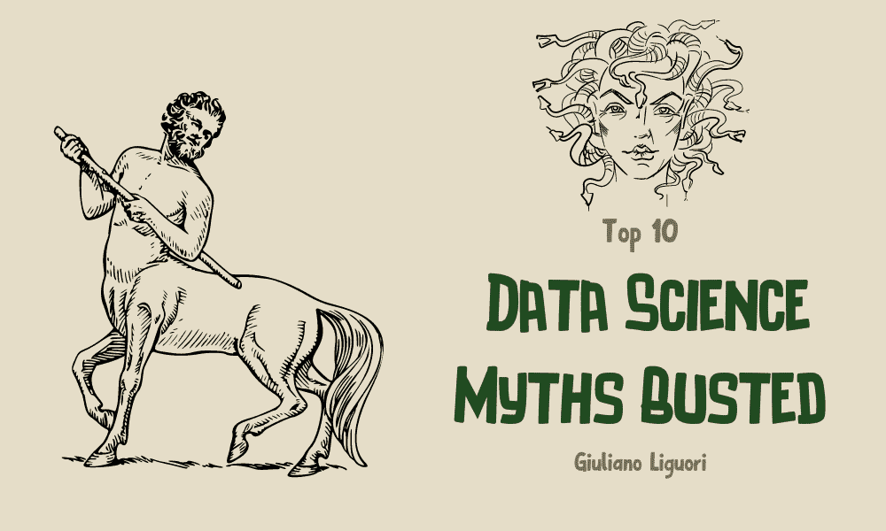
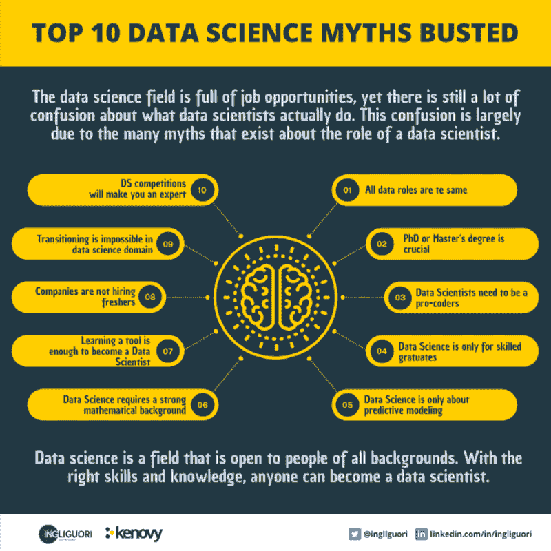

# 打破前 10 大数据科学神话

> 原文：[`www.kdnuggets.com/2022/12/top-10-data-science-myths-busted.html`](https://www.kdnuggets.com/2022/12/top-10-data-science-myths-busted.html)

编辑提供的图片

随着数据科学的普及，围绕它有很多神话。如果你有意从事数据科学的职业，了解这些神话并将其揭穿是很重要的。

* * *

## 我们的前三大课程推荐

 1\. [谷歌网络安全证书](https://www.kdnuggets.com/google-cybersecurity) - 快速开启网络安全职业生涯。

 2\. [谷歌数据分析专业证书](https://www.kdnuggets.com/google-data-analytics) - 提升你的数据分析技能

 3\. [谷歌 IT 支持专业证书](https://www.kdnuggets.com/google-itsupport) - 支持你的组织的 IT 需求

* * *

大数据世界充满了各种职位，包括数据工程师、数据科学家、数据分析师、业务分析师等等。毫无疑问，数据科学家是这个领域中最受欢迎的职位，这也是为什么在初学者中存在如此多的混淆。当他们尝试探索这个职位时，由于互联网上的随机内容非常混乱，他们无法确定这个领域是否适合自己，也无法决定资源的选择，这一切的混乱来自于全球各地关于数据科学的随机帖子和神话。因此，我们将揭穿这 10 大数据科学神话，帮助你解开这些误解。

作者提供的信息图

# 神话 1\. 所有数据角色都相同

数据分析师、数据工程师和数据科学家都在做相同的事情，这完全是错误的，因为他们的工作、角色和职责都非常不同。我们理解这会造成混淆，因为所有这些人都在同一个大数据的伞下工作。首先，让我们看看数据工程师的工作。他们的职责是从事基础工程工作，构建可扩展的数据管道，以便从多个来源提取原始数据，对其进行转换，并将其存储到下游系统中。数据科学家和数据分析师依赖于这个过程，因为他们将数据转化为有意义的信息——将数据转化为信息的过程。这是将有意义的洞察呈现在数据中并为数据科学家构建准确的机器学习模型的关键。虽然这些人看起来似乎在做相同的事情，他们的技能可能有重叠，但他们的职责在根本上是不同的，这就是为什么公司会招聘不同职位的人。如果不是这样，他们会雇佣一个能够做所有事情的数据专家。

# 神话 2\. 成为数据科学家需要博士学位或硕士学位

这也是完全错误的，不过，这也很大程度上取决于你想要的职位类型。例如，如果我们寻求的是研究领域的角色，我们需要硕士或博士学位，但如果你想解决复杂的数据问题并处理深度学习或机器学习相关的工作，那么你将需要处理数据科学的任务，使用库和数据分析方法来揭示那些复杂的数据谜题。因此，你不需要拥有硕士学位。如今，一切都与技能有关，所以如果你拥有数据科学家所需的技能集，那么你绝对可以进入这个领域。

# 神话 3\. 数据科学家需要成为专业编码员

这也是完全错误的，因为作为数据科学家，你的工作是广泛地处理数据。当我们谈到专业编码时，这意味着要在竞争编程方面投入大量精力，或对典型的数据结构和算法有非常深入的了解。确实，数据科学家必须具备良好的复杂问题解决能力，在数据科学领域，我们有如 Python 和 R 这样的语言，通过多个库提供了非常重要的支持，可以用来解决复杂的数据问题。作为数据科学家，你的目标应该是了解如何使用这些库及其模块，以便创建最佳的数据模型和与机器学习相关的模型。数据科学家必须具备这些技能，以免在竞争编程或练习典型的数据结构和算法上浪费过多时间。

# 神话 4\. 数据科学仅适用于计算机科学专业毕业生

这是必须揭穿的最重要的神话之一。尽管越来越多的年轻人决定学习科学科目，主要是因为科技领域工作机会的不断增加，但到目前为止，大多数人仍然没有技术背景。公司倾向于招聘数据科学领域的候选人，那些没有技术背景的候选人因为在解决问题和理解业务用例方面非常出色而被选中。这些都是在数据科学面试中取得成功的重要因素。公司不关注程序员的典型技术技能，而是希望了解候选人在能力方面的表现，是否能够理解案例研究，是否能够从数据中提取商业矩阵以及解决哪些复杂的数据相关问题。因此，永远不要认为来自非计算机科学或非技术背景的人不能进入数据科学领域。顺便提一下，对于计算机科学毕业生来说，他们的首要任务仍然是软件工程，他们希望在这一领域发展职业。因此，在数据科学领域，非技术人员的工作机会越来越多。所以现在即使你没有计算机科学相关的特定学位，只要你能获得数据科学领域所需的正确技能，你仍然有机会成为数据科学家。

# 神话 5\. 数据科学仅仅关于预测建模

并不是每个人都知道数据科学家将 80%的时间花在数据清洗和转换上，只有 20%的时间用于数据建模。因此，想要创建非常准确的数据以及机器学习模型的数据科学家，需要对数据进行清洗和转换。我们知道，当我们处理一个特定的大数据解决方案时，涉及多个步骤，而第一步也是非常重要的一步就是数据转换。如今，我们从多个来源获取数据，而原始数据有时包含错误以及垃圾记录。如果我们无法清洗数据，我们将无法获得有意义的转换数据，也无法创建非常准确的机器学习模型。这就是为什么数据科学不仅仅是建立预测模型和回归模型，它是清洗和转换数据与建立准确的机器学习模型的良好结合。

# 神话 6\. 数据科学需要强大的数学背景

这也是完全不正确的，因为擅长数学是作为数据科学家日常活动中的一个重要部分。在分析数据时，我们需要这些数学概念，比如数据统计部分、概率部分，但这并不是成为数据科学家的必备技能。正如我们所知，在数据科学中，我们有像 Python 和 R 这样出色的编程语言，它们提供了很棒的库支持，我们可以直接使用这些库来进行典型的数学计算和运算。因此，除非你需要创新某些东西或创建新的算法，否则你不需要成为数学专家。

# 神话 7\. 学习一种工具就足以成为数据科学家

一个好的数据科学档案是多种技能的结合，包括技术技能和非技术技能。成为一个优秀的数据科学家需要这两种技能。要成为一个好的数据科学家，你不能仅仅依赖编程或你认为在数据科学中使用的特定工具。如果你在这两方面都很优秀，你可能会成为一个出色的数据科学家。作为数据科学家，我们在解决复杂数据问题时必须与多个利益相关者互动，并且必须直接与业务合作，以收集所有需求。了解数据领域、我们为何处理数据、从转换后的数据中可以获得什么洞察、如何解决问题、什么是相关的和什么是不相关的，都是数据科学领域所需的。不要以为仅有技术方面的东西或任何特定工具如语言或数据库就足够破解数据科学档案。你需要利用非技术技能和软技能作为你的支持系统，以成为一个好的数据科学家。

# 神话 8\. 公司不招聘应届生担任数据科学角色

这是一个常见的问题。如果我们五六年前讨论这个话题，那确实是完全正确的。公司当时不关注应届生的数据科学角色，但现在在 2022 年，这种情况发生了很大变化，因为现在的应届生自我意识强，自我激励，并且非常有兴趣探索数据科学和数据工程等领域。他们不再依赖他人，而是投入自己的努力去探索这些职位。他们还积极参与黑客马拉松、开源贡献等比赛，并尝试自己构建酷炫的项目。这就是他们如何获得适合数据科学角色的正确技能组合和出色的开发技能。因此，现在公司更倾向于招聘应届生，以应对数据科学角色的空缺。

# 神话 9\. 从不同的工作领域转行到数据科学领域是不可能的

如果你来自数据相关的背景，比如你曾担任过数据工程师、数据分析师或业务分析师，那么这个转型对你来说会很容易，因为你已经了解数据及如何使用不同的工具和技术框架来处理数据。另一方面，如果你来自于测试职位或软件工程职位，那么转型到数据科学将会有挑战，但并非不可能。你需要努力掌握所需的技能，然后进行一些实际的项目，这将有助于你获得新能力，并培养你对数据科学领域的兴趣，以了解你如何真正为公司作为数据科学家创造价值。

# 神话 10. 数据科学竞赛会让你成为专家

数据科学竞赛是获取正确技能的好方法，同时也可以了解数据科学环境，甚至提升开发技能，但如果你认为仅仅通过参与黑客马拉松和创建竞赛项目就能成为数据科学专家，那是不准确的。你将提升并增加简历的价值，以便展示你的工作和所取得的成果，但如果你真的想成为专家，你需要参与一些实际的用例或生产级应用。因此，建议新人们应参加良好的实习。

# 结论

如果你对数据科学感兴趣，不要让这些误区让你灰心。数据科学是一个对各种背景的人开放的领域。只要具备正确的技能和知识，任何人都可以成为数据科学家。

请在 Twitter 和 LinkedIn 上关注我，以获取每日技术更新：

[`bit.ly/m/ingliguori`](https://bit.ly/m/ingliguori)

# 参考资料

[揭开数据科学十大误区 | 数据科学技巧 2022 | 大数据 | DSML | 数据科学神话与现实](https://www.youtube.com/watch?v=AZjBIGUXlsg)

**[Giuliano Liguori](https://www.linkedin.com/in/ingliguori)** 是 Kenovy 的首席执行官兼联合创始人，Kenovy 是创新的关键。Giuliano Liguori 是 AI、工业 4.0 和数字化转型领域的领先声音。在过去的 18 年里，他通过拥抱创新、利用先进技术和成功整合 OT 和 IT，帮助组织和企业变得更智能、更高效。他的博客 Digital Leaders 推广数字化转型、工业 4.0 和 AI 采用。他还是 CIO Club Italia 的联合创始人和执行委员会成员。

[原文](https://medium.com/codex/top-10-data-science-myths-busted-268e47d49d38)。经许可转载。

### 更多相关话题

+   [KDnuggets 新闻，12 月 7 日：十大数据科学误区揭秘 • 4…](https://www.kdnuggets.com/2022/n47.html)

+   [6 个人工智能神话揭穿：分辨事实与虚构](https://www.kdnuggets.com/6-artificial-intelligence-myths-debunked-separating-fact-from-fiction)

+   [KDnuggets 新闻, 6 月 8: 数据科学的 21 个备忘单…](https://www.kdnuggets.com/2022/n23.html)

+   [数据科学、数据可视化和…的 38 个顶级 Python 库](https://www.kdnuggets.com/2020/11/top-python-libraries-data-science-data-visualization-machine-learning.html)

+   [KDnuggets™ 新闻 22:n03, 1 月 19: 对 13 个数据的深入分析…](https://www.kdnuggets.com/2022/n03.html)

+   [KDnuggets 新闻 22:n16, 4 月 20: 学习的顶级 YouTube 频道…](https://www.kdnuggets.com/2022/n16.html)
