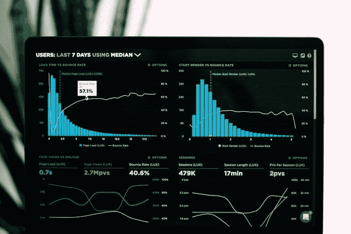

# 初学者的前十个数据科学项目

> 原文：[`www.kdnuggets.com/2021/06/top-10-data-science-projects-beginners.html`](https://www.kdnuggets.com/2021/06/top-10-data-science-projects-beginners.html)

comments

照片由 [Jo Szczepanska](https://unsplash.com/@joszczepanska?utm_source=unsplash&utm_medium=referral&utm_content=creditCopyText) 提供，来源于 [Unsplash](https://unsplash.com/s/photos/project?utm_source=unsplash&utm_medium=referral&utm_content=creditCopyText)

作为一名有志的数据科学家，你一定听过“*做数据科学项目*”的建议不下千次。

* * *

## 我们的三大课程推荐

 1\. [谷歌网络安全证书](https://www.kdnuggets.com/google-cybersecurity) - 快速进入网络安全领域的职业生涯。

 2\. [谷歌数据分析专业证书](https://www.kdnuggets.com/google-data-analytics) - 提升你的数据分析技能

 3\. [谷歌 IT 支持专业证书](https://www.kdnuggets.com/google-itsupport) - 支持你的组织进行 IT 相关工作

* * *

数据科学项目不仅是极好的学习体验，它们还能帮助你在众多希望进入数据科学领域的热爱者中脱颖而出。

### 然而，并非所有的数据科学项目都有助于提升你的简历。实际上，在你的作品集中列出错误的项目可能会适得其反。

在这篇文章中，我将带你深入了解那些在简历中**必不可少**的项目。

我还将为每个项目提供**示例数据集**以供实验，并附上相关的**教程帮助你完成项目**。

### 技能 1：数据收集

照片由 [James Harrison](https://unsplash.com/@jstrippa?utm_source=unsplash&utm_medium=referral&utm_content=creditCopyText) 提供，来源于 [Unsplash](https://unsplash.com/s/photos/code?utm_source=unsplash&utm_medium=referral&utm_content=creditCopyText)

数据收集和预处理是数据科学家必备的重要技能之一。

在我的数据科学工作中，大部分工作涉及在 Python 中进行数据收集和清理。在理解业务需求后，我们需要获取互联网中的相关数据。

这可以通过使用 API 或网络抓取工具来完成。一旦完成，数据需要被清理并存储到数据框中，以便作为输入提供给机器学习模型。

这是数据科学家工作中最耗时的部分。

我建议通过完成以下项目来展示你在数据收集和预处理方面的技能：

### 网络抓取 — 食品评论网站

教程： [Zomato Web Scraping with BeautifulSoup](https://datascienceplus.com/zomato-web-scraping-with-beautifulsoup-in-python/)

语言：Python

从食品配送网站抓取评论是一个有趣且实际的项目，可以为你的简历增添亮点。

简单地构建一个网络爬虫，收集该网站所有网页上的评论信息，并将其存储在数据框中。

如果你想进一步拓展这个项目，可以使用收集的数据构建情感分析模型，并对这些评论进行分类，判断哪些是积极的，哪些是消极的。

下次你想找点吃的时，选择一个评论整体评价最好的餐厅。

### 网络爬虫 — 在线课程网站

教程：[用 Python 在 8 分钟内构建一个网络爬虫](https://towardsdatascience.com/scrape-websites-using-python-in-5-minutes-931cd9f44443)

语言：Python

想要在 2021 年找到最佳的在线课程吗？在数百个数据科学课程中挑选一个既实惠又高评价的课程确实很困难。

你可以通过抓取一个在线课程网站，并将所有结果存储到数据框中来实现这一点。

将这个项目进一步拓展，你还可以围绕价格和评级等变量创建可视化，寻找既实惠又优质的课程。

你还可以创建一个情感分析模型，得出每个在线课程的整体情感。然后，你可以选择情感总体评价最高的课程。

### 奖励

创建一些项目，使用 API 或其他外部工具收集数据。这些技能通常在你开始工作时非常有用。

大多数依赖第三方数据的公司通常会购买 API 访问权限，你需要借助这些外部工具进行数据收集。

一个你可以做的示例项目：使用 Twitter API 收集与特定标签相关的数据，并将数据存储在数据框中。

### 技能 2：探索性数据分析

图片来源：[Luke Chesser](https://unsplash.com/@lukechesser?utm_source=unsplash&utm_medium=referral&utm_content=creditCopyText)拍摄，来自[Unsplash](https://unsplash.com/s/photos/data?utm_source=unsplash&utm_medium=referral&utm_content=creditCopyText)

在收集和存储数据之后，你需要对数据框中的所有变量进行分析。

你需要观察每个变量的分布情况，了解它们之间的关系。你还必须能够利用可用的数据回答问题。

作为数据科学家，你会经常做这些工作，甚至比预测建模还要多。

以下是一些 EDA 项目想法：

### 识别心脏病的风险因素

数据集：[Framingham Heart Study](https://biolincc.nhlbi.nih.gov/studies/framcohort/)

教程：[Framingham Heart Study: 决策树](https://medium.com/swlh/the-framingham-heart-study-decision-trees-83a7fb62718e)

语言：Python 或 R

这个数据集包含了如胆固醇、年龄、糖尿病和家族病史等预测因子，用于预测患者心脏病的发生。

你可以使用 Python 或 R 来分析数据集中存在的关系，并回答以下问题：

+   糖尿病患者是否更容易在年轻时发展心脏病？

+   是否存在某个特定的人口群体比其他群体更容易患心脏病？

+   频繁锻炼是否能降低患心脏病的风险？

+   吸烟者是否比非吸烟者更容易发展心脏病？

能够借助可用数据回答这些问题是数据科学家必备的重要技能。

这个项目不仅会帮助你提升作为分析师的技能，还能展示你从大数据集中提取见解的能力。

### 世界幸福报告

数据集：[世界幸福报告](https://www.kaggle.com/unsdsn/world-happiness)

教程：[世界幸福报告 EDA](https://www.kaggle.com/rushilpatel2000/world-happiness-report-eda)

语言：Python

世界幸福报告追踪六个因素来衡量全球幸福感——预期寿命、经济状况、社会支持、腐败缺失、自由和慷慨。

在对这个数据集进行分析时，你可以回答以下问题：

+   世界上哪个国家最幸福？

+   哪些因素对一个国家的幸福感最为重要？

+   整体幸福感是在增加还是减少？

再次强调，这个项目将有助于提升你作为分析师的技能。我在大多数成功的数据分析师身上看到的一个特质是好奇心。

数据科学家和分析师总是在寻找影响因素。

他们总是试图寻找变量之间的关系，并不断提出问题。

如果你是一个有志成为数据科学家的人，做这样的项目将帮助你培养分析思维。

### 技能 3：数据可视化

由 [Lukas Blazek](https://unsplash.com/@goumbik?utm_source=unsplash&utm_medium=referral&utm_content=creditCopyText) 在 [Unsplash](https://unsplash.com/s/photos/data?utm_source=unsplash&utm_medium=referral&utm_content=creditCopyText) 提供的照片

当你开始担任数据科学家时，你的客户和利益相关者通常会是非技术人员。

你需要将你的见解分解并向非技术观众展示结果。

最好的方式是以可视化的形式进行展示。

展示一个互动仪表板将有助于你更好地传达你的见解，因为图表一目了然。

因此，许多公司将数据可视化列为数据科学相关职位的**必备**技能。

这里有一些你可以在作品集中展示的数据可视化项目，以展示你的数据可视化技能：

### 构建一个 Covid-19 仪表板

数据集：[约翰斯·霍普金斯大学 Covid-19 数据库](https://github.com/CSSEGISandData/COVID-19)

教程：[使用 Python 和 Tableau 构建 Covid-19 仪表板](https://towardsdatascience.com/building-covid-19-dashboard-with-python-and-tableau-296b0016920f)

语言：Python

您首先需要使用 Python 对上述数据集进行预处理。然后，您可以使用 Tableau 创建一个互动的 Covid-19 仪表板。

Tableau 是最受欢迎的数据可视化工具之一，是大多数入门级数据科学职位的前提条件。

使用 Tableau 构建一个仪表板并在您的作品集中展示将帮助您脱颖而出，因为这展示了您使用该工具的熟练程度。

### 构建 IMDb 电影数据集仪表板

数据集：[IMDb 顶级评分电影](https://www.imdb.com/chart/top)

教程：[使用 Tableau 探索 IMDb 前 250](https://www.edupristine.com/blog/exploring-internet-movie-database-in-tableau)

您可以用 IMDb 数据集进行实验，并使用 Tableau 创建一个互动的电影仪表板。

如上所述，展示您构建的 Tableau 仪表板可以帮助您的作品集脱颖而出。

Tableau 的另一个好处是，您可以将您的可视化结果上传到 Tableau Public，并与任何想要使用您仪表板的人分享链接。

这意味着潜在的雇主可以与您的仪表板互动，这会引发他们的兴趣。一旦他们对您的项目感兴趣并且能够实际操作最终产品，您就离获得工作更近了一步。

如果您想开始使用 Tableau，您可以访问我的教程 [这里](https://medium.datadriveninvestor.com/tableau-tutorial-for-beginners-43483adf719)。

### 技能 4：机器学习

图片由 [Kevin Ku](https://unsplash.com/@ikukevk?utm_source=unsplash&utm_medium=referral&utm_content=creditCopyText) 提供，来源于 [Unsplash](https://unsplash.com/s/photos/machine-learning?utm_source=unsplash&utm_medium=referral&utm_content=creditCopyText)

最后，您需要展示能够体现您机器学习熟练度的项目。

我建议做两种项目——有监督和无监督的机器学习项目。

### 食品评论中的情感分析

数据集：[亚马逊美食评论数据集](https://www.kaggle.com/snap/amazon-fine-food-reviews?select=Reviews.csv)

教程：[Python 情感分析入门指南](https://towardsdatascience.com/a-beginners-guide-to-sentiment-analysis-in-python-95e354ea84f6)

语言：Python

情感分析是机器学习中非常重要的一个方面。企业经常使用它来评估客户对其产品的整体反应。

客户通常在社交媒体和客户反馈论坛上讨论产品。这些数据可以被收集和分析，以了解不同的人如何对不同的营销策略做出反应。

基于所进行的情感分析，公司可以对其产品进行不同的定位或更改目标受众。

我建议在你的作品集中展示一个情感分析项目，因为几乎所有企业都有社交媒体存在，并且需要评估客户反馈。

### 预期寿命预测

数据集：[预期寿命数据集](https://www.kaggle.com/kumarajarshi/life-expectancy-who?ref=hackernoon.com)

教程：[预期寿命回归](https://www.kaggle.com/wrecked22/life-expectancy-regression)

语言：Python

在这个项目中，你将预测一个人的预期寿命，基于教育水平、婴儿死亡数、酒精消费和成人死亡率等变量。

我上面列出的情感分析项目是一个分类问题，这也是我将回归问题加入列表的原因。

在简历上展示多样化的项目以展示你在不同领域的专业知识是非常重要的。

### 乳腺癌分析

数据集：[乳腺癌数据集](https://www.kaggle.com/vishwaparekh/cluster-analysis-of-breast-cancer-dataset?select=data.csv)

教程：[乳腺癌数据集的聚类分析](https://www.kaggle.com/vishwaparekh/cluster-analysis-of-breast-cancer-dataset)

语言：Python

在这个项目中，你将使用 K-means 聚类算法来检测乳腺癌的存在，基于目标属性。

K-means 聚类是一种无监督学习技术。

在你的作品集中展示聚类项目是重要的，因为大多数现实世界的数据都是未标注的。

即使是公司收集的大型数据集通常也没有训练标签。作为数据科学家，你可能需要使用无监督学习技术自己进行标注。

### 结论

你需要展示包括数据收集、分析、可视化和机器学习在内的多种技能的项目。

在线课程不足以让你在所有这些领域获得技能。然而，你可以找到几乎所有你想做的项目的教程。

你只需要具备基本的 Python 知识，就可以跟随这些教程。

一旦你把所有代码弄得妥当，并且能够正确跟进，你就可以复制解决方案，并独立开展各种不同的项目。

请记住，如果你是数据科学领域的初学者，没有相关学位或硕士学位，那么展示项目在你的作品集中是非常重要的。

作品集项目是向潜在雇主展示你技能的最佳方式之一，尤其是为了获得你在这一领域的第一个入门级工作。

了解我如何获得我的第一个数据科学实习[点击这里](https://towardsdatascience.com/data-science-projects-that-will-get-you-the-job-805065e7260)。

> 迟早，那些获胜的人是那些相信自己能做到的人 — 保罗·图尔尼耶

**简介： [Natassha Selvaraj](https://www.natasshaselvaraj.com/)** (**[LinkedIn](https://www.linkedin.com/in/natassha-selvaraj-33430717a/)**) 我目前正在攻读计算机科学学位，主修数据科学。我对机器学习领域充满兴趣，并且在这个领域完成了各种项目。我还喜欢解决问题和编程，这也是我每天都会做的事情。

[原文](https://towardsdatascience.com/top-10-data-science-projects-for-beginners-a2feb5e2153e)。已获许可转载。

**相关内容：**

+   重建我的 7 个 Python 项目

+   你的投资组合中最好的数据科学项目

+   数据科学初学者的投资组合指南

### 更多相关话题

+   [建立一个稳固的数据团队](https://www.kdnuggets.com/2021/12/build-solid-data-team.html)

+   [使用管道编写干净的 Python 代码](https://www.kdnuggets.com/2021/12/write-clean-python-code-pipes.html)

+   [成为一名优秀数据科学家所需的 5 项关键技能](https://www.kdnuggets.com/2021/12/5-key-skills-needed-become-great-data-scientist.html)

+   [每个初学者数据科学家应掌握的 6 种预测模型](https://www.kdnuggets.com/2021/12/6-predictive-models-every-beginner-data-scientist-master.html)

+   [2021 年最佳 ETL 工具](https://www.kdnuggets.com/2021/12/mozart-best-etl-tools-2021.html)

+   [学习数据科学统计学的顶级资源](https://www.kdnuggets.com/2021/12/springboard-top-resources-learn-data-science-statistics.html)
