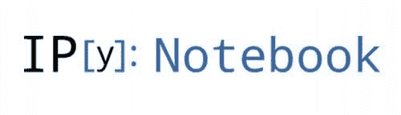
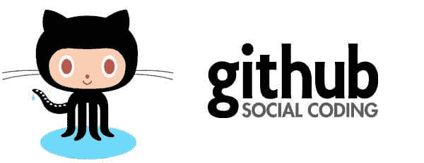

# 数据科学和机器学习的前 10 个 IPython Notebook 教程

> 原文：[`www.kdnuggets.com/2016/04/top-10-ipython-nb-tutorials.html`](https://www.kdnuggets.com/2016/04/top-10-ipython-nb-tutorials.html)

本文由 10 个 Github 代码库组成，这些代码库部分或全部由 IPython（Jupyter）笔记本构成，重点传授数据科学和机器学习概念。它们涵盖了从基础 Python 材料到 TensorFlow 和 Theano 的深度学习，并在中间有很多内容。

哦，它们都是 Python 相关的。Jupyter 现在支持多种语言，但这个列表是老派的，完全是 IPython Notebook 风格的材料。

* * *

## 我们的前三名课程推荐

 1\. [Google 网络安全证书](https://www.kdnuggets.com/google-cybersecurity) - 快速进入网络安全职业的快车道。

 2\. [Google 数据分析专业证书](https://www.kdnuggets.com/google-data-analytics) - 提升你的数据分析技能

 3\. [Google IT 支持专业证书](https://www.kdnuggets.com/google-itsupport) - 支持你的组织的 IT

* * *

以下是 10 个有用的 IPython Notebook Github 代码库，按无特定顺序排列：

**[示例数据科学笔记本](https://github.com/rhiever/Data-Analysis-and-Machine-Learning-Projects/blob/master/example-data-science-notebook/Example%20Machine%20Learning%20Notebook.ipynb)**

> 用于数据分析和机器学习项目的教学材料、代码和数据的代码库

这个热身笔记本来自博士后研究员[Randall Olson](http://www.randalolson.com/)，他使用常见的 Python 生态系统数据分析/机器学习/数据科学堆栈来处理[Iris 数据集](http://archive.ics.uci.edu/ml/datasets/Iris)。虽然它只是一个笔记本，但这是一个很好的起点，因为它激发了你对所有分析工具的兴趣，包括可视化。它还帮助你专注于用数据讲故事。

**[Python 机器学习书籍](https://github.com/rasbt/python-machine-learning-book)**

> "Python 机器学习"书籍的代码库和信息资源

这是由[Sebastian Raschka](https://twitter.com/rasbt)编写的精彩书籍[《用 Python 进行机器学习》](https://www.packtpub.com/big-data-and-business-intelligence/python-machine-learning)的配套代码。我不常推荐许多材料，但我强烈推荐这本书。这个代码库也很棒，是一个极好的资源。然而，建议你还是买一本自己的书，以全面理解代码库的内容，并充分融入 Python 生态系统中的机器学习。

**[学习数据科学](https://github.com/nborwankar/LearnDataScience)**

> 自主学习数据科学的开放内容。

这是一个笔记本和数据集的集合，主要由[尼廷·博尔万卡](https://twitter.com/nitin)整理，涵盖了 4 个算法主题：线性回归、逻辑回归、随机森林和 k 均值聚类。这些看似简单的教程，尽管对于新手来说可能最有用。

**[Scikit-learn 教程](https://github.com/jakevdp/sklearn_tutorial)**

> 我关于 scikit-learn 教程的资料。

这个由[杰克·范德普拉斯](https://twitter.com/jakevdp?lang=en)创建的仓库，旨在通过几种不同的机器学习算法来教授[Scikit-learn](http://scikit-learn.org/stable/)。其中涉及到的有趣话题包括验证、高斯混合模型的密度估计和主成分分析（PCA）的降维；你还会学到 k 均值、回归和分类等标准算法，放心。该资料最适合机器学习的初学者，或者有一定理解但希望掌握 Scikit-learn 的人。

**[机器学习](https://github.com/masinoa/machine_learning)**

> 机器学习算法的 Python 代码示例和文档。

[亚伦·马西诺](https://github.com/masinoa)分享了一系列非常详细、非常技术性的机器学习 IPython Notebook 学习资源。这个简单标题的仓库中的笔记本受到了安德鲁·恩的《机器学习》课程（斯坦福大学，Coursera）、汤姆·米切尔的课程（卡内基梅隆大学）以及克里斯托弗·M·比肖普的《模式识别与机器学习》的启发。

**[研究计算聚会](https://github.com/ResearchComputing/Meetup-Fall-2013)**

> 与 2013 年秋季聚会相关的幻灯片、代码及其他信息。

来自 UC Boulder 研究计算组的这个较旧的笔记本集合（来自 2013 年秋季）涵盖了广泛的材料，显然专注于使用 Linux 命令行进行数据管理。涵盖了许多常用库、shell 编程和 Linux 命令行基础，至少实现了一篇当时的论文。它似乎还涉及了一些 Kaggle 竞赛，所以你会在这个集合中获得一些多样的内容。

**[Theano 教程](https://github.com/craffel/theano-tutorial)**

> 一组关于神经网络的教程，使用 Theano。

博士生[科林·拉费尔](http://www.colinraffel.com/)编写了这套使用 Theano 的深度学习教程。它包含两个笔记本：一个通用的 Theano 神经网络教程和一个关于反向传播的概述。这是一个很好的入门资源，用于开始学习深度学习和 Theano。

**[IPython Theano 教程](https://github.com/jaberg/IPythonTheanoTutorials)**

> 一组以 ipynb 格式呈现的教程，展示了如何在 Theano 中完成各种任务。

这是 Colin Raffel 的入门 Theano 笔记本的一个很好的后续。[詹姆斯·伯格斯特拉](http://www.eng.uwaterloo.ca/~jbergstr/)通过这个项目带我们深入了解神经网络架构，涵盖了更多的 Theano 练习。它包括一些入门级 Python 材料，以及更高级的主题如自编码器。它还链接到一些相关材料。

**[IPython 笔记本](https://github.com/jdwittenauer/ipython-notebooks)**

> 一系列涵盖各种主题的 IPython 笔记本

这是由[约翰·维滕纳尔](http://www.johnwittenauer.net/)整理的一个丰富的混合项目，其中包括 Ng 的 Coursera 课程练习的 Python 实现、Udacity 的 TensorFlow 导向深度学习课程练习和 Spark edX 课程练习。机器学习、深度学习和大数据处理框架：这就是“数据科学”的本质了，各位。

**[ISLR Python](https://github.com/JWarmenhoven/ISLR-python)**

> 《统计学习导论》（James, Witten, Hastie, Tibshirani, 2013）：Python 代码

这是一个由[乔尔迪·沃门霍文](https://twitter.com/penguinsula)主办的伟大项目，旨在将 James、Witten、Hastie 和 Tibshirani（2013）所著《应用于 R 的统计学习入门》一书中的概念实现到 Python 中（正如你可能已经猜到的那样，这本书在 R 中有实际练习）。这本书以 PDF 格式免费提供，这使得这个仓库对那些希望学习的人来说更具吸引力。

**相关内容**：

+   Scikit-learn 和 Python 栈教程：介绍，分类器实现

+   掌握 Python 机器学习的 7 个步骤

+   理解深度学习的 7 个步骤

### 更多相关内容

+   [水银概述：创建数据科学投资组合和……](https://www.kdnuggets.com/2022/05/overview-mercury-creating-data-science-portfolio-notebook-based-webapps.html)

+   [数据科学家的 10 个 Jupyter Notebook 技巧和窍门](https://www.kdnuggets.com/2023/06/10-jupyter-notebook-tips-tricks-data-scientists.html)

+   [Jupyter Notebook 上的 5 个免费数据科学项目模板](https://www.kdnuggets.com/5-free-templates-for-data-science-projects-on-jupyter-notebook)

+   [金融中的 Python：在 Jupyter Notebook 中实时数据流](https://www.kdnuggets.com/python-in-finance-real-time-data-streaming-within-jupyter-notebook)

+   [如何在 Jupyter Notebook 上设置 Julia](https://www.kdnuggets.com/2022/11/setup-julia-jupyter-notebook.html)

+   [Jupyter Notebook 魔法方法备忘单](https://www.kdnuggets.com/jupyter-notebook-magic-methods-cheat-sheet)
