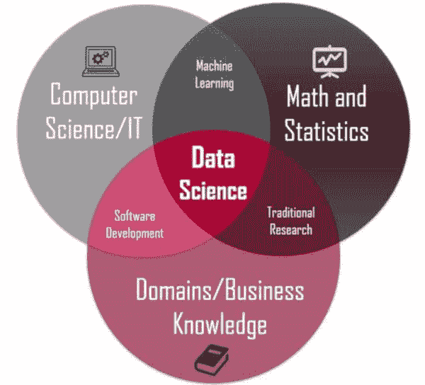

# 数据科学顶级 10 大列表

> 原文：[`www.kdnuggets.com/2020/08/top-10-lists-data-science.html`](https://www.kdnuggets.com/2020/08/top-10-lists-data-science.html)

评论

**作者 [Mojeed Abisiga](https://www.linkedin.com/in/mojeed-abisiga/)，数据科学家与机器学习工程师**。

* * *

## 我们的三大课程推荐

 1\. [谷歌网络安全证书](https://www.kdnuggets.com/google-cybersecurity) - 快速进入网络安全职业轨道。

 2\. [谷歌数据分析专业证书](https://www.kdnuggets.com/google-data-analytics) - 提升您的数据分析水平

 3\. [谷歌 IT 支持专业证书](https://www.kdnuggets.com/google-itsupport) - 支持您的组织 IT 需求

* * *

数据科学无疑是 21 世纪“最性感”的职业路径，由具备强烈智力好奇心和技术专长的人组成，从大量数据中挖掘有价值的见解。这帮助公司通过提高生产力、解锁更好的决策洞察和利润增长等方式增值。

数据科学家的旅程充满了曲折和变化，这些都会塑造你。然而，真正塑造你的不是这些曲折和变化，而是你如何应对它们。许多挑战可以通过在开始旅程之前或在成功的数据科学家之路上操作前，了解合适的工具包来预防或最小化。

本文提供了你所需的关键信息，以便你可以高效利用时间，并智能地规划数据科学职业道路。因此，提供了一个帮助你找到数据科学迷宫出路的指南。

**顶级** **✔️** **10 数据科学网站**

+   Analytics Vidhya

+   Kaggle

+   Coursera

+   Udacity

+   Datacamp

+   EdX

+   Udemy

+   KDNuggets

+   R-bloggers

+   Khan Academy

**顶级** **✔️** **10 数据科学技能**

+   概率与统计

+   线性代数

+   Python

+   R

+   SQL

+   Tableau/Power BI

+   AWS/Azure

+   Spark

+   Excel

+   DevOps

**顶级** **✔️** **10 数据科学算法**

+   线性回归

+   逻辑回归

+   K 均值聚类

+   PCA

+   支持向量机

+   决策树

+   随机森林

+   梯度提升机器

+   朴素贝叶斯分类器

+   人工神经网络

**顶级** **✔️** **10 数据科学角色**

+   数据科学家

+   决策者

+   分析师

+   ETL 工程师

+   机器学习工程师

+   数据工程师

+   分析经理

+   Tableau 开发者

+   研究员

+   BI 分析师

**顶级** **✔️** **10 LinkedIn 数据科学专家**

+   Bernard Marr

+   DJ Patil

+   Francesca Lazzeri, PhD

+   Carla Gentry

+   Dennis R. Mortensen

+   Andrew Ng

+   Gregory Piatetsky-Shapiro

+   Tom Davenport

+   Randy Lao️

+   NABIH IBRAHIM BAWAZIR

**顶级** **✔️** **10 个 Python 库用于数据科学**

+   Pandas

+   Numpy

+   Scikit-Learn

+   Keras

+   PyTorch

+   LightGBM

+   Matplotlib

+   SciPy

+   Theano

+   TensorFlow

**顶级** **✔️** **10 个数据科学行业**

+   技术

+   金融

+   零售

+   电信

+   医疗与制药

+   制造业

+   汽车

+   网络安全

+   能源

+   工具

**顶级** **✔️** **10 个 LinkedIn 上值得关注的数据科学相关标签**

+   #创新

+   #技术

+   #大数据

+   #商业智能

+   #分析

+   #数据挖掘

+   #数据

+   #人工智能

+   #机器学习

+   #数据科学

**顶级** **✔️** **10 个 LinkedIn 数据科学小组**

+   [大数据与分析](https://www.linkedin.com/groups/4332669/)

+   [高级分析与数据科学](https://www.linkedin.com/groups/8535151/)

+   [大数据、分析、商业智能与可视化专家社区](https://www.linkedin.com/groups/23006/)

+   [数据科学、大数据、机器学习、人工智能专业人士 | DataScience.US](https://www.linkedin.com/groups/85005/)

+   [数据挖掘、统计学、大数据、数据可视化和数据科学](https://www.linkedin.com/groups/152247/)

+   [研究方法与数据科学](https://www.linkedin.com/groups/1895501/)

+   [大数据、分析、物联网（IoT）与区块链](https://www.linkedin.com/groups/3990648/)

+   [大数据|人工智能|机器学习|预测分析|数据挖掘|数据科学](https://www.linkedin.com/groups/5096075/)

+   [IBM 大数据与分析](https://www.linkedin.com/groups/4014567/)

+   [高级分析、预测建模与统计分析专业人士小组](https://www.linkedin.com/groups/138718/)

**顶级** **✔️** **10 个免费数据集来源用于数据科学项目**

+   Kaggle

+   UCI 机器学习库

+   Google 自定义数据集搜索

+   政府

+   Reddit

+   Quandl

+   VisualData

+   GitHub

+   世界

+   Google Cloud 公共数据集

祝你在成为顶尖数据科学专家的旅程中好运。没有什么是不可能的，相信自己！

### 参考资料

[`towardsdatascience.com/top-10-great-sites-with-free-data-sets-581ac8f6334`](https://towardsdatascience.com/top-10-great-sites-with-free-data-sets-581ac8f6334)

[`www.dataquest.io/blog/free-datasets-for-projects/`](https://www.dataquest.io/blog/free-datasets-for-projects/)

[`www.analyticsinsight.net/top-10-big-data-analytics-linkedin-groups/`](https://www.analyticsinsight.net/top-10-big-data-analytics-linkedin-groups/)

[`www.linkedinsights.com/the-hot-100-linkedin-hashtags/`](https://www.linkedinsights.com/the-hot-100-linkedin-hashtags/)

[`www.geeksforgeeks.org/11-industries-that-benefits-the-most-from-data-science/`](https://www.geeksforgeeks.org/11-industries-that-benefits-the-most-from-data-science/)

[`datafloq.com/read/top-industries-for-data-science-professionals/6698`](https://datafloq.com/read/top-industries-for-data-science-professionals/6698)

[`www.linkedin.com/pulse/top-12-data-science-experts-best-career-articles-linkedin-tanmoy-ray/`](https://www.linkedin.com/pulse/top-12-data-science-experts-best-career-articles-linkedin-tanmoy-ray/)

[`www.kdnuggets.com/2016/05/10-big-data-data-science-leaders-linkedin.html`](https://www.kdnuggets.com/2016/05/10-big-data-data-science-leaders-linkedin.html)

[`towardsdatascience.com/the-top-10-ml-algorithms-for-data-science-in-5-minutes-4ffbed9c8672`](https://towardsdatascience.com/the-top-10-ml-algorithms-for-data-science-in-5-minutes-4ffbed9c8672)

[`medium.com/@exastax/top-20-data-science-blogs-and-websites-for-data-scientists-d88b7d99740`](https://medium.com/@exastax/top-20-data-science-blogs-and-websites-for-data-scientists-d88b7d99740)

**简介：** [Mojeed Abisiga](https://www.linkedin.com/in/mojeed-abisiga/) 是一名数据科学家和机器学习工程师，拥有丰富的经验，成功将基于机器学习的解决方案应用于现实世界问题，并利用他在工具和技术方面的专长，从大量数据中发现模式和挖掘洞察，帮助企业推动增长、做出有价值的决策，并在数据旅程中获得竞争优势。他目前在 KPMG 尼日利亚的数据与分析部门担任数据科学家和 RPA 专家，构建了多个跨越不同领域和行业（如电信、银行、人力资源和快速消费品）的企业级智能自动化、商业智能和机器学习模型。

**相关：**

+   [2020 年 5 项必须掌握的数据科学技能](https://www.kdnuggets.com/2020/01/top-5-data-science-skills-2020.html)

+   [数据科学家最受欢迎的技术技能](https://www.kdnuggets.com/2019/12/most-demand-tech-skills-data-scientists.html)

+   [哪些数据科学技能是核心技能，哪些是热点/新兴技能？](https://www.kdnuggets.com/2019/09/core-hot-data-science-skills.html)

### 更多相关话题

+   [成为优秀数据科学家所需的 5 项关键技能](https://www.kdnuggets.com/2021/12/5-key-skills-needed-become-great-data-scientist.html)

+   [每位初学者数据科学家应掌握的 6 种预测模型](https://www.kdnuggets.com/2021/12/6-predictive-models-every-beginner-data-scientist-master.html)

+   [2021 年最佳 ETL 工具](https://www.kdnuggets.com/2021/12/mozart-best-etl-tools-2021.html)

+   [学习数据科学统计的顶级资源](https://www.kdnuggets.com/2021/12/springboard-top-resources-learn-data-science-statistics.html)

+   [停止学习数据科学以寻找目标，并寻找目标去…](https://www.kdnuggets.com/2021/12/stop-learning-data-science-find-purpose.html)

+   [过滤 Python 列表的 5 种方法](https://www.kdnuggets.com/2022/11/5-ways-filtering-python-lists.html)
