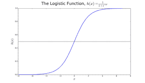
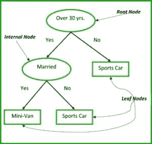
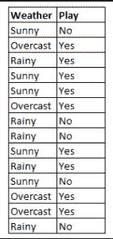

# 初学者的十大机器学习算法

> 原文：[`www.kdnuggets.com/2017/10/top-10-machine-learning-algorithms-beginners.html`](https://www.kdnuggets.com/2017/10/top-10-machine-learning-algorithms-beginners.html)

### I. 介绍

对[机器学习算法](https://www.kdnuggets.com/2016/08/10-algorithms-machine-learning-engineers.html)的研究在《哈佛商业评论》[文章](https://hbr.org/2012/10/data-scientist-the-sexiest-job-of-the-21st-century)称数据科学家为“21 世纪最性感的职业”之后，获得了极大的关注。因此，为了帮助那些刚入门机器学习领域的人，我们决定重新编排我们极受欢迎的金牌博客机器学习工程师需要了解的 10 种算法——尽管这篇文章面向的是初学者。

机器学习算法是能够从数据中学习并通过经验改进的算法，无需人工干预。学习任务可能包括学习将输入映射到输出的函数，学习无标记数据中的隐藏结构；或者是‘基于实例的学习’，在这种学习中，通过将新的实例（行）与存储在内存中的训练数据实例进行比较，为新的实例生成类别标签。‘基于实例的学习’不会从特定实例中创建抽象。

### II. 机器学习算法的类型

机器学习算法有 3 种类型：

**1\. 监督学习：**

监督学习可以解释为：使用标记的训练数据来学习从输入变量（X）到输出变量（Y）的映射函数。

*Y = f (X)*

监督学习问题可以分为两类：

*a. 分类*：预测给定样本的结果，其中输出变量以类别的形式出现。例子包括性别（男性和女性）、健康状况（生病和健康）。

*b. 回归*：预测给定样本的结果，其中输出变量以实际值的形式出现。例子包括表示降雨量、人的身高的实际值标签。

我们在本博客中讨论的前 5 种算法——线性回归、逻辑回归、CART、朴素贝叶斯、KNN 是监督学习的例子。

集成学习是一种监督学习。它指的是将多个不同的弱机器学习模型的预测结果结合起来，以对新的样本进行预测。我们讨论的算法 9-10——使用随机森林的袋装方法、使用 XGBoost 的提升方法就是集成技术的例子。

**2\. 无监督学习：**

无监督学习问题只有输入变量（X），但没有相应的输出变量。它使用未标记的训练数据来建模数据的潜在结构。

无监督学习问题可以分为两类：

*a. 关联*：发现集合中项的共现概率。这在市场篮子分析中被广泛使用。例如：如果一个顾客购买了面包，他有 80%的可能性也会购买鸡蛋。

*b. 聚类*：将样本分组，使得同一簇内的对象彼此之间的相似度高于与其他簇中的对象之间的相似度。

*c. 降维*：顾名思义，降维意味着减少数据集中的变量数量，同时确保重要信息仍然被传达。降维可以通过特征提取方法和特征选择方法来完成。特征选择从原始变量中选择一个子集。特征提取则将数据从高维空间转换到低维空间。例如：PCA 算法是一种特征提取方法。

我们在这里讨论的算法 6-8 - Apriori、K-means、PCA 是无监督学习的例子。

**3\. 强化学习：**

强化学习是一种机器学习算法，它允许智能体根据当前状态决定最佳的下一步行动，通过学习能够最大化奖励的行为。

强化算法通常通过试错法学习最佳行动。它们通常用于机器人技术——机器人可以通过在碰到障碍物后获得负反馈来学习避免碰撞；以及视频游戏——在游戏中通过试错法可以揭示能够提升玩家奖励的特定动作。智能体可以使用这些奖励来了解游戏的最佳状态并选择下一步行动。

### III. 量化机器学习算法的受欢迎程度

调查论文[如这些](http://www.cs.uvm.edu/~icdm/algorithms/10Algorithms-08.pdf)已经量化了 10 种最受欢迎的数据挖掘算法。然而，这些列表是主观的，正如引用的论文所示，参与者的样本量非常狭窄，主要是数据挖掘的高级从业者。受访者包括 ACM KDD 创新奖和 IEEE ICDM 研究贡献奖的获奖者；KDD-06、ICDM’06 和 SDM’06 的程序委员会成员；以及 ICDM’06 的 145 名与会者。

本博客中的前 10 种算法旨在为初学者提供帮助，主要是我在孟买大学计算机工程本科阶段从‘数据仓储与挖掘’（DWM）课程中学到的。这门课程是了解机器学习算法领域的绝佳入门。最后两种算法（集成方法）是根据它们在[Kaggle 竞赛中获胜的普遍性](http://www.datasciencecentral.com/profiles/blogs/want-to-win-at-kaggle-pay-attention-to-your-ensembles)特别列出的。希望你喜欢这篇文章！

### IV. 监督学习算法

**1\. 线性回归**

在机器学习中，我们有一组输入变量（x），用于确定输出变量（y）。输入变量和输出变量之间存在一种关系。机器学习的目标是量化这种关系。

图 1：线性回归表示为形式为 y = a + bx 的直线。[来源](http://bhagyeshvikani.blogspot.ca/2015/10/linear-regression.html) 在线性回归中，输入变量（x）和输出变量（y）之间的关系被表示为形式为 y = a + bx 的方程。因此，线性回归的目标是找出系数 a 和 b 的值。这里，a 是截距，b 是直线的斜率。

图 1 显示了数据集中 x 和 y 值的散点图。目标是拟合一条与大多数点最接近的直线。这将减少数据点的 y 值与直线之间的距离（“误差”）。

**2\. 逻辑回归**

线性回归预测的是连续值（如降雨量，以 cm 为单位），而逻辑回归预测的是离散值（如学生是否及格），这是在应用转换函数后得到的。

逻辑回归最适合于二分类问题（数据集中 y = 0 或 1，其中 1 表示默认类别。例如：在预测事件是否发生时，事件发生被分类为 1。在预测一个人是否会生病时，生病的情况被标记为 1）。它以其使用的转换函数命名，即逻辑函数 h(x)= 1/ (1 + e^x)，这是一个 S 形曲线。

在逻辑回归中，输出是默认类别的概率（与线性回归直接产生输出不同）。由于它是概率，输出范围在 0-1 之间。输出（y 值）是通过对 x 值进行对数转换，使用逻辑函数 h(x)= 1/ (1 + e^ -x) 得到的。然后应用阈值将这个概率强制转换为二分类。

图 2：逻辑回归用于判断肿瘤是恶性还是良性。如果概率 h(x)>= 0.5，则分类为恶性。[来源](https://athemathmo.github.io/2016/03/07/rusty-machine.html) 在图 2 中，为了判断肿瘤是否恶性，默认变量为 y=1（肿瘤=恶性）；x 变量可以是肿瘤的测量值，比如肿瘤的大小。如图所示，逻辑函数将数据集中各种实例的 x 值转换到 0 到 1 的范围内。如果概率超过 0.5 的阈值（由水平线表示），则将肿瘤分类为恶性。

逻辑回归方程 *P(x) = e ^ (b0 +b1*x) / (1 + e^(b0 + b1*x))* 可以转换为 *ln(p(x) / 1-p(x)) = b0 + b1*x*。

逻辑回归的目标是利用训练数据来寻找系数 b0 和 b1 的值，以最小化预测结果与实际结果之间的误差。这些系数使用最大似然估计技术来估算。

**3. CART**

分类与回归树（CART）是一种决策树的实现，还有其他如 ID3、C4.5。

非终端节点是根节点和内部节点。终端节点是叶子节点。每个非终端节点代表一个输入变量（x）及其在该变量上的分裂点；叶子节点代表输出变量（y）。模型的使用方法是：沿着树的分裂路径走到一个叶子节点，并输出该叶子节点上的值。

图 3 中的决策树根据一个人的年龄和婚姻状况来分类其是否会购买跑车或小型货车。如果该人超过 30 岁且未婚，我们按以下方式走树：‘超过 30 岁？’ -> 是 -> ‘已婚？’ -> 否。因此，模型输出的是跑车。

图 3：决策树的部分。 [来源](http://www.hypertextbookshop.com/dataminingbook/public_version/contents/chapters/chapter001/section002/green/page001.html)

**4. 朴素贝叶斯**

为了计算一个事件发生的概率，给定另一个事件已经发生，我们使用贝叶斯定理。为了计算某个变量值下的结果概率，即计算假设 h 为真的概率，给定我们的先验知识 d，我们使用贝叶斯定理如下：

*P(h|d) = (P(d|h) * P(h)) / P(d)*

where

+   P(h|d) = 后验概率。给定数据 d，假设 h 为真的概率，其中 P(h|d) = P(d1|h) * P(d2|h) * .... * P(dn|h) * P(d)

+   P(d|h) = 似然性。给定假设 h 为真的情况下，数据 d 的概率。

+   P(h) = 类别先验概率。假设 h 为真的概率（与数据无关）

+   P(d) = 预测先验概率。数据的概率（与假设无关）

这个算法被称为‘naive’（朴素的），因为它假设所有变量相互独立，这在实际例子中是一个朴素的假设。

图 4：使用朴素贝叶斯预测‘play’的状态，变量为‘weather’。以图 4 为例，如果天气 = ‘sunny’，结果是什么？

为了确定结果是 play = ‘yes’ 还是 ‘no’，给定变量 weather = ‘sunny’，计算 P(yes|sunny) 和 P(no|sunny)，并选择概率较高的结果。

-> P(yes|sunny) = (P(sunny|yes) * P(yes)) / P(sunny)

= (3/9 * 9/14) / (5/14)

= 0.60

-> P(no|sunny) = (P(sunny|no) * P(no)) / P(sunny)

= (2/5 * 5/14) / (5/14)

= 0.40

因此，如果天气 = ‘sunny’，结果是 play = ‘yes’。

**5. KNN**

K 最近邻算法使用整个数据集作为训练集，而不是将数据集拆分为训练集和测试集。

当需要为一个新的数据实例生成结果时，KNN 算法会遍历整个数据集，以找到与新实例最接近的 k 个实例，或者与新记录最相似的 k 个实例，然后输出结果的均值（对于回归问题）或众数（最频繁的类别，对于分类问题）。k 的值由用户指定。

实例之间的相似性通过欧氏距离和汉明距离等度量来计算。

* * *

## 我们的前三大课程推荐

 1\. [Google 网络安全证书](https://www.kdnuggets.com/google-cybersecurity) - 快速进入网络安全职业轨道。

 2\. [Google 数据分析专业证书](https://www.kdnuggets.com/google-data-analytics) - 提升你的数据分析能力

 3\. [Google IT 支持专业证书](https://www.kdnuggets.com/google-itsupport) - 支持你的组织 IT 部门

* * *

### 了解更多相关话题

+   [建立一个扎实的数据团队](https://www.kdnuggets.com/2021/12/build-solid-data-team.html)

+   [使用管道编写干净的 Python 代码](https://www.kdnuggets.com/2021/12/write-clean-python-code-pipes.html)

+   [数据科学统计学习的最佳资源](https://www.kdnuggets.com/2021/12/springboard-top-resources-learn-data-science-statistics.html)

+   [停止学习数据科学去寻找目的，并找到目的去…](https://www.kdnuggets.com/2021/12/stop-learning-data-science-find-purpose.html)

+   [每位初学者数据科学家应掌握的 6 个预测模型](https://www.kdnuggets.com/2021/12/6-predictive-models-every-beginner-data-scientist-master.html)

+   [一个 90 亿美元的 AI 失败，深入分析](https://www.kdnuggets.com/2021/12/9b-ai-failure-examined.html)
