# 前十名机器学习演示：Hugging Face Spaces 版

> 原文：[`www.kdnuggets.com/2022/05/top-10-machine-learning-demos-hugging-face-spaces-edition.html`](https://www.kdnuggets.com/2022/05/top-10-machine-learning-demos-hugging-face-spaces-edition.html)

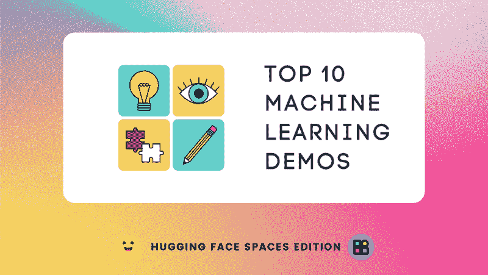

作者提供的图片

前十名榜单基于流行度、可用性和独特性。在这篇博客中，我们将学习 Hugging Face Spaces 上最佳的机器学习演示。 [Spaces](https://huggingface.co/spaces) 允许你使用 Git 上传你的 Streamlit 应用、Gradio 演示和 HTML 应用。

* * *

## 我们的前三名课程推荐

 1\. [Google 网络安全证书](https://www.kdnuggets.com/google-cybersecurity) - 快速进入网络安全职业的快车道。

 2\. [Google 数据分析专业证书](https://www.kdnuggets.com/google-data-analytics) - 提升你的数据分析能力

 3\. [Google IT 支持专业证书](https://www.kdnuggets.com/google-itsupport) - 支持你的组织进行 IT 管理

* * *

# 这个 Pokémon 不存在

[这个 Pokémon 不存在](https://huggingface.co/spaces/ronvolutional/ai-pokemon-card) 使用 [ruDALL-E](https://huggingface.co/minimaxir/ai-generated-pokemon-rudalle) 模型生成插图，随机选择名称和属性。要收集稀有和独特的宝可梦，你需要输入你的名字并点击提交按钮。这个网页应用简单但非常受欢迎。

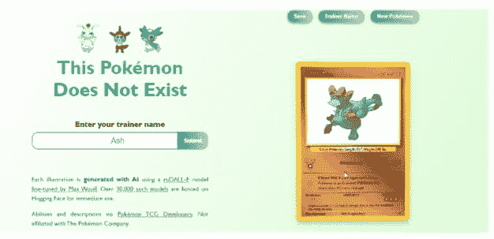

# MAGMA

[MAGMA](https://huggingface.co/spaces/EleutherAI/magma)（基于适配器的生成模型多模态增强）是一个视觉语言模型，用于描述或回答有关图像的问题。了解更多关于 MAGMA 的信息，请访问 [arxiv.org](https://arxiv.org/abs/2112.05253)。要使用 ML 演示，你需要提供一张图片并提出一个具体的问题。例如，“描述这张图片”。了解更多用例请点击 [这里](https://github.com/Aleph-Alpha/magma)。

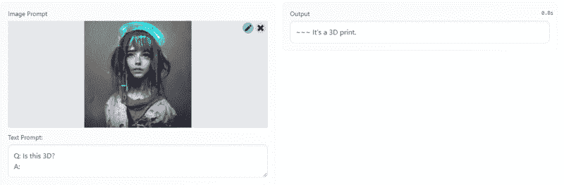

# AnimeGANv2

[AnimeGANv2](https://huggingface.co/spaces/akhaliq/AnimeGANv2) 是 Hugging Face Spaces 上最受欢迎的机器学习应用，拥有 515 个 ?。它还以难以置信的艺术风格快速生成结果。了解更多关于生成模型的内部工作，请点击 [这里](https://tachibanayoshino.github.io/AnimeGANv2/)。要使用这个演示，你需要上传一张肖像，然后选择风格生成动漫风格的艺术作品。

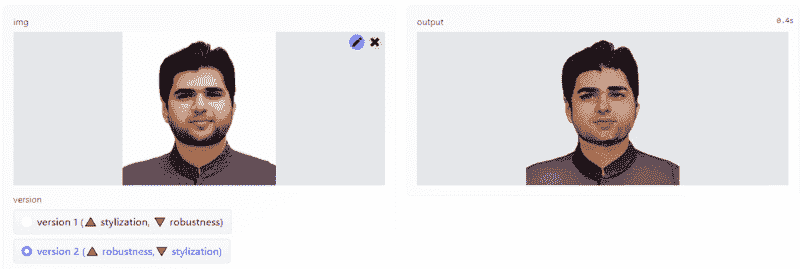

# 图像修复与着色

当我在 Twitter 上看到 [图像恢复与上色](https://huggingface.co/spaces/manhkhanhUIT/Image_Restoration_Colorization) 演示时，我以为他们一定使用了一个完美的例子来展示输出。然而，当我在一张全新的照片上亲自尝试时，我被应用的简单性和强大功能所震撼。Gradio 演示要求你上传黑白和损坏的图像，它将返回一张上色的高质量照片。你还可以通过多种选项进行尝试，以获得更好的结果。

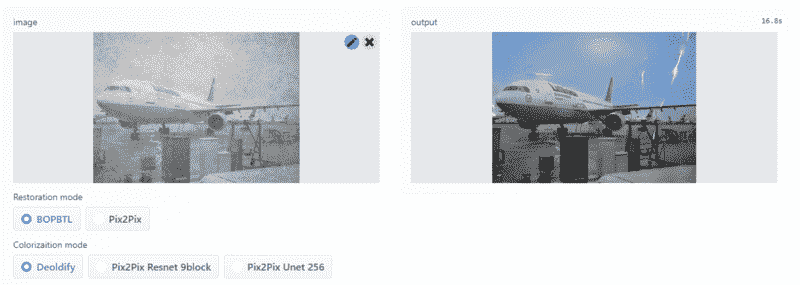

# DiT 文档布局分析

[DiT](https://huggingface.co/spaces/nielsr/dit-document-layout-analysis) [文档布局分析](https://huggingface.co/spaces/nielsr/dit-document-layout-analysis) 演示使用了一个自监督预训练的文档图像变换器模型来预测 PDF 文档上的标签。例如，检测表格、文本、图像等。该演示需要一个 PDF 文档，其余的由强大的模型来突出显示文档的各个部分。

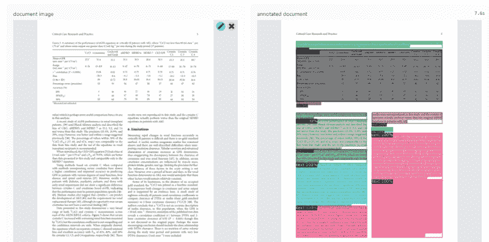

# Chef Transformer

[Chef Transformer](https://huggingface.co/spaces/flax-community/chef-transformer) 演示使用了 [t5-recipe-generation](https://huggingface.co/flax-community/t5-recipe-generation) 模型，根据厨师、食物风格和配料生成食谱。如果你饿了而食物选择有限，可以输入配料并获得美味食物的食谱。这是我最喜欢的应用程序，因为它在视觉上很吸引人且具有独特的使用场景。

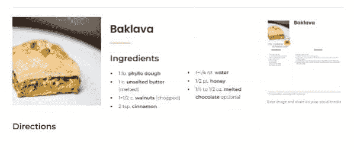

# ArcaneGAN 视频

[ArcaneGAN 视频](https://huggingface.co/spaces/sxela/ArcaneGAN-video)使用在 Arcane 动漫数据集上训练的风格化 U-Net，图像通过混合的 StyleGAN2 生成。了解更多关于模型实现的内容，请点击 [这里](https://github.com/Sxela/ArcaneGAN)。在这个 Gradio 演示中，你只需上传一个示例视频，让模型施展魔法。输出视频将呈现 [Arcane](https://www.imdb.com/title/tt11126994/) 动漫风格。

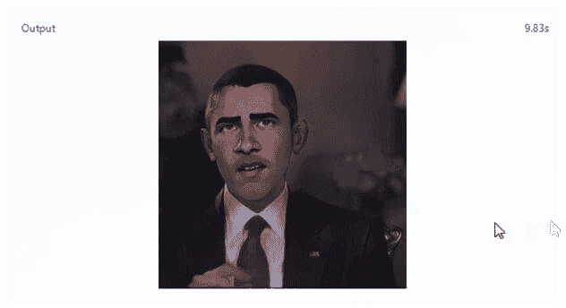

# 瑞克与莫蒂聊天机器人

[瑞克与莫蒂聊天机器人](https://huggingface.co/spaces/kingabzpro/Rick_and_Morty_Bot)使用了一个经过微调的 [DialoGPT](https://www.microsoft.com/en-us/research/publication/dialogpt-large-scale-generative-pre-training-for-conversational-response-generation/) 版本，该模型在瑞克与莫蒂的对话数据集上进行了训练。聊天机器人功能是新的，它为你提供了增强的聊天体验。只需输入搞笑问题，继续对话，直到你觉得无聊为止。

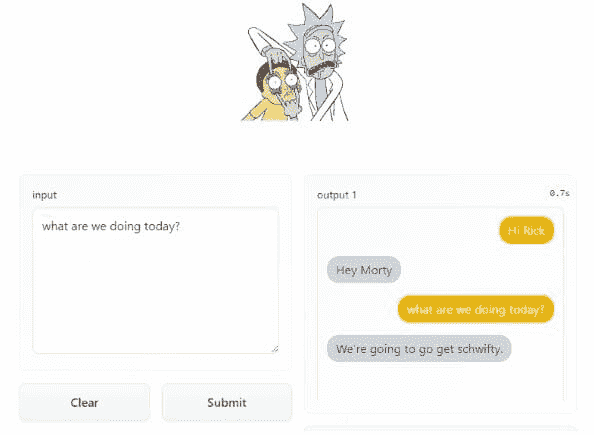

# OCR 用于验证码

[OCR For Captcha](https://huggingface.co/spaces/keras-io/ocr-for-captcha) 模型是在结合了 CNN 和 RNN 的基础上训练的，并具有一个用于实现 CTC 损失的终端层。要深入了解模型训练，查看 Keras 的 [代码示例](https://keras.io/examples/vision/captcha_ocr/)。该应用要求你上传一张验证码图片，并返回高度准确的字母数字文本。

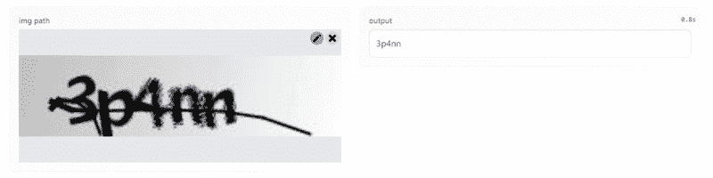

# Fastspeech2 TTS

[Fastspeech2 TTS](https://huggingface.co/spaces/StevenLimcorn/fastspeech2-TTS) 使用了实时的最先进的语音合成架构，如 Tacotron-2、Melgan、Multiband-Melgan、FastSpeech 和基于 TensorFlow 的 FastSpeech2。如果你想体验自然的文本转语音效果，可以试着输入文本并感到惊艳。这个应用还允许你测试各种模型架构。我非常喜欢演讲者的自然声音。

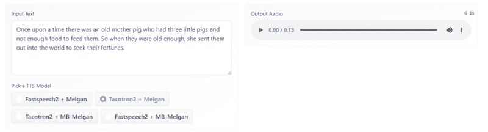

# 结论

当我被邀请参加 Spaces 的 beta 测试时，我曾持怀疑态度，但一个月内，Spaces 已超越了 Streamlit cloud、Heroku 和其他云部署平台。在易用性、集成性和更快推理方面，我爱上了 HuggingFace Spaces 以及社区成员提出的独特 Web 应用创意。在这篇博客中，我们覆盖了 HF Spaces 上的前十名机器学习演示，并了解了这些应用的工作原理。

> 请在评论区告诉我你心目中的前十名排名。

**[Abid Ali Awan](https://www.polywork.com/kingabzpro)** ([@1abidaliawan](https://twitter.com/1abidaliawan)) 是一位认证的数据科学专业人士，热衷于构建机器学习模型。目前，他专注于内容创作，并撰写有关机器学习和数据科学技术的技术博客。Abid 拥有技术管理硕士学位和电信工程学士学位。他的愿景是使用图神经网络为正在与心理疾病斗争的学生构建 AI 产品。

### 更多相关主题

+   [前 7 个基于扩散的应用及其演示](https://www.kdnuggets.com/2022/10/top-7-diffusionbased-applications-demos.html)

+   [一个为客户数据建模开发 Hugging Face 的社区](https://www.kdnuggets.com/2022/08/objectiv-community-developing-hugging-face-customer-data-modeling.html)

+   [在 5 分钟内使用 Hugging Face 和 Gradio 构建 AI 聊天机器人](https://www.kdnuggets.com/2023/06/build-ai-chatbot-5-minutes-hugging-face-gradio.html)

+   [如何使用 Hugging Face AutoTrain 微调 LLMs](https://www.kdnuggets.com/how-to-use-hugging-face-autotrain-to-finetune-llms)

+   [如何用 Hugging Face AutoTrain 微调 Mistral AI 7B LLM](https://www.kdnuggets.com/how-to-finetune-mistral-ai-7b-llm-with-hugging-face-autotrain)

+   [Mistral 7B-V0.2：用 Hugging Face 微调 Mistral 的新开源 LLM](https://www.kdnuggets.com/mistral-7b-v02-fine-tuning-mistral-new-open-source-llm-with-hugging-face)
