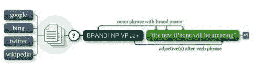
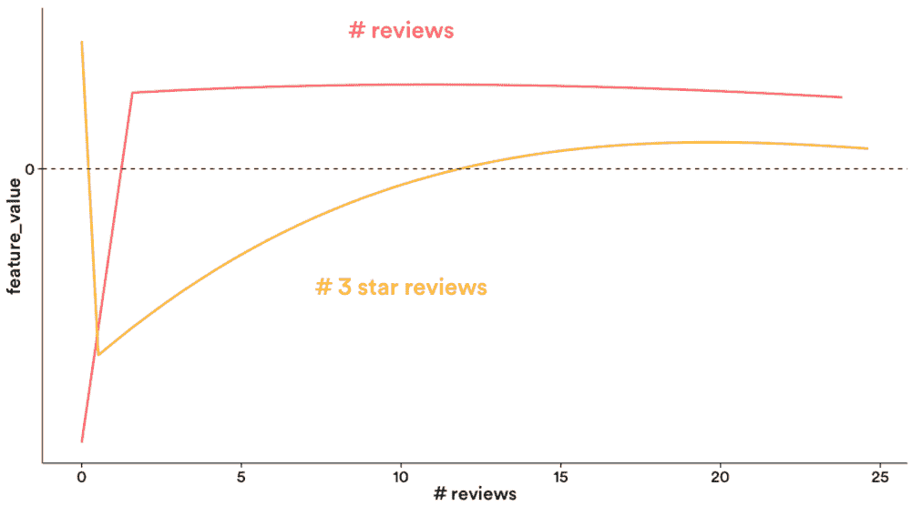

# Github 上的前 10 大机器学习项目

> 原文：[`www.kdnuggets.com/2015/12/top-10-machine-learning-github.html/2`](https://www.kdnuggets.com/2015/12/top-10-machine-learning-github.html/2)

**5\. [Pattern](https://github.com/clips/pattern)**

> 用于 Python 的网络挖掘模块，提供抓取、自然语言处理、机器学习、网络分析和可视化的工具。

★ 3799,  598

[Pattern](http://www.clips.ua.ac.be/pages/pattern)是一个基于 Python 的网络挖掘工具包，源自安特卫普大学的[计算语言学与心理语言学（CLiPS）](http://www.clips.ua.ac.be/)研究中心。在此背景下，它提供了用于抓取、机器学习、自然语言处理、网络分析和可视化的工具。Pattern 还可以轻松从几个知名的网络服务中挖掘数据。该项目声称文档齐全，并包括大量示例和单元测试。

**6\. [NuPIC (Numenta 智能计算平台)](https://github.com/numenta/nupic)**

> 一个受脑部启发的机器智能平台，基于皮层学习算法的生物学准确神经网络。

★ 3647,  987

[NuPIC](http://numenta.org/)实现了[层次时间记忆（HTM）](http://numenta.com/learn/hierarchical-temporal-memory-white-paper.html)机器学习算法。HTM 试图模拟新皮层的计算，重点在于存储和回忆空间和时间模式。NuPIC 非常适合与模式相关的异常检测。

**7\. [Vowpal Wabbit](https://github.com/JohnLangford/vowpal_wabbit)**

> Vowpal Wabbit 是一个机器学习系统，通过在线学习、哈希、全局归约、减法、学习 2 搜索、主动学习和交互学习等技术推动机器学习的前沿。

★ 2949,  827

[Vowpal Wabbit](http://hunch.net/~vw/)旨在快速建模大规模数据集，并支持并行学习。该项目最初在 Yahoo!启动，目前由微软研究院开发。Vowpal Wabbit 利用[外存学习](https://en.wikipedia.org/wiki/Out-of-core_algorithm)，并已被用于在 1000 个计算节点上在一小时内[学习一个 TB 特征数据集](http://arxiv.org/abs/1110.4198)。

**8\. [aerosolve](https://github.com/airbnb/aerosolve)**

> 为人类打造的机器学习包。

★ 2538,  245

aerosolve 试图与其他库不同，专注于提供用户友好的调试功能、用于训练的 Scala 代码、用于轻松图像排名的图像内容分析引擎，以及为用户提供灵活性和控制功能的特征转换语言。aerosolve 实现了基于 thrift 的特征表示，其中特征按逻辑分组，用于对整个特征组应用转换或促进组间的交互。

**9\. [GoLearn](https://github.com/sjwhitworth/golearn)**

> 适用于 Go 的机器学习。

★ 2334,  215

GoLearn 是一个为 Go 开发的活跃的机器学习库。其目标是为 Go 开发人员提供一个功能全面、易于使用且可定制的包。GoLearn 实现了许多人熟悉的 Scikit-learn 的 fit/predict 接口，使更换估计器变得容易，并实现了像交叉验证和训练/测试拆分这样的“辅助函数”。

**10\. [黑客的机器学习代码](https://github.com/johnmyleswhite/ML_for_Hackers)**

> 伴随《黑客的机器学习》一书的代码。

★ 2003,  1446

该库包含 O'Reilly 书籍《黑客的机器学习》的代码。所有库代码都是 R 语言编写的，依赖于众多 R 包，涵盖的主题包括分类、排序和回归等常见任务，以及主成分分析和多维尺度分析等统计程序。

* *根据 GitHub 搜索中“机器学习”查询的返回结果确定，按星标数量排序，截止至 2015 年 12 月 10 日下午 1:00 EST。*

**相关：**

+   [21 个机器学习项目](https://www.kdnuggets.com/2020/03/20-machine-learning-datasets-project-ideas.html)

+   前 20 个 Python 机器学习开源项目

+   拓扑数据分析 - 开源实现

+   掌握 Python 机器学习的 7 个步骤

* * *

## 我们的前三个课程推荐

 1\. [谷歌网络安全证书](https://www.kdnuggets.com/google-cybersecurity) - 快速进入网络安全职业生涯。

 2\. [谷歌数据分析专业证书](https://www.kdnuggets.com/google-data-analytics) - 提升你的数据分析技能

 3\. [谷歌 IT 支持专业证书](https://www.kdnuggets.com/google-itsupport) - 支持你所在的组织的 IT

* * *

### 更多相关话题

+   [建立一个稳固的数据团队](https://www.kdnuggets.com/2021/12/build-solid-data-team.html)

+   [使用管道编写干净的 Python 代码](https://www.kdnuggets.com/2021/12/write-clean-python-code-pipes.html)

+   [数据科学学习统计的最佳资源](https://www.kdnuggets.com/2021/12/springboard-top-resources-learn-data-science-statistics.html)

+   [停止学习数据科学以寻找目标，并通过找到目标来……](https://www.kdnuggets.com/2021/12/stop-learning-data-science-find-purpose.html)

+   [每个初学者数据科学家应掌握的 6 种预测模型](https://www.kdnuggets.com/2021/12/6-predictive-models-every-beginner-data-scientist-master.html)

+   [一个 90 亿美元的 AI 失败，经过审视](https://www.kdnuggets.com/2021/12/9b-ai-failure-examined.html)
