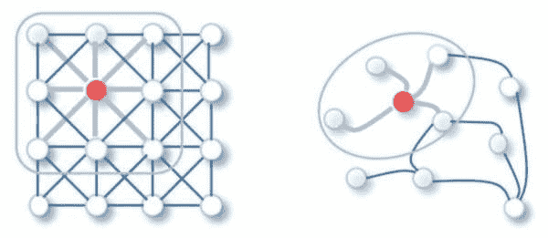
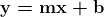
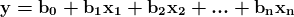

# 数据科学家必须了解的前 10 大机器学习算法 – 第一部分

> 原文：[`www.kdnuggets.com/2021/04/top-10-must-know-machine-learning-algorithms-data-scientists-1.html`](https://www.kdnuggets.com/2021/04/top-10-must-know-machine-learning-algorithms-data-scientists-1.html)

评论

图片来源：[图神经网络综合调查](https://arxiv.org/abs/1901.00596v4)

在[机器学习算法](https://www.kdnuggets.com/2016/08/10-algorithms-machine-learning-engineers.html)的海量信息中筛选，对于数据科学新手来说可能是一个困难且耗时的过程。搞清楚哪些算法被广泛使用，哪些算法只是新颖或有趣的，并不仅仅是一个学术练习；确定在学习初期要集中时间和精力的地方，可能决定了你的职业能否迅速起步，还是经历长时间的延迟。

* * *

## 我们的前 3 名课程推荐

 1\. [谷歌网络安全证书](https://www.kdnuggets.com/google-cybersecurity) - 快速进入网络安全职业的快车道。

 2\. [谷歌数据分析专业证书](https://www.kdnuggets.com/google-data-analytics) - 提升你的数据分析技能

 3\. [谷歌 IT 支持专业证书](https://www.kdnuggets.com/google-itsupport) - 支持你的组织的 IT 工作

* * *

如何准确区分值得关注的立即有用的算法和那些不那么有用的算法？确定如何制定一个权威的机器学习算法清单本质上是困难的，但似乎直接向从业者征求反馈可能是最佳方法。这样的过程带来了一整套困难，正如所能想象的那样，这种调查的结果少之又少。

然而，KDnuggets 在过去几年中[进行了这样的调查](https://www.kdnuggets.com/2019/04/top-data-science-machine-learning-methods-2018-2019.html)，询问受访者“在 2018/2019 年你在实际应用中使用了哪些数据科学/机器学习方法和算法？”当然，如上所述，这样的调查受到自我选择、参与者验证缺乏、对实际回应的信任等因素的影响，但这项调查代表了我们目前能够获得的最新、最全面的最佳资料来源。

因此，这是我们用来识别当前使用的前 10 种机器学习算法的来源，因此也是数据科学家必须了解的前 10 种算法。下面介绍了这前 10 种必知算法中的前 5 种，并简要概述了这些算法及其工作原理。我们将在接下来的几周内进行第二部分的跟进。

请注意以下事项：

+   我们跳过了不映射到机器学习算法的条目（例如“可视化”、“描述性统计”、“文本分析”）

+   我们将“回归”条目单独处理为“线性回归”和“逻辑回归”。

+   我们将条目“集成方法”替换为“自助法”，一种特定的集成方法，因为列表中还单独列出了其他一些集成方法。

+   我们跳过了任何神经网络条目，因为这些技术将架构与多种不同的算法结合以实现其目标，这些方面超出了本讨论的范围。

### 1\. 线性回归

回归是近乎经过验证的方式来近似给定数据集之间的关系，但由于[不幸的情况](https://en.wikipedia.org/wiki/Regression_analysis#History)而获得了不太有用的名称。

线性回归是一种简单的代数工具，旨在找到适合 2 个或更多属性的“最佳”（为了本讨论的目的是直线）线，其中一个属性（**简单**线性回归）或几个属性的组合（**多重**线性回归）用于预测另一个类别属性。使用一组训练实例来计算线性模型，其中一个属性或一组属性与另一个属性进行绘图。然后，该模型尝试确定给定特定类别属性时新实例将在回归线上位于何处。

预测变量与响应变量（*x* 和 *y*，分别）之间的关系可以通过以下方程表示，所有读到这里的人无疑都非常熟悉： 。

*m* 和 *b* 是回归系数，分别表示直线的斜率和 y 截距。如果你难以回忆，建议你查阅一下你的小学代数笔记 :)

多重线性回归的方程式推广为 *n* 个属性为：

### 2\. 决策树

在机器学习中，决策树几十年来一直被用作有效且易于理解的数据分类器（与现存的大量黑箱分类器形成对比）。多年来，研究产生了许多决策树算法，其中 3 种最重要、最具影响力且使用广泛的算法是：

迭代二分法 3（ID3） - 罗丝·奎因兰的 C4.5 前身

+   迭代二分法 3（ID3） - 罗丝·奎因兰的 C4.5 前身

+   C4.5 - 历史上最受欢迎的分类器之一，也是奎因兰的作品

+   CART - 与 C4.5 大致同时独立发明，也仍然非常流行

ID3、C4.5 和 CART 都采用自顶向下、递归、分治的方法来进行决策树归纳。

多年来，C4.5 已成为衡量新分类算法性能的基准。Quinlan 的原始实现包含专有代码；然而，多年来已经有各种开源版本，包括（曾经非常流行的）Weka 机器学习工具包的 J48 决策树算法。

决策树分类算法的模型（或树）构建方面由两个主要任务组成：树归纳和树剪枝。**树归纳** 是将一组预分类实例作为输入，决定最佳的分裂属性，分裂数据集，并对结果数据集递归处理，直到所有训练实例都被分类。**树剪枝** 涉及通过消除冗余或对分类过程非必要的分支来减少决策树的大小。

在构建我们的树时，目标是基于创建尽可能纯净的子节点的属性进行分裂，以此最小化对数据集中的所有实例进行分类所需的分裂次数。这种纯度通常通过多种不同的属性选择度量来衡量。

有 3 种显著的属性选择度量用于决策树归纳，每种都与 3 种显著的决策树分类器配对。

+   信息增益 - 用于 ID3 算法

+   增益比 - 用于 C4.5 算法

+   基尼指数 - 用于 CART 算法

在 ID3 中，纯度通过信息增益的概念来衡量，这一概念基于 Claude Shannon 的工作，涉及对一个之前未见实例进行正确分类所需知道多少信息。在实践中，这通过比较熵，或当前数据集划分中分类一个实例所需的信息量，与如果当前数据集划分在给定属性上进一步划分时分类一个实例所需的信息量来衡量。

本讨论中的一个重要收获应是，决策树是一种分类策略，而不是某种单一的、明确定义的分类算法。虽然我们简要了解了 3 种不同的决策树算法实现，但每种算法的不同方面有多种配置方式。实际上，任何试图对数据进行分类并采用自顶向下、递归、分治的方法来构建树状图进行后续实例分类的算法，不论其他细节（包括属性分裂选择方法和可选的树剪枝方法），都可以被视为决策树。

### *k* 均值聚类

*k*-均值是一种简单但通常有效的聚类方法。传统上，从给定数据集中随机选择*k*个数据点作为簇中心或质心，然后将所有训练实例绘制并添加到最近的簇中。在所有实例都被添加到簇之后，质心代表每个簇的实例均值被重新计算，这些重新计算的质心成为各自簇的新中心。

此时，所有簇的成员资格被重置，所有训练集的实例被重新绘制并重新添加到它们最近的、可能重新中心化的簇中。这个迭代过程持续进行，直到质心或它们的成员资格没有变化，簇被认为已经稳定。

当重新计算的质心与之前迭代的质心匹配或在某个预设的范围内时，收敛就达成了。在*k*-均值中，距离的度量通常是欧几里得距离，这对于形式为(*x, y*)的两个点，可以表示为：

技术上讲，特别是在并行计算时代，*k*-均值中的迭代聚类是串行的；然而，迭代中的距离计算不一定是串行的。因此，对于大规模数据集，距离计算是*k*-均值聚类算法中值得并行化的目标。

此外，虽然我们刚刚描述了一种使用簇均值和欧几里得距离的特定聚类方法，但想象使用簇中位数值或其他任何距离度量（如余弦距离、曼哈顿距离、切比雪夫距离等）的一系列其他方法并不困难。

### 4\. 装袋法

在特定场景下，将分类器进行链式或分组操作可能比不这样做更有用，使用投票、加权或组合的技术以追求尽可能准确的分类器。集成学习者是提供这种功能的分类器的各种方式。装袋法就是一个集成学习者的例子。

装袋法的操作非常简单：构建多个模型，观察这些模型的结果，然后选择大多数结果。我最近遇到了一些车后轴总成的问题：我对经销商的诊断不太满意，因此我带到另外 2 个车库，这两个车库都同意问题与经销商所建议的不同。瞧，装袋法在行动。

在我的例子中，我只访问了 3 个车库，但你可以想象，如果我访问了几十个或几百个车库，准确性可能会提高，尤其是当我的车的问题比较复杂时。这对于装袋法也适用，装袋分类器通常比单一的分类器更准确。此外，还要注意，所使用的分类器类型并不重要；最终模型可以由任何单一分类器类型组成。

Bagging 是*bootstrap aggregation*的简称，因其从数据集中提取多个样本，每个样本集被视为一个 bootstrap 样本。这些 bootstrap 样本的结果然后被汇总。

### 5\. 支持向量机

如前所述，支持向量机（SVM）是一种特定的分类策略。SVM 通过将训练数据集转换为更高维度来工作，然后检查这些维度中的最佳分隔边界或边界。在 SVM 中，这些边界被称为超平面，通过定位支持向量（即最本质地定义类别的实例）及其边际（与超平面平行的线，由超平面与其支持向量之间的最短距离定义）来识别。因此，SVM 能够分类线性和非线性数据。

支持向量机（SVM）的主要思想是，随着维度的增加，可以总是找到一个将特定类别与其他所有类别分开的超平面，从而划分数据集成员的类别。当重复足够多次时，可以生成足够的超平面来分隔* n *维空间中的所有类别。重要的是，SVM 不仅寻找任何分隔超平面，而是寻找最大边际超平面，即与各类别支持向量等距离的超平面。

SVM 的核心是核技巧，它使得可以在原始数据和该数据的潜在更高维特征空间变换之间进行比较，以确定这种变换是否有助于数据类别的分隔，这样我们就可以找到可以分隔类别的超平面。核技巧是至关重要的，因为它可以使潜在上不可处理的变换计算变得可行，这些比较通过成对的相似性比较来实现。

当数据是线性可分时，可以选择许多分隔线。这样的超平面可以表示为

其中* W *是权重向量，b 是标量偏置，X 是训练数据（形式为（*x[1]，x[2]*，...））。如果我们的偏置*b*被视为一个额外的权重，则该方程可以表示为

这可以被重写为一对线性不等式，通过解决大于或小于零的情况，其中任一满足条件都表明一个特定点位于超平面之上或之下。找到最大边际超平面，或位于支持向量等距离的超平面，是通过将线性不等式合并为一个方程，并将其转化为约束的二次优化问题，使用拉格朗日公式并利用 Karush-Kuhn-Tucker 条件求解，这超出了我们在这里讨论的范围。

这里有 5 个数据科学家必须了解的算法，其中*必须了解*的定义为在实践中最常用的算法，而最常用的依据是最近一次 KDnuggets 调查的结果。我们将在接下来的几周内发布该列表的第二部分。在那之前，我们希望你觉得这个列表和简单的解释对你有帮助，并且能够从中拓展学习更多相关内容。

**相关**：

+   如何在面试中解释关键的机器学习算法

+   机器学习工程师需要知道的 10 个算法

+   初学者的十大机器学习算法

### 相关主题

+   [KDnuggets 新闻，6 月 22 日：主要监督学习算法…](https://www.kdnuggets.com/2022/n25.html)

+   [检测虚假数据科学家的 20 个问题（附答案）：ChatGPT…](https://www.kdnuggets.com/2023/01/20-questions-detect-fake-data-scientists-chatgpt-1.html)

+   [检测虚假数据科学家的 20 个问题（附答案）：ChatGPT…](https://www.kdnuggets.com/2023/02/20-questions-detect-fake-data-scientists-chatgpt-2.html)

+   [初学者指南：十大机器学习算法](https://www.kdnuggets.com/a-beginner-guide-to-the-top-10-machine-learning-algorithms)

+   [机器学习中使用的主要监督学习算法](https://www.kdnuggets.com/2022/06/primary-supervised-learning-algorithms-used-machine-learning.html)

+   [必要的机器学习算法：初学者指南](https://www.kdnuggets.com/2021/05/essential-machine-learning-algorithms-beginners.html)
