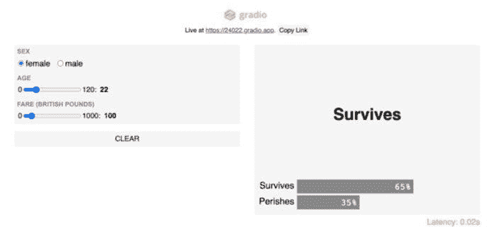

# 2021 年数据科学家应该了解的前 10 个 Python 库

> 原文：[`www.kdnuggets.com/2021/03/top-10-python-libraries-2021.html`](https://www.kdnuggets.com/2021/03/top-10-python-libraries-2021.html)

评论

*照片来自[David Clode](https://unsplash.com/@davidclode?utm_source=unsplash&utm_medium=referral&utm_content=creditCopyText)在[Unsplash](https://unsplash.com/s/photos/python?utm_source=unsplash&utm_medium=referral&utm_content=creditCopyText)上。*

* * *

## 我们的前三个课程推荐

 1\. [谷歌网络安全证书](https://www.kdnuggets.com/google-cybersecurity) - 快速进入网络安全职业的快车道。

 2\. [谷歌数据分析专业证书](https://www.kdnuggets.com/google-data-analytics) - 提升你的数据分析能力

 3\. [谷歌 IT 支持专业证书](https://www.kdnuggets.com/google-itsupport) - 支持组织中的 IT 工作

* * *

学习数据科学可能会让人感到不知所措。这里有数百种工具和资源，而且并不总是很明显你应该关注哪些工具或学习什么。

简单来说，你应该学习你喜欢的内容，因为数据科学提供了广泛的技能和工具。话虽如此，我想与大家分享我认为数据科学中最常用的前 10 个[Python 库](https://www.kdnuggets.com/2020/11/top-python-libraries-data-science-data-visualization-machine-learning.html)。

话虽如此，以下是数据科学领域的前 10 个 Python 库。

### 1\. Pandas

你一定听过这样一句话。数据科学家的 70%到 80%的工作是理解和清理数据，也就是数据探索和数据处理。

Pandas 主要用于数据分析，它是最常用的 Python 库之一。它提供了一些最有用的工具来探索、清理和分析数据。使用 Pandas，你可以加载、准备、操作和分析各种结构化数据。机器学习库也围绕 Pandas DataFrames 作为输入。

**学习 Pandas 的地方**

+   [Kaggle 教程](https://www.kaggle.com/learn/pandas)

+   [75 个 Pandas 练习及解答](https://www.kaggle.com/python10pm/pandas-75-exercises-with-solutions)

+   [Pandas 实践问题](https://github.com/guipsamora/pandas_exercises)

### 2\. NumPy

NumPy 主要用于支持 N 维数组。这些多维数组相比于 Python 列表要强大 50 倍，使得 NumPy 成为数据科学家的最爱。

NumPy 也被像 TensorFlow 这样的其他库用于其内部张量计算。NumPy 还提供了快速的预编译函数用于数值例程，这些例程可能难以手动解决。为了提高效率，NumPy 使用面向数组的计算，因此处理多个类变得容易。

**在哪里学习 NumPy**

+   [NumPy.org](https://numpy.org/learn/)

+   [TutorialsPoint](https://www.tutorialspoint.com/numpy/numpy_data_types.htm)

### 3\. Scikit-learn

Scikit-learn 可以说是 Python 中最重要的机器学习库。使用 Pandas 或 NumPy 清理和处理数据后，scikit-learn 用于构建机器学习模型，因为它拥有大量用于预测建模和分析的工具。

使用 scikit-learn 的理由有很多。举几个例子，你可以使用 scikit-learn 构建多种类型的机器学习模型，监督和无监督模型，交叉验证模型的准确性，以及进行特征重要性分析。

**在哪里学习 Scikit-learn**

+   [Scikit-learn 教程](https://scikit-learn.org/stable/tutorial/basic/tutorial.html)

+   [机器学习简介（Udacity）](https://www.udacity.com/course/intro-to-machine-learning--ud120)

### 4\. Gradio

*[由 Gradio 拍摄的图片（经许可）](https://www.gradio.app/hub/aliabid94/hub-titanic)*

[Gradio](https://www.gradio.app/) 允许你只需三行代码即可构建和部署机器学习模型的 Web 应用。它与 Streamlit 或 Flask 具有相同的目的，但我发现它更快、更容易部署模型。

Gradio 有以下几个优点：

1.  它允许进一步的模型验证。具体来说，它允许你以交互方式测试模型的不同输入。

1.  这是一种进行演示的好方法。

1.  它易于实施和分发，因为通过公共链接，任何人都可以访问该 Web 应用。

**在哪里学习 Gradio**

+   [入门页面](https://www.gradio.app/getting_started)

### 5\. TensorFlow

TensorFlow 是 Python 中用于实现神经网络的最流行的库之一。它使用多维数组，也称为张量，这使得它可以对特定输入执行多种操作。

由于其高度的并行性，它可以训练多个神经网络和 GPU，从而实现高效且可扩展的模型。TensorFlow 的这一特性也被称为管道化。

**在哪里学习 TensorFlow**

+   [TensorFlow 的官方网站](https://www.tensorflow.org/learn)

+   [Kaggle 的深度学习简介](https://www.kaggle.com/learn/intro-to-deep-learning)

+   [Google 的 TensorFlow 简介](https://developers.google.com/machine-learning/crash-course/first-steps-with-tensorflow/toolkit)

### 6\. Keras

Keras 主要用于创建深度学习模型，特别是神经网络。它建立在 TensorFlow 和 Theano 之上，使得构建神经网络变得非常简单。由于 Keras 使用后端基础设施生成计算图，因此相比于其他库，它的速度相对较慢。

**在哪里学习 Keras**

+   [Keras 的网站](https://keras.io)

+   [谷歌的 Keras 入门](https://cloud.google.com/ai-platform/docs/getting-started-keras)

### 7\. SciPy

正如名字所示，SciPy 主要用于其科学功能和源自 NumPy 的数学函数。这个库提供的一些有用功能包括统计函数、优化函数和信号处理函数。为了求解微分方程和进行优化，它包括了计算积分的函数。一些使 SciPy 变得重要的应用有：

+   多维图像处理

+   解决傅里叶变换和微分方程的能力

+   由于其优化的算法，它可以非常强大且高效地进行线性代数计算。

**在哪里学习 SciPy**

+   [SciPy 网站](https://www.scipy.org)

+   [Guru99 教程](https://www.guru99.com/scipy-tutorial.html)

### 8\. Statsmodels

Statsmodels 是一个用于进行高强度统计的优秀库。这个多功能库是不同 Python 库的融合，它从 Matplotlib 获取图形特性和功能，从 Pandas 处理数据，从 Pasty 处理类似 R 的公式，基于 NumPy 和 SciPy 构建。

特别是，它对创建统计模型（如 OLS）以及执行统计测试非常有用。

**在哪里学习 Statsmodels**

+   [Statsmodels: 入门指南](https://www.statsmodels.org/stable/gettingstarted.html)

### 9\. Plotly

Plotly 无疑是构建可视化的必备工具，因为它功能强大、易于使用，而且能够与可视化进行互动，具有很大的优势。

与 Plotly 一起使用的是 Dash，它是一个允许你使用 Plotly 可视化构建动态仪表板的工具。Dash 是一个基于网络的 Python 接口，去除了这些类型分析 Web 应用程序对 JavaScript 的需求，允许你在线和离线运行这些图表。

**在哪里学习 Plotly**

+   [Plotly 初学者可视化](https://towardsdatascience.com/interactive-visualizations-with-plotly-ea3f8feb87d1)

+   [Plotly 的高级可视化](https://towardsdatascience.com/the-next-level-of-data-visualization-in-python-dd6e99039d5e)

### 10\. Seaborn

Seaborn 建立在 Matplotlib 之上，是一个有效的库，用于创建不同的可视化。

Seaborn 最重要的功能之一是创建放大数据可视化的能力。一些初看不明显的相关性可以在可视化上下文中显示出来，从而让数据科学家更好地理解模型。

由于其可自定义的主题和高级接口，它提供了设计良好且卓越的数据可视化，使得图表非常吸引人，之后可以展示给利益相关者。

**在哪里学习 Seaborn**

+   [精英数据科学](https://elitedatascience.com/python-seaborn-tutorial)

+   [Seaborn 用户指南](https://seaborn.pydata.org/tutorial.html)

**相关资料：**

+   [更多数据科学备忘单](https://www.kdnuggets.com/2021/03/more-data-science-cheatsheets.html)

+   [你还在使用 Pandas 处理 2021 年的大数据吗？这里有两个更好的选择](https://www.kdnuggets.com/2021/03/pandas-big-data-better-options.html)

+   [2021 年数据科学学习路线图](https://www.kdnuggets.com/2021/02/data-science-learning-roadmap-2021.html)

### 更多相关主题

+   [使用管道编写干净的 Python 代码](https://www.kdnuggets.com/2021/12/write-clean-python-code-pipes.html)

+   [建立一个稳固的数据团队](https://www.kdnuggets.com/2021/12/build-solid-data-team.html)

+   [每个数据科学家应该知道的三个 R 库（即使你使用 Python）](https://www.kdnuggets.com/2021/12/three-r-libraries-every-data-scientist-know-even-python.html)

+   [2021 年最佳 ETL 工具](https://www.kdnuggets.com/2021/12/mozart-best-etl-tools-2021.html)

+   [KDnuggets 新闻，4 月 13 日：数据科学家应该知道的 Python 库……](https://www.kdnuggets.com/2022/n15.html)

+   [每个初学者数据科学家应掌握的 6 种预测模型](https://www.kdnuggets.com/2021/12/6-predictive-models-every-beginner-data-scientist-master.html)
