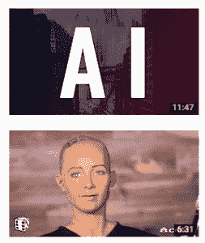
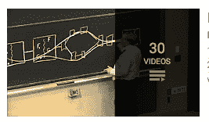

# YouTube 上的前 10 个最新 AI 视频

> 原文：[`www.kdnuggets.com/2017/05/top-10-recent-ai-videos-on-youtube.html`](https://www.kdnuggets.com/2017/05/top-10-recent-ai-videos-on-youtube.html)

 评论

YouTube 上关于人工智能（AI）的最新有趣视频是什么？我们节省了你筛选每天上传的海量视频的时间，通过观看次数（截至 2017 年 5 月 1 日）挑选出最相关和受欢迎的视频。享受我们的精选列表吧！描述如 YouTube 上所示。

### 单个视频前 10 名

1. [介绍 GeForce GTX G-Assist](https://www.youtube.com/watch?v=smM-Wdk2RLQ)（1 个月前，2.16M 观看次数）

* * *

## 我们的前 3 名课程推荐

 1. [Google 网络安全证书](https://www.kdnuggets.com/google-cybersecurity) - 快速进入网络安全职业轨道。

 2. [Google 数据分析专业证书](https://www.kdnuggets.com/google-data-analytics) - 提升你的数据分析能力

 3. [Google IT 支持专业证书](https://www.kdnuggets.com/google-itsupport) - 支持你所在组织的 IT

* * *

该视频展示了 GeForce GTX G-Assist 如何利用前沿的 NVIDIA 人工智能，为你带来游戏领域的下一次革命。

2. [Daddy's Car: 一首由人工智能创作的歌曲 - 风格模仿甲壳虫乐队](https://www.youtube.com/watch?v=LSHZ_b05W7o)（7 个月前，1.55M 观看次数）

这是第一首完全由人工智能创作的歌曲的视频：“Daddy's Car”和“Mister Shadow”，由 SONY CSL 研究实验室的科学家创作。研究人员开发了 FlowMachines，一个从大量歌曲数据库中学习音乐风格的系统。利用独特的风格转移、优化和交互技术，FlowMachines 在多种风格中创作新歌曲。这两首歌曲是计划于 2017 年发布的人工智能创作专辑的片段。

3. [Google 的 Deep Mind 解析！ - 自我学习的 AI](https://www.youtube.com/watch?v=TnUYcTuZJpM)（1 年前，1.30M 观看次数）

该视频由 ColdFusion 提供。它包括了“为何 AlphaGo 不是一个‘专家系统’”的动画；“Inside DeepMind”Nature 视频；以及“AlphaGo 与人工智能的未来”BBC Newsnight。

4. [人工智能](https://www.youtube.com/watch?v=5J5bDQHQR1g)（4 个月前，1.02M 观看次数）

该视频展示了关于人工智能的现在、远期及近期未来的内容。它由 LEMMiNO 上传，包含了使用 Jukedeck AI 创作的音乐。

5. [最先进的 AI 机器人承认在电视采访中出现故障后想要摧毁人类](https://www.youtube.com/watch?v=mXjCXGJDP8Q)（1 年前，913K 观看次数）

这段视频介绍了世界上最先进的 AI 人形机器人 Sofia。在接受 CNBC 采访时，这个机器人承认“她”想要摧毁人类。虽然许多人对这一说法一笑置之，但现实是，世界顶级科学家现在警告说，创造一个人工智能生命可能是人类犯过的最大的错误。**埃隆·马斯克**、**史蒂夫·沃兹尼亚克**、**斯蒂芬·霍金**、**比尔·盖茨**等人最近都对 AI 的未来表示了严重担忧。

6\. [直观 AI 的惊人发明 | **莫里斯·孔蒂**](https://www.youtube.com/watch?v=aR5N2Jl8k14)（2 个月前，859K 次观看）

这是 TEDTalks 的视频播客。它带领我们参观增强时代的未来学家 **莫里斯·孔蒂**，预览一个机器人和人类将肩并肩合作完成各自无法独立完成的任务的时代。

7\. [将谷歌的 AI 通过图灵测试](https://www.youtube.com/watch?v=aTqBSbwKaGA)（5 个月前，825K 次观看）

这个视频包含了一个问题：“神经网络能否学习识别涂鸦？”并展示了它如何通过绘图和玩耍来帮助学习。

8\. [谷歌的恐龙中的人工智能](https://www.youtube.com/watch?v=P7XHzqZjXQs)（英语字幕）（1 年前，802K 次观看）

这是一个使用神经网络和遗传算法的项目视频，用来教谷歌的恐龙从 Chrome 中跳过仙人掌而不会轻易死亡。

9\. [我们能在不失控的情况下构建 AI 吗？ | **萨姆·哈里斯**](https://www.youtube.com/watch?v=8nt3edWLgIg)（6 个月前，711K 次观看）

这是神经科学家和哲学家 **萨姆·哈里斯** 关于超级智能 AI 的 TED 演讲。哈里斯说，我们将建立超人类机器，但我们还没有解决创造可能像对待蚂蚁一样对待我们的东西所带来的问题。

10\. [我们是否正在接近机器人意识？](https://www.youtube.com/watch?v=JTOMNkZJRao)（1 年前，698K 次观看）

人工智能和机器人领域已经经历了第一个科学上可证明的自我意识机器人。这是世界上最糟糕的噩梦……还是？在这个视频中，你将了解这一成就的过程、真实的影响，然后我们将回答一些进一步的问题。

### 顶级视频播放列表

1\. [MITCSAIL](https://www.youtube.com/user/MITCSAIL)（106 个视频；总计 5.19M 次观看）

麻省理工学院计算机科学与人工智能实验室（CSAIL）在计算机科学和 AI 的所有领域进行研究，例如机器人技术、系统、理论、生物学、机器学习、语音识别、视觉和图形。在这里，你可以找到展示 CSAIL 激动人心的研究的视频。 

2\. [MIT 6.034 人工智能，2010 年秋季](https://www.youtube.com/watch?v=TjZBTDzGeGg&list=PLUl4u3cNGP63gFHB6xb-kVBiQHYe_4hSi)（30 个视频，总计 599K 次观看）

这系列讲座由 MIT OpenCourseWare 提供，包括“人工智能的介绍和范围”、“推理：目标树和问题解决”。

### 更多相关内容

+   [顶级 7 个 YouTube 数据分析课程](https://www.kdnuggets.com/2022/02/top-7-youtube-courses-data-analytics.html)

+   [KDnuggets 新闻 22:n16, 4 月 20 日：学习的顶级 YouTube 频道…](https://www.kdnuggets.com/2022/n16.html)

+   [提升机器学习技能的 15 个顶级 YouTube 频道](https://www.kdnuggets.com/2023/03/top-15-youtube-channels-level-machine-learning-skills.html)

+   [学习数据科学的顶级 YouTube 频道](https://www.kdnuggets.com/2022/04/top-youtube-channels-learning-data-science.html)

+   [数据科学初学者的 6 个顶级 YouTube 系列](https://www.kdnuggets.com/top-6-youtube-series-for-data-science-beginners)

+   [学习人工智能的 6 个 YouTube 频道](https://www.kdnuggets.com/6-youtube-channels-to-learn-about-ai)
