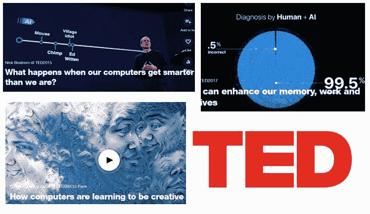

# 数据科学家和机器学习工程师的十大 TED 演讲

> 原文：[`www.kdnuggets.com/2018/01/top-10-ted-talks-data-scientists-machine-learning.html`](https://www.kdnuggets.com/2018/01/top-10-ted-talks-data-scientists-machine-learning.html)

 评论

有时候，当我们过于专注于学习机器学习的技术实现时，我们往往忽视了这项技术的重要问题，如其未来应用和政治后果。在这篇文章中，我们没有讨论使用什么语言或什么算法最适合解决问题，而是汇集了一些来自高度受欢迎的非营利组织 TED 的视频。

在这一系列视频中，你将找到关于 AI 和机器学习的有趣讨论和会议，采用“宏观视角”。你将听到关于该领域即将发展的不同观点及其对全球的影响、优势和后果。话题包括 AI 的政治和技术责任；对未来就业市场的影响，甚至它在艺术中的作用。

希望你能像我一样享受这些讲座

1.  [当我们的计算机比我们更聪明时会发生什么？](https://www.ted.com/talks/nick_bostrom_what_happens_when_our_computers_get_smarter_than_we_are)，尼克·博斯特罗姆，3.1M 次观看。[ @FHIOxford](https://twitter.com/FHIOxford)。

    人工智能正在飞速变得更加智能——研究表明，在本世纪内，计算机 AI 可能会像人类一样“聪明”。哲学家和技术专家博斯特罗姆要求我们认真思考现在我们所构建的世界，这些世界由思维机器驱动。我们的智能机器会帮助维护人类及其价值观，还是它们会有自己的价值观？

1.  [我们能在不失控的情况下构建 AI 吗？](https://www.ted.com/talks/sam_harris_can_we_build_ai_without_losing_control_over_it)，萨姆·哈里斯，3.0M 次观看，[ @SamHarrisOrg](https://twitter.com/SamHarrisOrg)。

    对超智能 AI 感到害怕吗？神经科学家和哲学家萨姆·哈里斯表示你应该感到害怕——而不仅仅是在理论上。哈里斯说，我们将构建超人类机器，但我们还没有处理好创建可能像对待蚂蚁一样对待我们的东西所带来的问题。

1.  [我们将失去哪些工作给机器 - 以及我们不会失去哪些工作](https://www.ted.com/talks/anthony_goldbloom_the_jobs_we_ll_lose_to_machines_and_the_ones_we_won_t)，安东尼·戈德布鲁姆，2.1M 次观看，[ @antgoldbloom](https://twitter.com/antgoldbloom)。

    机器学习不再仅限于像评估信用风险和分类邮件这样的简单任务——今天，它能够处理更复杂的应用，如评分作文和诊断疾病。随着这些进展，一个不安的问题出现了：未来会有机器人做你的工作吗？

1.  [我们正在构建一个反乌托邦只是为了让人们点击广告](https://www.ted.com/talks/zeynep_tufekci_we_re_building_a_dystopia_just_to_make_people_click_on_ads)，泽伊内普·图费基，1.7M 次观看，[@zeynep](https://twitter.com/zeynep)。

    在这场开阔眼界的演讲中，她详细讲述了公司如 Facebook、Google 和 Amazon 使用的相同算法如何被用来组织你获取政治和社会信息的方式。而真正的威胁甚至不是机器。我们需要理解的是强大的势力如何利用人工智能来控制我们——以及我们可以做些什么来应对。

1.  [未来没有工作的时代我们将如何赚钱](https://www.ted.com/talks/martin_ford_how_we_ll_earn_money_in_a_future_without_jobs)，马丁·福特，1.5M 次观看，[@MFordFuture](https://twitter.com/MFordFuture)。

    能够思考、学习和适应的机器即将到来——这可能意味着我们人类将面临严重的失业。我们应该怎么做呢？在关于一个有争议的想法的直白演讲中，未来学家马丁·福特提出了将收入与传统工作分离并实施全民基本收入的理由。

1.  [计算机如何学习创造力](https://www.ted.com/talks/blaise_aguera_y_arcas_how_computers_are_learning_to_be_creative)，布莱兹·阿圭拉·亚卡斯，1.49M 次观看，[@blaiseaguera](https://twitter.com/blaiseaguera)。

    布莱兹，谷歌的首席科学家，从事深度神经网络的机器感知和分布式学习。在这场引人入胜的演示中，他展示了如何将训练来识别图像的神经网络反向运行，以生成图像。结果：令人惊叹的、迷幻的拼贴画（和诗歌！）超越了分类。

1.  [人工智能如何提升我们的记忆、工作和社交生活](https://www.ted.com/talks/tom_gruber_how_ai_can_enhance_our_memory_work_and_social_lives)，汤姆·格鲁伯，1.47M 次观看。他分享了对未来的愿景，在这个未来中，人工智能帮助我们在感知、创造力和认知功能上实现超人表现——从加速我们的设计技能到帮助我们记住我们曾读过的所有内容和我们遇到的每个人的名字。

1.  [人工智能如何带来第二次工业革命](https://www.ted.com/talks/kevin_kelly_how_ai_can_bring_on_a_second_industrial_revolution)，凯文·凯利，1.46M 次观看，[@kevin2kelly](https://twitter.com/kevin2kelly)。

    他表示，在接下来的 20 年里，我们不断让事物变得越来越智能的倾向将对我们所做的几乎所有事情产生深远的影响。凯利探讨了我们需要理解的三大人工智能趋势，以便接受它并引导其发展。

1.  [不要害怕超级智能的人工智能](https://www.ted.com/talks/grady_booch_don_t_fear_superintelligence)，格雷迪·布奇，1.44M 次观看，[@Grady_Booch](https://twitter.com/Grady_Booch)。

    科学家和哲学家 Grady Booch 表示，新技术带来了新的焦虑，但我们不需要害怕全能的、无情的人工智能。Booch 通过解释我们如何教导，而不是编程，让超智能计算机分享我们的价值观，来消除我们对超级智能计算机的最糟糕的（科幻作品引发的）恐惧。他建议我们不要担心不太可能发生的生存威胁，而是考虑人工智能将如何提升人类生活。

1.  [创建更安全 AI 的 3 个原则](https://www.ted.com/talks/stuart_russell_how_ai_might_make_us_better_people)，Stuart Russell，1.23M 观看次数。我们如何利用超级智能 AI 的力量，同时防止机器人接管的灾难？随着我们朝着创造全知机器的方向前进，AI 先锋 Stuart Russell 正在研究一些略有不同的东西：具备不确定性的机器人。听听他对能够使用常识、利他主义和其他人类价值观解决问题的兼容人工智能的愿景。

**相关**

+   [**YouTube 上的近期大数据视频**](https://www.kdnuggets.com/2017/05/top-recent-big-data-videos-youtube.html)

+   [**非营利组织如何从数据科学的力量中受益**](https://www.kdnuggets.com/2018/01/nonprofits-data-science.html)

+   [**人工智能如何学习你愿意支付的价格**](https://www.kdnuggets.com/2017/12/how-ai-learns-different-prices.html)

* * *

## 我们的前三大课程推荐

 1\. [Google 网络安全证书](https://www.kdnuggets.com/google-cybersecurity) - 快速进入网络安全职业。

 2\. [Google 数据分析专业证书](https://www.kdnuggets.com/google-data-analytics) - 提升你的数据分析技能

 3\. [Google IT 支持专业证书](https://www.kdnuggets.com/google-itsupport) - 支持你所在组织的 IT 需求

* * *

### 更多相关话题

+   [成为优秀数据科学家所需的 5 项关键技能](https://www.kdnuggets.com/2021/12/5-key-skills-needed-become-great-data-scientist.html)

+   [每个初学者数据科学家都应该掌握的 6 种预测模型](https://www.kdnuggets.com/2021/12/6-predictive-models-every-beginner-data-scientist-master.html)

+   [2021 年最佳 ETL 工具](https://www.kdnuggets.com/2021/12/mozart-best-etl-tools-2021.html)

+   [学习数据科学的顶级资源](https://www.kdnuggets.com/2021/12/springboard-top-resources-learn-data-science-statistics.html)

+   [停止学习数据科学来寻找目的，并以此来……](https://www.kdnuggets.com/2021/12/stop-learning-data-science-find-purpose.html)

+   [建立一个强大的数据团队](https://www.kdnuggets.com/2021/12/build-solid-data-team.html)
