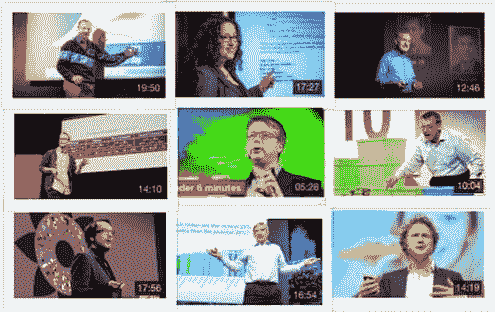

# 数据科学家必看的前 10 个 TED 演讲

> 原文：[`www.kdnuggets.com/2016/02/top-10-tedtalks-data-scientists.html`](https://www.kdnuggets.com/2016/02/top-10-tedtalks-data-scientists.html)

 评论

TED 是一个致力于传播值得传播的思想的非盈利组织——通过 TED.com，他们还安排年度会议和本地 TEDx 活动。TEDTalks 将 TED 会议上的最佳思想无偿分享给世界：值得信赖的声音和打破常规的创新者、偶像和天才们，在 18 分钟内讲述他们的故事。数据科学已经成为许多这些演讲的中心。这里，我们根据**观看次数**收集了前 10 个 TED 演讲。

1.  [你见过的最佳统计数据](https://www.ted.com/talks/hans_rosling_shows_the_best_stats_you_ve_ever_seen?language=en) (观看次数: 10,406,507)

    你从未见过这样的数据展示。统计学大师汉斯·罗斯林以体育播报员般的戏剧性和紧迫感揭穿了有关所谓“发展中国家”的神话。

1.  [我如何破解了在线约会](https://www.ted.com/talks/amy_webb_how_i_hacked_online_dating?language=en) (观看次数: 4,432,687)

    艾米·韦布在在线约会中没有好运。她喜欢的约会对象没有回复她，她自己的个人资料则吸引了一片沉默（甚至更糟）。所以，作为数据爱好者的她开始制作电子表格。听听她如何破解在线约会生活的故事——带有令人沮丧、搞笑和改变人生的结果。

1.  [什么造就了美好的生活？来自最长幸福研究的教训](https://www.ted.com/talks/robert_waldinger_what_makes_a_good_life_lessons_from_the_longest_study_on_happiness?language=en) (观看次数: 3,791,115)

    在我们生活的过程中，什么让我们保持幸福和健康？如果你认为是名誉和财富，你并不孤单——但根据精神科医生罗伯特·沃尔丁格的说法，你错了。作为一项 75 年成人发展研究的主任，沃尔丁格对真正的幸福和满足感的数据有着前所未有的获取权限。在这次演讲中，他分享了从研究中得到的三条重要教训以及一些古老的、实用的智慧，关于如何建立一个充实而长久的生活。

1.  [如何不对世界无知](https://www.ted.com/talks/hans_and_ola_rosling_how_not_to_be_ignorant_about_the_world?language=en) (观看次数: 2,711,429)

    你对这个世界了解多少？汉斯·罗斯林通过他著名的全球人口、健康和收入数据图表（还有一个特别长的指示器），展示了你对自己认为了解的事物可能大错特错的统计概率。参与他的观众问答，然后从汉斯的儿子奥拉那里学习 4 种快速减少无知的方法。

1.  [全球人口增长，一箱一箱地展示](https://www.ted.com/talks/hans_rosling_on_global_population_growth?language=en) (观看次数: 2,450,700)

    未来 50 年，全球人口将增长到 90 亿——只有通过提高最贫困者的生活标准，我们才能控制人口增长。这是汉斯·罗斯林在 TED@Cannes 上使用色彩丰富的新数据展示技术揭示的矛盾答案（你将会看到）。

1.  [谁掌控了世界？](https://www.ted.com/talks/james_b_glattfelder_who_controls_the_world?language=en)（观看次数：2,297,109）

    詹姆斯·格拉特费尔德研究复杂性：一个相互连接的系统——比如，一群鸟——如何超越其组成部分的总和。事实证明，复杂性理论可以揭示经济运行的很多奥秘。格拉特费尔德分享了一项突破性的研究，讲述了全球经济中的控制如何流动，以及少数人手中权力的集中如何使我们所有人变得脆弱。

1.  [数据可视化的美](http://www.ted.com/talks/david_mccandless_the_beauty_of_data_visualization?language=en)（观看次数：2,277,195）

    大卫·麦坎德莱斯将复杂的数据集（如全球军事开支、媒体热度、Facebook 状态更新）转化为美观、简洁的图表，揭示出隐藏的模式和联系。他建议，良好的设计是应对信息过载的最佳方式——这可能会改变我们看待世界的方式。

1.  [揭示城市交汇点与分隔点的社会地图](https://www.ted.com/talks/dave_troy_social_maps_that_reveal_a_city_s_intersections_and_separations?language=en)（观看次数：2,277,144）

    每个城市都有其社区、圈子和俱乐部，那些隐藏的线条连接并划分了同一个城市中的人们。通过观察人们在线分享的内容，我们可以了解到关于城市的什么？从自己家乡巴尔的摩开始，戴夫·特罗伊一直在可视化城市居民的推文，揭示他们的生活、交谈对象——以及他们不愿意接触的人。

1.  [对抗伪科学](https://www.ted.com/talks/ben_goldacre_battling_bad_science?language=en)（观看次数：1,891,208）

    每天都有新的健康建议新闻报道，但你如何知道这些建议是否正确？医生兼流行病学家本·戈尔德克雷高速展示了证据如何被扭曲，从明显的营养声称到制药行业的微妙把戏。

1.  [卷曲薯条困境：为什么社交媒体“点赞”比你想象的更有意义](https://www.ted.com/talks/jennifer_golbeck_the_curly_fry_conundrum_why_social_media_likes_say_more_than_you_might_think?language=en)（观看次数：1,742,215）

    你在 Facebook 上点赞了吗？观看这个演讲，了解 Facebook（以及其他平台）如何通过你的随机点赞和分享猜测出一些令人惊讶的事情。计算机科学家詹妮弗·戈尔贝克解释了这一现象的形成过程，以及这种技术的一些应用并不那么可爱——并说明了她为何认为我们应该将信息的控制权交还给其正当所有者。

* * *

## 我们的三大课程推荐

 1\. [谷歌网络安全证书](https://www.kdnuggets.com/google-cybersecurity) - 快速进入网络安全职业生涯。

 2\. [谷歌数据分析专业证书](https://www.kdnuggets.com/google-data-analytics) - 提升你的数据分析能力

 3\. [谷歌 IT 支持专业证书](https://www.kdnuggets.com/google-itsupport) - 支持你的组织的 IT

* * *

我们希望你能喜欢这些讲座。请告诉我们你最喜欢的数据科学在线讲座。

**简历：[Devendra Desale](https://www.linkedin.com/in/devendra-desale-91872847)([@DevendraDesale](https://twitter.com/DevendraDesale))** 是一名数据科学研究生，目前从事文本挖掘和大数据技术工作。他还对企业架构和数据驱动的业务感兴趣。当不在电脑前时，他也喜欢参加聚会和探索未知领域。

**相关：**

+   前 5 名大数据 / 机器学习播客

+   YouTube 上观看次数最多的大数据视频

+   最佳大数据、数据科学、数据挖掘和机器学习播客

### 更多相关话题

+   [建立一个坚实的数据团队](https://www.kdnuggets.com/2021/12/build-solid-data-team.html)

+   [使用管道编写干净的 Python 代码](https://www.kdnuggets.com/2021/12/write-clean-python-code-pipes.html)

+   [学习数据科学统计学的最佳资源](https://www.kdnuggets.com/2021/12/springboard-top-resources-learn-data-science-statistics.html)

+   [停止学习数据科学以寻找目标，然后再寻找目标…](https://www.kdnuggets.com/2021/12/stop-learning-data-science-find-purpose.html)

+   [每个初学者数据科学家应掌握的 6 个预测模型](https://www.kdnuggets.com/2021/12/6-predictive-models-every-beginner-data-scientist-master.html)

+   [成功数据科学家的 5 个特征](https://www.kdnuggets.com/2021/12/5-characteristics-successful-data-scientist.html)
