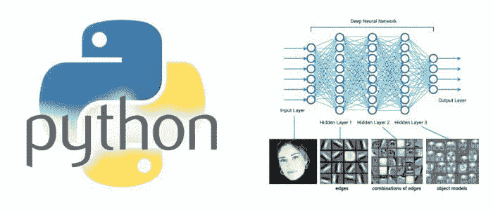

# 深度学习在 Python 中的十大视频

> 原文：[`www.kdnuggets.com/2017/11/top-10-videos-deep-learning-python.html`](https://www.kdnuggets.com/2017/11/top-10-videos-deep-learning-python.html)

这个“十大”列表是根据内容质量而非观看次数创建的。为了帮助你选择合适的框架，我们首先从一个比较几个流行 Python DL 库的视频开始。我已经包含了这十大项目的亮点以及我对每一个优缺点的看法，以便你选择最适合你需求的一个。我把最好的留到最后——最全面但免费的 YouTube 深度学习课程 ☺。我们开始吧！

**1\. 概述：[深度学习框架比较](https://www.youtube.com/watch?v=MDP9FfsNx60)（96K 次观看）** - 5 分钟

在实际列出最佳 Python 深度学习视频之前，了解 5 个最受欢迎的深度学习框架 - SciKit Learn、TensorFlow、Theano、Keras 和 Caffe 之间的区别非常重要。这个 5 分钟的视频由 Siraj Raval 制作，提供了每个框架优缺点的最佳比较，甚至展示了代码示例的结构，帮助你更好地决定。先从这个视频开始。

**2\. 播放列表：[Sentdex 的 TensorFlow 教程](https://www.youtube.com/watch?v=oYbVFhK_olY&list=PLSPWNkAMSvv5DKeSVDbEbUKSsK4Z-GgiP)（114K 次观看）** - 4.5 小时

Sentdex 的这 14 个视频播放列表是最有条理、解释最全面、简洁却易于跟随的 Python 深度学习教程。它包括了使用 MNIST 数据集的递归神经网络和卷积神经网络的 TensorFlow 实现。

**3\. 单独教程：[TensorFlow 教程 02：卷积神经网络](https://www.youtube.com/watch?v=HMcx-zY8JSg)（69.7K 次观看）** - 36 分钟

Magnus Pedersen 在 YouTube 频道 Hvass Laboratories 上的这个教程非常值得一看——代码中有出色的注释；此外，讲解者没有中断。观看这个视频来理解 TensorFlow 中的脚本。以后谢谢我 ☺

**4\. 概述：[如何轻松预测股票价格](https://www.youtube.com/watch?v=ftMq5ps503w)（210K 次观看）** - 9 分钟

在这个视频中，Siraj Raval 使用了一种特殊类型的递归神经网络——LSTM 网络。他使用了具有 TensorFlow 后端的 Keras 库。他解释了使用递归网络处理时间序列数据的原因，并用它来预测基于 16 年训练数据的 S&P 500 的每日收盘价。GitHub 代码的链接在视频描述框中给出。

*(编辑：可能对过去的数据效果很好，但不能保证对未来的数据有效)*

**5\. 教程：[使用 Python 和 Theano 库的深度学习介绍](https://www.youtube.com/watch?v=S75EdAcXHKk)（201K 次观看）** - 52 分钟

如果你想在不到一小时内听一个关于 Python 和 Theano 库的讲座，面向初学者，那么你可以参考 Alec Radford 的讲座。与大多数其他讲座不同，这个讲座比较了‘旧’网络与‘现代’网络的特征，即 2000 年前后的网络与 2012 年后的网络。

**6\. 播放列表: [PyTorch 从零到全](https://www.youtube.com/playlist?list=PLlMkM4tgfjnJ3I-dbhO9JTw7gNty6o_2m)（3K 观看次数）** - 2 小时 15 分钟

在这系列 11 个视频中，Sung Kim 从头开始教你 PyTorch。这个系列的亮点是第 10 讲，他教你如何构建一个基本的 CNN，并通过详细的图示强调 CNN 概念的理解。

**7\. 单独教程: [TensorFlow 教程](https://www.youtube.com/watch?v=yX8KuPZCAMo)（43.9K 观看次数）** - 49 分钟

这篇由 Edureka 编写的教程实现了使用 TensorFlow 的深度学习。对于 TensorFlow 初学者来说，这是一个非常好的教程。它教授了 TensorFlow 基础知识和数据结构。它还包括一个使用深度学习作为海军雷达识别器的用例——以识别水下障碍物是岩石还是地雷。

**8\. 播放列表: [用 Python 学深度学习](https://www.youtube.com/playlist?list=PLIG2x2RJ_4LSRIZiVAHH4qWQSLLfrYLnh)（1.8K 观看次数）** - 83 分钟

YouTube 频道‘Machine Learning TV’发布了一系列共 15 个视频，总计 83 分钟，使用 Theano 和 Keras 来实现自动图像标注的深度学习。它展示了如何训练你的第一个深度神经网络，以对 MNIST 数据集中的数字进行分类。它还对如何在 Theano 中加载和重用预训练模型进行了很好的解释。

**9\. 播放列表: [用 Keras 进行深度学习- Python](https://www.youtube.com/playlist?list=PLVBorYCcu-xX3Ppjb_sqBd_Xf6GqagQyl)（30.3K 观看次数）** - 85 分钟

YouTube 频道‘The SemiColon’发布了一系列 11 个视频，讲解了使用 Theano 和 Keras 实现聊天机器人的教程。它包括对卷积神经网络、Theano 中的递归神经网络（与 Keras 配合使用）、神经网络和 scikit-learn 库中的反向传播的解释，应用于手写识别（MNIST）数据集。

讲解中穿插了‘呃’和‘啊’，但对用 Word2Vec 构建聊天机器人的解释很好。

**10\. 免费在线课程: [Andrew Ng 的深度学习（完整课程）](https://www.youtube.com/playlist?list=PLBAGcD3siRDguyYYzhVwZ3tLvOyyG5k6K)（28K 观看次数）** - 4 周课程

与我之前的[金融机器学习顶级视频推荐](https://www.kdnuggets.com/2017/09/top-10-videos-machine-learning-finance.html?preview=true)一样，我将最好的留到最后☺。如果你想从公认的最著名机器学习讲师之一安德鲁·吴那里学习深度学习，那么这个播放列表适合你。这个课程旨在为期 4 周，涵盖 98 个视频，教你深度学习、神经网络、二分类、导数、梯度下降、激活函数、反向传播、正则化、RMSprop、调优、丢弃法、在不同分布上进行训练和测试等内容，使用 Python 代码在 Jupyter notebook 中进行。

**相关：**

+   Python 深度学习框架概述

+   在哪里学习深度学习- 课程、教程、软件

+   TensorFlow 非常棒- 对深度学习加速的理性看法

* * *

## 我们的前三个课程推荐

 1\. [Google 网络安全证书](https://www.kdnuggets.com/google-cybersecurity) - 加速你的网络安全职业生涯

 2\. [Google 数据分析专业证书](https://www.kdnuggets.com/google-data-analytics) - 提升你的数据分析技能

 3\. [Google IT 支持专业证书](https://www.kdnuggets.com/google-itsupport) - 支持你的组织的 IT 需求

* * *

### 更多相关内容

+   [学习数据科学的统计学最佳资源](https://www.kdnuggets.com/2021/12/springboard-top-resources-learn-data-science-statistics.html)

+   [是什么让 Python 成为初创企业理想的编程语言](https://www.kdnuggets.com/2021/12/makes-python-ideal-programming-language-startups.html)

+   [每个数据科学家都应该了解的三个 R 库（即使你使用 Python）](https://www.kdnuggets.com/2021/12/three-r-libraries-every-data-scientist-know-even-python.html)

+   [停止学习数据科学以寻找目标，并寻找目标来……](https://www.kdnuggets.com/2021/12/stop-learning-data-science-find-purpose.html)

+   [一个 90 亿美元的 AI 失败案例分析](https://www.kdnuggets.com/2021/12/9b-ai-failure-examined.html)

+   [成功的数据科学家具备的 5 个特征](https://www.kdnuggets.com/2021/12/5-characteristics-successful-data-scientist.html)
