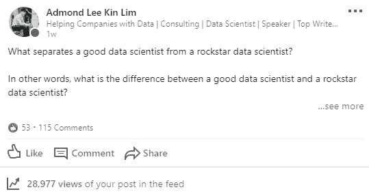

# 成为顶级数据科学家的 13 项技能

> 原文：[`www.kdnuggets.com/2019/07/top-13-skills-become-rockstar-data-scientist.html`](https://www.kdnuggets.com/2019/07/top-13-skills-become-rockstar-data-scientist.html)

 评论

**作者 [Admond Lee](https://www.linkedin.com/in/admond1994/)，Micron Technology / AI Time Journal / Tech in Asia**

* * *

## 我们的前三个课程推荐

 1\. [Google 网络安全证书](https://www.kdnuggets.com/google-cybersecurity) - 快速进入网络安全职业生涯。

 2\. [Google 数据分析专业证书](https://www.kdnuggets.com/google-data-analytics) - 提升你的数据分析技能

 3\. [Google IT 支持专业证书](https://www.kdnuggets.com/google-itsupport) - 支持你的组织 IT 需求

* * *

一周前，我在[LinkedIn 上提出了这个问题](https://www.linkedin.com/feed/update/urn:li:activity:6531492123240431616?source=post_page---------------------------)：

> 什么使得一个优秀的数据科学家与顶级数据科学家不同？

[LinkedIn 上的问题](http://what/%20separates%20a%20good%20data%20scientist%20from%20a%20rockstar%20data%20scientist?source=post_page---------------------------)

出乎意料的是，我收到了来自不同领域的许多顶级数据科学家的大量反馈，他们分享了他们的想法和建议——我发现这些内容非常有趣且实用。

为了了解优秀的数据科学家与顶级数据科学家之间的主要区别，我继续在互联网上搜索……直到我找到[这篇文章](https://www.kdnuggets.com/2018/05/simplilearn-9-must-have-skills-data-scientist.html?source=post_page---------------------------)。

所以我提炼了所有信息，并列出了成为顶级数据科学家的技能。

实际上，对于数据科学家来说，掌握以下所有技能是不可能的。但在我看来，这些技能使得一个顶级数据科学家与一个优秀的数据科学家有所不同。

在本文的结尾，我希望你能发现这些技能对你的数据科学家职业生涯有帮助。

让我们开始吧！

### 1\. 教育

数据科学家通常受过高等教育——88% 拥有至少硕士学位，46% 拥有博士学位——尽管有一些显著的例外，但通常需要非常强的教育背景才能发展成为数据科学家所需的深厚知识。要成为数据科学家，你可以获得计算机科学、社会科学、物理科学或统计学的学士学位。最常见的学习领域是数学和统计学（32%），其次是计算机科学（19%）和工程学（16%）。这些课程中的任何学位将为你提供处理和分析大数据所需的技能。

在你的学位课程结束后，你还没有完成。事实是，大多数数据科学家拥有硕士学位或博士学位，他们还会进行在线培训，以学习特定技能，比如如何使用 Hadoop 或大数据查询。因此，你可以报考数据科学、数学、天体物理学或任何其他相关领域的硕士学位课程。你在学位课程中学到的技能将帮助你轻松过渡到数据科学领域。

除了课堂学习之外，你还可以通过开发应用程序、启动博客或探索数据分析来实践课堂上学到的知识，以便进一步学习。

**在我看来，只要你能够完成工作，拥有硕士学位或博士学位是可选的。在大多数行业工作范围中，只要你能够解决业务问题，就不需要进行研究和部署前沿的新型机器学习模型。**

有用的资源免费电子书: [成为专业数据科学家的 74 个秘诀](https://datascientist88.blogspot.com/2019/05/74-secrets-to-become-pro-data-scientist.html?source=post_page---------------------------)

### 2\. R 编程

对至少一种分析工具的深入了解，对于数据科学来说通常更倾向于 R。R 专门为数据科学需求而设计。你可以使用 R 解决在数据科学中遇到的任何问题。事实上，43% 的数据科学家使用 R 来解决统计问题。然而，R 有陡峭的学习曲线。

学习起来较为困难，特别是如果你已经掌握了其他编程语言。尽管如此，互联网有许多优秀资源可以帮助你入门 R，例如 Simplilearn 的 R 编程语言数据科学培训。这是一个很好的资源，适合有志于成为数据科学家的你。

### 3\. Python 编程

Python 是我通常看到的数据科学角色中最常见的编程语言，此外还有 Java、Perl 或 C/C++。Python 是数据科学家的优秀编程语言。这也是为什么 O'Reilly 调查中 40% 的受访者将 Python 作为他们的主要编程语言。

由于其多功能性，你可以在数据科学过程中使用 Python 处理几乎所有的步骤。它可以处理各种格式的数据，你可以轻松地将 SQL 表导入到你的代码中。它允许你创建数据集，你可以在 Google 上找到你需要的任何类型的数据集。

你可以通过以下书籍了解更多有关 Python 基础知识及其在数据科学中的应用：

+   [Python 数据科学手册](https://www.amazon.com/Python-Data-Science-Handbook-Essential-ebook/dp/B01N2JT3ST/ref=as_li_ss_tl?keywords=python%20for%20data%20analysis&qid=1540663027&s=Books&sr=1-2&ref=sr_1_2&linkCode=ll1&tag=admond-20&linkId=0bb8a753123e4b54f1fa6dc463585e28&source=post_page---------------------------)

+   [Python 数据分析](https://www.amazon.com/Python-Data-Analysis-Wrangling-IPython-ebook/dp/B075X4LT6K/ref=as_li_ss_tl?keywords=python%20for%20data%20analysis&qid=1540663027&s=Books&sr=1-1&ref=sr_1_1&linkCode=ll1&tag=admond-20&linkId=838bdee3bf4ca017f2bc905cd3680f71&source=post_page---------------------------)

+   [学习 Python](https://www.amazon.com/Learning-Python-5th-Mark-Lutz/dp/1449355730/ref=as_li_ss_tl?ie=UTF8&linkCode=ll1&tag=admond-20&linkId=4497aa20eee542a8c0d91e0467082b61&source=post_page---------------------------)

### 4. Hadoop 平台

虽然这并非总是一个要求，但在许多情况下，它是高度受欢迎的。拥有 Hive 或 Pig 的经验也是一个强有力的卖点。对诸如 Amazon S3 等云工具的熟悉也会有帮助。CrowdFlower 对 3490 个 LinkedIn 数据科学职位的研究表明，Apache Hadoop 被评为数据科学家第二重要的技能，评分为 49%。

作为数据科学家，你可能会遇到数据量超过系统内存或需要将数据发送到不同服务器的情况，这时 Hadoop 就派上用场了。你可以使用 Hadoop 快速地将数据传输到系统上的各个点。这还不是全部。你可以使用 Hadoop 进行数据探索、数据过滤、数据采样和总结。

### 5. SQL 数据库/编码

尽管 NoSQL 和 Hadoop 已成为数据科学的重要组成部分，但仍然期望候选人能够编写和执行复杂的 SQL 查询。SQL（结构化查询语言）是一种编程语言，可以帮助你进行诸如添加、删除和提取数据等操作。它还可以帮助你执行分析功能和转换数据库结构。

作为数据科学家，你需要精通 SQL。这是因为 SQL 专门设计用于帮助你访问、沟通和处理数据。使用 SQL 查询数据库时，它能为你提供洞察力。它有简洁的命令，可以帮助你节省时间并减少进行复杂查询所需的编程量。学习 SQL 将帮助你更好地理解关系型数据库，并提升你作为数据科学家的个人资料。

### 6. Apache Spark

Apache Spark 正成为全球最受欢迎的大数据技术。它是一个类似于 Hadoop 的大数据计算框架。唯一的区别是 Spark 比 Hadoop 更快。这是因为 Hadoop 读写磁盘，速度较慢，而 Spark 将计算结果缓存于内存中。

Apache Spark 专门设计用于数据科学，以加速其复杂算法的运行。当处理大量数据时，它有助于传播数据处理，从而节省时间。它还帮助数据科学家处理复杂的非结构化数据集。你可以在一台机器或多台机器的集群上使用它。

Apache Spark 使数据科学家能够防止数据丢失。Apache Spark 的优势在于其速度和平台，使得进行数据科学项目变得容易。通过 Apache Spark，你可以从数据获取到分布式计算中执行分析。

### 7\. 机器学习与人工智能

许多数据科学家在机器学习领域和技术方面不够熟练。这包括**神经网络**、**强化学习**、**对抗学习**等。如果你想在其他数据科学家中脱颖而出，你需要了解机器学习技术，如**监督学习**、**决策树**、**逻辑回归**等。这些技能将帮助你解决基于主要组织结果预测的不同数据科学问题。

数据科学需要在不同的机器学习领域应用技能。Kaggle 在其一项调查中揭示，少数数据专业人士在高级机器学习技能方面具备能力，如**监督学习**、**无监督学习**、**时间序列**、**自然语言处理**、**异常检测**、**计算机视觉**、**推荐引擎**、**生存分析**、**强化学习**和**对抗学习**。

数据科学涉及处理大量数据集。你可能想熟悉[**机器学习**](http://bit.ly/2N4i6za?source=post_page---------------------------)**。**

### 8\. 数据可视化

商业世界经常产生大量数据。这些数据需要转换成易于理解的格式。人们天生比起原始数据，更容易理解图表和图形形式的图片。正如一个成语所说，“一图胜千言”。

作为数据科学家，你必须能够使用数据可视化工具，如 ggplot、d3.js 和 Matplotlib、Tableau 来可视化数据。这些工具将帮助你将项目中的复杂结果转换为易于理解的格式。问题在于，很多人不了解序列相关性或 p 值。你需要以视觉方式展示这些术语在结果中所代表的含义。

数据可视化为组织提供了直接处理数据的机会。他们可以快速掌握有助于他们抓住新商业机会并保持领先地位的见解。

特别是，我写了一篇[文章](https://towardsdatascience.com/storytelling-with-data-a-data-visualization-guide-for-business-professionals-97d50512b407?source=post_page---------------------------)，谈论了数据可视化的重要性以及如何用数据创建更好的故事。

### 9\. 非结构化数据

数据科学家能够处理非结构化数据是至关重要的。非结构化数据是指不适合放入数据库表中的未定义内容。例如包括视频、博客文章、客户评价、社交媒体帖子、视频流、音频等。它们是被堆积在一起的繁重文本。整理这些类型的数据是困难的，因为它们没有经过优化。

大多数人将非结构化数据称为“黑暗分析”，因为它的复杂性。处理非结构化数据可以帮助你揭示对决策有用的见解。作为数据科学家，你必须具备理解和操作来自不同平台的非结构化数据的能力。

### 10\. 智力好奇心

> “我没有特别的才能。我只是充满了激情的好奇心。”
> 
> — 阿尔伯特·爱因斯坦

最近你一定在各处见到过这个短语，尤其是与数据科学家相关。Frank Lo 在他几个月前发布的客座博客中描述了它的含义，并讨论了其他必要的“软技能”。

好奇心可以被定义为获取更多知识的愿望。作为数据科学家，你需要能够提出关于数据的问题，因为数据科学家花费约 80%的时间来发现和准备数据。这是因为数据科学领域发展迅速，你必须学习更多以跟上步伐。

你需要通过在线阅读内容和阅读有关数据科学趋势的相关书籍来定期更新你的知识。不要被互联网飞速流动的大量数据压倒，你必须知道如何理解这些数据。好奇心是你作为数据科学家成功所需的技能之一。例如，最初你可能看不到你所收集的数据中的许多见解。好奇心将使你能够筛选数据以找到答案和更多见解。

### 11\. 商业洞察力

成为一名数据科学家，你需要对你所工作的行业有扎实的理解，并知道你的公司正在尝试解决哪些业务问题。在数据科学方面，能够分辨出哪些问题对业务而言是重要的，以及识别出业务应该如何利用其数据的新方式是至关重要的。

要做到这一点，你必须理解你解决的问题如何影响业务。这就是为什么*[你需要了解业务运作方式](https://towardsdatascience.com/5-lessons-i-have-learned-from-data-science-in-real-working-experience-3532c1b41fd7?source=post_page---------------------------)*，这样你才能把努力方向引导到正确的地方。

### 12\. 沟通技巧

寻找优秀数据科学家的公司希望找到能够将技术发现清晰流畅地传达给非技术团队（如市场营销或销售部门）的人。数据科学家必须通过提供量化见解来帮助业务做出决策，同时理解非技术同事的需求，以便适当地处理数据。

除了使用公司理解的语言外，你还需要通过数据讲故事来沟通。作为数据科学家，你必须知道如何围绕数据创建故事情节，以便让任何人都能理解。例如，展示一张数据表格不如以讲故事的形式分享数据见解更有效。使用讲故事的方式将帮助你更好地向雇主传达你的发现。

在沟通时，要关注你分析的数据中蕴含的结果和价值。大多数企业主并不关心你分析了什么，他们关心的是这些分析如何能积极地影响他们的业务。*[学习如何专注于提供价值，并通过沟通建立持久的关系](https://towardsdatascience.com/5-lessons-i-have-learned-from-data-science-in-real-working-experience-3532c1b41fd7?source=post_page---------------------------)*。

### 13\. 团队合作

数据科学家不能单独工作。你需要与公司高管合作制定策略，与产品经理和设计师合作开发更好的产品，与市场人员合作推出更具转化率的营销活动，与客户端和服务器端软件开发人员合作创建数据管道和改进工作流程。你将不得不与组织中的每个人合作，包括你的客户。

本质上，你将与团队成员合作制定用例，以了解业务目标以及解决问题所需的数据。你需要知道如何处理用例，所需的数据以及如何将结果翻译和呈现成所有相关人员都能轻松理解的内容。

### 最终想法

[(来源)](https://unsplash.com/photos/bH7kZ0yazB0?source=post_page---------------------------)

感谢阅读。

如果你对所需的技能感到不知所措，这完全没问题（我也是！）。

归根结底，这些技能并不是成为数据科学家的必备条件，但它们确实能使你与其他典型的数据科学家有所不同。

我知道你并非普通人。

一如既往，如果你有任何问题或评论，请随时在下方留言反馈，或者你也可以通过[LinkedIn](https://www.linkedin.com/in/admond1994/?source=post_page---------------------------)与我联系。下次见！????

**简介：[Admond Lee](https://www.linkedin.com/in/admond1994/)** 被誉为帮助初创公司和各种公司解决数据问题的**数据科学家和顾问**中的佼佼者，具有强大的**数据科学咨询和行业知识**专长。你可以在 [LinkedIn](https://www.linkedin.com/in/admond1994/)、[Medium](https://medium.com/@admond1994)、[Twitter](https://twitter.com/admond1994) 和 [Facebook](https://www.facebook.com/admond1994) 上与他联系，或者[**预约与他通话**](http://bit.ly/request-a-call-with-admond)**，如果你在寻找数据科学咨询服务。**

[原文](https://towardsdatascience.com/top-13-skills-to-become-a-rockstar-data-scientist-faf2f97e655d)。经授权转载。

**相关内容：**

+   你应该关注的 10 位数据科学领袖

+   如何进入数据科学领域：为有志数据科学家提供的终极问答指南

+   简单却实用的数据清理代码

### 相关主题

+   [构建强大的数据团队](https://www.kdnuggets.com/2021/12/build-solid-data-team.html)

+   [使用管道编写干净的 Python 代码](https://www.kdnuggets.com/2021/12/write-clean-python-code-pipes.html)

+   [成为出色数据科学家所需的 5 项关键技能](https://www.kdnuggets.com/2021/12/5-key-skills-needed-become-great-data-scientist.html)

+   [每位初学者数据科学家应掌握的 6 种预测模型](https://www.kdnuggets.com/2021/12/6-predictive-models-every-beginner-data-scientist-master.html)

+   [成功数据科学家的 5 个特征](https://www.kdnuggets.com/2021/12/5-characteristics-successful-data-scientist.html)

+   [每个数据科学家都应该了解的三个 R 库（即使你使用 Python）](https://www.kdnuggets.com/2021/12/three-r-libraries-every-data-scientist-know-even-python.html)
