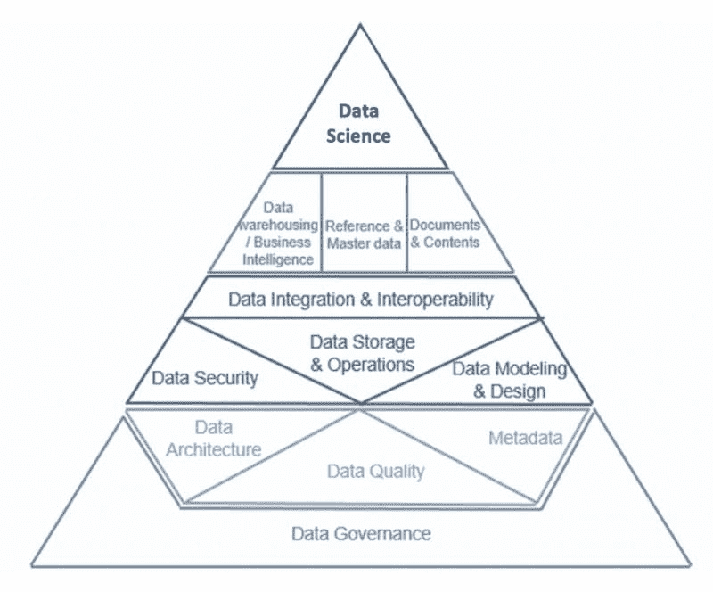
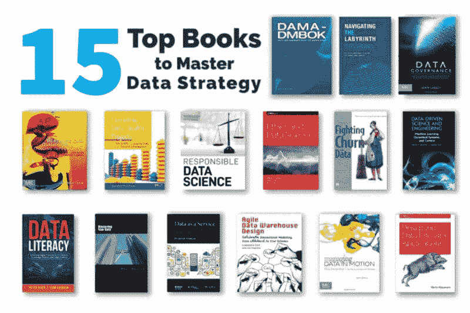

# 精通数据战略的 15 本书

> 原文：[`www.kdnuggets.com/2022/06/top-15-books-master-data-strategy.html`](https://www.kdnuggets.com/2022/06/top-15-books-master-data-strategy.html)

如果你是一位**数据从业者**，希望获得**领导角色**，学习数据管理将是实现目标的重要一步。在这篇文章中，我们列出了 15 本书，涵盖从数据架构（高度技术性）到数据素养（广泛非技术性）的主题，以帮助你提高对**端到端最佳实践**的理解。

图片由 [Gaelle Marcel](https://unsplash.com/@gaellemarcel?utm_source=medium&utm_medium=referral) 提供，来源于 [Unsplash](https://unsplash.com/?utm_source=medium&utm_medium=referral)

# 1. [数据管理知识体系（DMBOK）](http://amzn.to/32oK8hH)

* * *

## 我们的前三大课程推荐

 1. [Google 网络安全证书](https://www.kdnuggets.com/google-cybersecurity) - 快速通道进入网络安全职业。

 2. [Google 数据分析专业证书](https://www.kdnuggets.com/google-data-analytics) - 提升你的数据分析技能

 3. [Google IT 支持专业证书](https://www.kdnuggets.com/google-itsupport) - 支持你的组织的 IT 需求

* * *

+   **作者**：DAMA 国际的各位领导

+   **阅读时间**：20 小时 5 分钟（588 页）

+   **评分**：4.8 / 5（397 条总评分）

> **总结**：如果不在这里开始这个列表我会感到遗憾。这本巨著涵盖了 14 个与数据战略相关的实际主题，之后还有 3 个与实施相关的主题。

14 个不同的知识领域最好地由[Aiken Pyramid](https://www.datastrategypros.com/resources/foundations)展示，说明这些主题如何相互构建。数据治理构成了金字塔的基础，接下来的层级包括数据架构、数据质量和元数据管理，直到我们到达顶层的[数据科学](https://towardsdatascience.com/data-science-for-leaders-1165f33befed)（书中天真地将其称为“大数据”）。

[*数据管理知识体系（DMBOK）*](http://amzn.to/32oK8hH) 读起来可能会有些令人沮丧，主要因为它是由 20 多位 DAMA 国际的成员编写的，看似没有连贯的主线。这本值得信赖的书籍目前是第二版——对于第三版，我建议请一个编辑。[视频评论在这里](https://www.youtube.com/watch?v=7_rugpo3a7c)。

**TL;DR**：如果你阅读这本书（或至少浏览大部分内容并标记重要部分），你将准备好参加开放书籍、开放笔记的[认证数据管理专业人员 (CDMP) 考试](https://towardsdatascience.com/best-data-science-certification-4f221ac3dbe3)（即你未曾听说过的最佳数据科学认证）。

# 2. [Navigating the Labyrinth](https://amzn.to/3vecyaY)

+   **作者**：**劳拉·塞巴斯蒂安-科尔曼**

+   **阅读时间**：6 小时 5 分钟（208 页）

+   **评分**：4.4 / 5（共 76 条评分）

> **总结**：本书面向那些在组织中实施数据治理并努力克服业务障碍的读者。如果你处于领导职位或需要与高层管理人员协调数据管理，[*Navigating the Labyrinth*](https://amzn.to/3vecyaY) 提供了这一复杂领域的指南。

**塞巴斯蒂安-科尔曼**将数据管理理念、框架和程序转化为一本适合商业的书籍，弥合了技术领域专家和高层决策者之间的差距。这本指南被广泛认为是数据管理总体目标、术语及如何在高层实施数据战略的绝佳概述。

**TL;DR**：[*Navigating the Labyrinth*](https://amzn.to/3vecyaY) 通过经过验证的原则简化了复杂性，这些原则与[*数据管理知识体系*](http://amzn.to/32oK8hH)紧密相关，从而提升你对数据管理的整体理解。

# 3. [数据治理](https://amzn.to/3bAeliU)

+   **作者**：**约翰·拉德利**

+   **阅读时间**：8 小时 45 分钟（264 页）

+   **评分**：4.3 / 5（共 80 条评分）

> **总结**：为什么数据治理对于保持组织的成功是必要的？团队应该如何规划、启动和执行数据治理计划？如何保持程序的持续运作？通过框架和案例研究，本书阐明了如何创建一个成功且具有成本效益的数据治理程序。

鉴于与增长、隐私和安全相关的开销，组织面临着与其数据资产相关的新风险来源。数据治理代表了解决方案。一个强有力的章程将帮助组织在风险和机会之间的危险边界中航行。

本书适用于任何打算创建数据治理程序的经理或团队负责人。数据管理的挑战继续扩大，面临如存储成本、指数级增长、行政管理和安全问题等困难。通过正确的策略，组织可以在节省开支的同时为客户/利益相关者提供更好的服务。

和列表上的许多其他书籍一样，[*数据治理*](https://amzn.to/3bAeliU) 与[CDMP 专家考试](https://www.datastrategypros.com/resources/specialist)相关，这是[CDMP 基础考试](https://www.datastrategypros.com/resources/cdmp)之后的下一个考试级别。如果你对本文讨论的任何主题的深入探索感到兴奋，我鼓励你[阅读](https://www.datastrategypros.com/resources/specialist)有关在 CDMP 从业者或大师级别获得认可的过程。

**总结**: 扩展数据操作同时避免风险的解决方案是实施强有力的数据治理。本书将向你展示如何做到这一点。

# 4. [持续改进的数据质量测量](https://amzn.to/2NskNPF)

+   **作者**: Laura Sebastian-Coleman

+   **阅读时间**: 12 小时 32 分钟（376 页）

+   **评分**: 4.1 / 5（总评分 29 条）

> **总结**: 领先专家 Sebastian-Coleman 提供了如何随时间监控和最大化数据质量的指导。它从标准测量概念开始，逐步推进到数据质量不同维度的详细测量技术框架。

本书还提供了用于趋势分析的数据质量结果定义和存储的常见概念模型。此外，它包括了持续测量和监控的通用规范，例如比较和计算，使测量具有意义。

**总结**: 组织对数据质量的目标应是促进持续的测量，而不是单次活动。

照片由 [Jason Leung](https://unsplash.com/@ninjason?utm_source=medium&utm_medium=referral) 供图，来源于 [Unsplash](https://unsplash.com/?utm_source=medium&utm_medium=referral)

# 5. [执行数据质量项目：优质数据和可信信息的十个步骤](https://amzn.to/38Qxr2i)

+   **作者**: Danette McGilvray

+   **阅读时间**: 11 小时 45 分钟（352 页）

+   **评分**: 4.6 / 5（总评分 57 条）

> **总结**: 十个步骤指的是一种系统化的方法，将理解数据质量的概念框架与改进数据质量所需的工具和技术相结合。这本书利用现实世界的项目来突出这些原则如何提升数据质量。

McGilvray 强调，永远不要仅仅为了数据质量本身而处理数据质量，而应将其作为推动组织特定使命的一种方式。十个步骤的方法论可以根据需要进行扩展和缩小，并适用于许多与数据质量相关的情况。

**总结**: [*执行数据质量项目*](https://amzn.to/38Qxr2i) 最近在 2021 年更新。它包括示例、几个模板和执行的实用建议。书中指导读者如何根据组织的独特位置选择下一步最佳行动。

# 6. [负责任的数据科学](https://amzn.to/3ta00zC)

+   **作者**: Grant Fleming 和 Peter Bruce

+   **阅读时间**: 10 小时 8 分钟（304 页）

+   **评分**: 3.5 / 5（共 6 条评分）

> **总结**: 不必再寻找其他资源，本书对最新技术应用于全球最大和最敏感记录时产生的伦理问题进行了深入、实用的探讨。本书指导数据科学家如何实施和审计机器学习模型，以减轻意外的危害。书中提供了解释技术和其他方法的技术实施方案，以减少偏见和不平等。

**简评**: [*负责任的数据科学*](https://amzn.to/3ta00zC) 阐述了利益相关者应如何实施数据解决方案。根据本书中的指南，数据科学家的角色是将详细的技术分析与伦理社会观察相结合。

照片由 [Oladimeji Ajegbile](https://unsplash.com/@diimejii?utm_source=unsplash&utm_medium=referral&utm_content=creditCopyText) 拍摄，来源于 [Unsplash](https://unsplash.com/@gaellemarcel?utm_source=unsplash&utm_medium=referral&utm_content=creditCopyText)

# 7\. [伦理与数据科学](https://www.amazon.com/Ethics-Data-Science-Mike-Loukides-ebook/dp/B07GTC8ZN7)

+   **作者**: Mike Loukides, Hilary Mason, 和 DJ Patil

+   **阅读时间**: 1 小时 32 分钟（46 页）

+   **评分**: 4.4 / 5（共 132 条评分）

> **总结**: 这本简短的指南作为 Kindle 电子书免费提供，讲解了关于伦理数据处理的建议、清单和术语，特别是针对数据科学家。书中列举了几起不道德的数据使用案例，并概述了应采取的推荐措施，以避免未来出现这些问题。

书的基本前提是，伦理数据科学不仅仅需要代码或 [誓言](https://nicolejaneway.medium.com/data-science-oath-c602f03a2166)。 [*伦理与数据科学*](https://www.amazon.com/Ethics-Data-Science-Mike-Loukides-ebook/dp/B07GTC8ZN7) 建议采用每日实践，并实施清单。数据科学家应将客户数据视为自己的数据，感到有权挑战组织的假设，并使用“5 Cs”（同意、清晰、一致、控制和后果）来创造出色的数据产品。

书的结尾附有普林斯顿研究人员撰写的案例研究。书中强调了精益方法论以及利用漏洞赏金发现潜在漏洞的实践。

**简评**: 本书是一本简单实用的数据科学伦理指南。

# 8. [利用数据对抗用户流失](https://amzn.to/3x45HUS)

+   **作者**: Dr. Carl Gold

+   **阅读时间**: 16 小时 20 分钟（504 页）

+   **评分**: 4.3 / 5（共 16 条评分）

> **总结**: 对于任何希望进入数据科学领域的人来说，这是一本必须阅读的案例研究。[*利用数据打击流失*](https://amzn.to/3x45HUS)充满了来自 Dr. Gold 职业生涯的实际例子，直到他担任订阅服务公司 [Zuora](https://www.zuora.com/about/) 的首席数据科学家。

用户流失发生在付费客户离开订阅服务时。对于任何有经常性收入的业务，这是一个关键指标。随着越来越多的公司转向订阅经济，这是数据科学家必须理解的重要业务模型。因此，这本书对于新兴的数据科学家或希望更好地理解这一细分领域的熟练从业者来说，是一个很好的实践项目。

在书中和相关的 [Twitch 直播视频](https://www.twitch.tv/carl24k_datascience)中，Dr. Gold 提供了进行流失分析所需的 SQL 和 Python 代码指导。在这两个资源中，Dr. Gold 真的深入探讨了特征工程的过程（即从大量原始数据中寻找和/或生成预测特征）。为了这个项目，Dr. Gold 创建了一个现实的模拟社交网络数据集，以便数据从业者可以通过动手编码跟随他的分析。

**简要**: 这是一本扎实且实用的指南，适用于所有数据科学家以及任何希望改善客户保留的人。这本书教你如何将原始数据转化为可测量的行为指标，计算客户终身价值，并利用人口统计数据来改进流失预测。

图片由 [freddie marriage](https://unsplash.com/@fredmarriage?utm_source=medium&utm_medium=referral) 拍摄，来源于 [Unsplash](https://unsplash.com/?utm_source=medium&utm_medium=referral)

# 9. [数据驱动的科学与工程：机器学习、动态系统和控制](https://amzn.to/37uweju)

+   **作者**: Steven N. Brunton 和 J. Nathan Kutz

+   **阅读时间**: 16 小时 25 分钟（492 页）

+   **评分**: 4.7 / 5（总共 186 条评价）

> **总结**: 这本书是数据科学的强有力入门书，重点介绍了基础数学原理。阅读这本书可以在数据驱动的决策制定和数据工程最佳实践方面获得优势。

Brunton 和 Kutz 深入探讨了数据分析和机器学习。这包括: 神经网络、Lorenz 系统、降维与变换、奇异值分解（SVD）、傅里叶变换和稀疏采样。

这本书还涉及了动态模式分解、稀疏动态识别算法和控制理论等主题。最后，书中讨论了使用适当正交分解（POD）算法来预测偏微分方程（PDE）的降阶模型（ROM）。

如果这些对你意义不大，也不用担心！！这本书由 Steve Brunton 的 [YouTube 频道](https://www.youtube.com/channel/UCm5mt-A4w61lknZ9lCsZtBw) 支持，该频道提供了另一种增强你对这些概念理解的方法。

**简明扼要**：这是对数据管道不同管理方法的一个非常好的概述。

# 10. [数据素养](https://amzn.to/3enrcFC)

+   **作者**：彼得·艾肯和托德·哈伯

+   **阅读时间**：14 小时 15 分钟（429 页）

+   **评分**：5 / 5（共 1 条评分）

> **总结**：这是一本扩展数据素养到数十亿人的路线图，本书定义了在当今商业环境中操作和在数据驱动的社会中积极参与所需的知识。

它还描述了如何通过一个 12 步框架在组织内建立数据素养。该部分概述了一个有价值的数据教义。它还描述了数据从业者在提高组织数据素养水平时可能面临的实际问题。

**简明扼要**：这本书是提高个人和组织数据素养的全面指南。

# 11. [掌握你的数据](https://amzn.to/3Ex0XHy)

+   **作者**：安迪·格雷厄姆

+   **阅读时间**：6 小时 16 分钟（188 页）

+   **评分**：4.6 / 5（共 7 条评分）

> **总结**：主数据管理（MDM）代表了管理组织数据一致性和完整性的整体挑战的一个缩影。这本书解释了 MDM、其商业理由以及成功的关键策略。

阅读后，你将拥有一个坚实的基础，以在组织中引入 MDM 或改进现有实践。这本书对任何在这一重要领域“冒险”的人来说都是至关重要的。该书的目标读者包括数据专业人士、信息技术人员、项目/程序经理、数据架构师、业务分析师和技术领导者。

**简明扼要**： “黄金记录”概念是格雷厄姆主数据论述的核心。读者将对这一概念有一个扎实的了解，特别是如何识别组成黄金记录的数据源。

图片由 [Arif Riyanto](https://unsplash.com/@arifriyanto?utm_source=medium&utm_medium=referral) 提供，发布在 [Unsplash](https://unsplash.com/?utm_source=medium&utm_medium=referral) 上。

# 12. [数据即服务：提供可重用企业数据服务的框架](https://www.amazon.com/Data-Service-Framework-Providing-Enterprise/dp/1119046580?crid=17DM6B9A7IJRH&keywords=data+as+a+service&qid=1640353996&s=books&sprefix=data+as+a+service,stripbooks,134&sr=1-3&linkCode=sl1&tag=nicolejanew08-20&linkId=10bbdcfae85ad400d4f938ab844e73ca&language=en_US&ref_=as_li_ss_tl)

+   **作者**：普什帕克·萨尔卡尔

+   **阅读时间**：11 小时 48 分钟（354 页）

+   **评分**：4.3 / 5（共 4 条评分）

> **摘要**: 数据越来越被视为一种资产，可以作为一种服务进行盈利。该书通过各种架构和相关模式的实际案例，展示了公司如何从数据即服务（DaaS）中受益。

该书概述了在任何公司实施数据即服务的全面策略，包括（1）一个可重复使用和适应的面向服务的架构（SOA）框架，（2）向客户提供 DaaS 的计划，以及（3）DaaS 架构每个组件的详细描述。Sarkar 深入探讨了如何通过使用 SOA 原则、行业最佳实践和数据虚拟化、云计算以及数据科学等新兴技术，成功地在异构平台之间收集和分发数据。

**概述**: [*数据即服务*](https://www.amazon.com/Data-Service-Framework-Providing-Enterprise/dp/1119046580?crid=17DM6B9A7IJRH&keywords=data+as+a+service&qid=1640353996&s=books&sprefix=data+as+a+service,stripbooks,134&sr=1-3&linkCode=sl1&tag=nicolejanew08-20&linkId=10bbdcfae85ad400d4f938ab844e73ca&language=en_US&ref_=as_li_ss_tl) 讨论了企业如何通过提供数据服务来创造收入，作为一种收费订阅服务。

# 13. [敏捷数据仓库设计](https://amzn.to/3IH7GBh)

+   **作者**: Lawrence Corr 和 Jim Stagnitto

+   **阅读时间**: 10 小时 56 分钟（328 页）

+   **评分**: 4.6 / 5（总共 154 条评分）

> **摘要**: 这本书提供了一个详细的逐步指南，用于捕捉数据仓库和商业智能（DW & BI）需求，并通过与 BI 利益相关者进行“模型风暴”（数据建模+头脑风暴）来将其转化为高性能的维度模型。

此外，读者将了解商业事件分析与建模（BEAM），这是一种用于改善数据仓库设计师、BI 利益相关者和整个 DW & BI 开发团队之间沟通的敏捷维度建模方法。[了解更多](https://towardsdatascience.com/data-warehouse-68ec63eecf78)。

**概述**: 通过友好的图表和有用的附加资源，Corr 和 Stagnitto 对数据管理领域做出了重要贡献。

# 14. [数据流动管理：数据集成最佳实践技术与技术](https://www.amazon.com/Managing-Data-Motion-Technologies-Intelligence/dp/0123971675?crid=2XACT4HQYUC06&keywords=April+reeve&qid=1640353664&s=books&sprefix=april+reeve,stripbooks,134&sr=1-1&linkCode=sl1&tag=nicolejanew08-20&linkId=921096df04d46512b5902bdfc80aec48&language=en_US&ref_=as_li_ss_tl)

+   **作者**: April Reeve

+   **阅读时间**: 6 小时 48 分钟（204 页）

+   **评分**: 3.6 / 5（总共 12 条评分）

> **总结**：读者将学习管理数据传输的策略、工具和最佳实践。这本书讨论了显著减少管理系统接口复杂性并促进可扩展设计的方法。基于二十多年的专业知识，Reeve 提出了一种供应商中立的数据在计算环境和数据系统之间传输的策略。

**总结**：典型的组织由几十（甚至上百）个计算系统构成，这些系统在时间的推移中被构建、购买或获得。数据必须集成以进行报告和分析，分享以处理业务交易，并在新系统获得时进行转换。

# 15. [设计数据密集型应用](https://amzn.to/3Haqlnw)

+   **作者**：马丁·克莱普曼

+   **阅读时间**：20 小时 20 分钟（611 页）

+   **评分**：4.8 / 5（2440 总评分）

> **总结**：如果你对分布式系统和可扩展性感兴趣，这本书是必读的。它提供了对该领域各种技术的全面理解，并详细描述了每项技术旨在解决的各种问题。通过这本书，你可以快速学习数据管理的最重要概念，并尽可能以有趣的方式掌握它们。

克莱普曼掌握了该领域的最新技术。他始终将计算机科学的相关理论与实际应用案例结合起来。重点主要是构建数据服务时适用的核心原则和思维过程。

**总结**：如果你从事数据工程、系统设计、云架构或 DevOps，这本书是一个不错的指南。

# 总结

就这样 — 15 本你需要阅读的书籍，以便掌握数据策略。如果你对深入了解这个领域感到兴奋，你应该考虑注册我的[数据策略通讯](https://us8.campaign-archive.com/home/?u=c164c67d8c9591e3b056f39b1&id=4e023ba400)。每个月，我们都会深入探讨一个与数据管理相关的最新故事，并提供一个特别适合数据从业者的生产力或健康建议。

你也可以考虑备考[认证数据管理专家考试](https://towardsdatascience.com/cdmp-exam-d65e1255016b)。这个 100 题的考试是开放书籍和笔记的，因此可以相对较快地学习并通过。除了提供一个有价值的数据管理领域资质外，CDMP 还提供了你可以在日常工作中使用的实用知识和框架，并帮助你为同事和客户提供结构化建议。

如果你有兴趣了解更多关于考试的信息，可以加入这两个群组：[CDMP 学习小组](https://www.facebook.com/groups/cdmpstudygroup)（Facebook）和 [数据战略专业人士](https://www.linkedin.com/groups/13951141/)（LinkedIn）。期待见到你！！

[原文](https://nicolejaneway.medium.com/15-data-strategy-books-6aef2a8b3472)。经许可转载。

### 更多相关内容

+   [KDnuggets 新闻，6 月 22 日：主要的监督学习算法…](https://www.kdnuggets.com/2022/n25.html)

+   [25 本免费书籍，助你掌握 SQL、Python、数据科学、机器学习等](https://www.kdnuggets.com/25-free-books-to-master-sql-python-data-science-machine-learning-and-natural-language-processing)

+   [5 本免费书籍，助你掌握数据科学](https://www.kdnuggets.com/5-free-books-to-master-data-science)

+   [5 本便宜书籍，助你掌握数据科学](https://www.kdnuggets.com/5-cheap-books-to-master-data-science)

+   [5 本免费书籍，助你掌握数据科学的统计学](https://www.kdnuggets.com/5-free-books-to-master-statistics-for-data-science)

+   [5 本免费书籍，助你掌握机器学习](https://www.kdnuggets.com/5-free-books-to-master-machine-learning)
