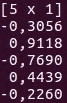
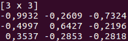
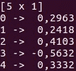
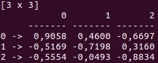
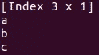
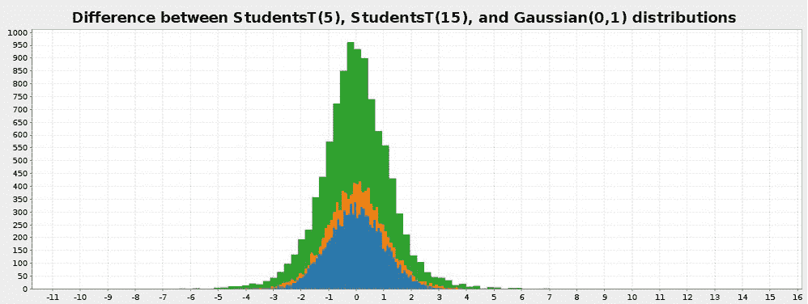
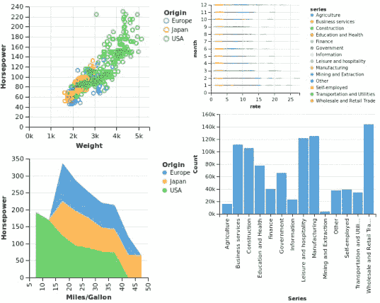
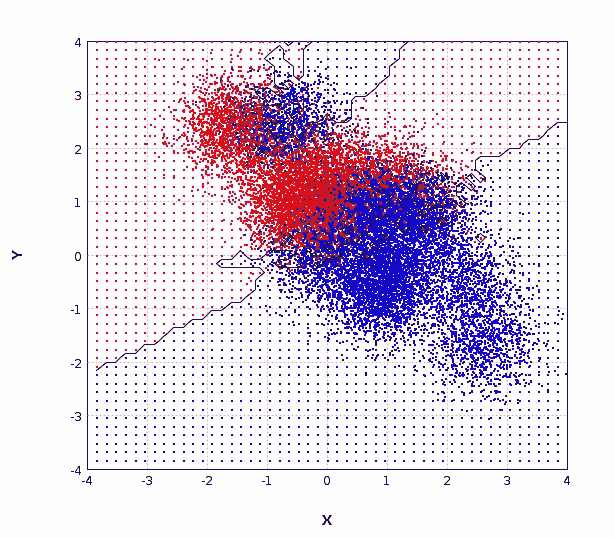
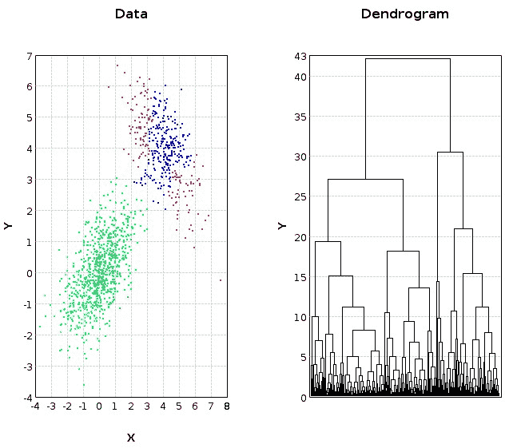
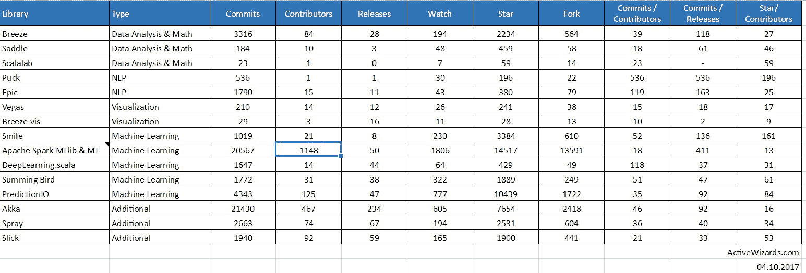

# 2018 年数据科学的前 15 个 Scala 库

> 原文：[`www.kdnuggets.com/2018/02/top-15-scala-libraries-data-science-2018.html`](https://www.kdnuggets.com/2018/02/top-15-scala-libraries-data-science-2018.html)

 评论

**作者：[伊戈尔·博布里亚科夫](https://medium.com/@ibobriakov)，ActiveWizards**

在我们之前的文章中，我们讨论了 [顶级 Python 数据科学库](https://activewizards.com/blog/top-15-libraries-for-data-science-in-python/)。这次我们将重点关注 Scala，近年来它已经成为数据科学家的另一个重要语言。Scala 的流行主要是由于 Spark 的兴起，Spark 是一个大数据处理引擎，使用 Scala 编写，因此提供了原生的 Scala API。

* * *

## 我们的前 3 个课程推荐

 1\. [Google 网络安全证书](https://www.kdnuggets.com/google-cybersecurity) - 快速进入网络安全职业道路

 2\. [Google 数据分析专业证书](https://www.kdnuggets.com/google-data-analytics) - 提升你的数据分析技能

 3\. [Google IT 支持专业证书](https://www.kdnuggets.com/google-itsupport) - 支持你的组织 IT 工作

* * *

我们不会在这里深入比较 Scala 与 Python，但重要的是要注意，与 Python 不同，Scala 是编译语言。因此，使用 Scala 编写的代码执行速度要快得多（与纯 Python 相比，而不是像 NumPy 这样的专用库）。

与 Java 相比，Scala 的编写体验更佳，因为通常可以用显著更少的代码行来表达相同的逻辑。Scala 的功能丝毫不逊色于 Java，甚至具有一些更先进的特性。Java 的老手们可能会提出很多反对意见，但毫无疑问，Scala 更适合数据科学任务。

目前，Python 和 R 仍然是快速数据分析、构建、探索和操作强大模型的主要语言，而 Scala 则成为处理大数据的功能性产品开发中的关键语言，因为大数据需要稳定性、灵活性、高速、可扩展性等。在研究阶段，分析和模型通常在 Python 中完成，然后在生产过程中实现到 Scala 中。

为了方便起见，我们准备了一个关于在 Scala 中执行机器学习和数据科学任务的最重要库的全面概述。我们将使用与对应的 Python 工具的类比，以便更好地理解一些重要方面。实际上，只有一个顶级的综合工具构成了 Scala 中数据科学和大数据解决方案开发的基础，这就是 Apache Spark，它配备了多种用 Scala 和 Java 编写的库和工具。让我们详细了解一下它。

### **数据分析和数学**

### **[Breeze](http://www.scalanlp.org/)(提交次数: 3316, 贡献者: 84)**

Breeze 被认为是 Scala 的主要科学计算库。它借鉴了 MATLAB 的数据结构和 Python 的 NumPy 类。Breeze 提供了对数据数组的快速高效操作，并实现了许多其他操作，包括以下内容：

+   **矩阵和向量运算**，用于创建、转置、填充数字、进行逐元素操作、求逆、计算行列式以及满足几乎所有需求的其他选项。

+   **概率和统计函数**，包括从统计分布和计算描述性统计（如均值、方差和标准差）到马尔科夫链模型。统计的主要包是 `breeze.stats` 和 `breeze.stats.distributions`

+   **优化**，即对函数进行局部或全局最小值的研究。优化方法存储在 `breeze.optimize` 包中。

+   **线性代数：** 所有基本操作依赖于 netlib-java 库，使 Breeze 在代数计算中非常快速。

+   **信号处理操作**，用于处理数字信号。Breeze 中的重要操作示例包括卷积和傅里叶变换，傅里叶变换将给定函数分解为正弦和余弦分量的和。

Breeze 还提供了绘图功能，我们将在下面讨论。

### **[Saddle](https://saddle.github.io/)(提交次数: 184, 贡献者: 10)**

另一个用于 Scala 的数据操作工具包是 Saddle。它是 R 和 Python 的 pandas 库在 Scala 中的对应物。与 pandas 或 R 中的数据帧类似，Saddle 基于 Frame 结构（2D 索引矩阵）。

总共有五种主要的数据结构，分别是：

+   Vec（1D 向量）

    

+   Mat（2D 矩阵）

    

+   Series（1D 索引矩阵）

    

+   Frame（2D 索引矩阵）

    

+   索引（类似哈希表）

    

Vec 和 Mat 类是 Series 和 Frame 的基础。你可以在这些数据结构上实现不同的操作，并用于基本的数据分析。Saddle 另一个很棒的特点是对缺失值的强大鲁棒性。/span>

### **[Scalalab](https://github.com/sterglee/scalalab)(提交次数: 23, 贡献者: 1)**

ScalaLab 是 Scala 对 MATLAB 计算功能的实现。此外，ScalaLab 可以直接调用和访问 MATLAB 脚本的结果。

与以前的计算库的主要区别在于 ScalaLab 使用了自己特定领域的语言，称为 ScalaSci。方便的是，ScalaLab 可以访问各种科学 Java 和 Scala 库，因此你可以轻松导入数据，然后使用不同的方法进行操作和计算。大多数技术与 Breeze 和 Saddle 类似。此外，像 Breeze 一样，ScalaLab 也提供绘图功能，允许对结果数据进行进一步解释。

### **自然语言处理**

### **[Epic](http://www.scalanlp.org/)(提交次数: 1790, 贡献者: 15) & Puck (提交次数: 536, 贡献者: 1)**

Scala 具有一些优秀的自然语言处理库，作为 ScalaNLP 的一部分，包括 Epic 和 Puck。这些库主要用作文本解析器，如果你需要解析成千上万的句子，Puck 因其高速和 GPU 使用而更加方便。此外，Epic 被称为一个预测框架，它利用结构化预测来构建复杂系统。

### **可视化**

### **[Breeze-vis](https://github.com/scalanlp/breeze/tree/master/viz) (提交次数: 29, 贡献者: 3)**

正如名字所示，Breeze-viz 是 Breeze 为 Scala 开发的绘图库。它基于著名的 Java 图表库 JFreeChart，并具有类似 MATLAB 的语法。尽管 Breeze-viz 的机会远少于 MATLAB、Python 中的 matplotlib 或 R，但它在开发和建立新模型的过程中仍然非常有用。

### **[Vegas](https://www.vegas-viz.org/)(提交次数: 210, 贡献者: 14)**

另一个用于数据可视化的 Scala 库是 Vegas。它比 Breeze-viz 更加功能强大，允许进行一些绘图规格，如过滤、转换和聚合。它的结构类似于 Python 的 Bokeh 和 Plotly。

Vegas 提供了声明式可视化，允许你主要专注于指定需要对数据做什么，并进一步分析可视化结果，而无需担心代码实现。

### **机器学习**

### **[Smile](https://haifengl.github.io/smile/)(提交次数: 1019, 贡献者: 21)**

Statistical Machine Intelligence and Learning Engine，简称 Smile，是一个有前景的现代机器学习系统，在某些方面类似于 Python 的 scikit-learn。它使用 Java 开发，也提供了 Scala 的 API。该库将以快速和广泛的应用、高效的内存使用以及大量的机器学习算法（如分类、回归、最近邻搜索、特征选择等）令你惊叹。

### **Apache Spark MLlib & ML**

基于 Spark 的 MLlib 库提供了丰富的机器学习算法。由于是用 Scala 编写的，它还为 Java、Python 和 R 提供了高度功能性的 API，但 Scala 的机会更为灵活。该库由两个独立的包组成：MLlib 和 ML。让我们详细了解它们。

+   MLlib 是一个基于 RDD 的库，包含用于分类、聚类、无监督学习技术的核心机器学习算法，并支持实现基本统计工具，如相关性、假设检验和随机数据生成。

+   ML 是一个较新的库，与 MLlib 不同，它在数据框架和数据集上运行。该库的主要目的是提供构建不同数据转换管道的能力。管道可以被视为一个阶段的序列，其中每个阶段要么是一个 Transformer，它将一个数据框架转换为另一个数据框架，要么是一个 Estimator，一种可以在数据框架上拟合以生成 Transformer 的算法。

每个包都有其优缺点，实际上，应用两者往往更为有效。

### **[DeepLearning.scala](http://deeplearning.thoughtworks.school/) (提交次数: 1647, 贡献者: 14)**

DeepLearning.scala 是一个替代的机器学习工具包，提供了高效的深度学习解决方案。它利用数学公式通过面向对象编程和函数式编程的结合，创建复杂的动态神经网络。该库使用了各种类型和应用类型类。后者允许同时进行多个计算，这在数据科学家的工具箱中至关重要。值得一提的是，该库的神经网络是程序，并支持所有 Scala 特性。

### **[Summing Bird](https://github.com/twitter/summingbird) (提交次数: 1772, 贡献者: 31)**

Summingbird 是一个领域特定的数据处理框架，允许批处理和在线 MapReduce 计算的集成，以及混合批处理/在线处理模式。设计该语言的主要推动者是 Twitter 的开发者，他们经常需要编写相同的代码：首先用于批处理，然后再次用于在线处理。

-   Summingbird 处理并生成两种类型的数据：流（无限序列的元组）和快照（在某个时间点上数据集的完整状态）。最后，Summingbird 提供了 Storm、Scalding 的平台实现和一个用于测试目的的内存执行引擎。

### **[PredictionIO](http://predictionio.incubator.apache.org/index.html) （提交次数：4343，贡献者：125）**

-   当然，我们不能忽视一个用于构建和部署预测引擎的机器学习服务器，名为 PredictionIO。它建立在 Apache Spark、MLlib 和 HBase 之上，并且曾被 Github 评选为最受欢迎的基于 Apache Spark 的机器学习产品。它使你能够轻松高效地构建、评估和部署引擎，实现自己的机器学习模型，并将其集成到你的引擎中。

### **附加**

### **[Akka](https://akka.io/) （提交次数：21430，贡献者：467）**

-   由 Scala 的创造公司开发的 Akka 是一个用于在 JVM 上构建分布式应用的并发框架。它使用基于演员的模型，其中一个演员代表一个接收消息并采取适当行动的对象。Akka 取代了之前 Scala 版本中可用的 Actor 类的功能。

-   主要区别，也被认为是最重要的改进，是演员与底层系统之间的额外层，只需演员处理消息，而框架处理所有其他复杂问题。所有演员都是按层次结构排列的，从而创建一个 Actor 系统，这有助于演员之间更高效地互动，并通过将复杂问题拆分为更小的任务来解决复杂问题。

### **[Spray](http://spray.io/) （提交次数：2663，贡献者：74）**

-   现在让我们看看 Spray - 一个基于 Akka 构建的 Scala 库套件，用于构建 REST/HTTP web 服务。它保证了异步、非阻塞的基于演员的高性能请求处理，同时内部 Scala DSL 提供了定义 web 服务行为的功能，以及高效且便捷的测试能力。

### **[Slick ](http://slick.lightbend.com/）（提交次数：1940，贡献者：92）**

-   最后但同样重要的是 Slick，它代表了 Scala 语言集成连接工具包。它是一个用于创建和执行数据库查询的库，支持多种数据库，如 H2、MySQL、PostgreSQL 等。一些数据库可以通过 slick-extensions 获得。

-   为了构建查询，Slick 提供了强大的 DSL，使代码看起来就像在使用 Scala 集合一样。Slick 支持简单的 SQL 查询和强类型的多个表的联接。此外，可以使用简单的子查询来构建更复杂的查询。

### **结论**

在这篇文章中，我们概述了一些在执行重要数据科学任务时非常有用的 Scala 库。这些库已被证明在实现最佳结果方面非常有帮助和有效。您还可以查看下面每个提供的库的 GitHub 活动统计数据。

来源：[Google 表格](https://docs.google.com/spreadsheets/d/1wLOtLLJ65QMbLumc3F2Mop_4uPIFbyJ6iDZwOp0cXrQ)

请注意，上述列表并不全面，市场上还有许多适用于不同使用场景的工具。如果您有其他有用的 Scala 库或框架的积极经验，值得添加到此列表中，请随时在下面的评论区分享。

非常感谢您的关注与合作！

&nbsp

**简介：[伊戈尔·博布里亚科夫](https://medium.com/@ibobriakov)** 是数据科学家和技术企业家。他帮助创新初创公司实施数据科学计划，并担任 [ActiveWizards](http://activewizards.com) 机器学习公司的顾问。他还帮助 [数据科学学院](http://datascience-school.com) 开发教育项目。

[原文](https://activewizards.com/blog/top-15-scala-libraries-for-data-science/)。经许可转载。

**相关：**

+   2017 年最佳 15 个 Python 数据科学库

+   最佳 Python 数据科学包

+   前 20 个 Python 机器学习开源项目，更新版

### 相关阅读

+   [前 38 个 Python 数据科学、数据可视化等库](https://www.kdnuggets.com/2020/11/top-python-libraries-data-science-data-visualization-machine-learning.html)

+   [超参数优化：10 个顶级 Python 库](https://www.kdnuggets.com/2023/01/hyperparameter-optimization-10-top-python-libraries.html)

+   [顶级自然语言处理库指南](https://www.kdnuggets.com/2023/04/guide-top-natural-language-processing-libraries.html)

+   [2022 年数据科学家应了解的 Python 库](https://www.kdnuggets.com/2022/04/python-libraries-data-scientists-know-2022.html)

+   [Python 数据清洗库简介](https://www.kdnuggets.com/2023/03/introduction-python-libraries-data-cleaning.html)

+   [Level 50 数据科学家：值得了解的 Python 库](https://www.kdnuggets.com/level-50-data-scientist-python-libraries-to-know)
