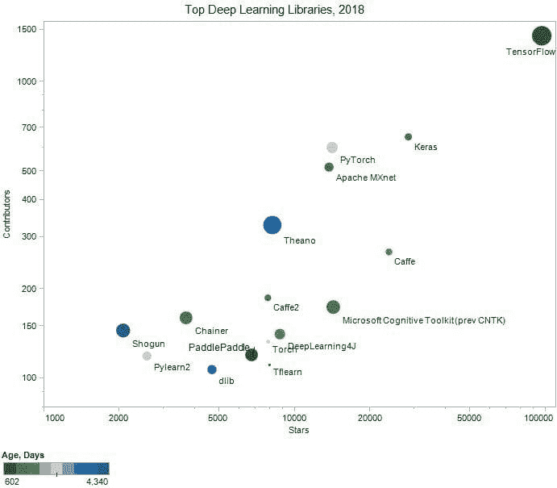

# 顶级 16 个开源深度学习库和平台

> 原文：[`www.kdnuggets.com/2018/04/top-16-open-source-deep-learning-libraries.html`](https://www.kdnuggets.com/2018/04/top-16-open-source-deep-learning-libraries.html)

 评论

深度学习是一个持续增长的、流行的机器学习方法家族中的一部分，基于数据表示。作为一个相对较新的概念，大量的资源可能会让那些刚入门或已经深入其中的人感到有些不知所措。与深度学习社区互动，参与目前可用的开源项目是保持最新趋势的好方法。

**图 1: 按 GitHub 星数和贡献者排序的顶级 16 个开源深度学习库**，两个轴均使用对数尺度。圆圈的颜色表示天数（绿色 - 较年轻，蓝色 - 较旧），根据 GitHub 上的“洞察力/贡献者”提供的开始日期计算。

* * *

## 我们的前 3 个课程推荐

 1\. [谷歌网络安全证书](https://www.kdnuggets.com/google-cybersecurity) - 快速进入网络安全职业生涯。

 2\. [谷歌数据分析专业证书](https://www.kdnuggets.com/google-data-analytics) - 提升您的数据分析技能

 3\. [谷歌 IT 支持专业证书](https://www.kdnuggets.com/google-itsupport) - 支持您组织的 IT 工作

* * *

从各个角度来看，TensorFlow 是无可争议的领导者。Keras、Caffe、微软认知工具包和 PyTorch 完成了前五名。

以下是按星数排序的完整列表，附有简要概述和进一步的链接。我们希望您能通过使用每个库提供的链接来享受合作和学习更多的过程：

1.  [**TensorFlow**](https://www.tensorflow.org/) 最初由在 Google 机器智能研究组织的 Google Brain 团队工作的研究人员和工程师开发。该系统旨在促进机器学习研究，并使从研究原型到生产系统的过渡快速而简便。

    Stars: 96655, Contributors: 1432, Commits: 31714, Start: 1-Nov-15\. Github URL: [TensorFlow](https://github.com/tensorflow/tensorflow).

1.  [**Keras**](https://keras.io/) 是一个高级神经网络 API，使用 Python 编写，能够运行在 TensorFlow、CNTK 或 Theano 之上。

    Stars: 28385, Contributors: 653, Commits: 4468, Start: 22-Mar-15\. Github URL: [Keras](https://github.com/keras-team/keras).

1.  [**Caffe**](http://caffe.berkeleyvision.org/) 是一个以表达、速度和模块化为核心的深度学习框架。由伯克利视觉与学习中心（BVLC）及社区贡献者开发。

    星标：23750，贡献者：267，提交次数：4128，开始日期：2015 年 9 月 8 日。Github 网址：[Caffe](https://github.com/BVLC/caffe)。

1.  [**Microsoft Cognitive Toolkit (Previously CNTK)**](https://docs.microsoft.com/en-gb/cognitive-toolkit/) 是一个统一的深度学习工具包，通过有向图描述神经网络的一系列计算步骤。

    星标：14243，贡献者：174，提交次数：15613，开始日期：2014 年 7 月 27 日。Github 网址：[Microsoft Cognitive Toolkit](https://github.com/Microsoft/CNTK)。

1.  [**PyTorch**](http://pytorch.org/)，Python 中的张量和动态神经网络，具有强大的 GPU 加速。

    星标：14101，贡献者：601，提交次数：10733，开始日期：2012 年 1 月 22 日。Github 网址：[PyTorch](https://github.com/pytorch/pytorch)。

1.  [**Apache MXnet**](https://mxnet.incubator.apache.org/) 是一个既高效又灵活的深度学习框架。它允许你混合符号式和命令式编程，以最大化效率和生产力。

    星标：13699，贡献者：516，提交次数：6953，开始日期：2015 年 4 月 26 日。Github 网址：[Apache MXnet](https://github.com/apache/incubator-mxnet)。

1.  [**DeepLearning4J**](https://deeplearning4j.org/) 是 Skymind Intelligence Layer 的一部分，其他部分包括 ND4J、DataVec、Arbiter 和 RL4J。它是一个 Apache 2.0 许可的开源分布式神经网络库，使用 Java 和 Scala 编写。

    星标：8725，贡献者：141，提交次数：9647，开始日期：2013 年 11 月 24 日。Github 网址：[DeepLearning4J](https://github.com/deeplearning4j/deeplearning4j)。

1.  [**Theano**](http://deeplearning.net/software/theano/) 允许你高效地定义、优化和评估涉及多维数组的数学表达式。然而，在 2017 年 9 月，Theano 宣布在 1.0 版本发布后将停止所有重大开发。尽管如此，它仍然是一个极其强大的库，你可以随时使用它进行深度学习研究。

    星标：8141，贡献者：329，提交次数：27974，开始日期：2008 年 1 月 6 日。Github 网址：[Theano](https://github.com/Theano/Theano)。

1.  [**TFLearn**](http://tflearn.org/) 是一个建立在 TensorFlow 之上的模块化且透明的深度学习库。它旨在为 TensorFlow 提供更高级的 API，以便于和加速实验，同时保持完全透明和兼容。

    星标：7933，贡献者：111，提交次数：589，开始日期：2016 年 3 月 27 日。Github 网址：[TFLearn](https://github.com/tflearn/tflearn)。

1.  [**Torch**](http://torch.ch/) 是 Torch7 中的主要包，其中定义了多维张量的数据结构及其数学操作。此外，它还提供了许多用于访问文件、序列化任意类型对象和其他实用工具的工具。

    星标：7834，贡献者：133，提交：1335，起始日期：2012 年 1 月 22 日。Github 网址：[Torch](https://github.com/torch/torch7)。

1.  [**Caffe2**](https://caffe2.ai/) 是一个轻量级、模块化且可扩展的深度学习框架。基于原始的 Caffe，Caffe2 在设计时考虑了表达性、速度和模块化。

    星标：7813，贡献者：187，提交：3678，起始日期：2015 年 6 月 21 日。Github 网址：[Caffe2](https://github.com/caffe2/caffe2)。

1.  [**PaddlePaddle**](http://www.paddlepaddle.org/)（PArallel Distributed Deep LEarning）是一个易于使用、高效、灵活且可扩展的深度学习平台，最初由百度的科学家和工程师开发，旨在将深度学习应用于百度的多个产品。

    星标：6726，贡献者：120，提交：13733，起始日期：2016 年 8 月 28 日。Github 网址：[PaddlePaddle](https://github.com/PaddlePaddle/Paddle)。

1.  [**DLib**](http://dlib.net/) 是一个现代的 C++ 工具包，包含机器学习算法和工具，用于在 C++ 中创建复杂软件以解决现实世界的问题。

    星标：4676，贡献者：107，提交：7276，起始日期：2008 年 4 月 27 日。Github 网址：[DLib](https://github.com/davisking/dlib)。

1.  [**Chainer**](http://chainer.org/) 是一个基于 Python 的独立开源深度学习框架。Chainer 提供了一种灵活、直观、高性能的方法来实现全范围的深度学习模型，包括最先进的模型，如递归神经网络和变分自编码器。

    星标：3685，贡献者：160，提交：13700，起始日期：2015 年 4 月 12 日。Github 网址：[Chainer](https://github.com/pfnet/chainer)。

1.  [**Neon**](http://neon.nervanasys.com/) 是 Nervana 基于 Python 的深度学习库。它在提供高性能的同时，也易于使用。

    星标：3466，贡献者：77，提交：1112，起始日期：2015 年 5 月 3 日。Github 网址：[Neon](https://github.com/NervanaSystems/neon)。

1.  [**Lasagne**](http://lasagne.readthedocs.org/) 是一个轻量级库，用于在 Theano 中构建和训练神经网络。

    星标：3417，贡献者：64，提交：1150，起始日期：2014 年 9 月 7 日。Github 网址：[Lasagne](https://github.com/Lasagne/Lasagne)。

### 其他选项：

+   **[H2O.ai](http://h2o.ai)**，开源快速可扩展的机器学习平台，用于更智能的应用（深度学习、梯度提升、随机森林、广义线性建模、自动机器学习等）。星标：3017，贡献者：102，提交：22771，起始日期：2014 年 3 月 2 日。Github 网址：[h2oai/h2o-3](https://github.com/h2oai/h2o-3)。

+   **[PyLearn2](http://deeplearning.net/software/pylearn2/)**。星标：2573，贡献者：119，提交：7119。Github 网址：[PyLearn2](https://github.com/lisa-lab/pylearn2)。

+   **[BigDL](https://github.com/intel-analytics/BigDL)**。星标：2385，贡献者：50，提交：2330。Github 网址：[BigDL](https://github.com/intel-analytics/BigDL)。

+   [**Shogun**](http://shogun-toolbox.org/)。星标：2068，贡献者：145，提交：16521。Github 网址：[Shogun](https://github.com/shogun-toolbox/shogun)。

+   [**Apache SINGA**](https://github.com/apache/incubator-singa)。Stars: 1362，Contributors: 31，Commits: 869。Github URL: [Apache SINGA](https://github.com/apache/incubator-singa)。

+   **[Blocks](https://github.com/mila-udem/blocks)**。Stars: 1099，Contributors: 48，Commits: 3257。Github URL: [Blocks](https://github.com/mila-udem/blocks)。

+   [**Mocha**](https://github.com/pluskid/Mocha.jl)。Stars: 1031，Contributors: 41，Commits: 1064。Github URL: [Mocha](https://github.com/pluskid/Mocha.jl)。

这就是我们详细列出的顶级深度学习库和平台。如果你知道我们遗漏了哪些，请在评论中告知我们！

贡献者和提交记录于 2018 年 4 月 17 日。

**相关：**

+   [顶级 20 个 Python AI 和机器学习开源项目](https://www.kdnuggets.com/2018/02/top-20-python-ai-machine-learning-open-source-projects.html)

+   [8 本必读的深度学习免费书籍](https://www.kdnuggets.com/2018/04/top-free-books-deep-learning.html)

+   [数据科学流行分布式计算包排名](https://www.kdnuggets.com/2018/03/top-distributed-computing-packages-data-science.html)

### 更多相关内容

+   [闭源与开源图像注释](https://www.kdnuggets.com/closed-source-vs-open-source-image-annotation)

+   [顶级开源大型语言模型](https://www.kdnuggets.com/2022/09/john-snow-top-open-source-large-language-models.html)

+   [2023 年十大开源数据科学工具的比较概述](https://www.kdnuggets.com/a-comparative-overview-of-the-top-10-open-source-data-science-tools-in-2023)

+   [深度学习库简介：PyTorch 和 Lightning AI](https://www.kdnuggets.com/introduction-to-deep-learning-libraries-pytorch-and-lightning-ai)

+   [8 个开源替代 ChatGPT 和 Bard 的选项](https://www.kdnuggets.com/2023/04/8-opensource-alternative-chatgpt-bard.html)

+   [AI 和开源软件：分离还是天生一对？](https://www.kdnuggets.com/ai-and-open-source-software-separated-at-birth)
