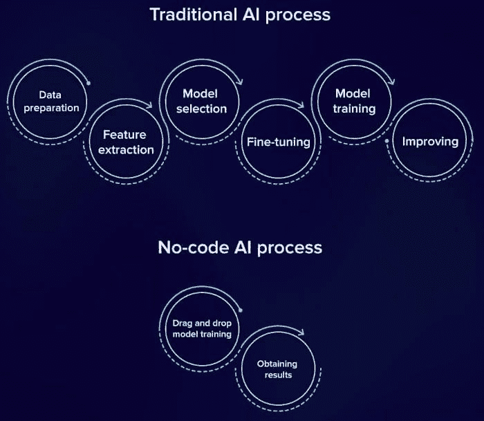

# 前 18 名低代码和无代码机器学习平台

> 原文：[`www.kdnuggets.com/2021/09/top-18-low-code-no-code-machine-learning-platforms.html`](https://www.kdnuggets.com/2021/09/top-18-low-code-no-code-machine-learning-platforms.html)

评论

**由 [Yulia Gavrilova](https://twitter.com/lumosmassimo)，serokell.io 的人工智能和技术伦理**。

你可能已经听说过“低代码”和“无代码”这两个术语。

**低代码** 只是意味着减少了编程量。许多元素可以从库中简单地拖放。然而，也可以通过编写自己的代码来定制这些元素，这样可以增加灵活性。

**无代码** 平台完全不需要编程知识。不同的人，如艺术家、教师、高层管理人员，都可以使用这些平台。他们在工作中需要人工智能，但不想深入编程和计算机科学。无代码解决方案功能有限，但可以快速构建简单的东西。

实际上，无代码和低代码平台之间的界限相当模糊。自称为“无代码”的平台通常仍然留有一些定制空间。

## 面向初学者的低代码平台

低代码库即使在编程经验有限的情况下也可以使用。

### PyCaret

这是一个 [开源机器学习库](https://pycaret.org/) 用 Python 编写，允许你以最少的编码创建和部署机器学习模型。

基本上，PyCaret 是一种低代码替代品，可以用少量的代码替代数百行代码。它极大地提高了软件开发的速度，使初学者更易于使用。PyCaret 是一个 Python 封装库，覆盖了多个机器学习库，如 scikit-learn、XGBoost、Microsoft LightGBM、spaCy 等等。

### Auto-ViML

[AutoViML](https://github.com/AutoViML/Auto_ViML) 是一个可以让任何人快速构建机器学习模型的工具。它会自动将你的数据通过不同的机器学习模型，以发现哪个模型在每种特定情况下效果最佳。另一个很大的优点是你不需要预处理数据，因为 AutoViML 会自动清理、转换和规范化数据。该程序可以处理不同类型的变量，包括文本、数字和视觉数据。

### H2O AutoML

[H2O](https://www.h2o.ai/products/h2o-automl/) 是一个开源机器学习平台。它提供了部署最广泛使用的机器学习算法的工具，如梯度下降、线性回归、深度人工神经网络等。这个平台的特点是其先进的 AutoML。该功能提供了同时构建多个模型的自动化过程，使你即使没有先前经验也可以创建和测试功能性机器学习模型。

## 2021 年你应该使用的无代码机器学习平台

这里有一系列无代码平台，您可以探索，如果您希望快速部署机器学习元素并将其与现有软件集成。

### Google Cloud Auto ML

这个[无代码工具](https://cloud.google.com/automl/)使任何人都能在没有任何机器学习专业知识的情况下训练和部署自定义机器学习模型。该平台支持不同类型的数据，并涵盖了从计算机视觉和视频智能到自然语言处理和翻译等广泛的使用场景。您可以准备和存储数据集，并使用自动化工具进行方便的标记。如果您需要更多的功能和灵活的工具，可以升级到使用 Google Cloud。

### Google ML Kit

这个[工具包](https://developers.google.com/ml-kit)是为希望让其应用程序更具吸引力的 Android 和 iOS 开发者制作的。它的 API 可以用于实现条形码扫描、人脸检测、图像标记等功能，而无需从头创建机器学习模型。所有必要的处理都在用户的移动设备上实时进行，因此您无需担心设置和托管昂贵的服务器。

### Teachable Machine

[Teachable Machine](https://teachablemachine.withgoogle.com/)是 Google 的另一个项目，旨在简化机器学习在应用程序和网站上的使用。由于其用户友好的界面，即使是非技术人员也可以轻松使用该平台。该程序处理图像并允许您训练机器识别和分类照片，同时也处理声音。如果您是新手，这个平台很有趣，并且是免费的。但您需要自己收集和准备用于训练模型的数据。

### Runway AI

[Runway AI](https://runwayml.com/)是为没有编程经验的创作者设计的，专注于视频和照片编辑，包括绿幕选项、过滤器和其他有趣的功能。这个工具包可以帮助您通过几次简单的点击扩展您的创造力，将视频转化为顶级的电影艺术。

### Lobe

这个[ML 平台](https://lobe.ai/)提供了易于使用的项目模板，即使是您第一次进行机器学习项目也能轻松上手。该项目相对较新，目前仅提供图像分类功能。未来，其创建者还希望推出对象检测和数据分类模板。然而，图像分类器是零售商、广告商和商业专业人士最有用的工具之一，因此一定要了解一下。

### Obviously AI

如果你在寻找一个无需编写代码即可基于数据进行预测的便捷工具，[Obviously AI](https://www.obviously.ai/) 适合你。它可供希望预测收入流、优化业务流程、构建更有效供应链并开展个性化自动营销活动的营销人员和企业主使用。你只需提供数据，选择一列作为创建自定义 ML 算法的基础，然后获取报告即可。

### CreateML

[CreateML](https://developer.apple.com/machine-learning/create-ml/) 是 Apple 提供的用户友好的拖放平台，允许你在 Mac 设备上训练模型。它可以帮助你构建分类器和推荐系统。该工具可以处理图像、视频、照片、表格数据和文本。你获得的模型可以在 iOS 应用中测试和部署。你可以预览模型的性能，随时暂停、保存、恢复和扩展你的训练过程。CreateML 允许你在单个项目中同时训练多个模型。它具有标准的 Apple SDK 和包括代码示例和解释性文章的文档。

### MakeML

[MakeML](https://makeml.app/) 使 iOS 开发者能够实现对象分割和对象检测解决方案。使用此工具，你不仅可以在照片中，还可以在视频中勾勒和编辑元素。创建自己的数据集，点击几下即可构建自定义 ML 模型，并将模型集成到你的应用中。该平台还允许你与 AR 一起工作。

### Fritz AI

如果你在寻找更令人兴奋的 iOS 和 Android 应用解决方案，你还可以查看 [Fritz AI](https://www.fritz.ai/)。它在 ML 模型开发中提供了灵活性——你可以在 Studio 中训练自定义模型，也可以使用预训练模型。在程序中，你可以创建或导入自己的数据集，监控模型的性能，并重新训练它。如果你进行 Snapchat 镜头开发，这个工具将帮助你将无代码机器学习添加到你的增强现实滤镜中。

### SuperAnnotate

对视频和文本进行注释是一项繁琐的工作，但可以通过 [SuperAnnotate](https://superannotate.com/) 自动化。该解决方案涵盖了跨不同行业的多种情况，如航空摄影、自动驾驶、机器人技术和医学。如果你需要快速处理图像而又不想雇佣整个数据科学团队，我们推荐你查看一下。

https://www.youtube.com/watch?v=qFvWPSqwJa4

### Rapid Miner

[RapidMiner](https://rapidminer.com/) 是一个为数据挖掘而创建的工具。它基于这样的理念，即业务分析师或数据分析人员不一定需要编程才能完成工作。同时，挖掘需要数据，因此该工具配备了一套优秀的操作符，解决了从各种来源（数据库、文件）获取和处理信息的广泛任务。总体来说，这个工具使得数据分析对任何人都足够简单。

### What-If 工具

这是一个非常有用的工具，可以在不编写代码的情况下评估模型的性能。[WIT](https://pair-code.github.io/what-if-tool/) 直观地展示了模型行为如何随时间和不同数据子集的变化而变化。你还可以比较两个模型的性能，看看哪个效果更好。

### DataRobot

[DataRobot](https://www.datarobot.com/) 是一个使业务分析师能够在没有机器学习或编程知识的情况下构建预测分析的平台。该平台使用自动化机器学习（AutoML）在短时间内生成准确的预测模型。DataRobot 提供了一个用户友好的界面来创建机器学习模型。只需几个步骤，公司就可以部署实时预测分析服务。

### Nanonets AI

智能文档处理可以通过 [Nanonets](https://nanonets.com/) 实现。它自动捕捉文档中的数据，节省了你数小时的手动文档管理。Nanonets AI 处理未见过的、半结构化的文档，即使这些文档不遵循标准模板，也会自动验证数据，并通过多次使用不断改进。

### Monkey Learn Studio

[MonkeyLearn Studio](https://monkeylearn.com/monkeylearn-studio/) 提供了处理文本数据的工具，并旨在被公司使用。这个平台可以自动标记业务数据，例如支持票据或电子邮件。它还帮助可视化数据。MonkeyLearn 使机器学习变得容易，因为它具有现成的机器学习模型，可以在无需编写代码的情况下进行训练和构建。

**最后的话**

这些工具在它们所具备的功能方面非常酷：无代码平台可让非技术专家或机器学习新手快速部署简单项目。但它们绝不能替代针对高负载、数据密集型项目的定制机器学习模型开发。所以，如果你有一个涉及大数据处理、密集工业过程自动化或敏感预测模型的独特想法，[联系我们](https://serokell.io/contacts)。我们可以一起思考适合你特定需求的解决方案。

[原始内容](https://serokell.io/blog/top-no-code-platforms)。经允许转载。

**相关：**

+   [将无代码机器学习推向前沿](https://www.kdnuggets.com/2021/07/pushing-no-code-machine-learning-edge.html)

+   [下一代 AutoML 框架](https://www.kdnuggets.com/2021/05/next-generation-automl-frameworks.html)

+   [Python 中的简单 AutoML](https://www.kdnuggets.com/2021/04/easy-automl-python.html)

* * *

## 我们的前三名课程推荐

 1\. [谷歌网络安全证书](https://www.kdnuggets.com/google-cybersecurity) - 快速进入网络安全职业道路

 2\. [谷歌数据分析专业证书](https://www.kdnuggets.com/google-data-analytics) - 提升你的数据分析能力

 3\. [谷歌 IT 支持专业证书](https://www.kdnuggets.com/google-itsupport) - 支持你的组织 IT 需求

* * *

### 更多相关主题

+   [学习数据科学统计的顶级资源](https://www.kdnuggets.com/2021/12/springboard-top-resources-learn-data-science-statistics.html)

+   [停止学习数据科学以寻找目的，并寻找目的去……](https://www.kdnuggets.com/2021/12/stop-learning-data-science-find-purpose.html)

+   [一个 90 亿美元的 AI 失败，进行了审视](https://www.kdnuggets.com/2021/12/9b-ai-failure-examined.html)

+   [成功数据科学家的五个特征](https://www.kdnuggets.com/2021/12/5-characteristics-successful-data-scientist.html)

+   [是什么让 Python 成为初创企业理想的编程语言](https://www.kdnuggets.com/2021/12/makes-python-ideal-programming-language-startups.html)

+   [每位数据科学家都应该了解的三个 R 库（即使你使用 Python）](https://www.kdnuggets.com/2021/12/three-r-libraries-every-data-scientist-know-even-python.html)
