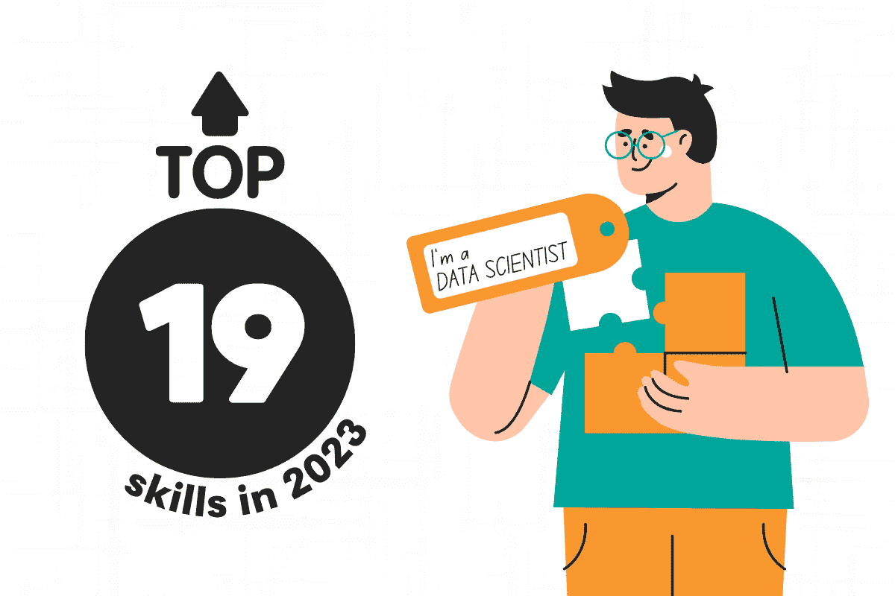
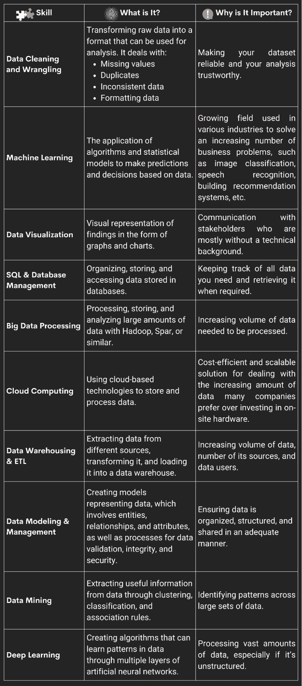
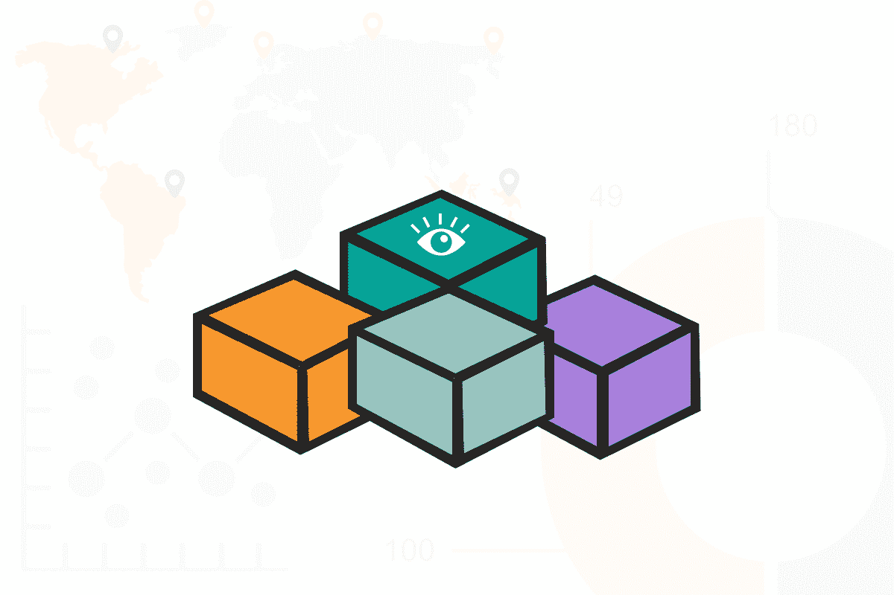
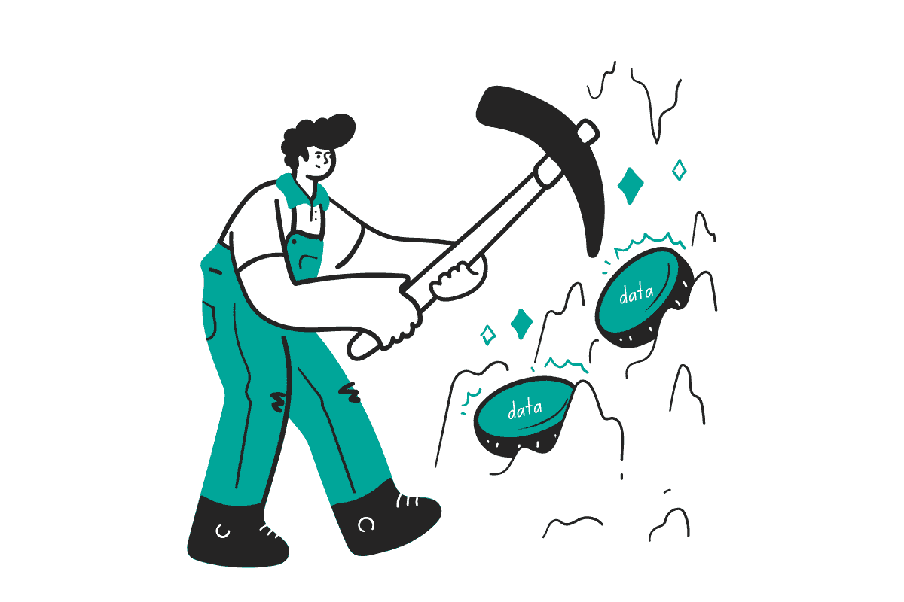

# 2023 年成为数据科学家需要掌握的 19 项技能

> 原文：[`www.kdnuggets.com/2023/04/top-19-skills-need-know-2023-data-scientist.html`](https://www.kdnuggets.com/2023/04/top-19-skills-need-know-2023-data-scientist.html)

作者提供的图片

时代在变化。如果你想在 2023 年成为数据科学家，有几个新的技能应该加入你的技能清单，以及你应该已经掌握的现有技能。

* * *

## 我们的前三个课程推荐

 1. [Google 网络安全证书](https://www.kdnuggets.com/google-cybersecurity) - 快速进入网络安全职业道路。

 2. [Google 数据分析专业证书](https://www.kdnuggets.com/google-data-analytics) - 提升你的数据分析技能

 3. [Google IT 支持专业证书](https://www.kdnuggets.com/google-itsupport) - 支持你的组织的 IT 部门

* * *

为什么需要如此广泛的技能？部分原因是工作范围的不断扩大。没有人确切知道数据科学家的定义是什么，或者他们应该做什么，更不用说你的未来雇主了。因此，任何涉及数据的内容都会被归入数据科学的范畴，由你来处理。

你需要了解如何清理、转换、统计分析、可视化、沟通和预测数据。不仅如此，新的技术（或最近才进入主流的技术）也可能会被纳入你的工作职责中。

在这篇文章中，我将详细介绍 2023 年成为数据科学家需要掌握的 19 项技能。

这里是最重要的十项技能概述。

作者提供的图片

这些技能将帮助你找到工作、成功通过面试、保持领先，并为晋升进行谈判。在每个部分，我会简要总结每项技能是什么、为什么重要，并提供一些学习这些技能的途径。

# 1. 数据清理和整理

尽管数据科学家并非 [80%](https://blog.ldodds.com/2020/01/31/do-data-scientists-spend-80-of-their-time-cleaning-data-turns-out-no/#:~:text=variant%20of%20it%3A-,Data%20scientists%20spend%2080%25%20of%20their%20time,data%20rather%20than%20creating%20insights.&text=Data%20scientists%20only%20spend%2020,data%20quality%2C%20standards%2C%20access.) 的时间都在清理数据，但数据清理和整理仍然是 2023 年数据科学家需要掌握的最重要的技能之一。

## 数据清理和整理是什么？

数据清洗和整理是将原始数据转换为可以用于分析的格式的过程。这涉及处理缺失值，去除重复项，处理不一致的数据，并将数据格式化为分析所需的形式。

数据清洗通常指的是去除错误/不准确的值，填补空白，查找重复项，以及确保数据集尽可能干净和可靠。整理数据（或称为处理、调整、修整等）则是指将数据转换成可分析的形式。你需要将其转换或映射成另一种、更易于查看的格式。

## 为什么在 2023 年成为数据科学家时这很重要？

询问任何数据科学家他们在做什么，他们会提到的第一件事之一就是数据清洗和整理。数据从来不会以干净、可分析的形式进入你的手中，因此知道如何将其整理好是非常重要的。

清洗和整理数据的能力确保你的分析结果是可信的，并有助于避免得出错误的结论。

## 你可以在哪里学习这个关键技能？

学习数据清洗和整理的选项非常丰富。哈佛在 EdX 上提供了一个[课程](https://pll.harvard.edu/course/data-science-wrangling?delta=0)。你也可以通过清洗和整理免费的原始数据集来进行练习，比如 Common Crawl，它是由超过 500 亿个网页组成的网络爬虫数据（[这里](https://registry.opendata.aws/commoncrawl/)），或者巴西的天气数据（[这里](https://www.kaggle.com/PROPPG-PPG/hourly-weather-surface-brazil-southeast-region)）。

# 2. 机器学习

不，这不仅仅是一个流行词！机器学习是任何未来数据科学家必须掌握的一个非常重要的技能。

## 什么是机器学习？

机器学习是应用算法和统计模型来根据数据做出预测和决策的过程。

这是一种人工智能的子领域，使计算机通过从数据中学习而不是显式编程来提高在特定任务上的表现。它有助于自动化。你会在任何行业中发现它。

## 为什么在 2023 年成为数据科学家时这很重要？

你需要了解机器学习，因为它是一个快速发展的领域，已成为解决复杂问题和进行预测的关键工具。

机器学习算法可以用于分类图像、识别语音、进行自然语言处理和创建推荐系统。你很难找到一个不进行（或不想进行）这些 ML 辅助任务的行业。

精通机器学习使数据科学家能够从大型复杂的数据集中提取有价值的见解，并开发出能驱动更好业务决策的预测模型。

## 你可以在哪里学习这个关键技能？

我们在 ScrataScratch 上有一个 [超过三十个机器学习项目](https://www.stratascratch.com/blog/30-project-ideas-to-showcase-your-machine-learning-skills?utm_source=blog&utm_medium=click&utm_campaign=kdn+19+data+scientist+skills) 的库，展示了这一技能以便你在简历上展示。[TensorFlow 也有](https://www.tensorflow.org/resources/learn-ml) 一系列出色的免费资源来学习机器学习。

# 3\. 数据可视化

图片由作者提供

这个技能相当显而易见。当你分析数据时，关键利益相关者会希望通过漂亮的图形和图表来理解你的发现。

## 什么是数据可视化？

数据可视化是创建图表、图形和其他图形的过程，以帮助更容易地理解数据。你将刚刚清理、整理或预测的数据转换成某种视觉格式，既可以与他人沟通趋势，也可以使趋势更容易被发现。

## 为什么在 2023 年成为数据科学家时这很重要？

在 2023 年，能够可视化数据对数据科学家至关重要。这就像拥有揭示数据中隐藏模式和趋势的秘密超能力，可能在初看时并不明显。而最棒的部分是？你可以以一种既吸引人又令人难忘的方式与他人分享你的发现。作为数据科学家，你将与各种经验水平的团队合作，但一张图比一串数字更容易被理解。

因此，如果你想成为一个能够有效传达洞见和发现的数据科学家，掌握数据可视化的艺术是很重要的。

## 你可以在哪里学习这个关键技能？

[这里有一个列表](https://www.mltut.com/best-free-data-visualization-courses/) 介绍了免费的数据可视化学习资源。

# 4\. SQL 和数据库管理

SQL 是结构化查询语言。数据科学家使用 SQL 来处理 SQL 数据库，管理数据库以及执行数据存储任务。

## 什么是 SQL 和数据库管理？

SQL 是一种非常流行的语言，它允许你访问和操作结构化数据。它与数据库管理密切相关，通常是在 SQL 中进行的。数据库管理基本上是你如何组织、存储和检索数据。SQL 数据库是 2023 年 [最受欢迎的后端技术之一](https://blog.boot.dev/backend/top-backend-technologies/)，因此不仅仅适用于数据科学。

## 为什么在 2023 年成为数据科学家时这很重要？

作为数据科学家，你必须跟踪所有的数据，确保它们有序，并在有人需要时检索这些数据。这就是 SQL 和数据库管理让你做到的事情。

## 你可以在哪里学习这个关键技能？

Coursera [提供了很多](https://www.coursera.org/courses?query=database%20management)很棒且价格合理的数据库管理/管理员课程，你可以尝试一下。你还可以在这里预览一些 [SQL 面试问题](https://www.stratascratch.com/blog/sql-interview-questions-you-must-prepare-the-ultimate-guide?utm_source=blog&utm_medium=click&utm_campaign=kdn+19+data+scientist+skills)，这对于测试你的知识很有用。

# 5\. 大数据处理

大数据是一个流行词汇，但它也是一个真实的概念——Oracle [定义](https://www.oracle.com/big-data/what-is-big-data/)它为“包含更大种类的数据，随着时间的推移增加的体量和更高的速度”，即拥有三个 V 的数据。

## 什么是大数据处理？

大数据处理是指使用像 Hadoop 和 Spark 这样的技术来处理、存储和分析大量数据的能力。

## 为什么在 2023 年成为数据科学家时这很重要？

在 2023 年，处理大数据的能力对数据科学家至关重要。生成的数据量持续以指数级增长，能够有效地处理和分析这些数据对于做出明智的决策和获得有价值的见解至关重要。那些对大数据处理技术有深刻理解的数据科学家将能够轻松处理大数据集，并最大限度地利用其中的信息。

此外，由于其流行性，将“大数据”加到你的简历上永远不会有坏处。

## 你可以在哪里学习它？

我喜欢 Simplilearn 的 [YouTube 教程系列](https://www.youtube.com/watch?v=KCEPoPJ8sWw)。

# 6\. 云计算

作者图片

有趣的是——随着越来越多的产品和服务迁移到云端，云计算成为几乎每个技术职位的工作要求，无论是 [DevOps](https://blog.boot.dev/devops/devops-vs-cloud-engineers/) 还是数据科学家。

## 什么是云计算？

云计算是使用像 AWS、Azure 或 Google Cloud 这样的云基础设施和平台来存储和处理数据。这有点像拥有一个可以随时随地访问的虚拟储藏室。与将数据和计算资源存储在本地计算机或服务器上不同，云计算允许组织和数据科学家通过互联网访问这些资源。

## 为什么在 2023 年成为数据科学家时这很重要？

正如我一直强调的，作为数据科学家，你需要处理的数据量在不断增加。越来越多的公司将数据存储在云端，而不是在本地处理。具备以可扩展和高效的方式存储和处理这些数据的能力变得越来越重要。

云计算为此提供了有效的解决方案，使数据科学家能够访问大量的计算资源和数据存储，而无需昂贵的硬件和基础设施。

## 你可以在哪里学习它？

好消息是，由于公司拥有各种云服务，许多公司有兴趣免费教你使用它们，以便你能学会使用他们的服务。[Google](https://cloud.google.com/training)、[Microsoft](https://learn.microsoft.com/en-us/training/paths/microsoft-azure-fundamentals-describe-cloud-concepts/) 和 [Amazon](https://aws.amazon.com/training/) 都提供了很棒的云计算资源。

# 7\. 数据仓库与 ETL

“等一下，我们刚刚讲过数据库吗？什么是数据仓库？”我听到你在问。

我明白你的感受。有时候，感觉最重要的数据科学技能就是搞清楚所有的缩略语和行话。

## 数据仓库和 ETL 是什么？

首先，让我们区分数据仓库和数据库。

数据仓库存储多个系统的当前和历史数据，而数据库存储驱动项目所需的当前数据。数据库存储驱动应用程序所需的当前数据，而数据仓库则存储一个或多个系统的当前和历史数据，以预定义和固定的模式分析数据。

简而言之，你会使用数据仓库来存储多个不同项目的数据，而数据库主要存储单个项目的数据。

ETL 是一个涉及数据仓库的过程，ETL 的缩写是提取、转换和加载。ETL 工具将从你想要的任何数据源系统中提取数据，在暂存区进行转换（通常是清洗、操作或“处理”数据），然后将其加载到数据仓库中。

## 为什么在 2023 年成为数据科学家时这很重要？

我感觉我在每项技能中都重复了这一点，但数据在增长。公司对数据渴求，他们会期待你管理数据。知道如何在可构建的管道中管理数据至关重要。

## 你可以在哪里学习它？

我建议学习如何使用特定语言，如 SQL 或 Python，来进行正确的 ETL。Datacamp 提供了一个[不错的课程](https://www.datacamp.com/courses/etl-in-python)来讲解 Python 中的 ETL。Microsoft 提供了一个更[中级教程](https://learn.microsoft.com/en-us/sql/integration-services/ssis-how-to-create-an-etl-package?view=sql-server-ver16)来讲解 SQL 选项。

# 8\. 数据建模与管理

每个数据科学家都是模型专家。我不是在说吉赛尔·邦辰。我指的是创建数据在系统中如何存储和组织的模型。

## 什么是数据建模和管理？

数据建模和管理是创建数学模型以表示数据的过程，以及管理数据以维护其质量、准确性和有用性。

这涉及到定义数据实体、关系和属性，并实现数据验证、完整性和安全性的过程。

简单来说，数据建模基本上意味着你在创建一个数据如何在雇主的系统中组织和连接的蓝图。你可以把它看作是绘制房屋蓝图。就像蓝图显示不同的房间及其连接方式一样，数据建模展示了不同信息片段之间是如何关联和连接的。

这有助于确保数据以一致且有效的方式存储和使用。

## 为什么在 2023 年成为数据科学家时这很重要？

作为数据科学家，你将负责确保数据以可访问的方式组织和结构化。数据建模和管理帮助你处理数据、分享数据、确保数据准确，并根据数据做出决策。

## 你可以在哪里学习它？

微软在他们的博客上有一个很好的[简介](https://learn.microsoft.com/en-us/training/modules/modern-analytics-data-modeling/)，时长仅半小时且评价很高。这是一个很好的起点。

# 9\. 数据挖掘

图片由作者提供

许多数据科学术语只是从其他职业中借用过来的，如建模和挖掘。让我们深入了解它的含义及其重要性。

## 什么是数据挖掘？

数据挖掘是通过诸如聚类、分类和关联规则等技术从数据中提取有用信息的过程。你是在从数据的汪洋中筛选出有用的金矿。（也许“数据淘金”会是这个技能更好的名字！）

## 为什么在 2023 年成为数据科学家时这很重要？

想象一下：你是 2023 年的数据科学家。你有来自万千不同来源的数据。你使用什么技能来识别这些数据源中的模式？

这就是数据挖掘。

## 你可以在哪里学习它？

数据挖掘通常在涉及大数据或数据分析的课程中讲授，因为这是这两项技能中相当关键的组成部分。EdX [提供了一些](https://www.edx.org/learn/data-mining#:~:text=Online%20Courses%20in%20Data%20Mining,languages%20like%20Java%20and%20Python.) 学习数据挖掘的选项。

# 10\. 深度学习

深度学习与机器学习有微妙的不同！深度学习是机器学习的一个子领域。

## 什么是深度学习？

深度学习是机器学习的一个方面，专注于创建可以通过多个层次的人工神经网络学习数据模式的算法。（人工神经网络，顺便提一下，是一种模拟人脑结构和功能的机器学习算法。）

## 为什么在 2023 年成为数据科学家时这很重要？

人工智能在 2023 年变得越来越复杂。了解 AI 和 ML 的基础知识是不够的——你还应该了解前沿技术，因为它们明天就不再是前沿了。深度学习几年前还是新鲜事物，而现在已经成为必需。

数据科学家将被期望在公司拥有大量数据时使用深度学习。它用于图像和视频处理或计算机视觉应用。

## 你可以在哪里学习这些技能？

我喜欢[Simplilearn 的教程](https://www.simplilearn.com/tutorials/deep-learning-tutorial/what-is-deep-learning)作为起点。

# 成为 2023 年数据科学家还需要了解哪些其他技能？

有许多新兴的技术和方法是值得了解的。这些技术可能更加先进，如生成对抗网络，或更注重软技能，如数据讲述，或专门用于某个领域，如时间序列预测。我会在这里简要总结这些内容：

+   **自然语言处理（NLP）**：处理和理解人类语言的人工智能子领域。聊天机器人使用这一技术。

+   **时间序列分析与预测**：研究时间数据并使用统计模型对未来事件进行预测。你可能会用这个技能进行销售或收入分析。

+   **实验设计与 A/B 测试**：设计和进行受控实验以测试假设，并根据数据做出决策的过程。

+   **数据讲述**：有效地将数据洞察和发现传达给非技术利益相关者的能力。越来越多的利益相关者对数据驱动决策背后的*原因*感兴趣，因此这至关重要。

+   **生成对抗网络（GANs）**：一种深度学习架构，其中两个神经网络被训练合作生成类似于给定数据集的新数据。

+   **迁移学习**：一种机器学习技术，其中一个模型在一个任务上进行预训练，然后在相关任务上进行微调，从而提高性能并减少所需的训练数据量。资源有限的小公司会发现这一点特别有用。

+   **自动化机器学习（AutoML）**：自动选择、训练和部署机器学习模型的过程。

+   **超参数调优**：另一种机器学习子类别。这是通过调整从数据中未学习到的参数（如学习率或隐藏层数量）来优化机器学习模型性能的过程。

+   **可解释人工智能（XAI）**：一个专注于创建透明和可解释算法和模型的人工智能分支，以便人类能够理解其决策过程。同样，这有助于利益相关者理解发生了什么。

如果你想在 2023 年成为数据科学家，这 19 项技能是绝对关键的。真正的好消息是，许多这些技能可以自学，而其他的你可以在像[数据或业务分析师](https://www.stratascratch.com/blog/data-analyst-vs-business-analyst-roles-and-career-paths?utm_source=blog&utm_medium=click&utm_campaign=kdn+19+data+scientist+skills)这样的初级职位中获得。

学习的一些方法：

+   总是检查 YouTube。那里有很多免费的、全面的资源。我在这里列出了一些，但实际上有无数的视频可以查看。

+   像 Coursera 和 EdX 这样的平台通常提供讲座系列

+   我们提供了超过一千个真实面试问题供练习，包括[基于编码的](https://platform.stratascratch.com/coding?code_type=1&utm_source=blog&utm_medium=click&utm_campaign=kdn+19+data+scientist+skills)和[非编码的](https://platform.stratascratch.com/technical?utm_source=blog&utm_medium=click&utm_campaign=kdn+19+data+scientist+skills)。我们还提供了[数据项目示例](https://platform.stratascratch.com/data-projects?utm_source=blog&utm_medium=click&utm_campaign=kdn+19+data+scientist+skills)。

享受学习这些技能的过程，以便在 2023 年成为数据科学家。

**[内特·罗西迪](https://www.stratascratch.com)** 是一位数据科学家，专注于产品策略。他还是一名兼职教授，教授分析学，并且是[StrataScratch](https://www.stratascratch.com/)的创始人，该平台帮助数据科学家通过来自顶级公司的真实面试问题来准备面试。可以通过[Twitter: StrataScratch](https://twitter.com/StrataScratch)或[LinkedIn](https://www.linkedin.com/in/nathanrosidi/)与他联系。

### 了解更多主题

+   [2023 年你需要了解的数据分析工具](https://www.kdnuggets.com/2023/05/data-analytics-tools-need-know-2023.html)

+   [数据科学基础：你需要了解的 10 项必要技能…](https://www.kdnuggets.com/2020/10/data-science-minimum-10-essential-skills.html)

+   [想用你的数据技能解决全球问题？这里是…](https://www.kdnuggets.com/2022/04/jhu-want-data-skills-solve-global-problems.html)

+   [每个机器学习工程师都应掌握的 5 项机器学习技能…](https://www.kdnuggets.com/2023/03/5-machine-learning-skills-every-machine-learning-engineer-know-2023.html)

+   [未来-proof 你的数据技能：2023 年每个数据科学家需要掌握的顶级技能](https://www.kdnuggets.com/futureproof-your-data-game-top-skills-every-data-scientist-needs-in-2023)

+   [KDnuggets 新闻，4 月 13 日：数据科学家应掌握的 Python 库…](https://www.kdnuggets.com/2022/n15.html)
