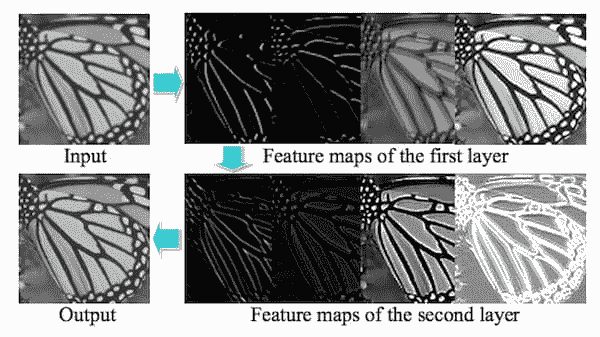
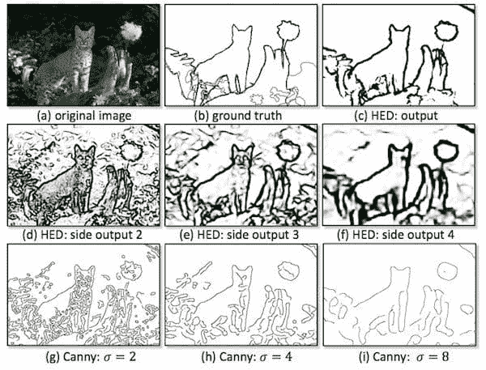

# 2018 年版前 20 篇深度学习论文

> 原文：[`www.kdnuggets.com/2018/03/top-20-deep-learning-papers-2018.html`](https://www.kdnuggets.com/2018/03/top-20-deep-learning-papers-2018.html)

 评论

深度学习，作为机器学习和统计学习的一个子领域，在过去几年取得了令人瞩目的进展。云计算、强大的开源工具以及大量可用的数据是这些突破的关键因素之一。选择前 20 篇论文的标准是使用来自[**academic.microsoft.com**](http://academic.microsoft.com)的引用次数。值得提及的是，这些指标变化迅速，因此引用量必须考虑为文章发布时的数字。

* * *

## 我们的前三大课程推荐

 1. [Google 网络安全证书](https://www.kdnuggets.com/google-cybersecurity) - 快速进入网络安全职业道路

 2. [Google 数据分析专业证书](https://www.kdnuggets.com/google-data-analytics) - 提升你的数据分析技能

 3. [Google IT 支持专业证书](https://www.kdnuggets.com/google-itsupport) - 支持你的组织的 IT 需求

* * *

在这份论文列表中，超过 75%的论文涉及深度学习和神经网络，特别是卷积神经网络（CNN）。其中近 50%的论文涉及计算机视觉领域的模式识别应用。我相信像 TensorFlow、Theano 以及 GPU 使用方面的进展，为数据科学家和机器学习工程师拓展这一领域铺平了道路。

**1.** [深度学习](https://www.cs.toronto.edu/~hinton/absps/NatureDeepReview.pdf)**，** 作者：Yann L.、Yoshua B. 和 Geoffrey H.（2015 年）（引用次数：5,716）

> 深度学习允许由多个处理层组成的计算模型学习具有多个抽象层次的数据表示。这些方法显著提高了语音识别、视觉对象识别、对象检测以及药物发现和基因组学等多个领域的最先进水平。

**2.** [**TensorFlow: 大规模异构分布式系统上的机器学习**](http://download.tensorflow.org/paper/whitepaper2015.pdf)**，** 作者：Martín A.、Ashish A. B.、Eugene B. C.等（2015 年）（引用次数：2,423）

> 该系统灵活且可以表达各种算法，包括深度神经网络模型的训练和推理算法，它已被用于研究和在计算机科学及其他领域（如语音识别、计算机视觉、机器人技术、信息检索、自然语言处理、地理信息提取和计算药物发现）中部署机器学习系统。

**3. [TensorFlow: 大规模机器学习系统](https://www.usenix.org/system/files/conference/osdi16/osdi16-abadi.pdf rel=)**，作者：Martín A.、Paul B.、Jianmin C.、Zhifeng C.、Andy D. 等（2016 年）（被引用：2,227）

> TensorFlow 支持各种应用，重点是深度神经网络的训练和推理。多个 Google 服务在生产中使用 TensorFlow，我们将其发布为开源项目，并且它已广泛用于机器学习研究。

**4. [深度学习中的神经网络](https://arxiv.org/pdf/1404.7828.pdf)**，作者：Juergen Schmidhuber（2015 年）（被引用：2,196）

> 本历史综述简要总结了相关工作，其中大部分来自上一个千年。浅层和深层学习者通过其信用分配路径的深度进行区分，这些路径是可能可学习的因果链。我们回顾了深度监督学习（也回顾了反向传播的历史）、无监督学习、强化学习与进化计算，以及对编码深度和大型网络的短程序的间接搜索。

**5. [通过深度强化学习实现人类级控制](https://web.stanford.edu/class/psych209/Readings/MnihEtAlHassibis15NatureControlDeepRL.pdf)**，作者：Volodymyr M.、Koray K.、David S.、Andrei A. R.、Joel V 等（2015 年）（被引用：2,086）

> 在这里，我们利用训练深度神经网络的最新进展，开发了一种新型人工智能代理，称为深度 Q 网络，该网络可以通过端到端强化学习直接从高维感官输入中学习成功的策略。我们在经典 Atari 2600 游戏的挑战领域测试了该代理。

**6. [更快的 R-CNN: 朝着实时目标检测的区域提议网络](https://arxiv.org/pdf/1506.01497.pdf)**，作者：Shaoqing R.、Kaiming H.、Ross B. G. 和 Jian S.（2015 年）（被引用：1,421）

> 在这项工作中，我们介绍了一种区域提议网络（RPN），它与检测网络共享全图像卷积特征，从而实现几乎零成本的区域提议。RPN 是一种全卷积网络，它同时在每个位置预测对象边界和对象性得分。

**7. [用于视觉识别和描述的长期递归卷积网络](https://arxiv.org/pdf/1411.4389.pdf)**，作者：Jeff D.、Lisa Anne H.、Sergio G.、Marcus R.、Subhashini V. 等（2015 年）（被引用：1,285）

> 与当前假设固定空间-时间感受野或简单时间平均的序列处理模型相比，递归卷积模型在空间和时间“层”上都可以是“加倍深度”的。

**8. [MatConvNet：用于 MATLAB 的卷积神经网络](https://arxiv.org/pdf/1412.4564.pdf)**，作者 Andrea Vedaldi 和 Karel Lenc（2015 年）（引用次数：1,148）

> 它将 CNN 的构建模块暴露为易于使用的 MATLAB 函数，提供了计算线性卷积的滤波器组、特征池化等常用例程。本文档概述了 CNN 及其在 MatConvNet 中的实现，并提供了工具箱中每个计算块的技术细节。

**9. [使用深度卷积生成对抗网络的无监督表示学习](https://arxiv.org/pdf/1511.06434.pdf)**，作者 Alec R., Luke M. 和 Soumith C.（2015 年）（引用次数：1,054）

> 在这项工作中，我们希望帮助弥合 CNN 在监督学习和无监督学习中的成功之间的差距。我们引入了一类称为深度卷积生成对抗网络（DCGANs）的 CNN，这些网络具有某些架构约束，并证明它们是无监督学习的强有力候选者。

**10. [U-Net：用于生物医学图像分割的卷积网络](https://arxiv.org/pdf/1505.04597.pdf)**，作者 Olaf R., Philipp F. 和 Thomas B.（2015 年）（引用次数：975）

> 大多数人一致认为，成功训练深度网络需要成千上万的标注训练样本。本文提出了一种网络和训练策略，依赖于强大的数据增强，以更有效地利用现有的标注样本。

**11. [条件随机场作为递归神经网络](http://www.robots.ox.ac.uk/~szheng/papers/CRFasRNN.pdf)**，作者 Shuai Z., Sadeep J., Bernardino R., Vibhav V. 等（2015 年）（引用次数：760）

> 我们引入了一种新的卷积神经网络形式，结合了卷积神经网络（CNNs）和基于条件随机场（CRFs）的概率图模型的优点。为此，我们将具有高斯对偶势的条件随机场的均值场近似推断形式化为递归神经网络。

**12. [使用深度卷积网络的图像超分辨率](https://arxiv.org/pdf/1501.00092.pdf)**，作者 Chao D., Chen C., Kaiming H. 和 Xiaoou T.（2014 年）（引用次数：591）

> 我们的方法直接学习低分辨率图像与高分辨率图像之间的端到端映射。该映射表示为一个深度卷积神经网络（CNN），它以低分辨率图像为输入，输出高分辨率图像。

**13. [超越短片段：用于视频分类的深度网络](https://arxiv.org/pdf/1503.08909.pdf)**，作者 Joe Y. Ng, Matthew J. H., Sudheendra V., Oriol V., Rajat M. 和 George T.（2015 年）（引用次数：533）

> 在这项工作中，我们提出并评估了几种深度神经网络架构，以在比以往尝试的更长时间段内结合视频中的图像信息。

**14. [Inception-v4、Inception-ResNet 及残差连接对学习的影响](https://arxiv.org/pdf/1602.07261.pdf)**，作者 Christian S.、Sergey I.、Vincent V. 和 Alexander A A.（2017）（引用次数：520）

> 非常深的卷积网络在近年来图像识别性能的最大进展中发挥了核心作用。通过一个包含三个残差网络和一个 Inception-v4 的集合，我们在 ImageNet 分类（CLS）挑战的测试集上实现了 3.08% 的 top-5 错误率。

**15. [显著性对象检测：一种判别性区域特征融合方法](https://arxiv.org/pdf/1410.5926.pdf)**，作者 Huaizu J.、Jingdong W.、Zejian Y.、Yang W.、Nanning Z. 和 Shipeng Li.（2013）（引用次数：518）

> 在本文中，我们将显著性图计算公式化为回归问题。我们的方法基于多级图像分割，利用监督学习方法将区域特征向量映射到显著性分数。

**16. [视觉 Madlibs: 填空描述生成和问答](https://www.cv-foundation.org/openaccess/content_iccv_2015/papers/Yu_Visual_Madlibs_Fill_ICCV_2015_paper.pdf)**，作者 Licheng Y.、Eunbyung P.、Alexander C. B. 和 Tamara L. B.（2015）（引用次数：510）

> 在本文中，我们介绍了一个新的数据集，其中包含 360,001 个针对 10,738 张图像的集中自然语言描述。该数据集，Visual Madlibs 数据集，是通过自动生成的填空模板收集的，旨在收集关于：人物和物体、它们的外观、活动和互动，以及对一般场景或其更广泛背景的推断的目标描述。

**17. [深度强化学习的异步方法](http://proceedings.mlr.press/v48/mniha16.pdf)**，作者 Volodymyr M.、Adrià P. B.、Mehdi M.、Alex G.、Tim H. 等（2016）（引用次数：472）

> 性能最佳的方法是异步变体的演员-评论家方法，它在 Atari 领域超越了当前的最先进水平，同时在单个多核 CPU 上训练的时间仅为 GPU 的一半。此外，我们还展示了异步演员-评论家在各种连续运动控制问题以及在使用视觉输入的随机 3D 迷宫导航新任务中的成功。

**18. [Theano: 一个用于快速计算数学表达式的 Python 框架](https://arxiv.org/pdf/1605.02688.pdf)**，作者 Rami A.、Guillaume A.、Amjad A.、Christof A. 等（2016）（引用次数：451）

> Theano 是一个 Python 库，允许高效地定义、优化和评估涉及多维数组的数学表达式。自推出以来，它已成为最常用的 CPU 和 GPU 数学编译器之一，特别是在机器学习社区中，并且显示出稳定的性能提升。

**19. [深度学习在野外的面部属性](https://www.cv-foundation.org/openaccess/content_iccv_2015/papers/Liu_Deep_Learning_Face_ICCV_2015_paper.pdf)**，由 Ziwei L.、Ping L.、Xiaogang W. 和 Xiaoou T. (2015)（引用次数：401）

> 该框架不仅大幅超越了最先进的技术，而且揭示了有关学习面部表示的有价值的事实。（1）它展示了如何通过不同的预训练策略改善面部定位（LNet）和属性预测（ANet）的性能。（2）它揭示了尽管 LNet 的滤波器仅通过图像级属性标签进行微调，但它们在整个图像上的响应图具有强烈的面部位置指示。

**20.** [**用于文本分类的字符级卷积网络**](http://papers.nips.cc/paper/5782-character-level-convolutional-networks-for-text-classification.pdf)**，**由 Xiang Z.、Junbo Jake Z. 和 Yann L. (2015)（引用次数：401）

> 这篇文章提供了对字符级卷积网络（ConvNets）在文本分类中应用的实证探索。我们构建了几个大规模数据集，展示了字符级卷积网络能够实现最先进或具有竞争力的结果。

**相关：**

+   [理解深度学习的 7 个步骤](https://www.kdnuggets.com/2016/01/seven-steps-deep-learning.html)

+   [深度学习——过去、现在和未来](https://www.kdnuggets.com/2017/05/deep-learning-big-deal.html)

+   [AI 从业者需要应用的 10 种深度学习方法](https://www.kdnuggets.com/2017/12/10-deep-learning-methods-ai-practitioners-need-apply.html)

### 更多相关主题

+   [成为优秀数据科学家所需的 5 项关键技能](https://www.kdnuggets.com/2021/12/5-key-skills-needed-become-great-data-scientist.html)

+   [每个初学者数据科学家应掌握的 6 种预测模型](https://www.kdnuggets.com/2021/12/6-predictive-models-every-beginner-data-scientist-master.html)

+   [2021 年最佳 ETL 工具](https://www.kdnuggets.com/2021/12/mozart-best-etl-tools-2021.html)

+   [学习数据科学统计的顶级资源](https://www.kdnuggets.com/2021/12/springboard-top-resources-learn-data-science-statistics.html)

+   [停止学习数据科学以寻找目标，并寻找目标以……](https://www.kdnuggets.com/2021/12/stop-learning-data-science-find-purpose.html)

+   [建立一个稳固的数据团队](https://www.kdnuggets.com/2021/12/build-solid-data-team.html)
