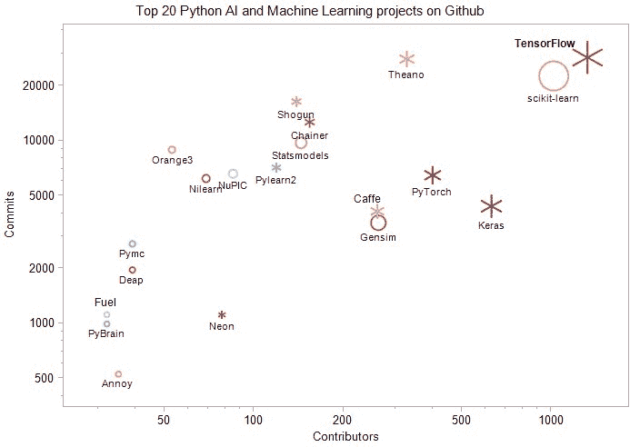

# 前 20 大 Python AI 和机器学习开源项目

> 原文：[`www.kdnuggets.com/2018/02/top-20-python-ai-machine-learning-open-source-projects.html`](https://www.kdnuggets.com/2018/02/top-20-python-ai-machine-learning-open-source-projects.html)

 评论

进入机器学习和人工智能领域并非易事。许多有志于此的专业人士和爱好者发现，在今天如此大量的资源面前，很难找到一条合适的路径。这个领域不断发展，我们必须跟上这快速发展的步伐。为了应对这种令人难以承受的演变和创新速度，保持更新和了解机器学习的进展的一个好方法是通过参与许多由高级专业人士每日使用的开源项目和工具，来与社区互动。

在这里，我们更新了信息，并审视了自我们上一个帖子 [Top 20 Python Machine Learning Open Source Projects](https://www.kdnuggets.com/2016/11/top-20-python-machine-learning-open-source-updated.html)（2016 年 11 月）以来的趋势。

* * *

## 我们的前三名课程推荐

 1\. [Google 网络安全证书](https://www.kdnuggets.com/google-cybersecurity) - 快速进入网络安全职业生涯。

 2\. [Google 数据分析专业证书](https://www.kdnuggets.com/google-data-analytics) - 提升你的数据分析技能

 3\. [Google IT 支持专业证书](https://www.kdnuggets.com/google-itsupport) - 支持你组织的 IT 需求

* * *

TensorFlow 已经跃居第一位，贡献者增长达到三位数。Scikit-learn 降至第二位，但仍然拥有非常大的贡献者基础。

与 2016 年相比，贡献者增长最快的项目是

1.  TensorFlow，169% 增长，从 493 位贡献者增加到 1324 位贡献者

1.  Deap，86% 增长，从 21 位贡献者增加到 39 位贡献者

1.  Chainer，83% 增长，从 84 位贡献者增加到 154 位贡献者

1.  Gensim，81% 增长，从 145 位贡献者增加到 262 位贡献者

1.  Neon，66% 增长，从 47 位贡献者增加到 78 位贡献者

1.  Nilearn，50% 增长，从 46 位贡献者增加到 69 位贡献者

2018 年的新内容：

1.  Keras，629 位贡献者

1.  PyTorch，399 位贡献者

**图 1：Github 上前 20 大 Python AI 和机器学习项目。**

大小与贡献者数量成正比，颜色表示贡献者数量的变化 - 红色代表较高，蓝色代表较低。雪花形状用于深度学习项目，圆形用于其他项目。

我们看到像 TensorFlow、Theano 和 Caffe 这样的深度学习项目仍然是最受欢迎的。

下列列表按 Github 上贡献者数量的降序排列。贡献者数量的变化与[2016 KDnuggets 关于前 20 个 Python 机器学习开源项目的帖子](https://www.kdnuggets.com/2016/11/top-20-python-machine-learning-open-source-updated.html)相比。

我们希望你喜欢浏览这些文档页面，以开始合作并学习使用 Python 进行机器学习的方法。

1.  **[TensorFlow](https://www.tensorflow.org/)** 最初由 Google Brain 团队内的研究人员和工程师开发。该系统旨在促进机器学习研究，并使从研究原型到生产系统的过渡快速而简便。

    贡献者：1324（增加了 168%），提交次数：28476，星标：92359。Github 网址：[Tensorflow](https://github.com/tensorflow/tensorflow)

1.  **[Scikit-learn](http://scikit-learn.org/)** 是用于数据挖掘和数据分析的简单而高效的工具，面向所有人，在各种环境中可重用，基于 NumPy、SciPy 和 matplotlib，开源，商业可用 – BSD 许可证。

    贡献者：1019（增加了 39%），提交次数：22575，Github 网址：[Scikit-learn](https://github.com/scikit-learn/scikit-learn)

1.  **[Keras](https://keras.io/)** 是一个高级神经网络 API，用 Python 编写，可以运行在 TensorFlow、CNTK 或 Theano 之上。

    贡献者：629（新增），提交次数：4371，Github 网址：[Keras](https://github.com/keras-team/keras)。

1.  **[PyTorch](http://pytorch.org)**，Python 中的张量和动态神经网络，具有强大的 GPU 加速。

    贡献者：399（新增），提交次数：6458，Github 网址：[pytorch](https://github.com/pytorch/pytorch)。

1.  **[Theano](http://deeplearning.net/software/theano/)** 允许你高效地定义、优化和评估涉及多维数组的数学表达式。

    贡献者：327（增加了 24%），提交次数：27931，Github 网址：[Theano](https://github.com/Theano/Theano)

1.  **[Gensim](https://radimrehurek.com/gensim/)** 是一个免费的 Python 库，具有可扩展的统计语义功能，可以分析纯文本文档的语义结构，并检索语义相似的文档。

    贡献者：262（增加了 81%），提交次数：3549，Github 网址：[Gensim](https://github.com/RaRe-Technologies/gensim)

1.  **[Caffe](http://caffe.berkeleyvision.org/)** 是一个深度学习框架，注重表达力、速度和模块化。由 Berkeley Vision and Learning Center ([BVLC](http://bvlc.eecs.berkeley.edu/)) 和社区贡献者开发。

    贡献者：260（增加了 21%），提交次数：4099，Github 网址：[Caffe](https://github.com/BVLC/caffe)

1.  **[Chainer](http://chainer.org/)** 是一个基于 Python 的独立开源深度学习框架。Chainer 提供了一种灵活、直观且高性能的方法来实现各种深度学习模型，包括诸如递归神经网络和变分自编码器等最先进的模型。

    贡献者: 154（增加了 84%），提交次数: 12613，Github URL: [Chainer](https://github.com/pfnet/chainer)

1.  **[Statsmodels](http://statsmodels.sourceforge.net/)** 是一个 Python 模块，允许用户探索数据、估计统计模型并执行统计测试。提供了针对不同数据类型和每个估计器的详细描述统计、统计测试、绘图函数和结果统计。

    贡献者: 144（增加了 33%），提交次数: 9729，Github URL: [Statsmodels](https://github.com/statsmodels/statsmodels/)

1.  **[Shogun](http://shogun-toolbox.org/)** 是一个机器学习工具箱，提供了广泛的 *统一* 和 *高效* 的机器学习（ML）方法。该工具箱无缝地允许轻松组合多种数据表示、算法类别和通用工具。

    贡献者: 139（增加了 32%），提交次数: 16362，Github URL: [Shogun](https://github.com/shogun-toolbox/shogun)

1.  **[Pylearn2](http://deeplearning.net/software/pylearn2/)** 是一个机器学习库。它的大部分功能建立在 [Theano](http://deeplearning.net/software/theano/) 之上。这意味着你可以使用数学表达式编写 Pylearn2 插件（新模型、算法等），Theano 将优化并稳定这些表达式，并将其编译为你选择的后端（CPU 或 GPU）。

    贡献者: 119（增加了 3.5%），提交次数: 7119，Github URL: [Pylearn2](https://github.com/lisa-lab/pylearn2)

1.  **[NuPIC](http://numenta.org/)** 是一个基于一种称为分层时间记忆（HTM）的新皮层理论的开源项目。HTM 理论的部分内容已经实现、测试并用于应用中，其他部分仍在开发中。

    贡献者: 85（增加了 12%），提交次数: 6588，Github URL: [NuPIC](https://github.com/numenta/nupic)

1.  **[Neon](http://neon.nervanasys.com/)** 是 [Nervana](http://nervanasys.com/) 的基于 Python 的深度学习库。它在提供易用性的同时，能够实现最高性能。

    贡献者: 78（增加了 66%），提交次数: 1112，Github URL: [Neon](https://github.com/NervanaSystems/neon)

1.  **[Nilearn](https://nilearn.github.io/)** 是一个用于神经影像数据的快速而简单的统计学习的 Python 模块。它利用了 [scikit-learn](http://scikit-learn.org/) Python 工具箱进行多变量统计，适用于预测建模、分类、解码或连通性分析等应用。

    贡献者: 69（增加了 50%），提交次数: 6198，Github URL: [Nilearn](https://github.com/nilearn/nilearn)

1.  **[Orange3](http://orange.biolab.si/orange3/)** 是开源的机器学习和数据可视化工具，适用于新手和专家。具有大规模工具箱的互动数据分析工作流。

    贡献者：53（增加 33%），提交次数：8915，Github 网址：[Orange3](https://github.com/biolab/orange3)

1.  **[Pymc](https://pymc-devs.github.io/pymc/README.html)** 是一个 Python 模块，实现了贝叶斯统计模型和拟合算法，包括马尔可夫链蒙特卡罗。其灵活性和可扩展性使其适用于各种问题。

    贡献者：39（增加 5.4%），提交次数：2721，Github 网址：[Pymc](https://github.com/pymc-devs/pymc)

1.  **[Deap](https://pypi.python.org/pypi/deap)** 是一个新颖的进化计算框架，用于快速原型开发和测试想法。它旨在使算法明确，数据结构透明。它与并行机制如多进程和 [SCOOP](https://scoop.googlecode.com/) 完美兼容。

    贡献者：39（增加 86%），提交次数：1960，Github 网址：[Deap](https://github.com/deap/deap)

1.  **[Annoy](https://pypi.python.org/pypi/annoy)** ([近似最近邻](https://en.wikipedia.org/wiki/Nearest_neighbor_search#Approximate_nearest_neighbor) 哦耶) 是一个具有 Python 绑定的 C++ 库，用于在空间中搜索与给定查询点接近的点。它还创建了大型只读文件数据结构，这些数据结构映射到内存中，以便多个进程可以共享相同的数据。

    贡献者：35（增加 46%），提交次数：527，Github 网址：[Annoy](https://github.com/spotify/annoy)

1.  **[PyBrain](http://pybrain.org/)** 是一个模块化的 Python 机器学习库。其目标是提供灵活、易于使用但仍然强大的机器学习算法，并且提供多种预定义的环境用于测试和比较你的算法。

    贡献者：32（增加 3%），提交次数：992，Github 网址：[PyBrain](https://github.com/pybrain/pybrain)

1.  **[Fuel](https://fuel.readthedocs.io/)** 是一个数据管道框架，为你的机器学习模型提供所需的数据。计划由 [Blocks](https://github.com/mila-udem/blocks) 和 [Pylearn2](https://github.com/lisa-lab/pylearn2) 神经网络库使用。

    贡献者：32（增加 10%），提交次数：1116，Github 网址：[Fuel](https://github.com/mila-udem/fuel)

贡献者和提交次数的数据记录于 2018 年 2 月。

**相关：**

+   [**更新的前 20 个 Python 机器学习开源项目**](https://www.kdnuggets.com/2016/11/top-20-python-machine-learning-open-source-updated.html)

+   [**选择开源机器学习库：TensorFlow、Theano、Torch、scikit-learn、Caffe**](https://www.kdnuggets.com/2017/11/choosing-open-source-machine-learning-library.html)

+   [**5 个实用的机器学习资源**](https://www.kdnuggets.com/2018/02/5-fantastic-practical-machine-learning-resources.html)

### 更多相关主题

+   [使用管道编写干净的 Python 代码](https://www.kdnuggets.com/2021/12/write-clean-python-code-pipes.html)

+   [构建一个稳固的数据团队](https://www.kdnuggets.com/2021/12/build-solid-data-team.html)

+   [学习数据科学统计的最佳资源](https://www.kdnuggets.com/2021/12/springboard-top-resources-learn-data-science-statistics.html)

+   [停止学习数据科学来寻找目标，并以此找到目标](https://www.kdnuggets.com/2021/12/stop-learning-data-science-find-purpose.html)

+   [是什么让 Python 成为初创公司的理想编程语言](https://www.kdnuggets.com/2021/12/makes-python-ideal-programming-language-startups.html)

+   [每个数据科学家都应该知道的三个 R 库（即使你使用 Python）](https://www.kdnuggets.com/2021/12/three-r-libraries-every-data-scientist-know-even-python.html)
