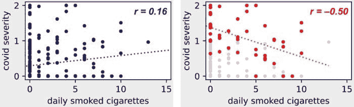
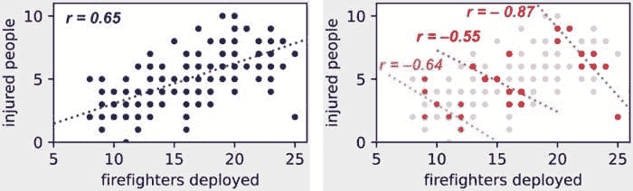
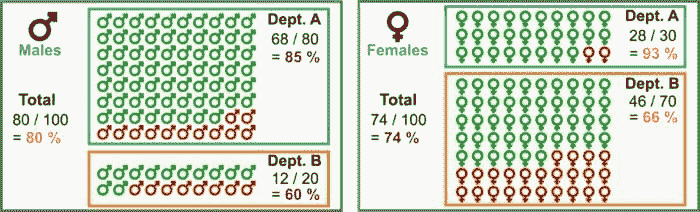
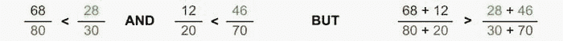

# 数据科学中的三大统计悖论

> 原文：[`www.kdnuggets.com/2021/04/top-3-statistical-paradoxes-data-science.html`](https://www.kdnuggets.com/2021/04/top-3-statistical-paradoxes-data-science.html)

comments

**作者 [Francesco Casalegno](https://www.linkedin.com/in/francescocasalegno/)，项目经理和机器学习工程师**

悖论违背了我们的预期。照片由[Greg & Lois Nunes](https://unsplash.com/@greg_nunes?utm_source=unsplash&utm_medium=referral&utm_content=creditCopyText)拍摄，来源于[Unsplash](https://unsplash.com/photos/ltifWJbvhXM?utm_source=unsplash&utm_medium=referral&utm_content=creditCopyText)。

* * *

## 我们的三大课程推荐

 1. [Google Cybersecurity Certificate](https://www.kdnuggets.com/google-cybersecurity) - 加速进入网络安全职业生涯

 2. [Google Data Analytics Professional Certificate](https://www.kdnuggets.com/google-data-analytics) - 提升您的数据分析能力

 3. [Google IT Support Professional Certificate](https://www.kdnuggets.com/google-itsupport) - 支持您的组织在 IT 领域

* * *

观察偏差和子群体差异很容易在任何数据科学应用中产生**统计悖论**。因此，忽略这些因素可能会完全颠覆我们分析的结论。

确实不罕见观察到令人惊讶的现象，比如**子群体****趋势在汇总数据中完全反转**。在本文中，我们探讨了数据科学中遇到的三种最常见的统计悖论。

### **1. 伯克森悖论**

一个显著的例子是观察到**COVID-19 严重程度与吸烟之间的负相关**（例如，参见[Wenzel 2020](https://ec.europa.eu/jrc/en/publication/smoking-and-covid-19-review-studies-suggesting-protective-effect-smoking-against-covid-19)的欧洲委员会审查）。吸烟是呼吸系统疾病的一个已知风险因素，那么我们如何解释这个矛盾呢？

[Griffith 2020](https://www.nature.com/articles/s41467-020-19478-2) 近期在《自然》上发表的研究表明，这可能是**碰撞偏差**的一个例子，也叫做[**伯克森悖论**](https://en.wikipedia.org/wiki/Berkson%27s_paradox)。为了理解这个悖论，让我们考虑以下图示模型，其中我们包含了第三个随机变量：“住院”。

**伯克森悖论：**“住院”是“吸烟”和“COVID-19 严重程度”的碰撞变量。（作者提供的图像）

这个第三变量“住院”是前两个变量的[**碰撞变量**](https://en.wikipedia.org/wiki/Collider_(statistics))。这意味着吸烟和严重 COVID-19 都增加了在医院生病的机会。伯克森悖论正是当我们**对碰撞变量进行条件化**时产生的，即当我们仅观察住院病人的数据而不是考虑整个群体时。

让我们考虑以下示例数据集。在左图中，我们有整个群体的观察数据，而右图中我们仅考虑住院病人的子集（即我们对碰撞变量进行条件化）。

**伯克森悖论：**如果我们对“住院”这一碰撞变量进行条件化，我们会观察到吸烟与 COVID-19 之间关系的反转！（图片由作者提供）

在左图中，我们可以观察到我们预期的 COVID-19 严重程度与吸烟之间的**正相关**，因为我们知道吸烟是呼吸系统疾病的风险因素。

但在右图中——我们仅考虑住院病人——我们看到的是相反的趋势！要理解这一点，请考虑以下几点。

1.  COVID-19 的高严重程度增加了住院的机会。特别是，如果严重程度 > 1，就需要住院。

1.  每天吸几支烟是多种疾病（如心脏病、癌症、糖尿病）的主要风险因素，这些疾病增加了因某种原因住院的可能性。

1.  因此，如果**住院病人**的**COVID-19 严重程度**较**低，他们吸烟的机会反而**会**更高**！事实上，他们必须有不同于 COVID-19 的某种疾病（例如心脏病、癌症、糖尿病）来解释他们的住院，而这种疾病很可能是由吸烟引起的。

这个例子与[Berkson 1946](https://www.jstor.org/stable/3002000?casa_token=EBVDrF0sqOQAAAAA%3ABvQ5XgFAxop9ZGhFWkgp2cm_Ck0I1jXy27dh8iK6UUaADuPFYJM7lndD9ti_XTTlA2qPawpK4ylyb-jc9F7rNB0bG5iqL6Z4ekwWRWwDDjN4TUEdMw&seq=1#metadata_info_tab_contents)中的原始工作非常相似，其中作者注意到医院病人中**胆囊炎**与**糖尿病**之间的负相关，尽管糖尿病是胆囊炎的风险因素。

### **2\. 潜在变量**

潜在变量的存在可能也会产生两个变量之间的表面倒置相关性。虽然伯克森悖论是因为对碰撞变量进行条件化（因此应该避免），但另一种悖论可以通过**对潜在变量进行条件化**来修正。

例如，我们考虑部署的消防员数量与火灾中受伤人数之间的关系。我们期望更多的消防员会改善结果（在某种程度上—参见[布鲁克斯定律](https://en.wikipedia.org/wiki/Brooks%27s_law)），然而在汇总数据中观察到正相关：**部署的消防员越多，受伤人数越多**！

为了理解这个悖论，让我们考虑以下图示模型。关键是再次考虑一个第三个随机变量：“火灾严重程度”。

**潜在变量悖论：** “火灾严重程度”是“部署的消防员数量”和“伤员人数”这两个变量的潜在变量。（图片由作者提供）

这个第三个潜在变量与其他两个变量正相关。确实，更**严重的火灾往往会导致更多的伤害**，同时它们**需要更多的消防员**来扑灭。

让我们考虑以下示例数据集。在左侧的图中，我们汇总了所有类型的火灾观察，而在右侧的图中，我们仅考虑了与三种固定火灾严重程度对应的观察（即我们对潜在变量进行条件观察）。

**潜在变量：** 如果我们对潜在变量“火灾严重程度”进行条件观察，我们会发现部署的消防员数量与伤员人数之间的关系发生了逆转！（图片由作者提供）

在右侧的图中，当我们**对火灾严重程度进行条件观察**时，我们可以看到预期的负相关。

+   对于给定严重程度的火灾，我们确实可以观察到**消防员部署越多，受伤人数越少**。

+   如果我们观察**更严重的火灾**，即使消防员数量和受伤人数都较多，我们也会观察到**相同的趋势**。

### 3\. 辛普森悖论

[**辛普森悖论**](https://en.m.wikipedia.org/wiki/Simpson%27s_paradox)是一种令人惊讶的现象，即在子组中观察到的趋势在子组合并时会发生反转。这通常与**数据子组中的类别不平衡**有关。

这个悖论的一个臭名昭著的例子来自于[Bickel 1975](https://science.sciencemag.org/content/187/4175/398.abstract)，其中对加利福尼亚大学的录取率进行了分析，以寻找**性别歧视的证据**，并揭示了两个明显矛盾的事实。

+   一方面，在**每个部门**他观察到**女性申请者的录取率高于男性申请者**。

+   另一方面，**汇总** **数据** 显示**女性申请者的录取率低于男性申请者**。

要了解这如何可能，我们考虑以下包含两个部门 A 部和 B 部的数据集。

+   在 100 名男性申请者中：80 人申请了部门 A，68 人被录取（85%），而 20 人申请了部门 B，12 人被录取（60%）。

+   在 100 名女性申请者中：30 人申请了部门 A，28 人被录取（93%），而 70 人申请了部门 B，46 人被录取（66%）。

**辛普森悖论：**女性申请者在每个部门中的录取概率更高，但总体女性录取率却低于男性录取率！（图像由作者提供）

这个悖论由以下不等式表达。

**辛普森悖论：**表面矛盾背后的不等式。（图像由作者提供）

我们现在可以理解我们看似矛盾的观察结果的来源。关键在于两个部门（部门 A：80–30，部门 B：20–70）中的申请者性别存在显著的**类别不平衡**。事实上，**大多数**女性学生申请了竞争更激烈的部门 B（录取率较低），而**大多数**男性学生则申请了竞争较少的部门 A（录取率较高）。这就导致了我们观察到的矛盾现象。

### **结论**

**潜在变量**、**碰撞变量**和**类别不平衡**可以在许多数据科学应用中轻易产生**统计悖论**。因此，特别关注这些关键点对于正确推导趋势和分析结果至关重要。

**个人简介：[Francesco Casalegno](https://www.linkedin.com/in/francescocasalegno/)** 是一名项目经理和机器学习工程师，对解决与数据科学相关的各种问题充满热情。他的背景包括软件工程和应用数学。Francesco 总是期待新的挑战，并坚信不断自我提升和与团队一起进步。

[原文](https://towardsdatascience.com/top-3-statistical-paradoxes-in-data-science-e2dc37535d99)。经授权转载。

**相关：**

+   数据科学面试中你应该知道的 10 个统计概念

+   使用 Python 进行拒绝采样

+   数据科学家应该知道的推断统计

### 更多相关话题

+   [数据科学学习统计学的最佳资源](https://www.kdnuggets.com/2021/12/springboard-top-resources-learn-data-science-statistics.html)

+   [数据科学家应该知道的 5 个统计悖论](https://www.kdnuggets.com/2023/02/5-statistical-paradoxes-data-scientists-know.html)

+   [停止学习数据科学以寻找目标，并通过寻找目标来……](https://www.kdnuggets.com/2021/12/stop-learning-data-science-find-purpose.html)

+   [成功数据科学家的 5 个特征](https://www.kdnuggets.com/2021/12/5-characteristics-successful-data-scientist.html)

+   [每个数据科学家都应了解的三个 R 库（即使你使用 Python）](https://www.kdnuggets.com/2021/12/three-r-libraries-every-data-scientist-know-even-python.html)

+   [9 亿美元人工智能失败的分析](https://www.kdnuggets.com/2021/12/9b-ai-failure-examined.html)
