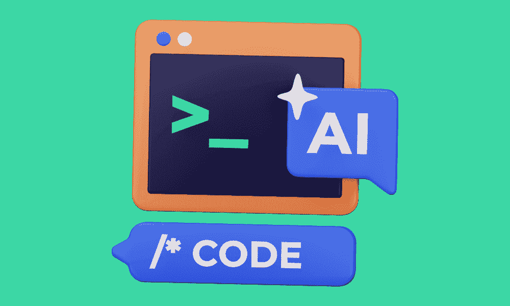
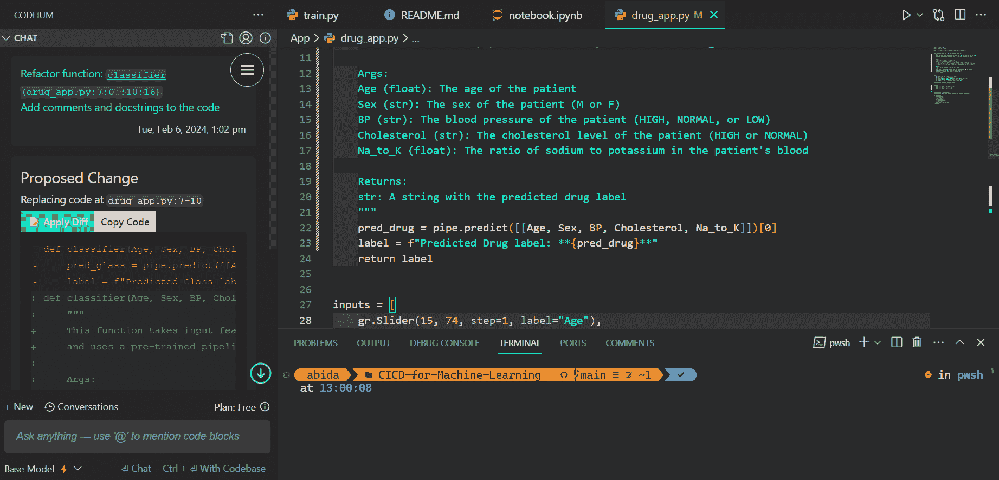
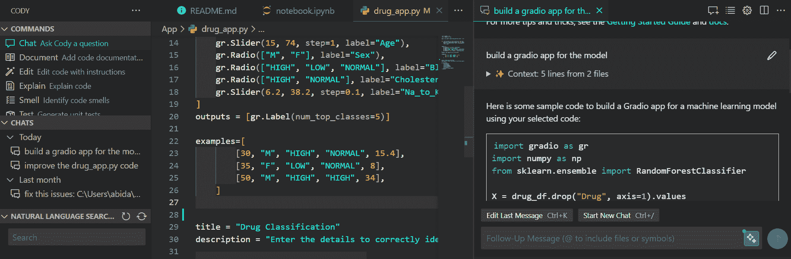
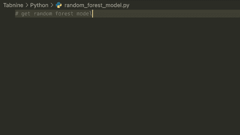

# 前 5 个 AI 编码助手你必须尝试

> 原文：[`www.kdnuggets.com/top-5-ai-coding-assistants-you-must-try`](https://www.kdnuggets.com/top-5-ai-coding-assistants-you-must-try)

作者提供的图片

AI 编码助手已经成为开发过程中的重要部分，它们在代码生成、理解、项目搜索以及通过提示或代码执行各种任务方面提供帮助。即使是 Google Colab 和 Deepnote 等云 IDE 平台也提供 AI 辅助编码，帮助你生成代码和解决问题。

* * *

## 我们的前 3 个课程推荐

 1\. [Google 网络安全证书](https://www.kdnuggets.com/google-cybersecurity) - 快速进入网络安全职业生涯。

 2\. [Google 数据分析专业证书](https://www.kdnuggets.com/google-data-analytics) - 提升你的数据分析能力

 3\. [Google IT 支持专业证书](https://www.kdnuggets.com/google-itsupport) - 支持你在 IT 领域的组织

* * *

在这篇文章中，我将分享值得一试的前 5 个 AI 编码助手。它们都提供 VSCode 扩展，并且容易设置。你只需安装它们，便能体验到更新更简便的程序开发方式。

# 1\. GitHub Copilot

[GitHub Copilot](https://github.com/features/copilot) 是一个利用人工智能帮助程序员更高效编写代码的工具。通过在 VS Code 中安装 Copilot 扩展，开发者可以生成代码、学习代码、自动补全和配置他们的编辑器。

来自 GitHub Copilot 的图片

Copilot 是一个成熟的产品，相比其他工具提供了最新和最准确的建议。通过新的聊天功能，开发者可以使用自然语言生成、修改和改进代码。此外，内联聊天功能允许你直接在文本编辑器中生成代码。

GitHub Copilot 唯一的缺点是它是一个付费工具。然而，如果你是全职开发者或软件工程师，每月支付 $10 也算是划算的。

# 2\. Codeium

[Codeium](https://codeium.com/) 是一个广泛知名的免费工具，最近获得了越来越多的关注。它提供了 GitHub Copilot 的大多数功能，最棒的是，对于个人用户它是免费的。

作者提供的截图

你可以使用 Codeium 提出与文件相关的问题，它会读取文件并提供上下文相关的答案。此外，你还可以让它重构、解释、改进和解决代码中的错误。

它还包括自动完成，但我建议你继续使用旧的 Python 自动完成，因为 Codeium 的自动完成并不总是准确。然而，Codeium 唯一的缺点是它可能不会总是生成最新版本的代码。

# 3. Cody

[Cody](https://sourcegraph.com/cody) 是一个 AI 驱动的编码助手，旨在帮助你更快地编写和理解代码。它提供类似于 Codeium 的功能，如聊天、命令、代码解释和自动完成。它有免费版和专业版。

截图由作者提供

我使用 Cody 已将近两个月，一直顺利，直到我开始用于数据和机器学习项目。不幸的是，我注意到它没有上下文感知，因此产生了不准确的代码。

然而，在我个人使用 Codeium 和 Cody 的经历中，我发现 Cody 有时无法理解代码，并产生不准确的自动完成建议。这就是为什么我更喜欢 Codeium 而不是 Cody。

# 4. Code GPT

我最近发现了 [Code GPT: Chat & AI Agents](https://marketplace.visualstudio.com/items?itemName=DanielSanMedium.dscodegpt)，并对它如何集成任何最先进的大型语言模型并提供广泛的功能印象深刻。这个扩展提供了 AI 聊天帮助、代码解释、错误检查、自动完成等功能。如果你可以访问 OpenAI API 或其他平台，你可以免费使用这个扩展。

截图由作者提供

我使用 Google AI、Anthiopic AI 和 OpenAI API 进行了测试。虽然 Claude 2.1 API 速度很快，但我对其准确性并不满意。为了提高其可用性，开发者需要致力于减少自动完成的延迟，并修复生成错误答案的问题。一种可能的解决方案是使用 Codeium 进行自动完成，使用 CodeGPT 进行代码生成和问题解决。

# 5. Tabnine

[Tabnine](https://www.tabnine.com/) 是一个 AI 编码助手，能够帮助你加速和简化软件开发过程。它还确保你的代码保持私密、安全和合规。Tabnine 目前被超过一百万开发者使用，并在 VSCode 上有七百万次下载。

Gif 来源于 Tabnine

虽然 Tabnine 的免费版可用，但可能不如 Pro 版有效。如果你想体验更好的编码辅助，投资 Pro 版可能是值得的。然而，免费版的自动完成功能仍然相当快速和准确。

如果你有兴趣尝试 Tabnine，可以利用他们的 90 天试用期。请注意，你需要添加支付信息以访问试用。

# 结论

AI 驱动的编码助手正在通过提高程序员的效率和生产力来改变软件开发。在这篇文章中，我们介绍了 5 个顶级 AI 编码助手，我认为这些助手应被那些在代码逻辑、格式化和测试方面遇到困难的人使用。

将这些助手之一或多个整合到你的工作流程中，可以提升你的生产力，生成并理解代码，更快解决问题，并更专注于编码。*最终*，这些 AI 助手让开发者能够花更少的时间在与代码作斗争上，从而专注于创造令人惊叹的软件。在下一个项目中试试它们吧。

****[Abid Ali Awan](https://www.polywork.com/kingabzpro)**** ([@1abidaliawan](https://www.linkedin.com/in/1abidaliawan)) 是一位认证的数据科学专业人士，热衷于构建机器学习模型。目前，他专注于内容创作，并撰写关于机器学习和数据科学技术的技术博客。Abid 拥有技术管理硕士学位和电信工程学士学位。他的愿景是利用图神经网络构建一款 AI 产品，帮助那些与心理疾病作斗争的学生。

### 更多相关内容

+   [2024 年你必须尝试的 5 个最佳向量数据库](https://www.kdnuggets.com/the-5-best-vector-databases-you-must-try-in-2024)

+   [2024 年你必须尝试的 7 个端到端 MLOps 平台](https://www.kdnuggets.com/7-end-to-end-mlops-platforms-you-must-try-in-2024)

+   [15 个你必须知道的数据科学 Python 编码面试问题](https://www.kdnuggets.com/2022/04/15-python-coding-interview-questions-must-know-data-science.html)

+   [KDnuggets 新闻，5 月 4 日：9 门免费的哈佛课程来学习数据…](https://www.kdnuggets.com/2022/n18.html)

+   [7 个必须知道的 Python 编码面试技巧](https://www.kdnuggets.com/2023/03/7-mustknow-python-tips-coding-interviews.html)

+   [2023 年你需要尝试的 5 个令人惊叹且免费的 LLM 游乐场](https://www.kdnuggets.com/5-amazing-free-llms-playgrounds-you-need-to-try-in-2023)
