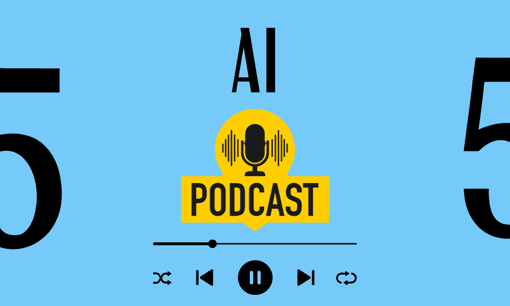

# 2024 年你不能错过的五大 AI 播客

> 原文：[`www.kdnuggets.com/top-5-ai-podcasts-you-cant-miss-in-2024`](https://www.kdnuggets.com/top-5-ai-podcasts-you-cant-miss-in-2024)

图片由编辑提供

世界变化飞快。真的很快，有时很难跟上发生了什么、新的事物、如何运作以及我们应该期待什么。播客是随时保持更新的绝佳方式——尤其是在你忙碌的时候。

* * *

## 我们的前三名课程推荐

 1\. [谷歌网络安全证书](https://www.kdnuggets.com/google-cybersecurity) - 快速进入网络安全领域。

 2\. [谷歌数据分析专业证书](https://www.kdnuggets.com/google-data-analytics) - 提升你的数据分析技能

 3\. [谷歌 IT 支持专业证书](https://www.kdnuggets.com/google-itsupport) - 支持你的组织的 IT

* * *

我已整理出 2024 年你需要收听的五大 AI 播客，以跟上这一趋势。那么我们开始吧……

# 1\. 商业中的 AI

链接：[商业中的 AI](https://podcast.emerj.com/)

主持人丹尼尔·法杰拉提供了一个面向非技术商业领袖的播客，旨在帮助他们了解 AI 所能带来的机会。在这个播客中，你将了解 AI 的能力，以及如何制定策略并实现投资回报。

每周，主持人将采访顶级 AI 高管，讨论 AI 在商业中的实际应用，从财富 500 强公司到初创企业。

如果你想学习如何进入 AI 商业世界或利用 AI 提升你的公司——这是你要收听的播客。

# 2\. AI 播客

链接：[AI 播客](https://blogs.nvidia.com/ai-podcast/)

由 NVIDIA 制作，加入他们深入探讨 AI 对我们世界的影响。你将聆听在 AI 领域具有影响力的人物，并了解他们的故事。它不限于科技行业，你将从各种各样的人身上学到东西，例如野生动物、医疗保健等。

想了解 AI 和机器学习对不同领域的影响——请收听！

# 3\. Lex Fridman 播客

链接：[Lex Fridman 播客](https://lexfridman.com/podcast/)

Lex Fridman 是 AI 领域著名的采访者。他是 AI 领域的研究者，并与多位在 AI 领域具有影响力的人物进行了深入对话。他的播客包括智能、意识、爱和权力的本质。

通过 Lex Fridman 的播客，你不仅能学习到 AI 的世界，还能了解来自各行各业的生活其他方面。Lex Fridman 在 AI 领域很有名，他的声誉使他能够采访到合适的人，并提出有 AI 知识支持的问题。

# 4\. 20VC

链接：[20VC](https://www.thetwentyminutevc.com/podcast/)

这是我个人的最爱之一。二十分钟 VC 播客不仅仅是 AI 相关内容，更是关于商业的一般内容。随着世界向生成式 AI 和其他 AI 相关方面的转变——商业世界正在基于这些变化做出回应。

如果你想了解当前和新兴公司如何迅速过渡，这个播客正好提供了这些信息。你将了解 CEO 在做什么，他们如何达到现在的地步以及他们计划在未来如何利用 AI。

想要创业或扩大现有业务——这是你从 CEO、CFO、CTO 等人士那里学习的播客。

# 5\. 交谈机器

链接：[交谈机器](https://www.thetalkingmachines.com/home)

他们的口号是“关于机器学习的人工对话”。我们许多人对当今世界 AI 系统的实施有看法——这是完全正常的。这档播客将为听众提供对 AI 和机器学习的学术理解。

如果你是 AI 世界的新手，了解 AI 的技术方面并学习基础知识是很有益的，这将指导你了解今天的 AI 市场。

# 附加：Eye on AI

链接：[Eye on AI](https://www.eye-on.ai/podcast-archive)

这是一个每两周更新一次的播客，适合那些日程繁忙但希望关注 AI 动态的人。由 Craig S. Smith 主持，在每一期节目中，他将深入采访在 AI 领域产生影响的人。

这可以是机器学习智能的小幅渐进变化，也可以是像亚马逊这样的主要公司在技术领域发生的全球性变化。

了解 AI 如何改变世界！

# 总结一下

这些是关于 AI 的前五大播客，它们深入探讨了 AI 当前的环境以及它如何改变商业世界和我们的未来。如果你知道社区应该了解的有趣播客，请在评论中分享！

****[Nisha Arya](https://www.linkedin.com/in/nisha-arya-ahmed/)**** 是一名数据科学家、自由技术作家、KDnuggets 的编辑和社区经理。她特别关注提供数据科学职业建议或教程以及数据科学理论知识。Nisha 涵盖了广泛的话题，并希望探索人工智能如何有助于人类寿命的延续。作为一个热衷学习者，Nisha 寻求扩展她的技术知识和写作技能，同时帮助指导他人。

### 相关主题

+   [你不能错过的 7 个机器学习算法](https://www.kdnuggets.com/7-machine-learning-algorithms-you-cant-miss)

+   [5 个超级实用的 SQL 备忘单，你不能错过！](https://www.kdnuggets.com/5-super-helpful-sql-cheat-sheets-you-cant-miss)

+   [2022 年最佳数据科学播客](https://www.kdnuggets.com/2022/06/top-data-science-podcasts-2022.html)

+   [2024 年你可以参加的 5 门顶级机器学习课程](https://www.kdnuggets.com/5-top-machine-learning-courses-you-can-take-in-2024)

+   [每个机器学习爱好者都应该关注的 5 个播客](https://www.kdnuggets.com/5-podcasts-every-machine-learning-enthusiast-should-follow)

+   [不要错过！2023 年结束前报名参加免费课程](https://www.kdnuggets.com/dont-miss-out-enroll-in-free-courses-before-2023-ends)
