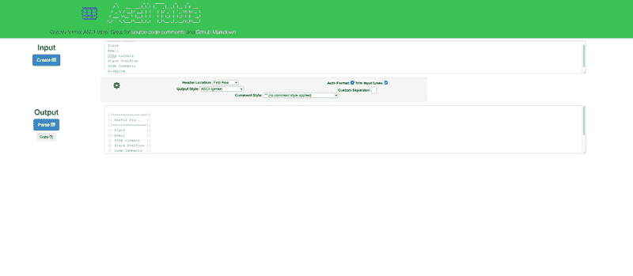
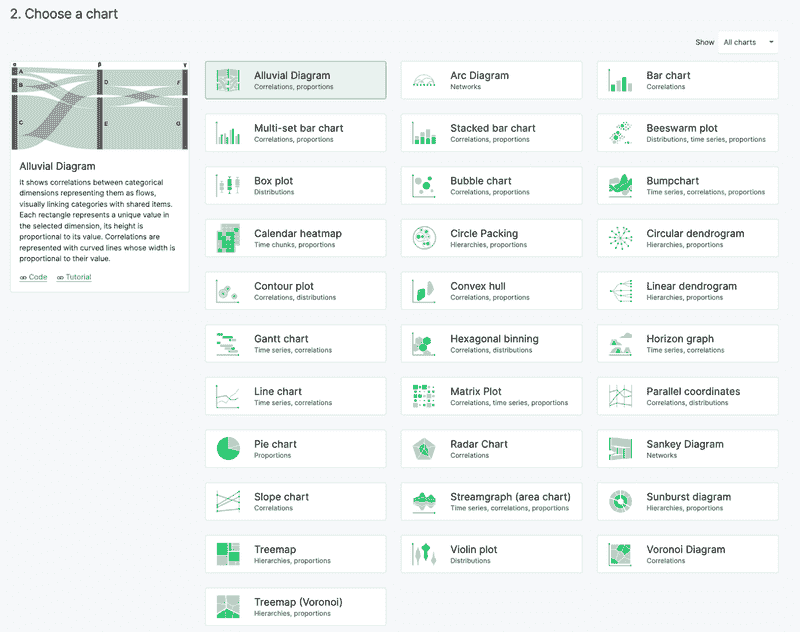

# 每个数据分析师应该拥有的前五个书签

> 原文：[`www.kdnuggets.com/2022/09/top-5-bookmarks-every-data-analyst.html`](https://www.kdnuggets.com/2022/09/top-5-bookmarks-every-data-analyst.html)


图片来源：[cottonbro](https://www.pexels.com/photo/person-holding-a-book-3832024/)

作为一名高级数据分析师，我的工作通常包括一个或两个大型的基础数据研究项目，以及一些“时间紧迫”的小型项目，分配给不同的团队。在一个典型的工作周，我可能会制作 5 到 7 张图表，编写几个查询，调整一些其他查询，并帮助同事调试他们的工作。我可能会提交 1 到 2 个内部 JIRA 工单，并进行几次 StackOverflow 搜索。

* * *

## 我们的前三个课程推荐

 1\. [谷歌网络安全证书](https://www.kdnuggets.com/google-cybersecurity) - 快速进入网络安全职业生涯。

 2\. [谷歌数据分析专业证书](https://www.kdnuggets.com/google-data-analytics) - 提升你的数据分析技能

 3\. [谷歌 IT 支持专业证书](https://www.kdnuggets.com/google-itsupport) - 支持你所在组织的 IT 工作

* * *

主要的潜在问题是，有了这些额外的干扰，我只需面对一个随机的临时问题，就可能从手头的更大任务中脱轨。这就是为什么最好的分析师灵活且迅速。他们应对变化，迅速解决琐碎的工作。

事实是，成为一名优秀的分析师完全在于平衡质量与速度。这表现在找到能够提高效率的好工具上。在那一周，我可能会使用半打不同的工具和软件。如果有一件事是所有分析师都一致同意的，那就是没有任何单一工具可以做到所有事情都很出色。这就是为什么我给年轻分析师的最大建议之一是**开始收藏在线书签**。养成导出这些书签的习惯，以便在换工作或升级电脑时可以带走它们。

这里是每位分析师都应该拥有的前五个书签。一些书签在日常工作中非常有用，而另一些则是特定情况中偶尔使用的。然而，你可能会在某一天需要它们，到那时，它们会为你节省大量的麻烦和时间。

# 5\. Ascii 表格格式化工具

表格格式化工具可以将一块复制/粘贴的数据转换成更加高效且美观的格式。这在多种情况下都很有用。有时我通过 Slack 或电子邮件给同事发送一个快速表格；有时我将数据粘贴到 JIRA 工单中。此外，表格格式化工具在论坛中发布或回答问题（如 Stack Overflow）或在博客中发布数据时也非常有用。诀窍是选择像 Courier New 这样的等宽字体，以使其正确对齐。



[`ozh.github.io/ascii-tables/`](https://ozh.github.io/ascii-tables/)

```py
//================\\

|| Useful For...  ||

|]================[|

|| Slack          ||

|| Email          ||

|| JIRA tickets   ||

|| Stack Overflow ||

|| Code Comments  ||

|| Blogging       ||

\\================//
```

选择很多，但我最喜欢的是 [`ozh.github.io/ascii-tables/`](https://ozh.github.io/ascii-tables/)。它快速、简单，并提供了很多不同的输出格式选择。此外，Ascii Table Formatter 会自动转换文本而无需点击任何东西；它是即时的！

这里有几个不同的例子：

# 4\. SQL 美化工具

SQL 编写器有两种类型——那些以查询的格式化为荣、让其更易于阅读的人和那些喜欢看世界毁灭的人。无论你是想格式化别人的混乱还是自己的混乱——SQL 美化工具都是必不可少的。

下次你发现自己试图解读如下查询时：

使用 SQL 美化工具，可以立刻将其格式化成这样：

有很多选项，包括可下载的程序、插件和在线版本。我更喜欢在线版本，可以在这里找到：[`codebeautify.org/sqlformatter`](https://codebeautify.org/sqlformatter)。

# 3\. JSON 查看器和转换器

我尽量避免处理 JSON 数据，但不幸的是，有时我别无选择。这就是为什么我在书签中保留了各种 JSON 相关的查看器和转换器。

想要快速浏览 JSON 结构以查看有哪些元素？需要调试为什么你的解析脚本失败？那么我推荐查看 [`www.convertcsv.com/json-to-csv.htm`](https://www.convertcsv.com/json-to-csv.htm) 和 [`www.convertcsv.com/csv-to-json.htm`](https://www.convertcsv.com/csv-to-json.htm) 以在表格和 JSON 结构之间转换，以及 [`jsonviewer.stack.hu/`](http://jsonviewer.stack.hu/) 进行解析和查看。

# 2\. 图表构建器

构建可视化和仪表板是分析师工作的重要部分。不幸的是，我估计我制作的图表中约有 80% 实际上不是用于仪表板，而是用于回答快速的、临时的问题。对于许多这些任务，启动像 Tableau 这样的专用应用程序或玩弄 Excel 实在是过于繁琐。因此，我需要能够快速构建图表的工具。

在线上有很多快速构建图表的资源，但[`app.rawgraphs.io/`](https://app.rawgraphs.io/)是我最喜欢的。我喜欢它因为它提供了许多鲜为人知的图表类型（如日历热图和圆形打包），这些图表在 Excel 中很难弄清楚。



[`app.rawgraphs.io/`](https://app.rawgraphs.io/)

# 1. SQL 生成器

大多数分析师实际上并没有记住各种变换的语法。相反，大多数人会回忆起以前的查询，该查询执行了类似的操作，然后在他们的`Untitled1.sql`、`Untitled2.sql`和`Copy of RevenueQuery_final_final_final(3).sql`文件夹中查找，直到找到为止。或者，Google 可以提供帮助，但这需要大量时间来查找正确的问题或具有正确语法的教程。

相反，给自己收藏一个好的 SQL 生成器。SQL 生成器基本上是一个 SQL 查询的模板，它允许你自定义列名和表结构，选择你想要执行的操作，然后为你构建各种不同“风味”的 SQL 语法。

不要再为`DATEDIFF()`与`DATE_DIFF()`之间的细微差别感到困扰！我推荐这个：[`app.rasgoml.com/sql`](https://app.rasgoml.com/sql)

# 结论

事实是，作为分析师就是要在质量与速度之间取得平衡。拥有一个可以帮助你在不牺牲质量的情况下节省时间的工具包是提高效率的有效方法。如果你目前没有一个“工具”的书签文件夹，希望这篇文章能为你提供一个良好的起点！

其他的呢？你有没有我遗漏的收藏书签？

## 社区建议

+   RegEx Helper — [韦斯利·朗斯沃斯](https://www.linkedin.com/in/wesley-longsworth/) ([Regexr](https://regexr.com/), [Regex101](https://regex101.com/))

**[乔什·贝瑞](https://www.linkedin.com/in/joshberry022/)** ([**@Twitter**](https://mobile.twitter.com/itsamejoshabee)) 负责 Rasgo 的面向客户的数据科学，自 2008 年起从事数据和分析行业。乔什在康卡斯特工作了 10 年，建立了数据科学团队，并且是内部开发的康卡斯特功能存储的主要负责人之一——这是市场上最早出现的功能存储之一。在离开康卡斯特后，乔什在 DataRobot 负责构建面向客户的数据科学。在空闲时间，乔什会对有趣的主题进行复杂分析，如棒球、F1 赛车、房地产市场预测等。

[原文](https://towardsdatascience.com/top-5-bookmarks-every-data-analyst-should-have-547a2c9ad1fe)。经授权转载。

### 相关主题

+   [每位数据科学家应具备的前 13 项技能](https://www.kdnuggets.com/2022/03/top-13-skills-every-data-scientist.html)

+   [KDnuggets 新闻，3 月 30 日：最受欢迎的编程入门课程](https://www.kdnuggets.com/2022/n13.html)

+   [如果你想成为数据分析师，应该考虑的 3 个课程](https://www.kdnuggets.com/3-courses-you-should-consider-if-you-want-to-become-a-data-analyst)

+   [KDnuggets 新闻，5 月 25 日：每位数据科学家都应该了解的 6 种 Python 机器学习工具](https://www.kdnuggets.com/2022/n21.html)

+   [每位初学者数据科学家都应该掌握的 6 种预测模型](https://www.kdnuggets.com/2021/12/6-predictive-models-every-beginner-data-scientist-master.html)

+   [每位数据科学家都应该了解的 6 种 Python 机器学习工具](https://www.kdnuggets.com/2022/05/6-python-machine-learning-tools-every-data-scientist-know.html)
