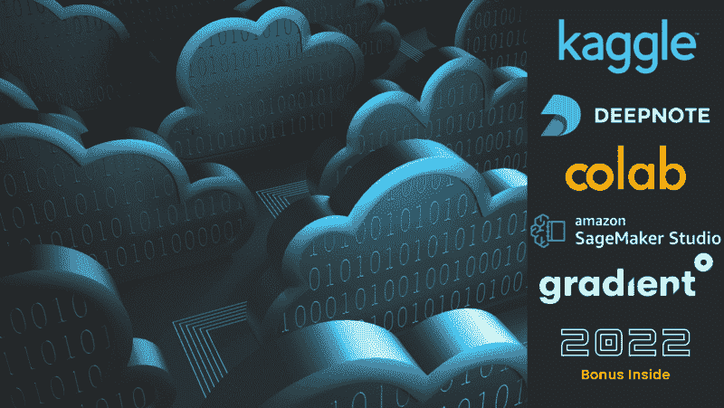
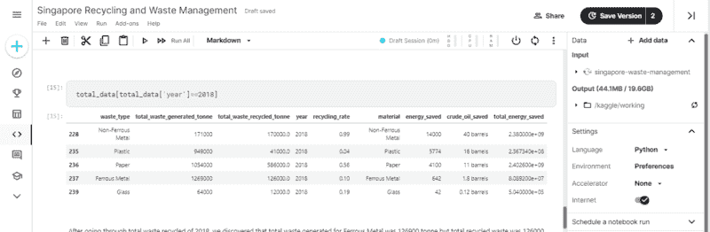
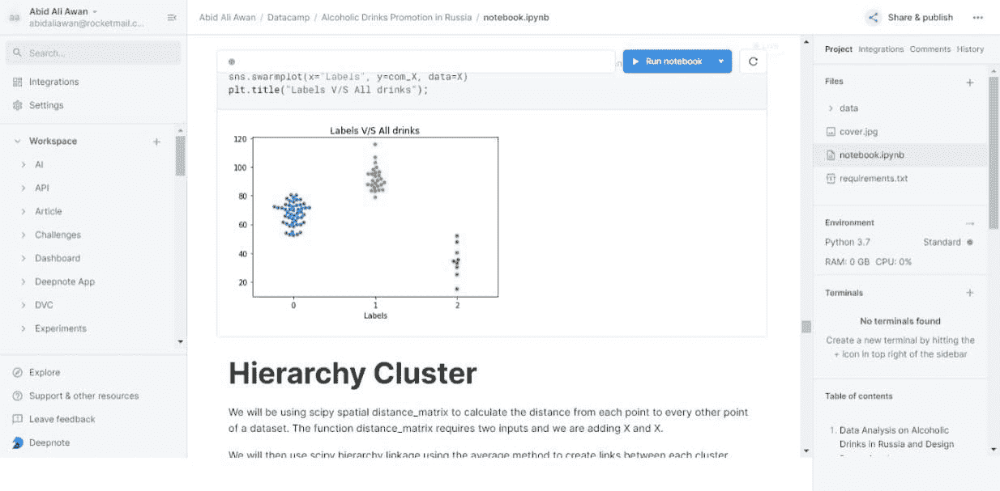
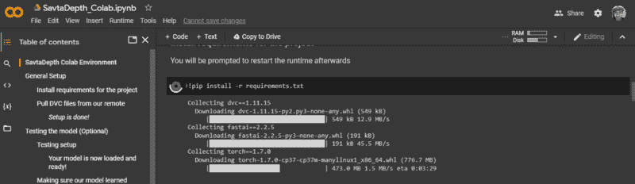
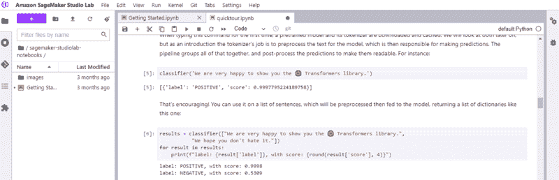
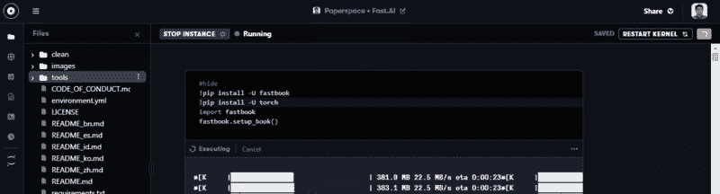
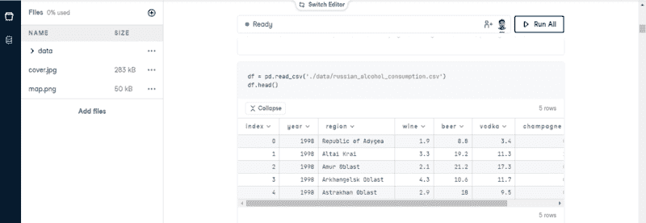

# 2022 年五大免费云笔记本

> 原文：[`www.kdnuggets.com/2022/04/top-5-free-cloud-notebooks-2022.html`](https://www.kdnuggets.com/2022/04/top-5-free-cloud-notebooks-2022.html)

图片由作者提供

我将分享我使用最佳云笔记本的经验，并解释它们为何排名前五。云集成开发环境（IDE）或云 Jupyter 笔记本改变了我对数据科学项目工作的整个看法。这些平台配备了预装的 Python 或 R 软件包，对大多数项目非常有用，几秒钟内你就可以开始工作。

* * *

## 我们的前三课程推荐

 1\. [谷歌网络安全证书](https://www.kdnuggets.com/google-cybersecurity) - 快速进入网络安全职业生涯。

 2\. [谷歌数据分析专业证书](https://www.kdnuggets.com/google-data-analytics) - 提升你的数据分析能力

 3\. [谷歌 IT 支持专业证书](https://www.kdnuggets.com/google-itsupport) - 支持你组织的 IT 工作

* * *

在我的笔记本电脑上启动 VSCode 通常需要更多时间，然后我还需要安装缺失的软件包。除了免费的计算资源和预构建环境，云笔记本平台还提供了第三方工具集成、协作和发布选项。在这篇博客中，我们将深入探讨五大云笔记本的最佳功能，以及如何利用它们来改善你当前的数据科学开发环境。

# 1\. Kaggle

图片来自 [Kaggle](https://www.kaggle.com/)

[Kaggle](https://www.kaggle.com/) 提供了一个完整的数据科学和机器学习生态系统。该平台互动性强，由社区驱动，学生和专业人士通过上传数据集、创建笔记本、分享想法和参与竞赛来贡献内容。Kaggle 还提供每周免费无限制的 CPU、30 小时 GPU 和 20 小时 TPU。除此之外，他们还提供无限的公共数据存储和 100 GB 的私人数据存储。Kaggle 是在机器学习项目中进行实验和分享解决方案的**终极工具**。

**功能**

+   免费的 CPU、GPU 和 TPU

+   免费存储

+   定时运行的笔记本

+   开源数据集和笔记本

+   Python & R

+   谷歌云集成

+   版本控制

# 2\. Deepnote

图片来自 [Deepnote](https://deepnote.com)

[Deepnote](https://deepnote.com/) 是我喜爱的工具。我在上面完成所有工作任务。它是任何类型的数据科学项目的最佳云笔记本平台。我将它排在第二，因为该平台仅提供免费的 CPU。Kaggle 和 Deepnote 都在不断改善 UI 和添加功能，因此我很难决定第一个。Deepnote 是一个基于项目的笔记本平台，提供多种数据库集成和各种关键功能以改善用户体验。你可以在数据科学项目上进行实验，创建自定义环境，实时协作，并发布你的工作。Deepnote 是你所有数据科学项目的一站式服务。

**特点**

+   免费 CPU 和存储

+   计划中的笔记本运行

+   Python、R 和自定义环境

+   数据库集成

+   用于运行 Streamlit、Tensorboard 等的 Web 服务器

+   实时协作

+   发布和共享笔记本

+   笔记本单元到 Web 应用

+   版本控制

# 3. Google Colab

图片来自[Colab](https://colab.research.google.com/)

[Google Colab](https://colab.research.google.com/) 在机器学习研究者和数据科学家中非常受欢迎。它简单且提供免费的 GPU 和 TPU。我使用 Colab 进行快速代码运行或尝试其他人的研究工作。大多数代码库或研究论文附有 Google Colab 的链接以测试和验证结果。我认为简单性和强大的计算能力使它非常吸引人，适合人们共享和实验机器学习项目。你获得临时存储、免费的但不可靠的 GPU 和 TPU，以及与 Google 云产品（如 Drive）的集成。

**特点**

+   免费 CPU、GPU 和 TPU

+   免费临时存储

+   仅支持 Python

+   Google 云集成

+   改进的 Jupyter UI

+   快速加载

# 4. 亚马逊 SageMaker Studio Lab

图片来自[Studiolab](https://studiolab.sagemaker.aws/)

亚马逊 SageMaker [Studio Lab](https://studiolab.sagemaker.aws/) 是一个新的竞争者，它是一款高质量的产品。该平台非常容易使用。每个会话提供 12 小时的免费 CPU 和 4 小时的 GPU。Studio Lab 的架构和界面基于亚马逊 SageMaker Studio，但功能有限。你只能获得免费的计算、存储以及 Jupyter lab 及其扩展的所有功能。

**特点**

+   免费 CPU 和 GPU

+   免费有限存储

+   仅支持 Python 和自定义环境

+   快速简洁的 UI

+   Jupyter 扩展

+   高内存

+   教育内容

# 5. Paperspace Gradient

图片来自[Gradient](https://gradient.run/)

[Gradient](https://gradient.run/) 由 Paperspace 提供，是一个专注于机器学习领域的云平台。它提供端到端的 MLOps 解决方案，包括模型和数据存储、部署解决方案和监控。它还提供免费 CPU 和 GPU 用于笔记本。用户界面相当美观且易于导航。为什么排在第 5 位？因为 GPU 大部分时间不可用，用户界面有 Bug 且较慢。还有一些其他平台免费提供的付费功能。Gradient 具有成为市场领导者的巨大潜力，但由于更新和开发较慢，仍在滞后。

**功能**

+   免费 CPU 和 GPU

+   免费有限存储

+   仅限 Python 环境

+   现代用户界面

+   版本控制有限

+   端到端机器学习解决方案

# 附加信息

来源于 [DataCamp 工作区](https://app.datacamp.com/workspace) 的图片

DataCamp [工作区](https://app.datacamp.com/workspace)是云笔记本市场中的另一位新竞争者。它具有交互性，并提供所有 Jupyter 笔记本的功能。你仅限于使用 CPU，但 90% 的数据科学项目只需要 CPU。工作区是 DataCamp 课程生态系统的一部分，你可以在这里进行教程项目并参加比赛。该平台还允许你创建个人资料，并以文章的形式分享你的笔记本。我是 DataCamp 的忠实粉丝，我认为未来工作区由于其简单性和与其他 DataCamp 产品的集成，将跻身前五名。

**功能**

+   免费 CPU

+   免费有限存储

+   交互式用户界面

+   分享与发布

+   与 DataCamp 集成

+   集成了 Git、数据集和模板

**[Abid Ali Awan](https://www.polywork.com/kingabzpro)** ([@1abidaliawan](https://twitter.com/1abidaliawan)) 是一位认证的数据科学专业人士，热衷于构建机器学习模型。目前，他专注于内容创作和撰写关于机器学习和数据科学技术的技术博客。Abid 拥有技术管理硕士学位和电信工程学士学位。他的愿景是使用图神经网络为挣扎于心理疾病的学生构建一个 AI 产品。

### 更多相关话题

+   [数据科学的 7 个最佳免费云笔记本](https://www.kdnuggets.com/top-7-free-cloud-notebooks-for-data-science)

+   [Anaconda 新品！数据科学培训与云托管笔记本](https://www.kdnuggets.com/2022/11/anaconda-new-anaconda-data-science-training-cloud-hosted-notebooks.html)

+   [云机器学习展望：2021 年的惊喜与 2022 年的预测](https://www.kdnuggets.com/2021/12/cloud-ml-perspective-surprises-2021-projections-2022.html)

+   [迁移到 AWS 云的 11 个最佳实践](https://www.kdnuggets.com/2023/04/11-best-practices-cloud-data-migration-aws-cloud.html)

+   [2022 年 ODSC 东部大会上的 15 场热门 MLOps 讲座，免费访问](https://www.kdnuggets.com/2022/04/odsc-15-trending-mlops-talks-access-free-odsc-east-2022.html)

+   [2022 年特征存储峰会：关于特征工程的免费会议](https://www.kdnuggets.com/2022/10/hopsworks-feature-store-summit-2022-free-conference-feature-engineering.html)
