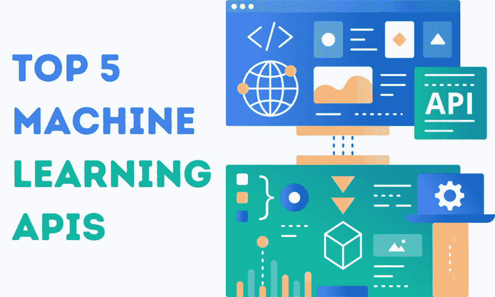

# 机器学习从业者应了解的前五大 API

> 原文：[`www.kdnuggets.com/top-5-machine-learning-apis-practitioners-should-know`](https://www.kdnuggets.com/top-5-machine-learning-apis-practitioners-should-know)

作者图片 | Canva

API，即应用程序编程接口，是一组规则和协议，使不同的软件或网络应用能够互相通信和交互，类似于蓝牙连接两个手机进行数据共享和消息传递。

* * *

## 我们的前三大课程推荐

 1\. [谷歌网络安全证书](https://www.kdnuggets.com/google-cybersecurity) - 快速进入网络安全职业。

 2\. [谷歌数据分析专业证书](https://www.kdnuggets.com/google-data-analytics) - 提升你的数据分析技能

 3\. [谷歌 IT 支持专业证书](https://www.kdnuggets.com/google-itsupport) - 支持你的组织的 IT 部门

* * *

在这篇博客中，我们将探讨前五大 API，这些 API 可以显著简化机器学习工程师的工作，使他们的工作流程更加顺畅，从而快速而无缝地构建 AI 应用。

## 1\. OpenAI API

[OpenAI](https://platform.openai.com/docs/api-reference/introduction) API 是最受欢迎的机器学习 API 之一。只需支付少量费用，你就可以访问最先进的大型语言模型，如 GPT-4o，以及嵌入、图像生成、文本到语音、语音到文本和内容审查模型。通过 OpenAI API，你可以创建自己的高质量 AI 应用，甚至围绕它建立一家初创公司。然而，使用 OpenAI API 可能会面临两个潜在问题。首先是隐私问题，其次是使用这些模型的成本可能迅速累积，尤其是当你试图围绕它建立公司时。这可能会减少你的扩展利润空间。这时候，其他 API 就显得尤为重要。

## 2\. Kaggle API

[Kaggle](https://www.kaggle.com/docs/api) API 允许你创建自己的模型。这意味着你可以用它来下载数据集和模型，然后使用免费的 GPU 来训练你的模型。所有操作都可以通过 Kaggle 命令行工具完成，真是太棒了。你甚至可以使用 API 保存你微调过的模型、笔记本和数据集。大多数问题都可以通过 Kaggle API 解决。如果你是机器学习领域的专家，还可以利用这个 API 参加竞赛。

## 3\. Hugging Face API

[Hugging Face](https://huggingface.co/docs/hub/api) API 是机器学习工程师和研究人员广泛使用的 API。它允许你下载数据集、模型、代码库和空间。它速度快，并且提供了大量自定义选项以下载数据集。此外，你可以使用它创建 Hugging Face Hub 代码库，保存和分享你的模型，开发和发布机器学习 Web 应用程序，并通过支持 GPU 的端点部署机器学习模型。大多数人将其与 Transformers 库一起使用，使得人们只需几行代码即可微调大型机器学习模型。

## 4\. ElevenLabs API

如果你正在寻找一个前沿的声音生成、语音转文本和语音转语音的解决方案，[ElevenLabs](https://elevenlabs.io/docs/introduction) API 是最佳选择。他们提供自然的声音，为你的产品注入生命。此外，该 API 包括语音克隆、流式传输、异步功能，并支持 29 种语言和 100 多种口音。你甚至可以使用文本生成声音效果。你可以跳过训练自己的模型并追求完美的步骤，直接集成 ElevenLabs API。

## 5\. StabilityAI API

我们已经了解了音频生成 API，现在我们将学习一种名为 [Stability AI](https://platform.stability.ai/docs/getting-started/stable-image) 的图像生成 API。该 API 可以使用最新的 Stable Diffusion 3 模型生成高质量的 4K 图像。此外，它还可以用来放大和编辑图像，并通过草图、结构和风格进行控制。Stable Fast 3D 模型允许你使用 2D 图像生成 3D 资产。Stability API 的一个最佳功能是，它允许你使用文本提示生成高度逼真的视频。

## 结论

通过使用机器学习 API，你可以轻松构建、保存和部署生产就绪的 AI 应用程序。这些 API 简化了流程，通过连接各种应用程序，让你可以专注于开发而不是基础设施。从头开始训练自己的机器学习模型变得越来越不常见，因为专业人士越来越依赖 API 来进行模型集成或使用 Hugging Face 生态系统微调现有模型。

在这篇博客中，我们探索了可以帮助你生成文本、图像和音频的 API。此外，你还可以从 Kaggle 和 Hugging Face 等平台获得广泛的数据、模型和代码资源，使得开发复杂的机器学习应用程序比以往更容易。

****[Abid Ali Awan](https://www.polywork.com/kingabzpro)**** ([@1abidaliawan](https://www.linkedin.com/in/1abidaliawan)) 是一位认证的数据科学专业人士，热爱构建机器学习模型。目前，他专注于内容创作，并撰写关于机器学习和数据科学技术的技术博客。Abid 拥有技术管理硕士学位和电信工程学士学位。他的愿景是利用图神经网络为那些面临心理健康问题的学生打造一个人工智能产品。

### 更多相关内容

+   [KDnuggets 新闻，4 月 13 日：数据科学家应关注的 Python 库……](https://www.kdnuggets.com/2022/n15.html)

+   [NLP 从业者的 5 门语言学课程](https://www.kdnuggets.com/2022/11/5-linguistics-courses-nlp-practitioners.html)

+   [SAS 如何助力从业者职业发展](https://www.kdnuggets.com/2023/07/sas-help-catapult-practitioners-careers.html)

+   [LLM 手册：从业者的策略和技巧](https://www.kdnuggets.com/llm-handbook-strategies-and-techniques-for-practitioners)

+   [每位机器学习工程师都应掌握的 5 项机器学习技能……](https://www.kdnuggets.com/2023/03/5-machine-learning-skills-every-machine-learning-engineer-know-2023.html)

+   [FastAPI 教程：用 Python 快速构建 API](https://www.kdnuggets.com/fastapi-tutorial-build-apis-with-python-in-minutes)
