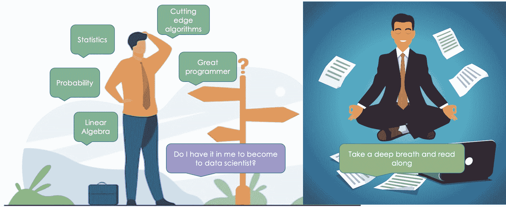

# 避免从事数据科学职业的 5 大理由

> 原文：[`www.kdnuggets.com/2022/04/top-5-reasons-avoid-data-science-career.html`](https://www.kdnuggets.com/2022/04/top-5-reasons-avoid-data-science-career.html)

我们都目睹了数据科学是 21 世纪最性感工作的经典声明。

谁不想获得这样一种特权：确保每个人的金融交易无欺诈，让用户知道他们接下来想观看的是什么视频，并拯救这个世界免于崩溃呢？

数据科学不仅是一个听起来非常酷的工作，而且也是一个非常有回报的职业。因此，这个职业所需的技能必定有些特别。当我说你应该仔细规划数据科学职业时，我绝不是在贬低你学习统计学、概率论、线性代数和最前沿算法的能力。哦，我怎么能忘记编码技能的效率以及在人工智能领域突破的新事物上保持领先。

你可能在上述看似简单的技能清单中是专家，但仍可能无法在数据科学领域取得引人注目的职业成就。

每个人都是天才，但正如爱因斯坦所说：

> 如果你用鱼的爬树能力来评判它，它将一辈子相信自己很笨。

因此，这篇文章的目的是让你在进入数据科学这个闪亮的大世界之前，对典型数据科学家的性格特征有一个现实检查。

在避免对每个人在数据科学中取得巨大成功的能力进行泛化，并让他们争取一线机会的同时，本文旨在让你在跨入这一领域之前，提前评估自己是否已经做好准备。

来源：[freepik pic1](https://www.freepik.com/free-vector/pensive-businessman-making-decision_7732656.htm#query=confused&position=7&from_view=keyword) 和 [freepik pic2](https://www.freepik.com/free-vector/young-businessman-levitating-yoga-position_1311241.htm#query=calm&position=40&from_view=keyword)

**来吧。**

# 1\. 工作中的学习

你是否也觉得你在本科阶段学到的内容与实际工作中的内容之间存在巨大的差距？我个人确实有这种感觉。学习理论在数据科学中是不够的——你可能在 Kaggle 上进行了大量的 Titanic 练习，并在精心准备的数据上建立了情感分析。但在实际项目中工作则完全是另一回事。没有人会要求或建议你去构建完成特定项目所需的多项技能之一——你需要在工作中学习并完成任务。老兵们总是关注前沿的先进算法以及现有算法的优缺点。他们不会等待合适的机会敲响他们的门来戴上眼镜熬夜工作。基本上，他们从不陷入“我无所不知”的舒适区。

来源：由 makyzz 创建的背景矢量 - www.freepik.com

# 2\. 挫折

你是否期望在第一次尝试时就能命中靶心并建立一个高度准确的模型？在通过改进 ML 流水线中的多个步骤来迭代模型时，你是否感到沮丧？

+   这可能涉及回到正确的数据收集，收集正确的代表性样本，以不仅用于训练，还用于推理。

+   如果你曾遭遇过错误标签，那么修正标签的责任在于你自己。

+   科学度量如精度、召回率或 RMSE 对于业务关注度最小。将科学数字转化为业务 KPI 并在你的工作中找到价值的责任在于你。

+   数据分布与训练集中的数据分布不同——欢迎进入数据漂移问题的套件。你需要找出何时以及用什么数据重新训练你的模型，以继续获得其回报。

+   你的旅程并未因生产中的一个体面的模型而结束，你需要花费时间记录你构建该模型的所有工作——谁告诉你数据科学是一个人的工作。成功需要一支团队的协作，而这支团队需要你提供的文档来保持一致。

+   在你获得向高管展示结果的荣耀之前，你需要不断重复你的解决方案和结果，以获得技术小组和管理层的批准。虽然这可以确保你的模型在早期接受审查，但有时这会有点困难，需要强大的耐力来应对重复的演示。

来源：由 freepik 创建的人物矢量 - www.freepik.com</a>

# 3\. 自我驱动

你是等待他人指示进行特定分析，还是足够有机会主义和好奇心来关联对业务最有利的事物，并提出改进投资回报率的好点子？你是否需要同行和经理的帮助和验证来确保你做得对，还是对自己的假设和分析有足够的信心？当大量数据摆在你面前时，很难知道从何开始——但那些不怕在数据中动手的人最终也会带回一大笔薪水，玩笑而已。

# 4\. 每个企业都是不同的

如果一个组织拥有领域专家型的数据科学家，那他们真是幸运。我曾经在领域内坚持了一段时间，直到我意识到这限制了我的潜力，并限制了我可以在普遍层面上做出的贡献。

放弃领域标签的决定对我的职业发展至关重要。此外，你需要学习各种特定于组织的工具，因此灵活性是关键。检查一下你是否足够灵活以加入数据科学家的队伍。

# 5\. 一切都关于实验

数据科学和实验是类似的。在对利益相关者喊出“尤里卡”之前，你需要尝试多种方法。你是否能够在经历多次失败后仍保持高容忍度，依然坚韧地以全新的视角看待业务问题？

通常，大多数数据科学家在 99%的时间里都失败了，但仍然能从剩下的 1%的尝试中创造出成功而稳健的解决方案。这一切都在于不断尝试。

移动指针所需的时间，即在构建机器学习模型时向前迈出一步，是非常疲惫和耗费精力的。

哦，还有人告诉你数据科学家将 80%的时间花在收集、清理和转换数据以使其“适合机器学习”，而只有 20%的时间用于实际的模型构建和分析。我敢打赌他们是这样说的。

你需要适应数据科学项目的迭代性质，并从容应对，否则在数据科学行业中生存下来将变得非常困难，更不用说繁荣发展了。

# 我的两分钱意见

我经常被问到——数据科学家做什么？这篇文章是我在行业中的第一手经验的汇编，同时也是对初入数据科学领域的人的指导。希望它能帮助你一窥真实的行业经验，并为你未来的挑战做好准备。

**[Vidhi Chugh](https://vidhi-chugh.medium.com/)** 是一位获奖的 AI/ML 创新领袖和 AI 伦理学家。她在数据科学、产品和研究的交汇处工作，以提供商业价值和洞察力。她是数据中心科学的倡导者，也是数据治理领域的领先专家，致力于构建值得信赖的 AI 解决方案。

### 更多相关话题

+   [你为何应使用线性回归模型而不是…的 3 个理由](https://www.kdnuggets.com/2021/08/3-reasons-linear-regression-instead-neural-networks.html)

+   [你为何应该获得认证的 5 个理由](https://www.kdnuggets.com/2023/05/sas-5-reasons-get-certified.html)

+   [数据科学家为何应使用 LightGBM 的 3 个理由](https://www.kdnuggets.com/2022/01/data-scientists-reasons-lightgbm.html)

+   [你为何难以找到数据科学工作的 7 个原因](https://www.kdnuggets.com/7-reasons-why-youre-struggling-to-land-a-data-science-job)

+   [你为何需要合成数据的 5 个理由](https://www.kdnuggets.com/2023/02/5-reasons-need-synthetic-data.html)

+   [你为何不应该成为数据科学家的 7 个理由](https://www.kdnuggets.com/7-reasons-why-you-shouldnt-become-a-data-scientist)
