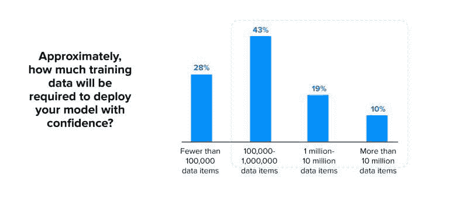

# 机器学习项目失败的 5 个主要原因

> 原文：[`www.kdnuggets.com/2021/01/top-5-reasons-why-machine-learning-projects-fail.html`](https://www.kdnuggets.com/2021/01/top-5-reasons-why-machine-learning-projects-fail.html)

评论

**作者 [Sudeep Srivastava](https://appinventiv.com/)，Appinventiv 首席执行官**

* * *

## 我们的三大课程推荐

 1\. [谷歌网络安全证书](https://www.kdnuggets.com/google-cybersecurity) - 快速进入网络安全职业生涯。

 2\. [谷歌数据分析专业证书](https://www.kdnuggets.com/google-data-analytics) - 提升你的数据分析技能

 3\. [谷歌 IT 支持专业证书](https://www.kdnuggets.com/google-itsupport) - 支持你的组织的 IT 需求

* * *

随着每份趋势报告将机器学习吹捧为有助于增长的技术，能够使各行业（跨部门和区域）对客户和收入更加友好，组织们也在效仿，并加倍努力采用机器学习。

尽管[机器学习应用开发项目](https://appinventiv.com/blog/machine-learning-app-development/)的数量明显增加，但项目失败的数量也几乎相等。机器学习项目失败率的增加在许多方面使得拥有出色 AI 想法的新企业避免实施这些想法。

我们今天文章的意图是帮助你了解机器学习项目失败的许多原因。我们希望这些信息能帮助你规划一个更好的实施方案，从而在机器学习执行的三个阶段：项目前期、项目实施期间和项目后期，降低失败的几率。

### **机器学习项目失败的主要原因**

**1\. 数据不足**

如果图表能告诉你什么，那就是成功的机器学习项目需要大量的数据。为了成功的机器学习项目，企业需要访问干净的数据——相关、有用、无误差且易于访问的数据。

除了拥有干净、结构化的数据外，数据还必须在一个地方——数据仓库、数据湖或某个数据平台——中随时可用，以便进行短期任务和大规模培训。

**2\. 机器学习模型与遗留系统不同步**

根据数据科学家的建议，组织往往会添加旨在促进创新的模型，却没有考虑它们与现有“非数字化”文化和遗留系统的契合度。因此，尽管这些解决方案在市场上运行良好，但当与现有系统结合时，采纳的成功率几乎为零。

解决方案在于将从事机器学习项目的团队与管理遗留系统的团队汇聚在一起。随后，应规划项目的里程碑式部署，以帮助实现无摩擦的迁移和轻松采纳。

**3\. 数据科学家不足**

市场上数据科学家严重短缺。虽然有很多工程师完成课程并自称为数据科学家，但真正具备深入分析复杂机器学习项目的技能的人极其有限。根据[2020 年企业机器学习状况报告](https://info.algorithmia.com/2020?utm_medium=blog&utm_source=blog&utm_campaign=IC-1912-2020-State-of-ML)，虽然对机器学习专家的需求持续上升，但在填补这一角色方面的供应却急剧短缺。

**4\. 更新困难**

随着时间的推移，机器学习项目往往会过时，无法继续作为解决业务问题的最佳方案。这通常发生在以下情况：

+   业务情况发生变化

+   用户需求的转变

+   更好的模型不断进入市场。

通常，更新现有机器学习模型既困难又耗时：在许多方面，它等同于建立一个新的数据科学项目。鉴于这些困难，组织通常倾向于继续使用该模型，直到它不再提供结果之后才停止。

**5\. 缺乏领导的支持**

有时，领导者缺乏完成机器学习项目所需的耐心和技术信心。虽然他们支持该项目，因为其周围的声望，但他们却很少关注数据的可访问性、准确性、资金和人力资源需求等方面。

要使机器学习项目成功，[确保所有人参与](https://tdan.com/how-to-convince-stakeholders-that-data-governance-is-necessary/26933) —— 尤其是董事会成员 —— 是非常重要的，因为即使是他们的一个怀疑也可能导致团队的不安，这会在项目启动之前就注定失败。

### **离别的话**

以上就是阻碍机器学习达到企业和行业所需采纳水平的主要挑战。

解决这些挑战的方案通常在于与一个了解新一代技术在非数字化组织中应用的商业和技术影响的熟练机器学习解决方案提供商合作。他们不仅可以帮助你制定如何整合机器学习项目的工作计划，还可以以最优化的方式采用新系统。

**个人简介：[Sudeep Srivastava](https://appinventiv.com/)** 是 Appinventiv 的首席执行官，他以乐观与计算风险的完美结合而闻名，这种特质贯穿于 Appinventiv 的每一个工作流程中。通过建立一个在移动行业中开拓新思路的品牌，他花时间探索如何将 Appinventiv 推向技术与生活融合的巅峰。

**相关：**

+   当良好的数据分析未能交付预期结果时

+   学习构建一个端到端的数据科学项目

+   想成为数据科学家？不要从机器学习开始

### 相关阅读

+   [调查：机器学习项目仍然经常失败部署](https://www.kdnuggets.com/survey-machine-learning-projects-still-routinely-fail-to-deploy)

+   [为什么大多数人无法学会编程？](https://www.kdnuggets.com/2022/03/people-fail-learn-programming.html)

+   [你不应该使用机器学习的 4 个理由](https://www.kdnuggets.com/2021/12/4-reasons-shouldnt-machine-learning.html)

+   [避免数据科学职业的前 5 个理由](https://www.kdnuggets.com/2022/04/top-5-reasons-avoid-data-science-career.html)

+   [通用语义层对你的数据堆栈有何好处的 6 个理由](https://www.kdnuggets.com/2024/01/cube-6-reasons-why-a-universal-semantic-layer-is-beneficial)

+   [为什么你应该使用线性回归模型而不是…的 3 个理由](https://www.kdnuggets.com/2021/08/3-reasons-linear-regression-instead-neural-networks.html)
