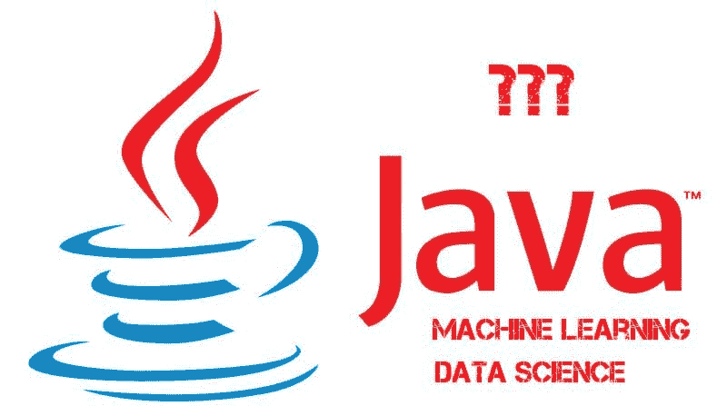

# 数据科学家应该了解 Java 的 6 个主要理由

> 原文：[`www.kdnuggets.com/2020/06/top-6-reasons-data-scientists-know-java.html`](https://www.kdnuggets.com/2020/06/top-6-reasons-data-scientists-know-java.html)

评论

**由 Malcom Ridgers，[BairesDev](https://www.bairesdev.com/)**

* * *

## 我们的前三课程推荐

 1\. [谷歌网络安全证书](https://www.kdnuggets.com/google-cybersecurity) - 快速进入网络安全职业轨道。

 2\. [谷歌数据分析专业证书](https://www.kdnuggets.com/google-data-analytics) - 提升你的数据分析技能

 3\. [谷歌 IT 支持专业证书](https://www.kdnuggets.com/google-itsupport) - 支持你的组织 IT

* * *

[Java 是当今最受需求的编程语言之一](https://towardsdatascience.com/top-10-in-demand-programming-languages-to-learn-in-2020-4462eb7d8d3e?)。它是一种跨平台、实用且强大的语言。全球的开发者使用 Java 构建应用程序、网络工具和软件开发平台。Java 在机器学习和数据科学中也有重要用途。

如果你是数据科学家，你可能比起 Java 更常使用 Python 和 R。根据最近的调查，[只有 21%的人在数据科学中使用 Java，](http://businessoverbroadway.com/wp-content/uploads/2019/01/programming_languages_used.png) 远低于 Python（83%）或 SQL（44%）。大多数人使用 Python 是因为它的 REPL 功能和快速的算法实验。同时，开发者使用 R 进行数据可视化和表示。

作为数据科学家，你应该知道如何使用 Java，因为它提供了创建商业应用程序的各种服务。如上所述，Java 在机器学习和人工智能领域有许多用途。许多大型公司如 Uber、Spotify 和 Airbnb 都是基于 Java 的。[像 BairesDev 这样的软件开发公司](https://www.bairesdev.com/technologies/java-development-services/?utm_source=kdnuggets&utm_medium=link&utm_campaign=content&utm_content=top) 使用 Java 构建和维护业务关键应用程序。

数据科学家应该学习 Java 的理由有很多。主要包括：

**1\. Java 拥有许多出色的数据科学框架。** 这些框架为开发者提供了基本功能，并帮助他们节省时间和金钱。流行的机器学习框架包括：

+   Deeplearning4J - 这是一个开源的 Java 深度学习工具包，用于部署神经网络。它可以与 Hadoop 和 Spark 集成。

+   ND4J - 它代表 N 维数组对象用于 Java。它是一个科学计算、信号处理和线性代数的工具包。它具有内置的库，如 numpy 和 MATLAB。

+   Apache Mahout - 这是一个可扩展的分布式代数框架。它有助于分类、聚类和推荐。

Java 也有许多用于数据处理的框架，包括：

+   Hadoop - 这个框架使用 MapReduce 算法在分布式文件系统中存储数据。

+   Kafka - 它使用基于 TCP 的协议进行消息集合抽象，以自然地将消息分组形成线性写入。

**2\. Java 易于理解。** 大多数开发者在使用 Java 编码时感到自信。除了拥有广泛的用户基础外，Java 还是市场上最受追捧的技能之一，因为公司通常使用它来处理所有快速执行的项目。Java 还是一种遗留语言——即它在全球许多主要应用程序和公司中被使用。

**3\. [Java 具有出色的可扩展性。](https://towardsdatascience.com/a-summary-of-the-advanced-data-science-with-ibm-specialization-1-4-5caf48c011df)** 大多数开发者使用 Java 创建可以根据业务需求进行扩展的应用程序。如果你的公司正在从零开始构建应用程序，Java 是一个优秀的选择，因为 Java 提供了向上扩展和向外扩展的功能以及负载均衡选项。

作为数据科学家，你会发现用 Java 构建复杂应用程序并扩展它们很容易；例如，ApacheSpark 是一个可以用于扩展的分析工具。它也可以用于构建多线程应用程序。

**4\. Java 具有独特的语法。** Java 的独特语法因其易于理解而在全球范围内被接受。这种语法使开发者能够理解约定、变量要求和编码方法。Java 是强类型的——即每种数据类型都已预定义在语言结构中，所有变量都必须属于某种数据类型。

大多数主要公司为其代码库维护标准的语法。这样可以确保所有开发者按照生产代码库的约定进行编码。Java 帮助他们自动维护标准约定，开发者可以遵守这些约定。

**5\. Java 运行迅速。** 大多数数据科学家使用 Python 进行数据科学应用。你会惊讶地发现，[Java 的速度比 Python 快 25 倍](https://analyticsindiamag.com/why-do-data-scientists-prefer-python-over-java/)。此外，如果你在寻找能够随时进行多重计算的应用程序，Java 的表现优于 Python。

不仅是处理速度，Java 开发在创建产品时所需的时间也比许多其他语言要少。它可以使用业务特定的开发工具，并拥有大量的 IDE 和成熟的功能来创建大规模的商业应用程序。

**6\. Java 和 OLTP 系统。** 在线事务处理系统（OLTP），与数据仓库一起，通常使用主机系统进行批处理。Java 比其他语言更自然地与这种架构结合。您可以将 Java 与 COBOL 和中间件软件集成。

您还可以将 Java 与 OLTP 标准和架构结合使用。对于那些希望投资于在大规模系统上执行数据分析且具有事务处理设计的应用程序的公司，Java 非常合适。

**结论**

Java 是一种面向对象的、功能多样且独特的语言，提供大量功能。其卓越的性能和速度使其成为市场上最受欢迎的技能之一。它还提供安全功能、网络中心编程和平台独立性。

对于数据科学家，Java 提供了一系列数据科学功能，如数据分析、数据处理、统计分析、数据可视化和 NLP。Java 可以帮助将机器学习算法应用于实际应用程序。它允许您基于批处理和流处理技术构建自适应和预测模型。加上 REPL 和 Lambda 表达式，它简化了大规模应用程序的创建。

如果您正在考虑将 Java 应用于数据科学项目，请毫不犹豫。这是一种非常适合数据科学家和数据工程师的语言。

**简介：Malcom Ridgers** 是一位专注于软件外包行业的技术专家。他掌握最新的市场动态，并对创新和技术业务的未来充满敏锐的洞察力。

**相关内容：**

+   Java 可以用于机器学习和数据科学吗？

+   AI 如何帮助管理传染病

+   如何将 Kubeflow 添加到您的 Kubernetes 部署中

### 更多相关话题

+   [数据科学家应使用 LightGBM 的 3 个理由](https://www.kdnuggets.com/2022/01/data-scientists-reasons-lightgbm.html)

+   [KDnuggets 新闻，4 月 13 日：数据科学家应该知道的 Python 库…](https://www.kdnuggets.com/2022/n15.html)

+   [您应该避免数据科学职业的 5 大理由](https://www.kdnuggets.com/2022/04/top-5-reasons-avoid-data-science-career.html)

+   [您应该使用线性回归模型而不是…的 3 个理由](https://www.kdnuggets.com/2021/08/3-reasons-linear-regression-instead-neural-networks.html)

+   [5 个您应该获取认证的理由](https://www.kdnuggets.com/2023/05/sas-5-reasons-get-certified.html)

+   [数据科学家在 2022 年应了解的 Python 库](https://www.kdnuggets.com/2022/04/python-libraries-data-scientists-know-2022.html)
