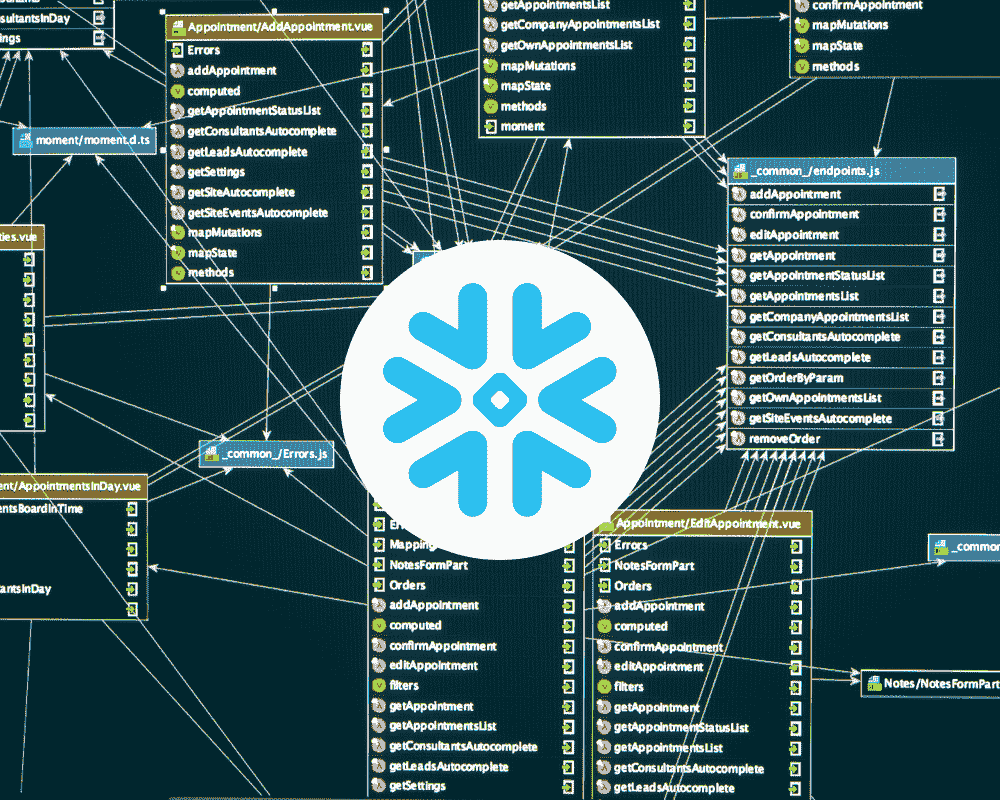
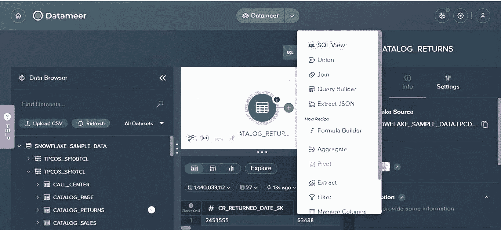
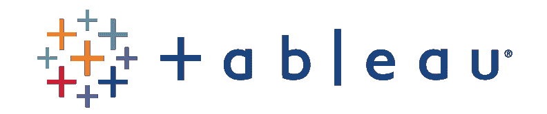
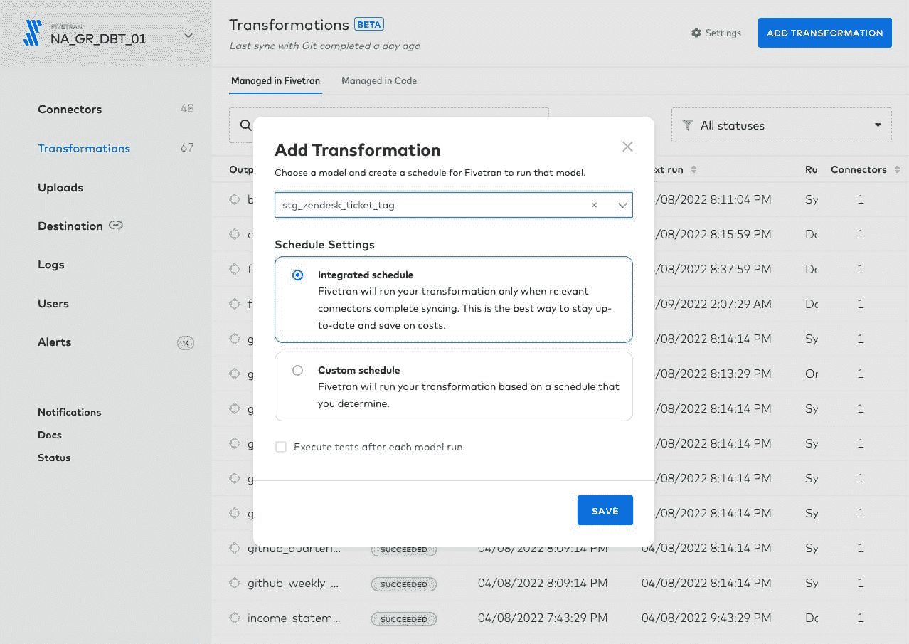
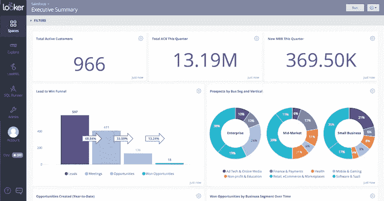
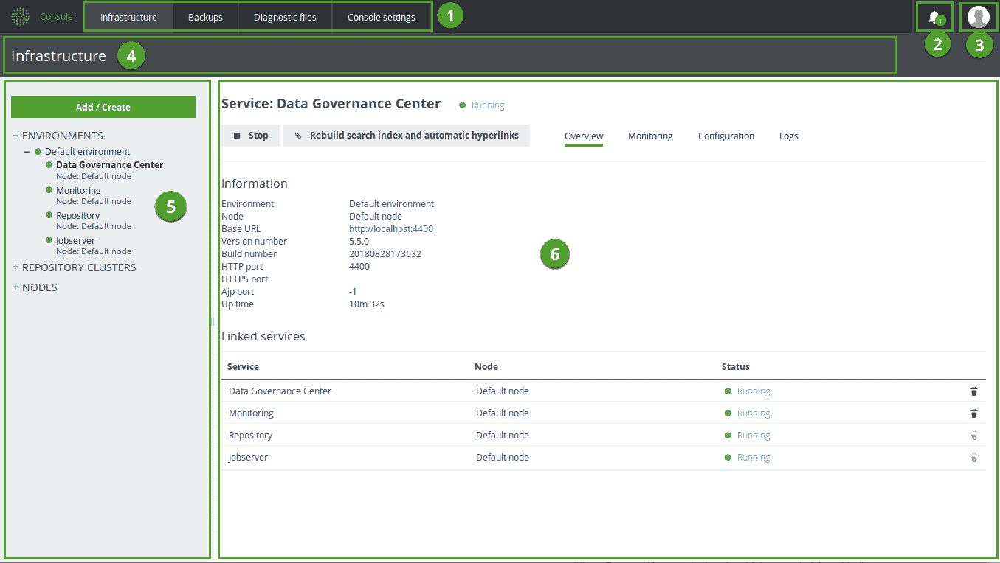
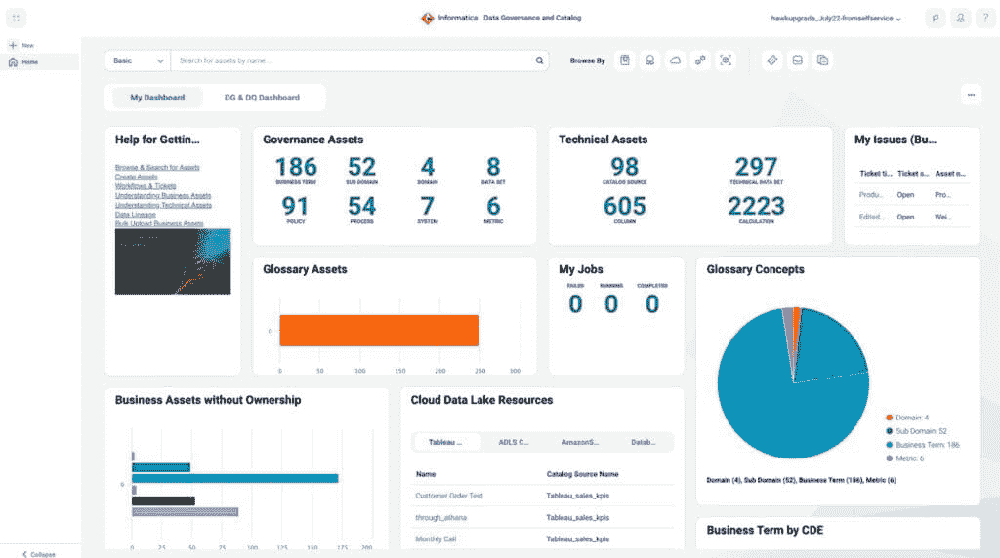

# 提高你在 Snowflake 上的生产力的 6 大工具

> 原文：[`www.kdnuggets.com/2023/08/top-6-tools-improve-productivity-snowflake.html`](https://www.kdnuggets.com/2023/08/top-6-tools-improve-productivity-snowflake.html)

编辑者提供的图片

Snowflake 彻底改变了企业存储、处理和分析数据的方式，提供了无与伦比的灵活性、可扩展性和性能。但像任何强大技术一样，为了真正利用其潜力，拥有合适的工具至关重要。

* * *

## 我们的三大课程推荐

 1\. [谷歌网络安全证书](https://www.kdnuggets.com/google-cybersecurity) - 快速进入网络安全职业生涯。

 2\. [谷歌数据分析专业证书](https://www.kdnuggets.com/google-data-analytics) - 提升你的数据分析技能

 3\. [谷歌 IT 支持专业证书](https://www.kdnuggets.com/google-itsupport) - 支持你的组织 IT

* * *

本文是你在使用 Snowflake 时提升生产力的 6 大工具指南。无论你是在处理数据、整合各种数据源、创建精美可视化还是得出可操作的见解，这些工具都能提升你的效率和效果。

因此，让我们深入探索这些能将你的 Snowflake 操作提升到新水平的生产力工具。

# 数据准备工具

## 1\. Datameer

图片来自[Datameer](https://www.datameer.com/demo-center/the-datameer-interface/)

Datameer 是一个自助数据准备工具，旨在使处理大数据变得更加可管理。它致力于简化过程并节省时间。

**特点：**

+   *数据发现：* Datameer 提供了一个可视化界面，使你更容易探索和理解数据。它的目的是将复杂的内容转变为更易于消化的形式。

+   *数据准备：* 使用 Datameer，你可以清理、转换和丰富你的数据，为分析做好准备。最棒的是，你不需要深入复杂的编码或脚本。

+   *数据探索：* Datameer 提供了一系列数据可视化工具，允许你与数据互动。其目的是快速有效地获得洞察。

+   *集成：* Datameer 可以连接到各种数据源，从传统数据库到复杂的云数据湖。它的目的是将你的所有数据集中在一个地方。

**优点：**

+   Datameer 的用户友好界面简化了数据发现、准备和探索过程。

+   其数据准备功能允许你清理、转换和丰富数据，而无需复杂的编码。

+   Datameer 能够与各种数据源集成，提供所有数据的统一视图。

**缺点：**

+   尽管 Datameer 提供了广泛的功能，但可能超出了某些小型企业的需求。

**定价：**

[Datameer 的定价](https://www.datameer.com/pricing/) 未在其网站上公开，但你可以与他们的团队安排一次快速通话，以获得满足你团队需求的个性化定价。

**使用案例：**

假设你是一家大公司的数据分析师。你处理来自各种来源的数据，包括传统数据库和复杂的基于云的数据湖。

使用 Datameer，你可以连接这些数据源，准备数据并在一个超级互动的环境中探索数据。关键在于快速获取洞察，做出推动业务前进的数据驱动决策。

视频下面讨论了 Datameer 和 Snowflake 的一些合作情况。

# 数据可视化工具

## 2\. Tableau

[Tableau](https://www.tableau.com/) 是数据可视化领域的领先工具。它直观的界面和拖放功能使其成为技术用户和非技术用户的友好选择。

[Tableau 和 Snowflake](https://www.snowflake.com/wp-content/uploads/2021/06/Best-Practices-for-Using-Tableau-With-Snowflake.pdf) 之间的无缝集成使你能够直接从 Snowflake 数据仓库提取数据，将其转化为可操作的洞察。

**关键功能：**

+   *互动仪表盘：* 通过互动仪表盘探索和理解你的数据。

+   *数据混合：* 从多个来源混合数据，以获得全面的数据视图。

+   *实时数据分析：* 基于最新的数据进行决策，具有实时分析能力。

**推荐理由：**

Tableau 的用户友好界面和强大的数据可视化能力使其成为希望实现数据访问民主化的企业的绝佳选择。其与 Snowflake 集成带来的流畅数据分析工作流程是另一个重大优点。

**定价详情：**

Tableau 提供一系列 [定价选项](https://www.tableau.com/pricing/teams-orgs)，根据你的需求，从每用户每月 70 美元的 Tableau Creator 开始。Tableau Explorer 和 Tableau Viewer 提供更少的功能，价格更低。

**学习曲线：**

尽管其界面直观，但掌握 Tableau 仍然需要一定的学习曲线。幸运的是，丰富的资源，包括 [教程、网络研讨会](https://www.tableau.com/events/webinars#f:webinars-language=[en-US]) 和强大的社区，可以帮助用户快速上手。

**社区和支持：**

Tableau 拥有一个庞大且活跃的用户社区，总是随时准备提供帮助。此外，Tableau 的客户支持也非常出色，提供了全面的知识库、实时支持和专门的支持团队。

**用例：**

各种规模和行业的企业都转向 Tableau 进行数据可视化。无论是创建交互式仪表板、执行临时分析还是生成报告，Tableau 都能满足你的需求。

# 数据集成/ETL 工具

## 3\. Fivetran

图片来自 [fivetran](https://www.fivetran.com/blog/fivetran-gives-analysts-a-new-way-to-transform-data)

Fivetran 是一个基于云的数据集成工具，专注于自动化数据管道。它旨在消除数据集成的麻烦。

**功能：**

+   *自动化数据管道：* Fivetran 负责设置、维护和扩展你的数据管道，就像有一个专属的数据管道经理。

+   *预构建连接器：* Fivetran 提供数百个预构建的连接器，使你可以轻松集成来自各种来源的数据，包括 Snowflake。

+   *数据转换：* Fivetran 支持在数据仓库内进行数据转换，允许你在数据存储位置直接转换数据。

**为何脱颖而出：**

+   Fivetran 的自动化数据管道消除了数据集成中的手动工作。

+   它的预构建连接器使得从各种来源集成数据变得简单。

+   Fivetran 对数据仓库内数据转换的支持可以提高数据处理的效率。

**注意事项：**

+   Fivetran 的高级功能可能需要初学者适应一段时间。

+   Fivetran 的成本可能成为小型组织或初创企业的障碍。

**定价：**

Fivetran 的定价是 [按使用计费](https://www.fivetran.com/pricing)，意味着你只需为每月使用的月活跃行（MAR）付费。他们为任何新的连接器提供 14 天的免费使用期，让你在承诺之前可以预测使用情况和定价。

# 商业智能工具

## 4\. Looker

图片来自 [getapp](https://www.getapp.com/business-intelligence-analytics-software/a/looker/)

Looker 是一个现代的商业智能平台，让你公司中的每个人都能从任何地方做出明智的决策。其核心是通过数据赋能用户。

**主要功能：**

+   *自助分析：* Looker 允许用户通过几次点击实时探索和发现洞察。它的目标是让数据对每个人都可访问。

+   *数据建模：* Looker 强大的数据建模层让你可以一次性定义业务指标和逻辑，然后在整个组织中一致使用这些定义。

+   *集成：* Looker 与 Snowflake 无缝集成，让你能够利用现有的数据仓库。

**你可能喜欢的原因：**

Looker 的用户友好界面和强大的数据建模能力使其成为希望民主化数据访问的企业的绝佳选择。此外，其与 Snowflake 的集成确保了顺畅的数据分析工作流程。

**定价详情：**

[Looker 的定价](https://cloud.google.com/looker/pricing) 未在其网站上具体披露，但你可以直接联系他们以获取根据你具体需求的报价。

# 数据治理工具

数据治理涉及数据的管理和保护，确保数据的可靠性、一致性和可访问性。我们在数据治理工具中寻找的理想特性包括：

+   它们应提供全面的数据治理能力，包括数据质量、主数据管理、数据隐私和数据目录。

+   它们应与其他数据平台（包括 Snowflake）无缝集成。

+   它们应易于使用，使组织能够轻松建立强大的数据治理框架。

这一类工具有很多选择。最受欢迎的包括 Collibra 和 Informatica 等。

## 5\. Collibra

图片来自 [productresources](https://productresources.collibra.com/docs/collibra/latest/Content/Console/ref_console-ui.htm)

Collibra 是一个全面的数据治理平台，提供管理、治理和理解数据的工具。它旨在帮助组织最大化数据的价值。

Collibra 以其强大的数据治理能力、用户友好的界面和广泛的集成选项（[包括 Snowflake](https://youtu.be/J6AMAlXuuZw)）脱颖而出。它是那些希望建立强大数据治理框架的组织的绝佳选择。

Collibra 的定价未在其网站上公开，但你可以 [直接联系他们](https://www.collibra.com/us/en/contact-us) 以获得根据你具体需求的报价。

## 6\. Informatica

图片来自 [firsteigen](https://firsteigen.com/blog/data-governance-tools/)

Informatica 是数据集成软件和服务的领先供应商。它提供了一套数据治理工具，旨在确保数据质量、合规性和安全性。

Informatica 结合其全面的数据治理工具套件和强大的数据集成能力，是那些希望提升数据治理的组织的强大选择。此外，它与 Snowflake 的无缝集成使你能够利用现有的数据仓库。

Informatica 更愿意 [直接与客户讨论定价](https://www.informatica.com/products/cloud-integration/pricing.html)，以提供个性化的报价。

# 结论

现在你已经了解了可以显著提升你在 Snowflake 上生产力的有用工具。这些工具是全球数据专业人士依赖的工具，用于简化工作流程，从数据中获得洞察，并推动决策制定。

但请记住，虽然这些工具都提供了很棒的功能，但考虑它们如何与 Snowflake 集成也很重要。例如，Datameer，据我所知，可以与 Snowflake 无缝集成。这是因为它是专门为 Snowflake 构建的。

探索这些工具，试用它们的功能，看看哪一款最适合你。当然，我们也很想听听你的经历。

你之前使用过这些工具吗？还有其他你非常推荐的工具吗？在评论区分享你的想法，让我们继续讨论吧！

**[Ndz Anthony](https://medium.com/@Ndz_Anthony)** 是一位资深 BI 分析师和导师。他喜欢通过与商业智能和企业分析相关的写作进行教育。

### 更多相关内容

+   [天高地迥：了解 JetBlue 如何使用 Monte Carlo 和 Snowflake…](https://www.kdnuggets.com/2022/12/monte-carlo-jetblue-snowflake-build-trust-improve-model-accuracy.html)

+   [初学者的 Snowflake 数据仓库](https://www.kdnuggets.com/2022/02/data-warehousing-snowflake-beginners.html)

+   [如何在 Snowflake 上构建流式半结构化分析平台](https://www.kdnuggets.com/2023/07/build-streaming-semistructured-analytics-platform-snowflake.html)

+   [7 款 AI 驱动的工具提升数据科学家的生产力](https://www.kdnuggets.com/2023/02/7-aipowered-tools-enhance-productivity-data-scientists.html)

+   [提升生产力的 5 款最佳 AI 工具](https://www.kdnuggets.com/the-5-best-ai-tools-for-maximizing-productivity)

+   [理解贝叶斯定理如何提升你的数据科学技能的 3 种方法](https://www.kdnuggets.com/2022/06/3-ways-understanding-bayes-theorem-improve-data-science.html)
