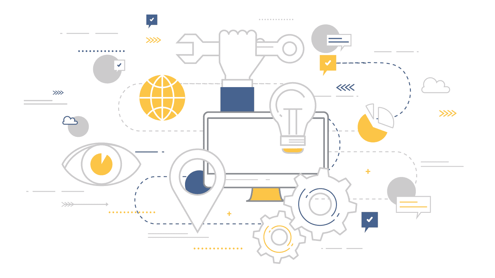
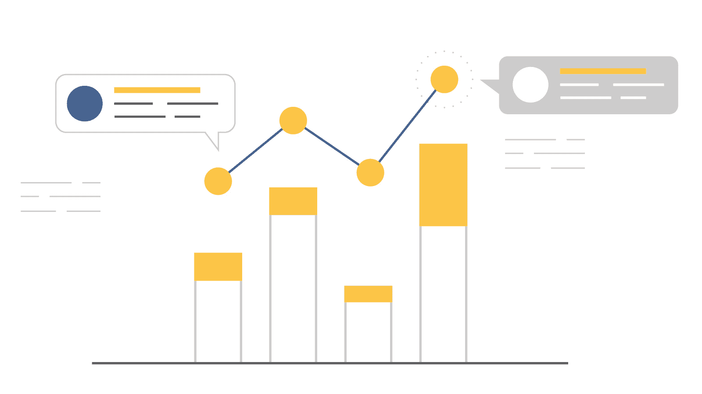

# 旅游行业的七大数据科学应用案例

> 原文：[`www.kdnuggets.com/2019/02/top-7-data-science-use-cases-travel.html`](https://www.kdnuggets.com/2019/02/top-7-data-science-use-cases-travel.html)

 评论

**由 [ActiveWizards](https://activewizards.com/) 提供**

* * *

## 我们的三大课程推荐

 1\. [Google 网络安全证书](https://www.kdnuggets.com/google-cybersecurity) - 快速进入网络安全职业生涯。

 2\. [Google 数据分析专业证书](https://www.kdnuggets.com/google-data-analytics) - 提升您的数据分析技能

 3\. [Google IT 支持专业证书](https://www.kdnuggets.com/google-itsupport) - 支持您的组织 IT 部门

* * *

数据科学为许多行业带来了新的奇妙机会。与这些可能性同时出现的还有不断变化和挑战。旅游和旅行行业也不例外。

旅游业目前正处于上升期。这可以解释为其已变得对更广泛的受众可负担得起。因此，目标市场发生了显著变化，比以往更为广泛。这不再是富裕和贵族的特权。此外，旅游和旅行已成为全球趋势。

为满足不断增长的消费者需求并处理大量数据，数据科学算法至关重要。大数据成为航空公司、酒店、预订网站等各类服务提供商在提升服务方面的关键工具。让我们探讨几个在旅游行业中广泛应用且高效的数据科学案例。

### 个性化营销和客户细分

人们在某种程度上倾向于欣赏旅行体验的个性化。客户细分意味着根据客户的偏好将所有客户分开，并调整服务堆栈以满足每个群体的需求。因此，关键思想是找到一种适用于所有情况的解决方案。个性化则是一个能够为特定人提供具体服务的技巧。因而，个性化使这一过程更加深入。

个性化营销和客户细分涉及收集用户行为和元数据、CRM 数据、地理位置数据、社交媒体数据，以统一、处理并预测用户未来的偏好。对于旅游行业而言，这些知识至关重要。

### 客户情感分析

情感分析是无监督学习的一个分支，旨在分析文本数据并识别文本中的情感元素。情感分析使公司所有者或服务提供商能够了解客户对其品牌的真实态度。对于旅行行业来说，客户评价起着重要作用。旅行者通常会阅读在各种网络平台和网站上发布的评论，并据此做出决定。这就是为什么许多现代预订网站将情感分析作为其服务包的一部分，提供给那些希望合作的旅行社、酒店和旅馆。

### 推荐引擎

一些专家常常将这种用例视为最有效和最有前景的之一。重要的旅行和预订网络平台正在积极使用推荐引擎来进行日常工作。

这些推荐通常是通过将客户的愿望和需求与现有的优惠进行匹配来提供的。一般来说，通过应用数据驱动的推荐引擎解决方案，旅行和旅游公司可以根据之前的搜索和偏好提供租赁交易、替代旅行日期、新的路线、目的地和景点。由于推荐引擎，旅行社和预订服务提供商能够向所有客户提出合适的报价。

### 路线优化

路线优化在旅行和旅游行业中扮演着重要角色。考虑到不同的目的地、时间表、工作时间和距离，旅行规划可能非常具有挑战性。这就是旅行路线优化的意义所在。

这一优化的关键目标如下：

+   旅行成本最小化

+   时间管理

+   距离最小化

因此，旅行路线优化在提升客户满意度方面发挥了重要作用。

### 旅行支持机器人

如今，旅行机器人正在真正改变旅行行业，通过提供卓越的旅行安排协助和客户支持。一个 AI 驱动的旅行机器人可以回答问题，节省用户的时间和金钱，组织旅行并建议新的访问地点。24/7 的可访问模式和多语言支持使得旅行机器人成为客户支持的最佳解决方案。

这里最重要的一点是，这些机器人不断学习，因此它们每天都变得更聪明，更有帮助。因此，聊天机器人能够解决主要的旅行和旅游任务。将机器人集成到您的网站中将非常有利。像 JetBlue、Marriott、Ryanair、Hyatt、Hipmunk、Kayak、Booking 等许多公司对此深信不疑。

### 分析

在获得竞争优势方面，公司寻求最大限度地利用大数据。在决策和行动中，旅行和旅游公司在很大程度上依赖于分析。实时分析和预测分析在旅行行业中有许多应用。

### 实时分析

实时分析在旅游业中最生动的应用之一是旅游分析。旅游预测模型可以预测特定时期和客户群体的旅行活动。它们的主要任务是识别长期和短期的新交易机会。通过分析以往客户的活动、偏好和购买，企业可以预测未来的商业扩展机会。

### 预测分析

预测分析在动态定价和公平预测中得到了应用。动态定价和公平预测的实践在旅游业并不陌生。每年，越来越多的公司采用这一技术来吸引尽可能多的客户。

众所周知，价格会随着季节、天气、供应商以及场所、座位和房间的可用性不断变化。借助智能工具，可以同时监控多个网站上的这些价格变化。自学习算法能够收集历史数据，并考虑所有外部因素来预测未来的价格走势。

例如，在酒店行业，这些算法通常用于完成以下任务：

+   避免对不需要特别促销的日期进行折扣

+   提高周末的价格

+   维护官方网站与第三方订票服务提供商之间的信息相关性。

### 结论

数据科学正在改变旅游业的面貌。它帮助旅游和旅行企业提供独特的旅行体验和高满意度，同时保持个人化的接触。近年来，数据科学已成为最有前途的技术之一，为各个行业带来了变革。它改变了我们的旅行方式和对旅行安排的态度。本文中介绍的用例只是冰山一角。通过应用数据科学和机器学习提供的各种解决方案，旅行业务可以了解客户的需求和偏好，以提供最佳的服务和优惠。

**[ActiveWizards](https://activewizards.com/)** 是一个专注于数据项目（大数据、数据科学、机器学习、数据可视化）的数据科学家和工程师团队。核心专长领域包括数据科学（研究、机器学习算法、可视化和工程）、数据可视化（d3.js、Tableau 等）、大数据工程（Hadoop、Spark、Kafka、Cassandra、HBase、MongoDB 等）和数据密集型 Web 应用程序开发（RESTful APIs、Flask、Django、Meteor）。

[原文](https://activewizards.com/blog/top-7-data-science-use-cases-in-travel/)。经许可转载。

**相关：**

+   实用的 Apache Spark 10 分钟

+   2018 年数据科学的前 20 个 Python 库

+   经理的基础数据科学简介

### 更多相关内容

+   [企业中的机器学习：使用案例与挑战](https://www.kdnuggets.com/2022/08/dss-machine-learning-enterprise-cases-challenges.html)

+   [NoSQL 数据库及其使用案例](https://www.kdnuggets.com/2023/03/nosql-databases-cases.html)

+   [DALLE-3 的 5 个使用案例](https://www.kdnuggets.com/5-use-cases-of-dalle-3)

+   [AI 和 LLM 使用案例中的向量数据库](https://www.kdnuggets.com/vector-databases-in-ai-and-llm-use-cases)

+   [为什么 TinyML 案例越来越受欢迎？](https://www.kdnuggets.com/2022/10/tinyml-cases-becoming-popular.html)

+   [KDnuggets™ 新闻 22:n06, 2 月 9 日：数据科学编程…](https://www.kdnuggets.com/2022/n06.html)
