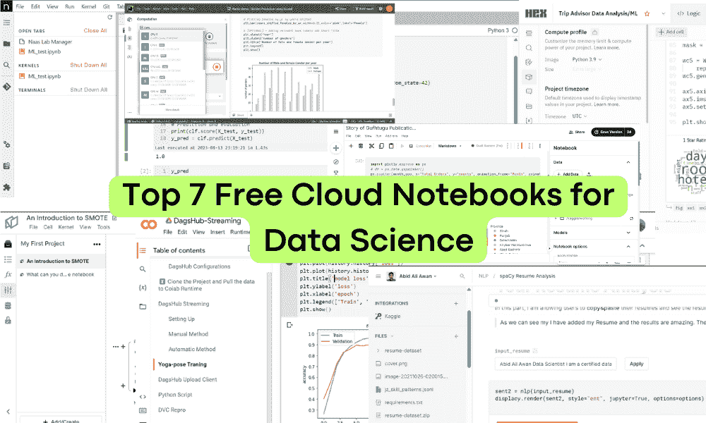
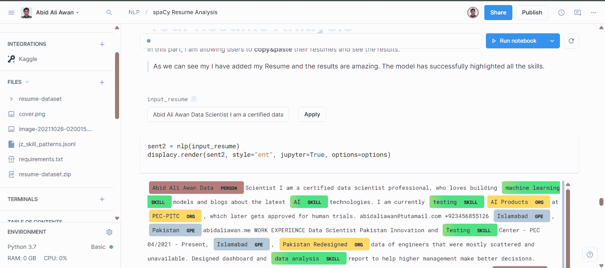
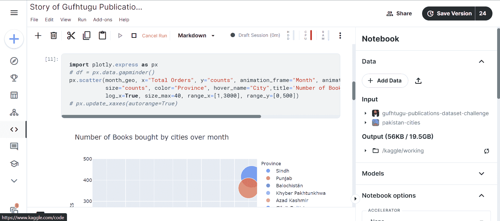
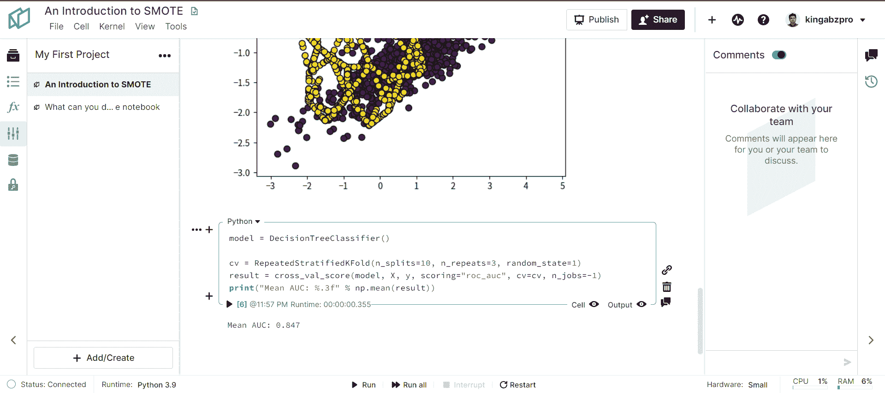
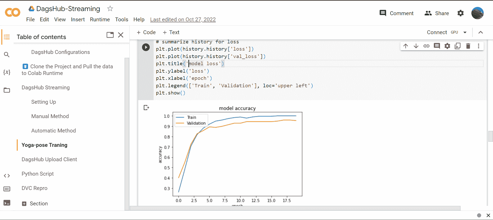
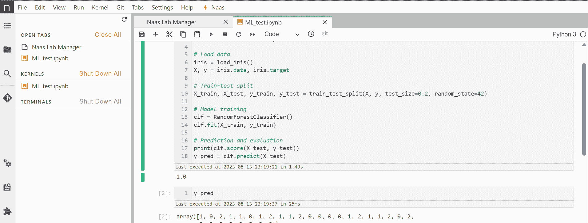
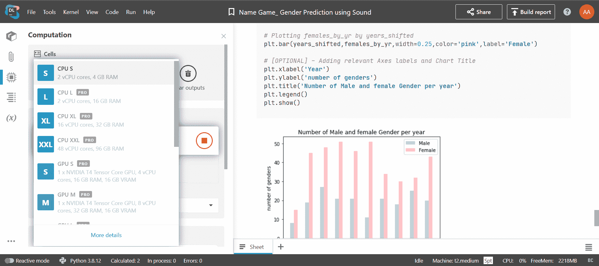

# 数据科学的七大免费云笔记本

> 原文：[`www.kdnuggets.com/top-7-free-cloud-notebooks-for-data-science`](https://www.kdnuggets.com/top-7-free-cloud-notebooks-for-data-science)

作者提供的图片

云笔记本已经成为数据科学家和分析师运行代码和生成分析报告的标准。云笔记本提供基于浏览器的界面来编写和执行代码，无需在本地安装任何东西。此外，还可以访问高端硬件以加速机器学习研究和开发。

* * *

## 我们的前三个课程推荐

 1\. [谷歌网络安全证书](https://www.kdnuggets.com/google-cybersecurity) - 快速进入网络安全职业生涯。

 2\. [谷歌数据分析专业证书](https://www.kdnuggets.com/google-data-analytics) - 提升你的数据分析技能

 3\. [谷歌 IT 支持专业证书](https://www.kdnuggets.com/google-itsupport) - 支持你的组织的 IT

* * *

云笔记本平台不仅提供免费的计算资源和预构建环境，还提供第三方工具集成、协作和发布选项。在这篇博客中，我们将深入探讨七大顶级云笔记本及其最佳功能。利用这些功能可以提升你当前的数据科学开发堆栈。

# 1\. Deepnote

[Deepnote](https://deepnote.com/) 目前位居首位。为什么？最近，他们推出了新的功能，这些功能将简化你的开发体验。我喜欢这个平台、团队和社区。此外，我在每个数据科学和机器学习项目中都使用它。

你可以在不到一分钟的时间内启动机器，并受益于预构建的开发环境。它还支持各种编程语言，你可以使用 Docker Hub 创建自己的环境。

我强烈推荐你创建一个账户并亲自体验一下。即使是非技术专业人士，也能通过 Deepnote 的 AI 功能更轻松地编写和调试代码。

作者提供的图片

# 2\. Kaggle

通过 Deepnote，[Kaggle](https://www.kaggle.com/) 今年也推出了新功能。例如，他们正在增加新的高性能 GPU、调度运行、模型的专用标签以及快速加载数据集。他们唯一需要改进的是实时协作和评论功能。

使用 Kaggle，你可以免费获得高性能的 CPU、GPU 和 TPU。此外，还可以免费获得存储空间、访问开源数据集和代码、Google Cloud 集成以及版本管理。

当我参与比赛或尝试深度学习模型时，它是我首选的平台。

再次推荐 Kaggle，因为它拥有强大的社区和高端硬件，适合你的 AI 项目。

图片来源：作者

# 3\. Hex

[Hex](https://hex.tech/)现在已经向公众开放，它是处理数据科学和分析任务的热门选择。它提供了类似 Deepnote 的功能，但由于环境加载和代码运行速度较慢，我将它排在第三。它在很多方面也有局限性。

Hex 是一个现代数据工作空间，旨在使数据处理更加轻松和协作。它允许用户连接各种数据源，包括数据库、云存储和 API。一旦连接数据，用户可以在交互式笔记本中使用 SQL 或 Python 直接分析数据。

图片来源：作者

# 4\. Noteable

我在[Noteable](https://noteable.io/)被引入为 ChatGPT 插件时才发现它。在此之前，我完全不知道它的存在。它简单、快速，功能多样。

该平台提供数据连接、加载、版本管理、笔记本发布、实时协作和快速环境加载。这个平台的最佳特点是其简约设计。此外，你可以将其与 ChatGPT 连接，以生成和运行代码并获取输出。这一功能使它在笔记本类别中具有很高的价值。

图片来源：作者

# 5\. Google Colab

[Google Colab](https://colab.research.google.com/)是我们喜爱和珍惜的老牌云笔记本。我们用它来运行深度学习代码，有时它是一个出色且方便的工具。随着时间的推移，它的免费层级受到了限制，并且更加注重付费选项。

除了轻松访问免费 GPU 和快速加载时间，Google Colab 几乎没有其他优势。它不是一个你每天都想使用的完整数据科学平台。

图片来源：作者

# 6\. Naas

[Naas](https://site.naas.ai/)以其解决各种问题的数据模板而闻名。这个平台提供了一种低代码解决方案，通过结合自动化、分析和人工智能，创建强大的数据产品。

它的计算能力和功能有限。它确实提供了每月免费信用额度用于运行和执行代码。除此之外，它就是云上的 JupyterLab。

图片来源：作者

# 7\. Datalore

[JetBrains Datalore](https://www.jetbrains.com/datalore/) 类似于 Noteable，但速度较慢，缺乏一些关键功能。你还受到计算限制。我曾经在 Datalore 上运行我的代码，但自从其推出以来，平台没有什么改进或变化。看起来 JetBrains 已经忘记了它。

它有一些你可以在 Deepnote 中获得的功能，但对于任何初学者来说，UI 是混乱的。唯一的优点是它提供免费的存储和计算。

作者提供的图片

# 结论

总之，云笔记本已成为数据科学家和分析师高效完成工作的必备工具。顶级选项提供了极大的价值，包括免费 GPU、简单设置、协作功能和与其他服务的集成。Deepnote 脱颖而出，是功能最全的选项，具备快速环境加载、AI 协助、实时协作和发布能力。

Kaggle 非常适合深度学习，因为它提供了高级硬件访问。Hex 和 Noteable 提供现代化的界面和集成，如 ChatGPT。虽然 Google Colab 等有其特定用途，但 Deepnote 凭借其对端到端数据科学工作流的关注，似乎处于领先地位。无论你选择哪个平台，云笔记本无疑会增强你的数据科学项目和洞察能力。

**[Abid Ali Awan](https://www.polywork.com/kingabzpro)** ([@1abidaliawan](https://www.linkedin.com/in/1abidaliawan/)) 是一位认证数据科学专业人士，热衷于构建机器学习模型。目前，他专注于内容创作，并撰写有关机器学习和数据科学技术的技术博客。Abid 拥有技术管理硕士学位和电信工程学士学位。他的愿景是利用图神经网络为心理健康问题的学生开发 AI 产品。

### 更多相关话题

+   [2022 年前 5 名免费云笔记本](https://www.kdnuggets.com/2022/04/top-5-free-cloud-notebooks-2022.html)

+   [Anaconda 的新动态！数据科学培训和云托管笔记本](https://www.kdnuggets.com/2022/11/anaconda-new-anaconda-data-science-training-cloud-hosted-notebooks.html)

+   [11 个 AWS 云和数据迁移的最佳实践](https://www.kdnuggets.com/2023/04/11-best-practices-cloud-data-migration-aws-cloud.html)

+   [Gemini 的免费 Google 云学习路径](https://www.kdnuggets.com/free-google-cloud-learning-path-for-gemini)

+   [前 5 名云机器学习平台和工具](https://www.kdnuggets.com/the-top-5-cloud-machine-learning-platforms-tools)

+   [2024 年顶级 8 款云容器管理解决方案](https://www.kdnuggets.com/the-top-8-cloud-container-management-solutions-of-2024)
