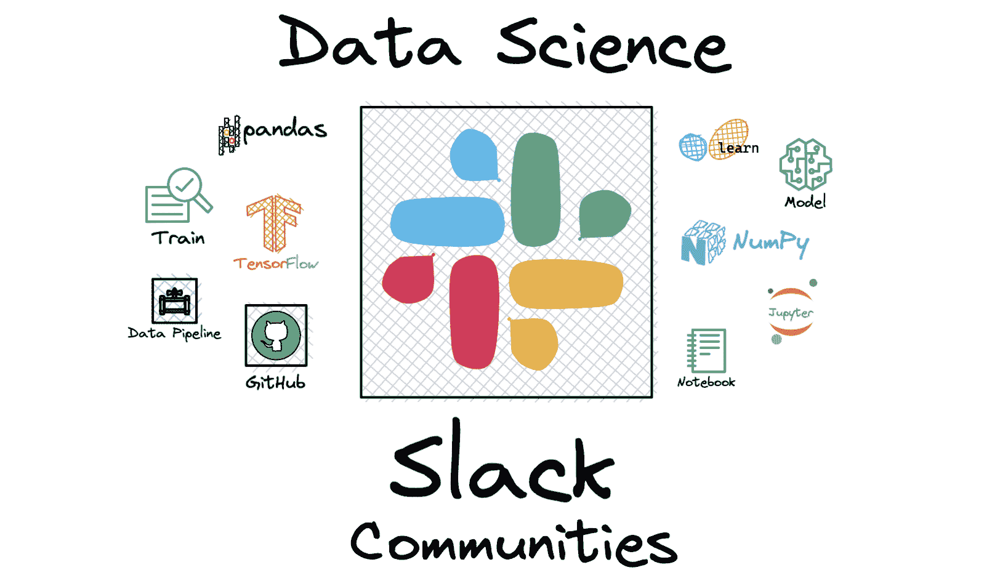

# 2023 年值得加入的 8 大数据科学 Slack 社区

> 原文：[`www.kdnuggets.com/2023/01/top-8-data-science-slack-communities-join-2023.html`](https://www.kdnuggets.com/2023/01/top-8-data-science-slack-communities-join-2023.html)

作者提供的图片

新年快乐！

* * *

## 我们的前三大课程推荐

 1\. [谷歌网络安全证书](https://www.kdnuggets.com/google-cybersecurity) - 快速进入网络安全职业的快车道。

 2\. [谷歌数据分析专业证书](https://www.kdnuggets.com/google-data-analytics) - 提升你的数据分析技能

 3\. [谷歌 IT 支持专业证书](https://www.kdnuggets.com/google-itsupport) - 支持您的组织 IT

* * *

今年你可能会考虑职业转型，学习新技能，并更加努力进行个人发展。根据美国劳动统计局的数据，预计 2021 年至 2031 年间数据科学家的增长率为 36%。

如果你想进入数据领域，有许多在线资源可供利用，包括书籍、课程、备忘单、社区等。

如果你在寻找学习资源，可以看看这些：

+   从这些 GitHub 库中学习数据科学

+   免费数据管理与数据科学学习 CS639

+   数据科学中你需要多少数学？

+   谷歌建议你在参加他们的机器学习或数据科学课程之前做什么

另一种很好的学习方式是成为社区的一部分。本文特别关注 Slack 社区。Slack 是一个消息应用程序，帮助连接人们并使团队以统一的方式工作。

你可以在 2023 年加入这些数据社区的 Slack 频道。

# Datatalks.Club

正如其名称所示，它涵盖了一切与数据相关的内容。这可以包括数据分析、数据科学和机器学习。各种 Slack 频道如#book-of-the-week、#career、#datascience、#events、#ai-memes-for-ai-peeps 等。

他们有每周活动，你可以自由加入，还有一个拥有 12 季的播客。

如果你想加入 Datatalks.Club 的 Slack 社区，请点击此链接：[Datatalks.Club Slack](https://datatalks.club/slack.html)

# 数据科学沙龙

数据科学沙龙是一个独特的会议，已成为一个多样化的社区，拥有一支由资深数据科学家、机器学习工程师等组成的团队。他们旨在将技术专业人士聚集在一起，帮助他们建立网络、成长，并相互学习，寻找可能的创新解决方案。

如果你想加入数据科学沙龙 Slack 社区，请点击此链接：[数据科学沙龙 Slack](https://info.datascience.salon/apply-to-dss-slack-workspace)

# 数据可靠性工程社区

这个 Slack 社区更细化到数据科学的特定问题。这里有广泛的数据工程师和科学家，深入探讨数据可靠性问题及其最佳实践。

如果这是你想要专注或需要更多指导的数据科学方面，这将是一个宝贵的 Slack 频道。

如果你想加入数据可靠性工程社区，请点击此链接：[数据可靠性工程社区 Slack](https://datareliabili-h4y1326.slack.com/join/shared_invite/zt-16md9v2dw-DjHdb_zSg7UD6i5iayYqyg#/shared-invite/email)。

# 数据科学家

一个讨论数据科学、数据仓库、BI 相关对话、话题等的社区。你将与领域中的其他人建立联系，并从他们的错误中学习，就像他们从你的错误中学习一样。

如果你想加入数据科学家社区，请点击此链接：[数据科学家 Slack](https://datascientists.slack.com/)。

# AI-ML-数据科学爱好者

如果你想要一个更轻松随意的环境，AI-ML-数据科学爱好者 Slack 社区适合你。这里充满了关于数据科学、机器学习和人工智能的普遍讨论。

这是跟踪其他人观点并扩展你的知识库的绝佳方式。

如果你想加入 AI-ML-数据科学爱好者社区，请点击此链接：[AI-ML-数据科学爱好者 Slack](https://datasciencelovers.slack.com/)。

# 开放数据科学社区

一个关注数据科学相关所有内容的社区。你将获得最新的数据科学文章、对你的学习过程有帮助的教程、代码分享和总体建议。旨在连接来自全球的数据科学专业人士。

如果你想加入开放数据科学社区，请点击此链接：[开放数据科学社区 Slack](https://odscglobal.slack.com/signup#/domain-signup)。

# [Papers with Code](https://paperswithcode.com/)

[Papers with Code](https://paperswithcode.com/) 是一个免费且开放的资源，提供机器学习论文、代码、数据集、方法和评估表。通过社区，你将获得优质的资源来帮助你的学习过程。你将从学习数据科学理论过渡到应用和发展你的技能。

如果您想加入“Paper with Code”社区，请点击此链接：[Paper with Code Slack](https://paperswithcode.slack.com/join/shared_invite/zt-1l0yymldz-IHkNZMreT7s4r6O5EU2LLQ#/shared-invite/email)。

# KaggleNoobs

如果您希望在数据科学领域取得成功，您需要练习您的编程技能。测试技能的唯一方法是通过项目。作为初学者，Kaggle 将是您最好的伙伴。因此，建议加入 Kaggle 社区，以帮助解答未解的问题并提供特定方面的指导。

如果您想加入 KaggleNoobs 社区，请点击此链接：[KaggleNoobs Slack](https://kagglenoobs.slack.com/signup#/domain-signup)。

# 结论

Slack 社区不仅是极好的学习资源，还帮助初学者适应全新的领域。您可以从他人的学习过程、项目以及书籍和课程推荐中获得启发。

**[尼莎·阿雅](https://www.linkedin.com/in/nisha-arya-ahmed/)** 是一名数据科学家和自由技术作家。她特别关注提供数据科学职业建议或教程以及基于理论的数据科学知识。她还希望探索人工智能如何有利于人类寿命的不同方式。作为一个热衷的学习者，她寻求扩展她的技术知识和写作技能，同时帮助指导他人。

### 更多相关主题

+   [5 个数据科学社区，助力您的职业发展](https://www.kdnuggets.com/5-data-science-communities-to-advance-your-career)

+   [加入 2022 年数据素养月](https://www.kdnuggets.com/2022/09/datacamp-join-data-literacy-month-2022.html)

+   [提升您的 AI 之旅！加入 Uplimit 的免费构建 AI 课程……](https://www.kdnuggets.com/2024/01/uplimit-supercharge-your-ai-journey-openai-course)

+   [加入 UC 的信息会议，了解商业硕士课程……](https://www.kdnuggets.com/2022/10/ucincinnati-join-ucs-information-session-masters-business-analytics-program.html)

+   [2023 年顶级免费数据科学在线课程](https://www.kdnuggets.com/2023/03/top-free-data-science-online-courses-2023.html)

+   [2023 年十大开源数据科学工具的比较概述](https://www.kdnuggets.com/a-comparative-overview-of-the-top-10-open-source-data-science-tools-in-2023)
