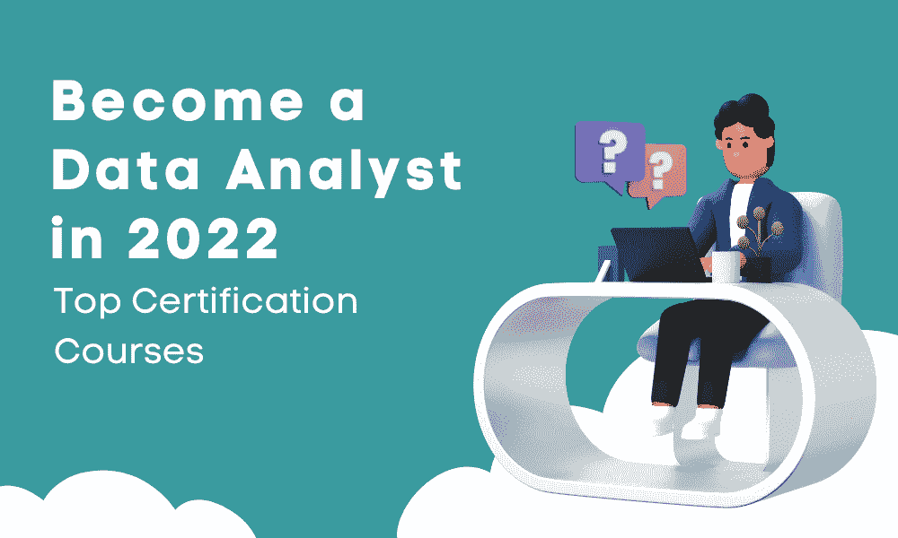

# 2022 年最佳数据分析师认证课程

> 原文：[`www.kdnuggets.com/2022/11/top-data-analyst-certification-courses-2022.html`](https://www.kdnuggets.com/2022/11/top-data-analyst-certification-courses-2022.html)

图片由编辑提供

最近有人问我关于数据分析师角色的问题，以及如何最好地迈向这一职业。我进行了研究，发现了一些在线认证课程，可以为你的数据分析师职业生涯提供启动。

所以你不需要再搜索了，我已经为你整理了这个列表。开始吧。

# Google 数据分析专业证书

[点击这里查看课程](https://www.coursera.org/professional-certificates/google-data-analytics)。

+   评分：4.8/5

+   课程时长：6 个月（每周学习不到 10 小时）

+   难度：初级水平

进度：100% 自定进度。按你自己的时间学习

由 Google 提供，这门课程为你提供了数据分析领域的热门技能。它包含 8 门课程：

1.  [基础：数据，无处不在](https://coursera.pxf.io/QOx9ez)

1.  [提问以做出数据驱动决策](https://coursera.pxf.io/QOx9ez)

1.  [为探索准备数据](https://coursera.pxf.io/QOx9ez)

1.  [将数据从脏数据处理成干净数据](https://coursera.pxf.io/QOx9ez)

1.  [分析数据以回答问题](https://coursera.pxf.io/QOx9ez)

1.  [通过可视化艺术分享数据](https://coursera.pxf.io/QOx9ez)

1.  [使用 R 编程进行数据分析](https://coursera.pxf.io/QOx9ez)

1.  [Google 数据分析顶点项目：完成案例研究](https://coursera.pxf.io/QOx9ez)

这些课程将让你更好地理解数据的一般情况，如何探索数据，如何使用数据回答特定的业务驱动问题，以及一定程度的编程。这门课程非常受欢迎，最常见的职位包括：初级数据分析师、初级数据科学家、财务分析师、运营分析师等。

# IBM 数据分析师专业证书

[点击这里查看课程](https://www.coursera.org/professional-certificates/ibm-data-analyst)。

+   评分：4.6/5

+   课程时长：11 个月（每周学习不到 3 小时）

+   难度：初级水平

+   进度：100% 自定进度。按你自己的时间学习

由 IBM 提供，这门课程为你提供了数据分析的核心原则，并对数据处理、分析技术等有更好的理解。它包含 8 门课程：

1.  [数据分析简介](https://www.coursera.org/learn/introduction-to-data-analytics?specialization=ibm-data-analyst)

1.  [Excel 数据分析基础](https://www.coursera.org/learn/excel-basics-data-analysis-ibm?specialization=ibm-data-analyst)

1.  [使用 Excel 和 Cognos 进行数据可视化和仪表板](https://www.coursera.org/learn/data-visualization-dashboards-excel-cognos?specialization=ibm-data-analyst)

1.  [Python 数据科学、AI 和开发](https://www.coursera.org/learn/python-for-applied-data-science-ai?specialization=ibm-data-analyst)

1.  [数据科学中的 Python 项目](https://www.coursera.org/learn/python-for-applied-data-science-ai?specialization=ibm-data-analyst)

1.  [Python 中的数据库和 SQL 数据科学](https://www.coursera.org/learn/sql-data-science?specialization=ibm-data-analyst)

1.  [Python 数据分析](https://www.coursera.org/learn/data-analysis-with-python?specialization=ibm-data-analyst)

1.  [使用 Python 的数据可视化](https://www.coursera.org/learn/python-for-data-visualization?specialization=ibm-data-analyst)

1.  [IBM 数据分析师顶点项目](https://www.coursera.org/learn/ibm-data-analyst-capstone-project?specialization=ibm-data-analyst)

这些课程将帮助你启动数据分析师职业生涯，通过提供数据分析的原则和基础，同时获得实践技能。你还将获得项目经验和数据分析工具，如 SQL、Python 和 Jupyter Notebooks，帮助你理解作为数据分析师的日常工作。

# Edureka 的数据分析师硕士项目

[点击这里查看课程](https://www.edureka.co/masters-program/data-analyst-certification)。

+   时长：250+小时

+   难度：初学者级别

+   进度：100% 自主学习。根据自己的时间学习

由 Edureka 提供的数据分析师课程增加了你对数据分析专业人员常用工具和系统的知识和专业技能。你将进一步深入学习统计学、R 和 Tableau 数据分析。课程包括 5 个子课程，每个子课程都有更深入的模块：

1.  分析的统计学基础

1.  R 数据分析认证

1.  Tableau 培训与认证

1.  Microsoft Power BI 培训

1.  AWS S3

如果你想了解更多模块，你可以下载课程大纲。你将深入学习的领域包括：统计学、探索性分析、数据可视化、概率、高级 SAS 程序、Tableau、贝叶斯推断、回归建模等。

# DataCamp 的 Python 数据分析师课程

[点击这里查看课程](https://www.datacamp.com/tracks/data-analyst-with-python)。

+   编程语言：Python

+   时长：36 小时

+   难度：初级/中级水平

+   进度：100% 自主学习。根据自己的时间学习

如果你希望成为一名专注于 Python 的数据分析师，这门 DataCamp 课程适合你。你将通过互动练习学习如何导入、清理、操作和可视化数据。课程包括 11 个子课程：

1.  Python 中的数据科学导论

1.  中级 Python

1.  使用 Pandas 的数据操作

1.  使用 Pandas 合并数据

1.  Python 中的统计学导论

1.  使用 Seaborn 的数据可视化导论

1.  使用 Python 的数据操作

1.  使用 Python 导入和清理数据

1.  Python 中的探索性数据分析

1.  Python 中的采样

1.  Python 中的假设检验

你将通过处理真实数据集来获得经验，以帮助你实现所学技能。许多课程忽略了统计学在数据分析中的重要性，但该课程提供了相关知识，并让你通过样本和假设检验进一步探索。

# 成为数据分析师由 Udacity 提供

[点击这里查看课程](https://www.udacity.com/course/data-analyst-nanodegree--nd002)。

+   评分：4.8/5

+   课程时长：4 个月（每周 10 小时学习）

+   难度：初学者水平

+   学习进度：100% 自定进度。按照自己的时间进行学习

+   先决条件：Python 和 SQL

由 Udacity 提供，并与 Kaggle 合作的《使用 Python 和 SQL 进行数据分析》课程，帮助你提升当前编程技能，并改善处理混乱复杂数据集的能力。该课程包含 4 个部分：

1.  数据分析入门

1.  实用统计学

1.  数据处理

1.  使用 Python 进行数据可视化

你将参与实际项目、知识、工作区、测验和自定义学习计划，并有进度跟踪器。还将提供技术导师支持和个人职业建议，帮助你获得理想的数据分析师职位。

# 想了解更多？

这里有一些关于数据分析的其他文章，可以帮助你进一步了解：

+   7 个数据分析面试问题及答案

+   2022 年顶级 YouTube 数据分析课程

**[Nisha Arya](https://www.linkedin.com/in/nisha-arya-ahmed/)**是一位数据科学家和自由技术写作人。她特别感兴趣于提供数据科学职业建议或教程以及数据科学相关的理论知识。她还希望探索人工智能如何对人类寿命的延续产生影响。作为一名热衷学习的人，她希望拓宽自己的技术知识和写作技能，同时帮助指导他人。

### 相关话题

+   [你在 2022 年会为你的工具包添加哪些认证？](https://www.kdnuggets.com/2022/03/sas-certification-adding-toolkit-2022.html)

+   [Meta 的新数据分析师专业认证已发布！](https://www.kdnuggets.com/metas-new-data-analyst-professional-certification-has-dropped)

+   [2022 年 8 个最佳数据科学课程，以实现快速职业晋升](https://www.kdnuggets.com/2022/02/scaler-8-best-data-science-courses-enroll-2022-steep-career-advancement.html)

+   [2022 年顶级数据科学工具](https://www.kdnuggets.com/2022/03/top-data-science-tools-2022.html)

+   [2022 年及以后顶级人工智能和数据科学工具与技术](https://www.kdnuggets.com/2022/03/nvidia-0317-top-ai-data-science-tools-techniques-2022-beyond.html)

+   [2022 年顶级数据科学播客](https://www.kdnuggets.com/2022/06/top-data-science-podcasts-2022.html)
