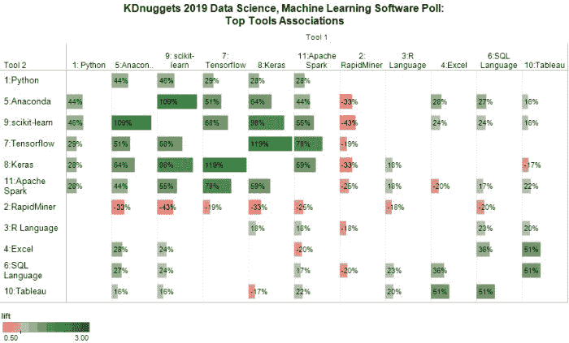
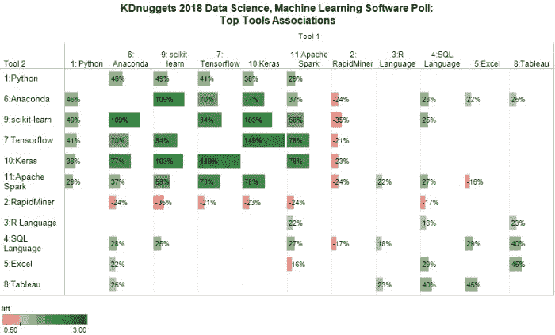
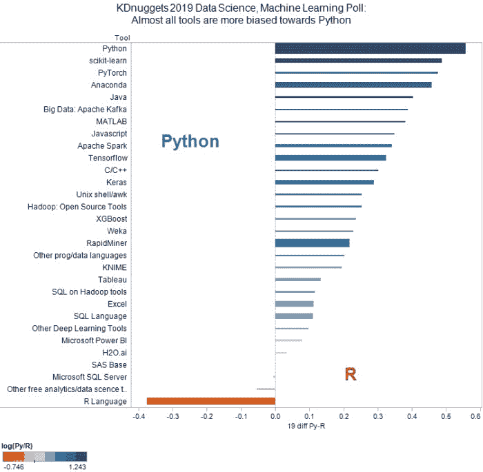
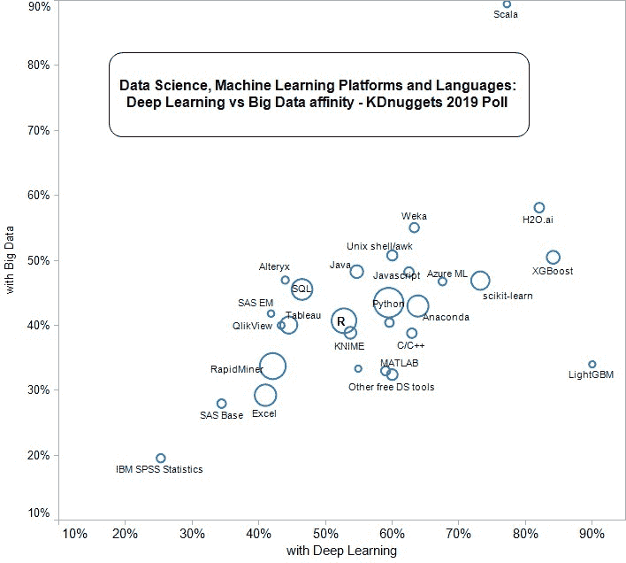

# 你需要知道的：现代开源数据科学/机器学习生态系统

> 原文：[`www.kdnuggets.com/2019/06/top-data-science-machine-learning-tools.html`](https://www.kdnuggets.com/2019/06/top-data-science-machine-learning-tools.html)

 comments 最近我们报告了第 20 届年度 KDnuggets 软件调查结果：

> **Python 领先于 11 个顶级数据科学、机器学习平台：趋势与分析**。

正如我们之前所做的（见 2017 年数据科学生态系统，2018 年数据科学生态系统），我们检查了哪些工具属于同一回答 - 用户的技能组合。我们注意到这并不一定意味着所有工具在每个项目中都一起使用，但拥有同时使用工具 X 和 Y 的知识和技能使得在某些项目中同时使用 X 和 Y 的可能性更大。我们看到的结果与这个假设一致。

顶级工具显示出令人惊讶的稳定性 - 我们看到与去年基本相同的模式。

首先，我们选择了至少获得 20%投票的工具。有 11 个这样的工具 - 与去年完全相同的 11 个工具，尽管顺序稍有变化。Keras 从第 10 名上升到第 8 名，Anaconda 从第 6 名上升到第 5 名。Tableau 和 SQL 略微下降。

这个 11 个工具的分界点是自然的，因为第 11 名（Apache Spark，21%）与第 12 名（Microsoft Power BI，13%）之间存在较大的差距。

我们使用了与我们的 2017 年分析 和 2018 年分析 相同的 Lift 衡量标准。

然后我们将关联性最强的工具分组，从 Tensorflow 和 Keras 开始，直到我们得到下面的图 1。通过仅显示 abs(Lift1) > 15% 的关联性，我们使模式更容易被看到。

**图 1：2019 年数据科学、机器学习顶级工具关联性**

条形长度对应的是 lift1 的绝对值，颜色表示 lift 的值（绿色 - 正相关，红色 - 负相关）。

我们注意到现代开源数据科学生态系统中的 6 个主要工具是：**Python、Anaconda、scikit-learn、Tensorflow、Keras 和 Apache Spark**。这与去年完全相同 - 见下文。

**图 1b：2018 年数据科学、机器学习顶级工具关联性**

Rapidminer 与上述所有工具的负相关性较小，且与其他工具的关联性也不强。

R 与 Keras、Apache Spark、SQL 和 Tableau 的关联性较小且为正相关。

第二组包括 3 个用于数据科学和机器学习的支持工具，这些工具通常一起使用：**SQL、Excel 和 Tableau**。

请注意，这张图表相对于对角线是对称的（右上三角形等于左下三角形），但我们包含了两个三角形，因为在完整图表中模式更容易看出。

Lift 定义：

> **Lift (X & Y) = pct (X & Y) / ( pct (X) * pct (Y) )**
> 
> 其中 pct(X) 是选择 X 的用户百分比。
> 
> Lift (X&Y) > 1 表示 X 和 Y 一起出现的频率高于独立时的预期，
> 
> 如果 X 和 Y 按独立性预期的频率出现，则 Lift=1，并且
> 
> 如果 X 和 Y 一起出现的频率低于预期，则 Lift < 1（负相关）
> 
> 为了使差异更容易看出，我们定义了
> 
> **Lift1 (X & Y) = Lift (X & Y) - 1**

### Python 与 R

接下来我们考察 Python 与 R。

令 **with_Py(X)** = 工具 X 在 Python 中的使用百分比，**with_R(X)** = 工具 X 在 R 中的使用百分比。为了可视化每个工具与 Python 或 R 的接近程度，我们使用了一个非常简单的度量 **Bias_Py_R(X) = with_Py(X) - with_R(X)**，如果工具更多地与 Python 一起使用，则为正值，如果更多地与 R 一起使用，则为负值。

在图 2 中，我们绘制了最受欢迎的工具（至少 90 个投票）的偏向性，可以看到几乎每个工具都偏向 Python。唯一的 3 个例外是 R（显而易见）、微软 SQL Server 和 SAS Base（完全没有偏向）。作为对比，在 类似的 2017 年分析 中，2018 年有 10 个工具偏向 R，2017 年有 3 个 R 偏向的工具。

R 是一个优秀的平台，具有深度和广度，广泛用于数据分析和可视化，目前仍占据约 50% 的份额。然而，展望未来，我们预计 Python 生态系统会有更多的发展和活力。

 **图 2：数据科学、机器学习平台 2019：Python 与 R 偏向性**

我不认为前 11 大平台的份额和关联的相对稳定性表明创新的终结，而只是可能在另一个主要系统 - 也许与 AutoML 相关的某些东西 - 颠覆当前生态系统之前的一个暂停。

### 大数据与深度学习

最后，我们考察数据科学/机器学习平台和语言与大数据（Hadoop 和 Spark 工具）以及深度学习的关系。

大数据工具的使用比例从 2018 年和 2017 年的 33% 上升到 37.4%。尽管这一增加，绝大多数数据科学家仍然使用中小规模数据，不需要 Hadoop / Spark。

深度学习工具的比例上升到 50%，而 2018 年为 43%，2017 年为 32%。

对于每个工具 X，我们计算它被同一个投票者与大数据（Spark/Hadoop 工具） - 纵轴，以及与深度学习工具（横轴）一起出现的频率。

这里是一个图表，显示了前几个工具（至少 50 个投票），排除了深度学习和大数据工具本身。

 **图 3：KDnuggets 2019 数据科学、机器学习调查：深度学习与大数据亲和力**

我们注意到，Scala 是在深度学习和大数据领域使用最广泛的语言。图表的右下角较重，几乎每个工具在深度学习中的使用频率都高于在大数据中的使用频率。

有趣的是，最与深度学习相关的工具是 XGBoost 和 LightGBM。

这里是一张表格，显示了不同平台与大数据和深度学习的关联情况，按与深度学习工具的关联度排序。

**表 1：顶级数据科学/机器学习软件及其与大数据和深度学习的关联**

| 软件 | **2019 统计** | 拥有大数据的比例 | 拥有深度学习的比例 |
| --- | --- | --- | --- |
| LightGBM | 50 | 34% | 90% |
| XGBoost | 208 | 50% | 84% |
| H2O.ai | 117 | 58% | 82% |
| Scala | 57 | 89% | 77% |
| scikit-learn | 418 | 47% | 73% |
| Azure ML | 77 | 47% | 68% |
| Anaconda | 556 | 43% | 64% |
| Weka | 109 | 55% | 63% |
| C/C++ | 116 | 39% | 63% |
| Javascript | 112 | 48% | 63% |
| 其他免费数据科学工具 | 145 | 32% | 60% |
| Unix shell/awk | 130 | 51% | 60% |
| 其他编程语言 | 94 | 40% | 60% |
| Python | 1078 | 44% | 59% |
| MATLAB | 100 | 33% | 59% |
| Orange DM | 51 | 33% | 55% |
| Java | 203 | 48% | 55% |
| KNIME | 175 | 39% | 54% |
| R | 764 | 41% | 53% |
| SQL Server | 184 | 34% | 49% |
| SQL | 538 | 46% | 46% |
| MS Power BI | 217 | 38% | 46% |
| Tableau | 362 | 40% | 44% |
| Alteryx | 66 | 47% | 44% |
| QlikView | 60 | 40% | 43% |
| RapidMiner | 839 | 34% | 42% |
| SAS EM | 55 | 42% | 42% |
| Excel | 571 | 29% | 41% |
| SAS Base | 93 | 28% | 34% |
| IBM SPSS Statistics | 87 | 20% | 25% |

**相关信息：**

+   **Python 领先的 11 大数据科学、机器学习平台：趋势与分析**。

+   [新兴生态系统：数据科学和机器学习软件分析](https://www.kdnuggets.com/2017/06/ecosystem-data-science-machine-learning-software.html)

+   [开源数据科学/机器学习生态系统的 6 个组成部分；Python 是否战胜了 R？](https://www.kdnuggets.com/2018/06/ecosystem-data-science-python-victory.html)

* * *

## 我们的前三课程推荐

 1\. [Google 网络安全证书](https://www.kdnuggets.com/google-cybersecurity) - 快速进入网络安全职业道路

 2\. [Google 数据分析专业证书](https://www.kdnuggets.com/google-data-analytics) - 提升你的数据分析能力

 3\. [Google IT 支持专业证书](https://www.kdnuggets.com/google-itsupport) - 支持你的组织的 IT 需求

* * *

### 更多相关话题

+   [每个数据科学家都应该了解的三个 R 库（即使你使用 Python）](https://www.kdnuggets.com/2021/12/three-r-libraries-every-data-scientist-know-even-python.html)

+   [停止学习数据科学以寻找目标，并通过找到目标来…](https://www.kdnuggets.com/2021/12/stop-learning-data-science-find-purpose.html)

+   [学习数据科学统计学的顶级资源](https://www.kdnuggets.com/2021/12/springboard-top-resources-learn-data-science-statistics.html)

+   [成功数据科学家的 5 个特征](https://www.kdnuggets.com/2021/12/5-characteristics-successful-data-scientist.html)

+   [一个 90 亿美元的 AI 失败，深入探讨](https://www.kdnuggets.com/2021/12/9b-ai-failure-examined.html)

+   [是什么让 Python 成为初创企业理想的编程语言](https://www.kdnuggets.com/2021/12/makes-python-ideal-programming-language-startups.html)
