# 2022 年最佳数据科学播客

> 原文：[`www.kdnuggets.com/2022/06/top-data-science-podcasts-2022.html`](https://www.kdnuggets.com/2022/06/top-data-science-podcasts-2022.html)

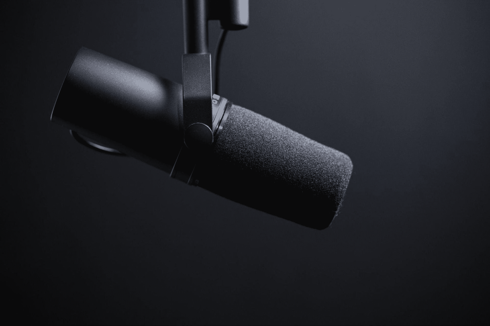

[Jukka Aalho](https://unsplash.com/@jukkaaalho) via Unsplash

播客正在增长，成为人们自我发展的基石。现在几乎每个领域都有播客，为什么不听听关于数据科学的播客呢？

* * *

## 我们的前 3 名课程推荐

 1\. [谷歌网络安全证书](https://www.kdnuggets.com/google-cybersecurity) - 加速进入网络安全职业道路。

 2\. [谷歌数据分析专业证书](https://www.kdnuggets.com/google-data-analytics) - 提升你的数据分析能力

 3\. [谷歌 IT 支持专业证书](https://www.kdnuggets.com/google-itsupport) - 支持你的组织 IT 需求

* * *

我将提供一份不同的数据科学相关播客清单，帮助你提高对该领域的兴趣，增加当前知识，或帮助你自我发展。

# 一般数据播客

让我们从谈论所有数据的播客开始，无论是过去、现在还是未来。

## [数据怀疑者](https://dataskeptic.com/)

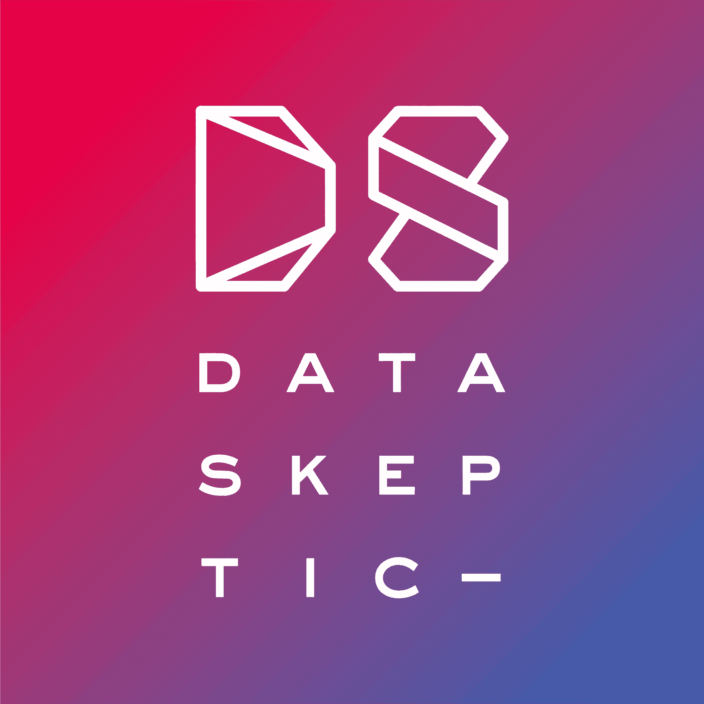

来源：[数据怀疑者](https://dataskeptic.com/)

几个月前我第一次输入数据科学播客时，这些播客出现了。Data Skeptic 于 2014 年推出了其播客，专注于数据科学、人工智能、机器学习等类似话题。他们按季节播放，内容包括 K 均值、时间序列、可解释性等。

它可以在[Apple](https://podcasts.apple.com/us/podcast/data-skeptic/id890348705?mt=2)和[Spotify](https://open.spotify.com/show/1BZN7H3ikovSejhwQTzNm4)上获取。

## [哈佛数据科学评论播客](https://hdsr.mitpress.mit.edu/podcast)

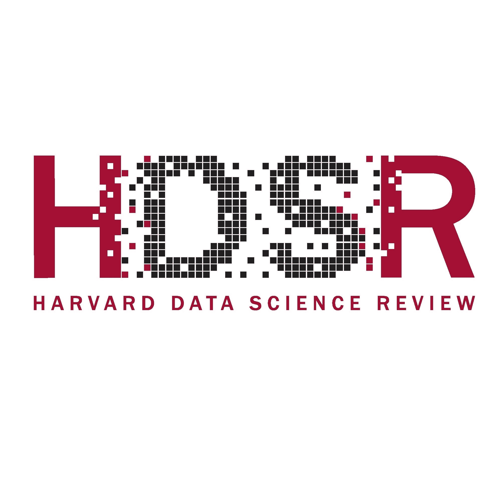

来源：[哈佛数据科学评论播客](https://hdsr.mitpress.mit.edu/podcast)

哈佛数据科学评论播客专注于数据科学及其在不同领域的应用和影响。每一期节目被描述为“案例研究”，以强调他们对理解数据使用和做出重要决策的渴望。

它可以在[Podbean](https://hdsr.podbean.com/)、[Apple](https://podcasts.apple.com/us/podcast/harvard-data-science-review-podcast/id1558728983?itsct=podcast_box&itscg=30200)和[Spotify](https://open.spotify.com/show/7jgRp5wIOiCmU5cuqrz8dd)上获取。

## [香蕉数据播客](https://banana-data.buzzsprout.com/)

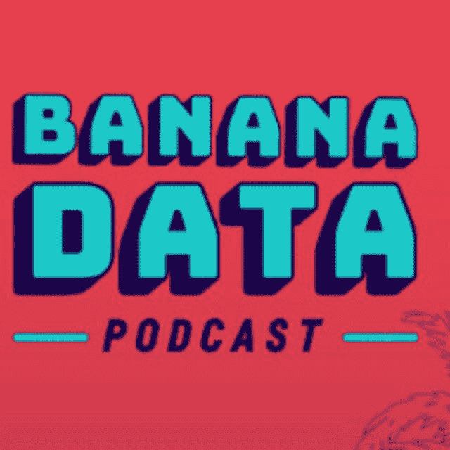

来源: [香蕉数据播客](https://banana-data.buzzsprout.com/)

由《香蕉数据播客》的主持人 Christopher Peter Makris 和 Corey Strausman 聚焦于数据科学世界中的最新创新。这个双周播客专注于数据相关的不同领域，从伦理人工智能到机器人宠物。你还可以订阅他们每周的香蕉数据通讯！

可以在 [Apple](https://podcasts.apple.com/us/podcast/the-banana-data-podcast/id1463103655) 和 [Spotify](https://open.spotify.com/show/3uZK2aPeVwnADRqyYR4nt0) 上收听。

## [O’Reilly 数据秀播客](https://www.oreilly.com/radar/topics/oreilly-data-show-podcast/)

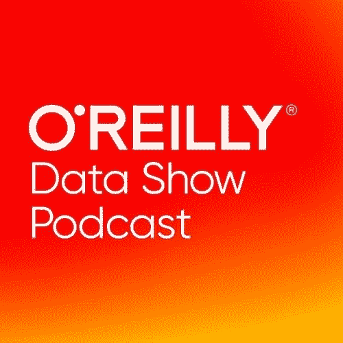

来源: [O’Reilly 数据秀播客](https://www.oreilly.com/radar/topics/oreilly-data-show-podcast/)

这个播客探讨了推动大数据、数据科学和人工智能的过程、工具和技术。他们的重点是新兴数据技术，涉及深度学习、端到端机器学习、实时分析等相关主题。

可以在 [Apple](https://podcasts.apple.com/us/podcast/oreilly-data-show/id944929220)、[Stitcher](http://www.stitcher.com/podcast/oreilly-media-2/the-oreilly-data-show-podcast?refid=stpr)、[Google Play](https://play.google.com/music/podcasts/portal/u/0#p:id=playpodcast/series&a=100729874) 和 [RSS](http://feeds.podtrac.com/IOJSwQcdEBcg) 上收听。

## [DataFramed](https://www.datacamp.com/podcast)

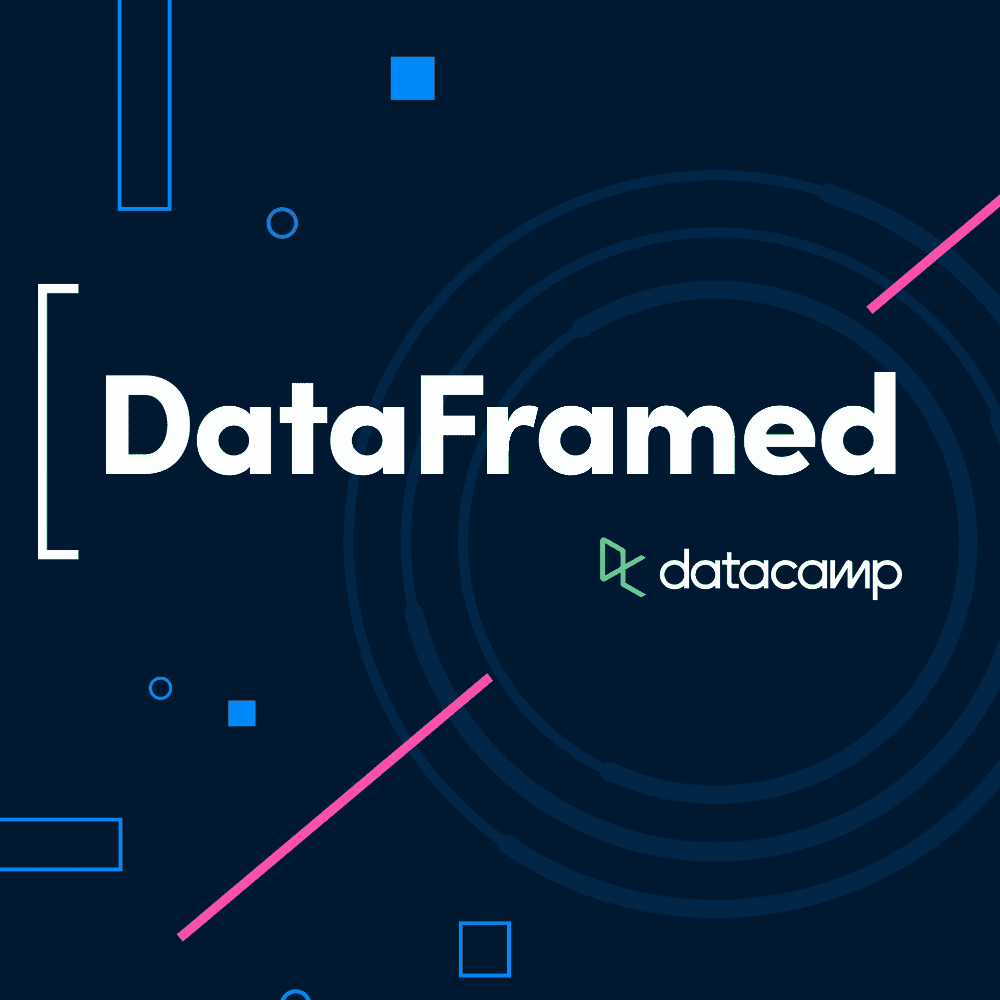

来源: [DataFramed](https://www.datacamp.com/podcast)

这是 DataCamp 自家的数据科学播客。他们目前有 85 集，涵盖了如何建立数据文化和提升数据素养的各种话题。

可以在 [Apple](https://podcasts.apple.com/us/podcast/85-building-data-literacy-at-starbucks/id1336150688?i=1000561547159)、[Spotify](https://open.spotify.com/episode/1AOAJOQnGKeFLo6luHAlA6?si=bMWLoQ16SDu2CPnEQvz_XA&nd=1) 和 [Google](https://podcasts.google.com/feed/aHR0cHM6Ly9mZWVkcy5zb3VuZGVyLmZtLzE5MjAxL3Jzcy54bWw/episode/OGU2MDM1ZTItZjYxYy00ZGY2LWIyNjQtNGJjODg0ZmVlNWE5?sa=X&ved=0CAQQ8qgGahcKEwjgp42theT3AhUAAAAAHQAAAAAQLA) 上收听。

# 职业建议

## [数据科学中的女性](https://www.widsconference.org/podcast.html)

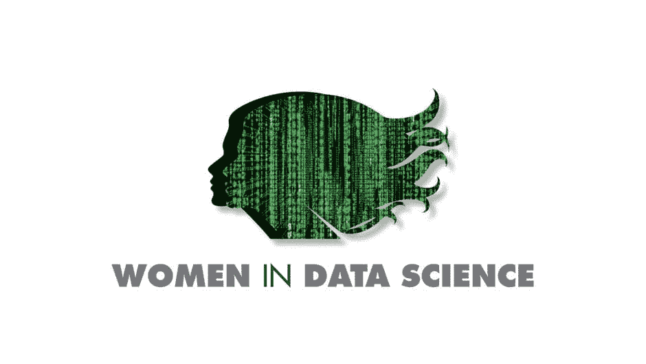

来源: [数据科学中的女性](https://www.widsconference.org/podcast.html)

我非常喜欢这个播客，因为可以想象女性进入以男性为主的行业是多么具有挑战性。这个播客由女性数据科学家主持，为其他女性提供建议，帮助她们取得成功。然而，它也包含了许多一般的数据讨论，如‘应用机器学习解决全球食品安全挑战’。

它可以在[Apple Podcasts](https://podcasts.apple.com/us/podcast/women-in-data-science/id1440076586?mt=2)、[Google Podcasts](https://podcasts.google.com/?feed=aHR0cHM6Ly9yc3Muc2ltcGxlY2FzdC5jb20vcG9kY2FzdHMvODEyNC9yc3M%3D)、[Spotify](https://open.spotify.com/show/0eaFZXUh8qys3c0Wr3vrA3)、[Stitcher](https://www.stitcher.com/podcast/women-in-data-science-wids) 和 [Overcast](https://overcast.fm/itunes1440076586/women-in-data-science) 上收听。

## [SuperDataScience](https://www.superdatascience.com/podcast)

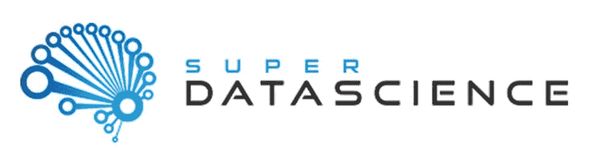

来源：[SuperDataScience](https://www.superdatascience.com/podcast)

我推荐的另一个关于数据领域职业建议的播客是**SuperDataScience**。他们涵盖了从 MLOps、气候变化到法律科技的一系列话题。然而，他们也提供了非常好的内容，帮助人们改变职业路径、应该选择什么样的道路以及可用的不同课程。

它可以在他们的[官网](https://www.superdatascience.com/podcast)上收听，也可以在[Apple](https://podcasts.apple.com/us/podcast/super-data-science/id1163599059)、[Spotify](https://open.spotify.com/show/1n8P7ZSgfVLVJ3GegxPat1)、[Stitcher Radio](https://www.stitcher.com/podcast/kirill-eremenko/superdatascience) 或 [TuneIn](https://tunein.com/podcasts/Business--Economics-Podcasts/The-Super-Data-Science-Podcast-Big-Data--Analyti-p919559/) 上收听。

## [The Artists of Data Science](https://theartistsofdatascience.fireside.fm/episodes)

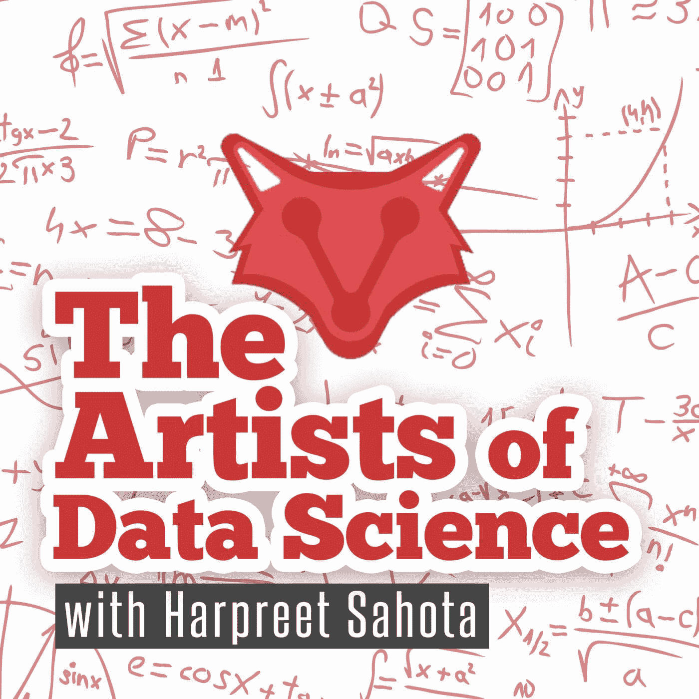

来源：[The Artists of Data Science](https://theartistsofdatascience.fireside.fm/episodes)

**The Artists of Data Science**播客于 2020 年 4 月 8 日播出，至今已有 245 集可供收听。这个播客非常注重数据科学家的自我发展。节目分为采访和“欢乐时光”两部分，听众可以在“欢乐时光”中提问任何与数据科学相关的问题。

它可以在[RSS](https://feeds.fireside.fm/theartistsofdatascience/rss)、[Apple](https://podcasts.apple.com/ca/podcast/the-artists-of-data-science/id1506968775)、[Google](https://podcasts.google.com/?feed=aHR0cHM6Ly9mZWVkcy5maXJlc2lkZS5mbS90aGVhcnRpc3Rzb2ZkYXRhc2NpZW5jZS9yc3M)、[Castbox](https://castbox.fm/channel/The-Artists-of-Data-Science-id2755047?country=us)、[Overcast](https://overcast.fm/itunes1506968775/the-artists-of-data-science)、[Spotify](https://open.spotify.com/show/71RbIpffwWXUMZQTFKiMWk)、[Stitcher](https://www.stitcher.com/podcast/the-artists-of-data-science) 和 [TuneIn](https://tunein.com/podcasts/Storytelling-Podcasts/The-Artists-of-Data-Science-p1313315/) 上收听。

# 机器学习和人工智能播客

## [Data Science at Home](https://datascienceathome.com/episodes/podcast/)

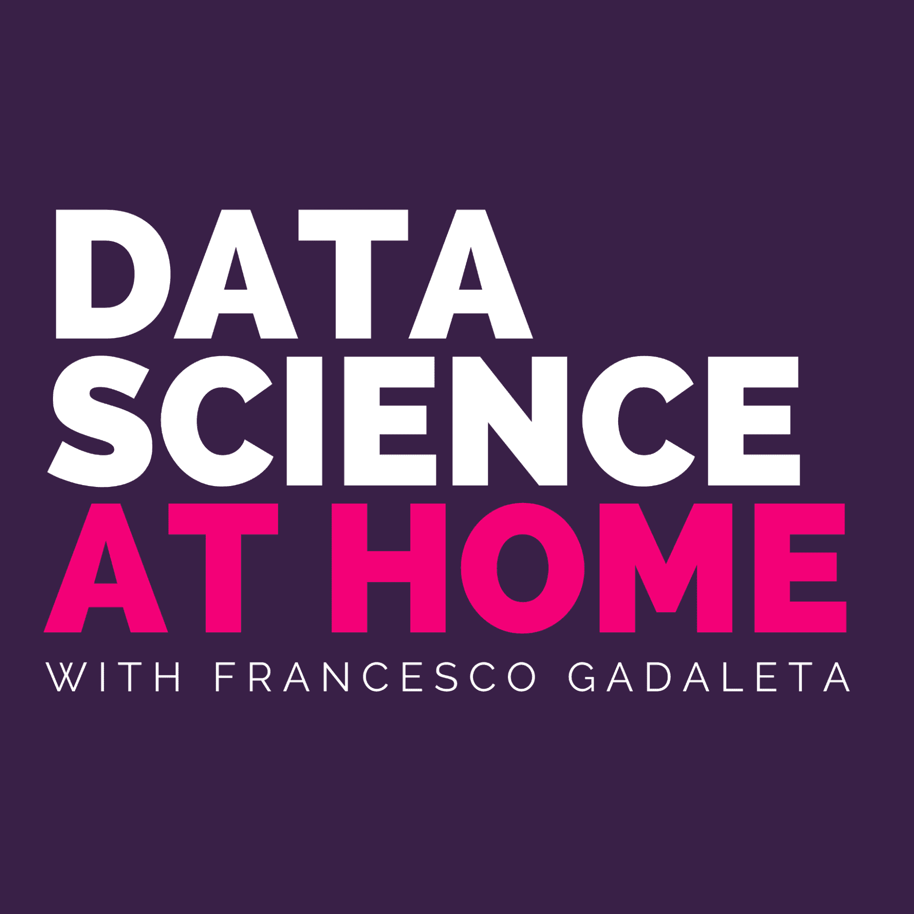

来源：[Data Science at Home](https://datascienceathome.com/episodes/podcast/)

主持人 Dr. Francesco Gadaleta 讨论了机器学习、人工智能和算法等不同话题。节目中还包含了对人工智能领域顶尖人物的采访。目前有 197 集供你查看，提供了大量的知识。

可在他们的[网站](https://datascienceathome.com/episodes/podcast/)以及[Apple](https://podcasts.apple.com/us/podcast/data-science-at-home/id1069871378)和[Spotify](https://open.spotify.com/show/57AJ6GiMDPVBLGRqvjeoz6)上收听。

## [Talk Python to Me](https://talkpython.fm/)

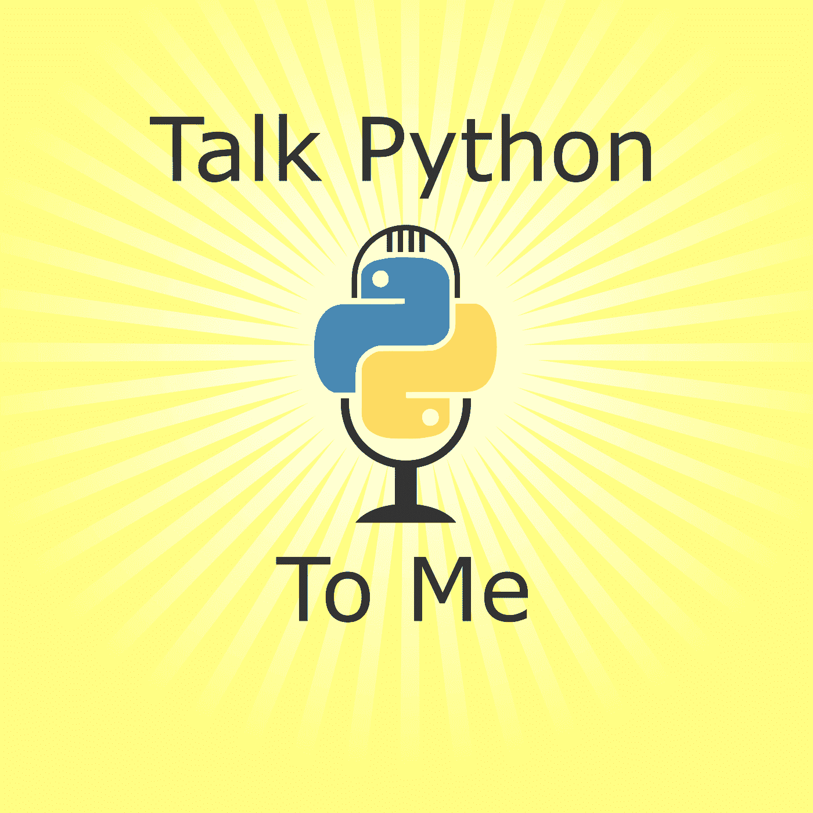

来源：[Talk Python to Me](https://talkpython.fm/)

如果你使用编程语言 Python 并想了解你可以用它做什么，各种工具、库等；这个播客就是为你准备的。它是由[Michael Kennedy](http://blog.michaelckennedy.net/)主持的每周播客，涵盖了广泛的 Python 话题和其他相关话题。节目格式是与行业专家的轻松 1 小时对话。

可在他们的[网站](https://talkpython.fm/episodes/all)和[Apple](https://podcasts.apple.com/us/podcast/talk-python-to-me/id979020229)、[Google](https://podcasts.google.com/feed/aHR0cHM6Ly90YWxrcHl0aG9uLmZtL2VwaXNvZGVzL3Jzcw?sa=X&ved=2ahUKEwjS1bej6e7sAhUu-YUKHXzuCPoQ9sEGegQIARAC)以及[Soundcloud](https://soundcloud.com/talkpython)上收听。

## [Gradient Dissent](https://wandb.ai/fully-connected/podcast)

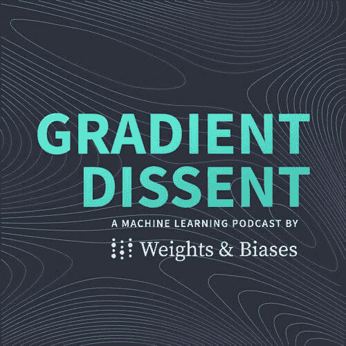

来源：[Gradient Dissent](https://wandb.ai/fully-connected/podcast)

Gradient Dissent 是由 Weights & Biases 创建的机器学习播客，由 Lukas Biewald 主持，探讨了机器学习、AI 和深度学习如何被行业领袖采用以及他们如何将这些模型投入生产。

可在[Apple](https://podcasts.apple.com/us/podcast/gradient-dissent/id1504567418)、[Spotify](https://open.spotify.com/show/7o9r3fFig3MhTJwehXDbXm)、[Google](https://podcasts.google.com/feed/aHR0cHM6Ly9mZWVkcy5jYXB0aXZhdGUuZm0vZ3JhZGllbnQtZGlzc2VudC8)和[YouTube](https://www.youtube.com/c/weights-biases)上收听。

## [In Machines We Trust](https://www.technologyreview.com/supertopic/in-machines-we-trust/)

来源：[In Machines We Trust](https://www.technologyreview.com/supertopic/in-machines-we-trust/)

这个获奖播客由 Jennifer Strong 主持，探讨了人工智能对我们日常生活的影响。目前有 3 季，其中第二季由 JP Morgan Chase and Co.赞助。这个播客让你更深入了解那些在应对科技力量、AI 发展和后果的人们。

它在[Apple Podcast](https://podcasts.apple.com/us/podcast/in-machines-we-trust/id1523584878)、[Spotify](https://open.spotify.com/show/6QefEeY1IKYVn5w6nUV83Y)、[Google Podcasts](https://podcasts.google.com/feed/aHR0cHM6Ly9mZWVkcy5tZWdhcGhvbmUuZm0vaW5tYWNoaW5lc3dldHJ1c3Q=)、[Stitcher](https://www.stitcher.com/podcast/in-machines-we-trust)和[TuneIn](https://tunein.com/podcasts/Technology-Podcasts/In-Machines-We-Trust-p1345273/)上都有提供。

# 数据可视化播客

## [数据故事](https://datastori.es/)

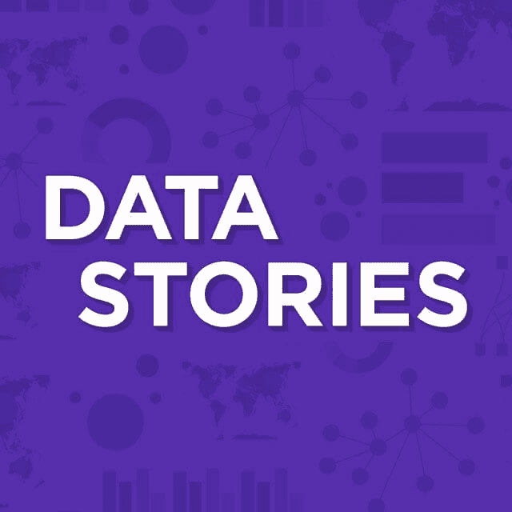

来源: [数据故事](https://datastori.es/)

这是由 Enrico Bertini 和 Moritz Stefaner 主办的关于数据可视化的播客。目前有 165 集，他们还有一个 Slack 社区聊天，你可以在这里讨论节目，建议嘉宾，并与其他听众聊天。

它在[Apple](https://podcasts.apple.com/us/podcast/data-stories/id502854960?mt=2)和[Spotify](https://open.spotify.com/show/0aIvhK1ANin1kSOKRhWG1M)上都有提供。

## [数据可视化今天](https://dataviztoday.com/)

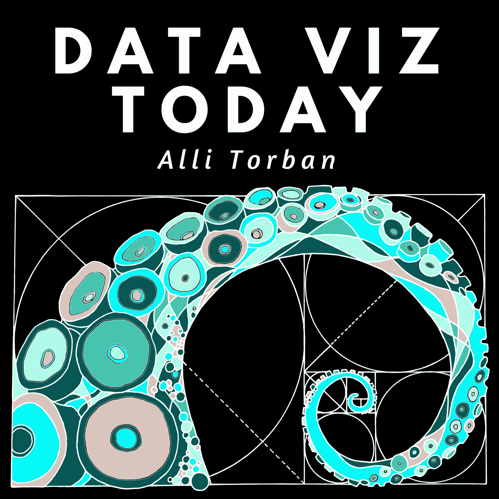

来源: [数据可视化今天](https://dataviztoday.com/)

数据可视化今天由前五角大楼分析师 Alli Torban 主持。它重点讲述了数据如何讲述引人入胜的故事，以及可视化如何使你的数据栩栩如生。目前你可以浏览 72 集。

它在[Apple](http://bit.ly/DataVizToday)、[Google Play](http://bit.ly/DVTGooglePlay)、[Google Podcasts](http://bit.ly/DVTGooglePodcasts)、[Stitcher](http://www.stitcher.com/s?fid=178210&refid=stpr)、[SoundCloud](https://soundcloud.com/user-183724339)和[Spotify](https://open.spotify.com/show/5CZnmqFEL019QW7yJoKyCI?si=kQZmxjQIR1-Jbq6isScwvg)上都有提供。

# 总结

还有许多其他与数据相关的播客，如果你知道任何我没有提到的好播客，请在下方评论中告诉我！

**[Nisha Arya](https://www.linkedin.com/in/nisha-arya-ahmed/)** 是一位数据科学家和自由职业技术写作人员。她特别感兴趣于提供数据科学职业建议或教程，以及围绕数据科学的理论知识。她还希望探索人工智能如何/可以提高人类寿命。作为一个热衷学习的人，她寻求拓宽自己的技术知识和写作技能，同时帮助指导他人。

### 更多相关话题

+   [2024 年你不能错过的顶尖 5 个 AI 播客](https://www.kdnuggets.com/top-5-ai-podcasts-you-cant-miss-in-2024)

+   [每个机器学习爱好者都应该关注的 5 个播客](https://www.kdnuggets.com/5-podcasts-every-machine-learning-enthusiast-should-follow)

+   [2022 年顶尖数据科学工具](https://www.kdnuggets.com/2022/03/top-data-science-tools-2022.html)

+   [2022 年及以后顶尖 AI 和数据科学工具与技术](https://www.kdnuggets.com/2022/03/nvidia-0317-top-ai-data-science-tools-techniques-2022-beyond.html)

+   [2022 年数据科学领域的热门职位和薪资](https://www.kdnuggets.com/2022/05/top-jobs-salaries-data-science-2022.html)

+   [2022 年顶级数据分析师认证课程](https://www.kdnuggets.com/2022/11/top-data-analyst-certification-courses-2022.html)
