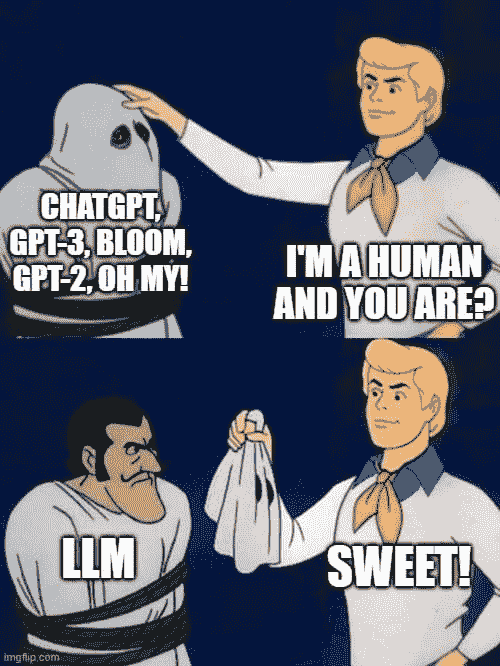

# 大型语言模型的顶级免费课程

> 原文：[`www.kdnuggets.com/2023/03/top-free-courses-large-language-models.html`](https://www.kdnuggets.com/2023/03/top-free-courses-large-language-models.html)

作者提供的图片 | 创建于 [imgflip](https://imgflip.com/)

Transformers 确实改变了自然语言处理领域，支撑了所有最先进的 NLP 应用程序。Google Bard、OpenAI 的 ChatGPT 以及其他：它们都由大型（transformer）语言模型驱动，这些模型在庞大的语料库上进行了训练，并进行了强化学习。

* * *

## 我们的前三大课程推荐

 1\. [Google 网络安全证书](https://www.kdnuggets.com/google-cybersecurity) - 快速进入网络安全职业生涯

 2\. [Google 数据分析专业证书](https://www.kdnuggets.com/google-data-analytics) - 提升你的数据分析技能

 3\. [Google IT 支持专业证书](https://www.kdnuggets.com/google-itsupport) - 支持你的组织的 IT

* * *

最新的成功案例–OpenAI 的 ChatGPT 基于 GPT-3 家族的大型语言模型。本文列出了帮助你更深入理解大型语言模型的免费课程。

让我们马上开始吧！

# 斯坦福大学的 CS324：大型语言模型

斯坦福大学的 [CS324：大型语言模型](https://stanford-cs324.github.io/winter2022/) 课程涵盖了你需要了解的大型语言模型的所有内容：

+   大型语言模型的能力

+   与大型语言模型相关的危害，如毒性、虚假信息、隐私风险、社会偏见等

+   大型语言模型的建模和训练，包括仅编码器、仅解码器和编码器-解码器架构

+   并行性

+   大型语言模型的扩展和适应

课程材料和建议阅读可以在 [课程网站](https://stanford-cs324.github.io/winter2022/) 上找到

# 普林斯顿大学的理解大型语言模型

[COS 597G：理解大型语言模型](https://www.cs.princeton.edu/courses/archive/fall22/cos597G/) 由普林斯顿大学提供，是另一个免费的课程，从基础到高级概念都涵盖了大型语言模型。课程材料和建议阅读可以在课程网站上找到，课程大纲包括以下内容：

+   大型语言模型的基础知识。

+   对 BERT、T5 和 GPT 3 的深入评审。

+   提示语言模型。

+   大型语言模型的扩展和风险。

+   基于检索的语言模型。

+   多模态语言模型。

# 由 ETH 苏黎世提供的大型语言模型

[瑞士 ETH 的 Rycolab 提供的大型语言模型课程](https://rycolab.io/classes/llm-s23/)是一个全新的课程，目前正在进行（2023 年春季）。课程于 2023 年 2 月 21 日正式开始，讲义和推荐阅读将逐步更新在课程网站上。本课程将帮助你学习以下内容：

+   概率基础

+   建模基础

+   神经网络建模和推断

+   训练、微调和推断

+   并行处理和扩展

+   安全性和误用

# 斯坦福大学的 CS224n: 自然语言处理中的深度学习

由斯坦福大学的**克里斯·曼宁**教授讲授，[CS224n: 自然语言处理中的深度学习](https://web.stanford.edu/class/cs224n/)是任何对自然语言处理感兴趣的人必修的课程。从传统的 NLP 和语言学概念到大型语言模型和伦理挑战，这门课程提供了该领域全面而扎实的基础。

[2021 年冬季](https://www.youtube.com/watch?v=rmVRLeJRkl4&list=PLoROMvodv4rOSH4v6133s9LFPRHjEmbmJ)和[2022 年春季](https://www.youtube.com/watch?v=iXjtJmUQBZk)的讲座视频可在 YouTube 上找到。

# HuggingFace Transformers 课程

如果你想了解所有关于变换器的信息，并开始构建自己的 NLP 应用程序，用于自然语言推断、摘要、问答等，那么[免费的 HuggingFace Transformers 课程](https://huggingface.co/course/chapter1/1)是你的最佳选择。

它分为三个部分，帮助你熟悉 HuggingFace 生态系统：

+   使用 HuggingFace 变换器

+   数据集和标记器库

+   构建生产就绪的 NLP 应用程序

# 大型语言模型的其他有用资源

到目前为止，我们已经覆盖了关于大型语言模型的免费课程。接下来，我们将介绍其他有用的资源来让你初步了解这些内容。

## Jay Alammar 关于大型语言模型的文章系列

从[《图解变换器》](https://jalammar.github.io/illustrated-transformer/)到[《在现实世界中应用大规模语言模型与 Cohere》](https://jalammar.github.io/applying-large-language-models-cohere/)，Jay Alammar 的[技术博客](https://jalammar.github.io/)是理解自然语言处理细节的最佳资源之一。

## 理解大型语言模型 - 变革性的阅读清单

**Sebastian Raschka**整理了[《理解大型语言模型 - 变革性的阅读清单》](https://sebastianraschka.com/blog/2023/llm-reading-list.html)的研究工作。该阅读清单将帮助你了解 NLP 领域的突破：从变换器之前的 RNN 到 Google BERT，再到今天的 ChatGPT。

## LangChain

[LangChain](https://github.com/hwchase17/langchain) 是一个 Python 库，帮助你在大型语言模型之上构建有用的应用程序。一些示例包括在特定领域语料库上进行问答、训练代理解决特定问题等。

你可以查看[文档](https://langchain.readthedocs.io/en/latest/?)，获取有关设置开发环境、入门和 API 参考的信息。

这是[LangChain 创始人 Harrison Chase 的 LangChain 演示](https://youtu.be/zaYTXQFR0_s)。

# 总结

希望你觉得这份关于大型语言模型的资源汇总对你有帮助。我们提供了各种课程、阅读清单及其他有用的资源和框架，帮助你构建自己的强大 LLM 基础应用。

如果你想了解更多关于 ChatGPT 的工作原理，可以查看这份学习 ChatGPT 的免费资源列表。

**[Bala Priya C](https://www.linkedin.com/in/bala-priya/)** 是一位技术写作人，喜欢创作长篇内容。她的兴趣领域包括数学、编程和数据科学。她通过编写教程、操作指南等方式与开发者社区分享她的学习经验。

### 更多相关话题

+   [更多关于大型语言模型的免费课程](https://www.kdnuggets.com/2023/06/free-courses-large-language-models.html)

+   [顶级开源大型语言模型](https://www.kdnuggets.com/2022/09/john-snow-top-open-source-large-language-models.html)

+   [了解大型语言模型](https://www.kdnuggets.com/2023/03/learn-large-language-models.html)

+   [John Snow Labs 推出的医疗领域专用大型语言模型介绍](https://www.kdnuggets.com/2023/04/john-snow-introducing-healthcare-specific-large-language-models-john-snow-labs.html)

+   [大型语言模型是什么，它们是如何工作的？](https://www.kdnuggets.com/2023/05/large-language-models-work.html)

+   [人工智能：大型语言和视觉模型](https://www.kdnuggets.com/2023/06/ai-large-language-visual-models.html)
