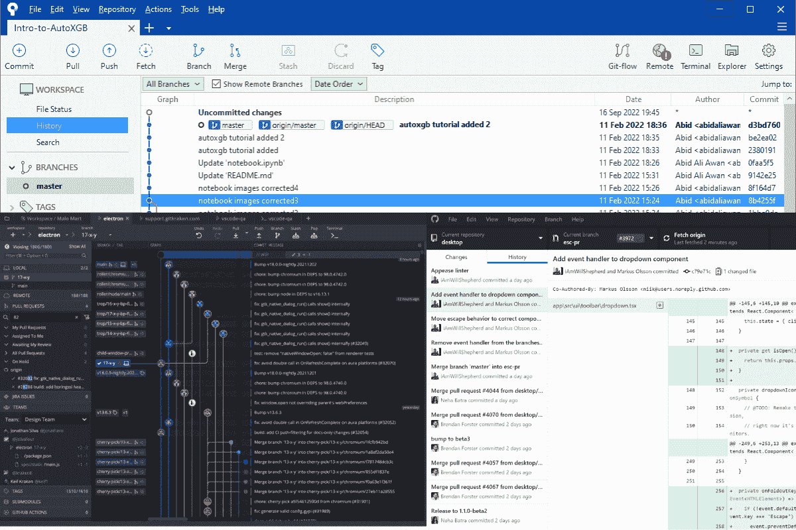
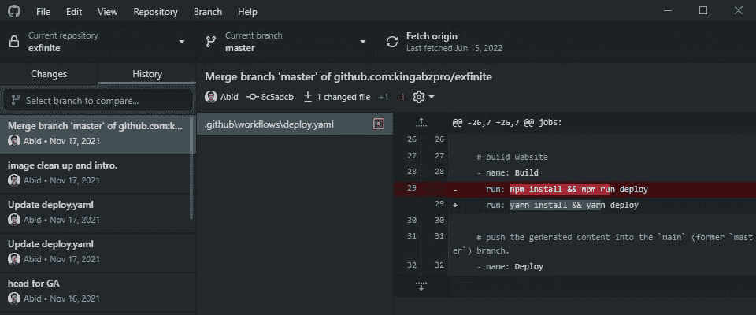
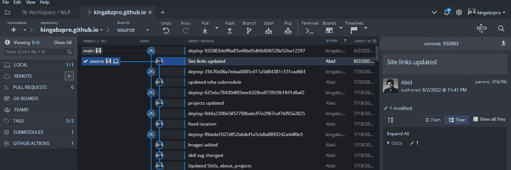
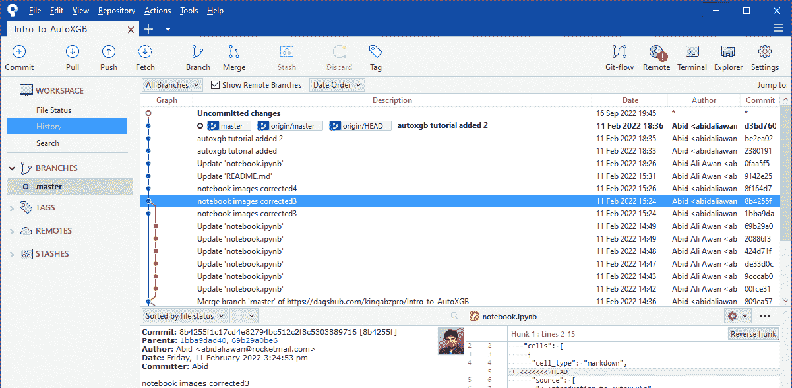

# 适合初学者的顶级免费 Git GUI 客户端

> 原文：[`www.kdnuggets.com/2022/10/top-free-git-gui-clients-beginners.html`](https://www.kdnuggets.com/2022/10/top-free-git-gui-clients-beginners.html)

图片来源：作者

Git 是基于终端的软件，让我们能够对文件进行版本控制、与团队协作和维护历史记录。简而言之，它已经成为软件开发的标准工具。

* * *

## 我们的前 3 个课程推荐

 1\. [Google 网络安全证书](https://www.kdnuggets.com/google-cybersecurity) - 快速进入网络安全职业生涯。

 2\. [Google 数据分析专业证书](https://www.kdnuggets.com/google-data-analytics) - 提升您的数据分析技能

 3\. [Google IT 支持专业证书](https://www.kdnuggets.com/google-itsupport) - 支持您组织的 IT

* * *

大多数软件工程师和开发人员习惯使用基于终端的工具。他们甚至使用 Vim 编写代码，测试程序，并通过终端推送更改。

对于初学者或数据专业人士来说，这是一个完全不同的世界。我们很难记住 Git 终端命令和快捷键。

这就是 Git GUI 发挥作用的地方。GUI 客户端提供了一个适合初学者的环境，您可以通过点击按钮和查看交互式提交历史记录来执行大多数任务。

在这篇文章中，我们将探讨适合初学者的软件来执行所有基于 Git 的任务。我们还将查看其主要功能和缺点，以评估哪些工具在您的独特情况下效果最佳。

# 前 3 名 Git GUI 客户端

## 1\. GitHub Desktop

图片来源：作者

[GitHub Desktop](https://desktop.github.com/) 是最适合初学者的应用程序。它易于操作，您可以实时查看存储库中的更改。请在 Windows 和 macOS 上下载并亲自体验。

您可以使用 GitHub Desktop 跟踪任何远程服务器上的 Git 存储库。为此，您需要提供存储库 URL 和身份验证凭据以克隆并开始处理项目。

**功能：**

+   轻松地将共同作者添加到您的提交中

+   检出带有拉取请求的分支

+   查看实时 CI 状态

+   语法高亮显示的差异

+   扩展的图像差异支持

+   从应用程序中访问您最喜欢的编辑器或终端

+   社区支持的开源软件

从一开始我就一直在使用 GitHub Desktop。我非常喜欢它，它对我来说非常容易操作。

独立软件的问题在于我必须在编辑器和 Git 客户端之间切换。此外，它缺乏项目管理和开发辅助功能。

## 2\. GitKraken

作者提供的图像

[GitKraken](https://www.gitkraken.com/) 是一个综合的 GitOps 解决方案，旨在提升你的开发体验。你可以邀请团队成员加入工作空间，并在项目上进行协作。它允许你在工作空间内管理所有的远程仓库。

如果你想要一个功能丰富的独立 Git GUI，我建议你立刻安装它。它是免费的，并且将帮助你理解开发过程。

**功能：**

+   交互式提交历史

+   命令面板

+   内置代码编辑器

+   语法高亮

+   内置增强终端支持

+   检测并警报潜在的合并冲突

+   安全解决合并冲突

+   创建和管理拉取请求

+   交互式变基

+   一键撤销更改

+   团队支持

+   与 GitHub、GitLab、Azure DevOps 和 Bitbucket 集成，创建简化的工作流程

我使用 Gitkraken 已经两年了，我非常喜欢一键撤销功能。你可以创建个人资料并与团队成员互动。

如果你在寻找一种可以满足所有软件需求的软件，Gitkraken 应该是你的选择。

刚开始时，你可能会被众多选项弄得有些困惑，但我相信，几天内你就会理解这些功能的意义。如果不然？那么你可以根据需要随时修改外观，去掉多余的标签。

## 3. Sourcetree

作者提供的图像

[Sourcetree](https://www.sourcetreeapp.com/) 是另一个免费的 Git GUI 客户端，适用于 Windows 和 MAC。它简单且互动，适合初学者和数据专业人士。它类似于 GitHub Desktop，并且很轻量。你只需安装并开始项目工作即可。

**功能：**

+   可视化你的代码和图像

+   可视化你的工作，并自信地推送

+   易于丢弃更改、文件和块或行。

+   跟踪你的工作状态

+   可视化进度

+   本地提交搜索

+   交互式变基

+   远程仓库管理器

它比 GitHub Desktop 更加干净、轻便，并且功能更多。如果你使用 Bitbucket 作为远程仓库，我强烈推荐你安装它，并体验流畅的集成。

# 结论

使用 Git GUI 有助于你快速学习开发过程。你不需要记住命令和设置环境，而是使用图形用户界面来帮助你。

如果你在寻找一个一站式解决方案，涵盖开发、测试、Git、部署和协作，那么我建议你安装 IDE。更推荐的是**Visual Studio Code**。这些集成开发环境可以实时跟踪更改，为你提供流畅的用户体验。简而言之，你无需在多个应用程序之间切换。

在这篇文章中，我们了解了前三名免费 Git 图形用户界面客户端以及它们对初学者的好处。如果你有兴趣了解更多关于 Git 功能或扩展的内容，请在评论中告诉我，我会尽力在下次写出来。

**[Abid Ali Awan](https://www.polywork.com/kingabzpro)** ([@1abidaliawan](https://twitter.com/1abidaliawan)) 是一位认证的数据科学专业人士，喜欢构建机器学习模型。目前，他专注于内容创作，并撰写关于机器学习和数据科学技术的技术博客。Abid 拥有技术管理硕士学位和电信工程学士学位。他的愿景是使用图神经网络构建一个 AI 产品，以帮助那些面临心理健康问题的学生。

### 更多相关话题

+   [KDnuggets 新闻，10 月 5 日：初学者的顶级免费 Git 图形用户界面客户端 •…](https://www.kdnuggets.com/2022/n39.html)

+   [数据科学家必备的 14 个 Git 命令](https://www.kdnuggets.com/2022/06/14-essential-git-commands-data-scientists.html)

+   [数据科学 Git 备忘单](https://www.kdnuggets.com/2022/11/git-data-science-cheatsheet.html)

+   [10 种高级 Git 技巧](https://www.kdnuggets.com/10-advanced-git-techniques)

+   [初学者免费 MLOps 速成课程](https://www.kdnuggets.com/2022/08/free-mlops-crash-course.html)

+   [初学者免费 AI 课程](https://www.kdnuggets.com/2022/08/free-ai-beginners-course.html)
