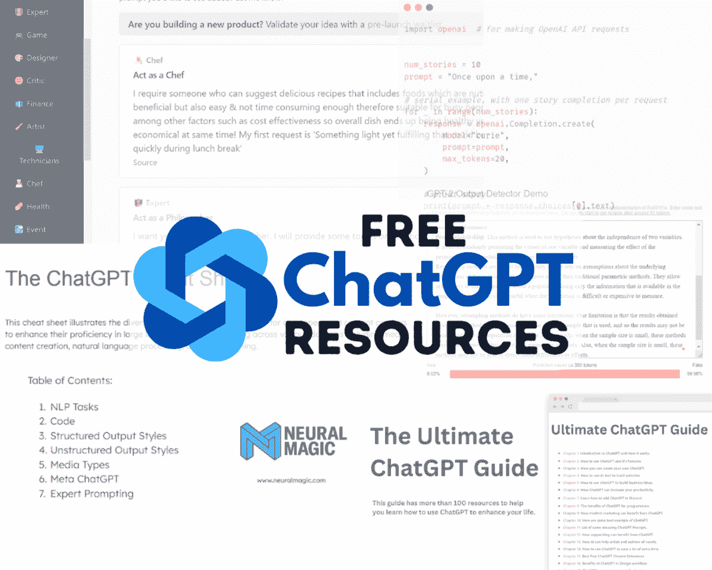

# 顶级免费资源来学习 ChatGPT

> 原文：[`www.kdnuggets.com/2023/02/top-free-resources-learn-chatgpt.html`](https://www.kdnuggets.com/2023/02/top-free-resources-learn-chatgpt.html)

作者提供的图片

到现在，大多数使用互联网的人都知道 ChatGPT 及其功能。但他们对它的工作原理和使用方法缺乏了解。

* * *

## 我们的前三个课程推荐

 1\. [Google 网络安全证书](https://www.kdnuggets.com/google-cybersecurity) - 快速进入网络安全职业的捷径。

 2\. [Google 数据分析专业证书](https://www.kdnuggets.com/google-data-analytics) - 提升你的数据分析能力

 3\. [Google IT 支持专业证书](https://www.kdnuggets.com/google-itsupport) - 支持组织的 IT 工作。

* * *

在这篇博客中，我们将涵盖理解 ChatGPT 基础知识、提升使用 OpenAI API 的技能、微调 GPT 模型和提高提示技巧的免费资源。你还将学习如何使用 ChatGPT 创建应用程序、分析数据并提高生产力。

> 记住，AI 已经成为常态。你需要开始学习它，以便未来不被淘汰。

# 备忘单

+   ChatGPT 备忘单：学习 ChatGPT 在 NLP、代码、结构和非结构化输出、媒体类型和元 ChatGPT 的技巧和窍门。

+   [OpenAI Cookbook](https://github.com/openai/openai-cookbook)：用于理解 OpenAI API 并利用其构建 ChatGPT 应用程序。它还包含 GPT3、嵌入和微调的代码示例。

# 书籍

+   [终极 ChatGPT 指南](https://hasantoxr.gumroad.com/l/gpt)：100 个资源，提升你的 ChatGPT 使用体验。

+   [ChatGPT 提示的艺术：创建清晰有效提示的指南](https://fka.gumroad.com/l/art-of-chatgpt-prompting)：学习制定引人入胜且富有信息量的 ChatGPT 提示的策略。

+   [软件工程师的 10 个 ChatGPT 提示](https://sergiorocks.gumroad.com/l/chatgpt-prompts-for-software-engineers)：学习如何为软件工程任务创建提示。

# 学习 ChatGPT 提示

+   [Learn Prompting](https://learnprompting.org/)：参加一个全面的免费课程，学习关于 AI 提示的所有内容。从 Stable Diffusion 到 LLMs。

+   [Awesome ChatGPT Prompts](https://prompts.chat/)：由开源社区贡献的简单 ChatGPT 提示库。

+   [ChatGPT 提示和产品](https://chatgpt.getlaunchlist.com/)：互动网站，按类别筛选各种提示。

# ChatGPT 教程

+   [初学者的 Chat GPT 快速入门课程](https://www.youtube.com/watch?v=JTxsNm9IdYU)：一个为新手创建 OpenAI 账户并开始使用 ChatGPT 的入门教程。

+   [我如何使用 ChatGPT 编码一个完整的网站](https://www.youtube.com/watch?v=ng438SIXyW4)：使用 ChatGPT 创建一个功能齐全的网站并将其托管在线上。

+   [提高生产力的 38 种方法](https://www.youtube.com/watch?v=sTeoEFzVNSc)：通过 38 个 Python、JavaScript、HTML、CSS、React 和 SQL 代码示例学习提高生产力。

+   [使用 ChatGPT 分析数据](https://www.youtube.com/watch?v=Dw0irOIJYnA)：对数据科学家和分析师极力推荐。你可以学习使用 ChatGPT 执行各种分析任务，甚至创建机器学习模型。

# 博客

+   ChatGPT 作为 Python 编程助手：通过遵循简单的指南提升 Python 编程技能。

+   ChatGPT：你需要知道的一切：用通俗的英语解释 ChatGPT。

+   [创建你自己的 ChatGPT](https://ai.plainenglish.io/creating-your-own-chatgpt-a-guide-to-fine-tuning-llms-with-lora-d7817b77fac0)：学习如何使用 LoRA 对 LLMs 进行微调，使用最少的资源。

+   检测 ChatGPT、GPT3 和 GPT2 的 5 个免费工具：用于内容审查和防止滥用的 ChatGPT 检测工具。

# 终极指南

[Prompt-Engineering-Guide](https://github.com/dair-ai/Prompt-Engineering-Guide) 是终极资源。它包含用户指南、研究论文、工具和库、数据集、博客以及关于 ChatGPT 的教程。

ChatGPT 是相当新的，人们仍在探索如何将其整合到工作场所。本文提到的学习指南和资源将帮助你入门。它还将帮助你理解如何使用 OpenAI API 来构建你的应用程序或创建令人惊叹的内容。

**[Abid Ali Awan](https://www.polywork.com/kingabzpro)** ([@1abidaliawan](https://twitter.com/1abidaliawan)) 是一位认证的数据科学专业人士，热爱构建机器学习模型。目前，他专注于内容创作，并撰写关于机器学习和数据科学技术的技术博客。Abid 拥有技术管理硕士学位和电信工程学士学位。他的愿景是利用图神经网络构建一款 AI 产品，帮助那些在精神健康方面挣扎的学生。

### 更多相关话题

+   [学习机器学习线性代数的 3 个最佳免费资源](https://www.kdnuggets.com/2022/03/top-3-free-resources-learn-linear-algebra-machine-learning.html)

+   [学习数据分析和数据科学的最佳免费资源](https://www.kdnuggets.com/2024/03/365datascience-best-free-resources-learn-data-analysis-data-science)

+   [学习 LLMs 的 10 个免费资源](https://www.kdnuggets.com/10-free-resources-to-learn-llms)

+   [学习高级 SQL 技术的 5 个最佳免费资源](https://www.kdnuggets.com/top-5-free-resources-for-learning-advanced-sql-techniques)

+   [最佳数据科学资源、训练营和课程来学习…](https://www.kdnuggets.com/2023/12/springboard-best-data-science-resources-bootcamp-courses-learn-data-science-new-year)

+   [学习如何免费使用 ChatGPT Next Web (NextChat)](https://www.kdnuggets.com/learn-how-to-use-chatgpt-next-web-nextchat-for-free)
