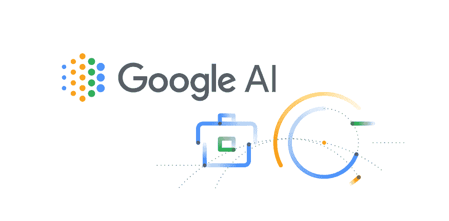
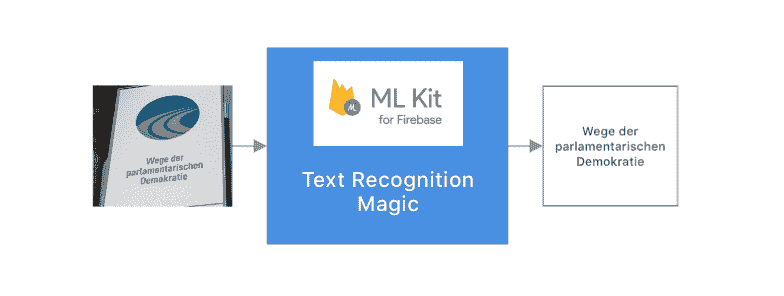
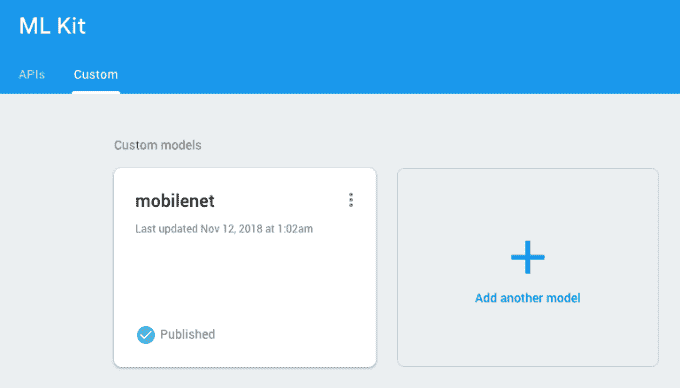
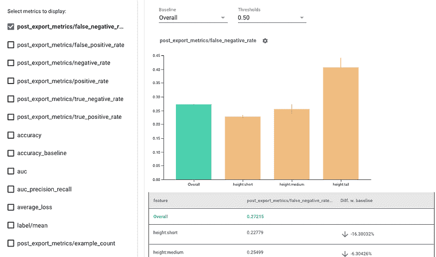
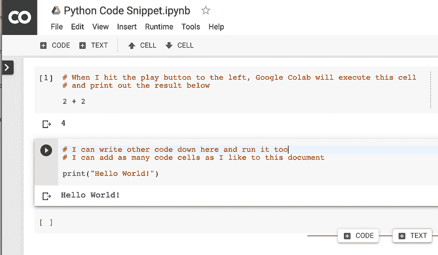
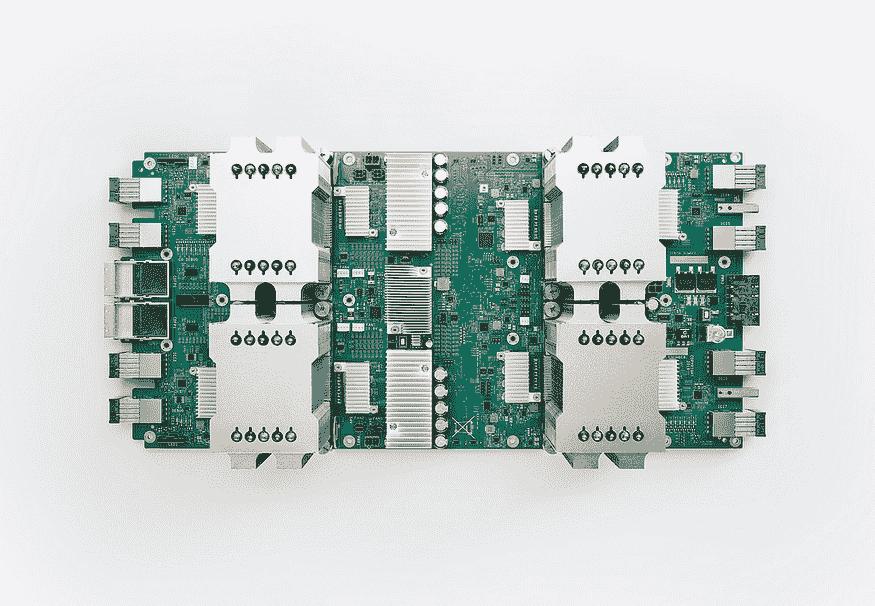

# 顶级 Google AI 和机器学习工具适合每个人

> 原文：[`www.kdnuggets.com/2020/08/top-google-ai-machine-learning-tools.html`](https://www.kdnuggets.com/2020/08/top-google-ai-machine-learning-tools.html)

comments

**由 [Claire D. Costa](https://www.linkedin.com/in/claire-d-costa-a0379419b/)，Digitalogy, LLC 的内容撰写者和战略家**。

*Google AI 将人工智能的好处带给每个人 ([source](https://in.pinterest.com/pin/781585710312288592/))。*

> *“我们希望利用人工智能增强人们的能力，使我们能够完成更多的任务，并允许我们花更多时间在创造性工作上。”* -- Jeff Dean，Google 高级研究员

将 Google 仅仅称为搜索巨头是不够的，因为它从一个简单的搜索引擎迅速发展成了多个关键 IT 领域创新的驱动力。在过去的几年里，Google 已经将其根深深扎入几乎所有数字领域，无论是智能手机、平板电脑、笔记本电脑等消费电子产品，还是 Android 和 Chrome OS 等基础软件，亦或是由 Google 的人工智能支持的智能软件。

Google 一直在智能软件行业积极创新。凭借多年来在搜索和分析数据方面积累的专业知识，Google 创造了多种工具，如 **TensorFlow**、**ML Kit**、**Cloud AI** 等，供热衷者和初学者尝试理解人工智能的能力。

> Google AI 专注于将人工智能的好处带给每个人。

以下各节将详细介绍 Google 如何针对开发者、研究人员和组织等特定用户群体来设计其工具套件，以及他们如何从 Google 的人工智能工具中获益。

### 对于开发者

随着更多开发者看到人工智能的潜力而深入这一领域，Google 正通过提供多个强大的工具来满足他们不断变化的需求，如：

**TensorFlow**

> 革命已经来临！欢迎使用 TensorFlow 2.0。

[TensorFlow](https://www.tensorflow.org/js/) 是 Google 提供给世界的端到端开源深度学习库，利用 [机器学习](https://hackernoon.com/the-simplest-explanation-of-machine-learning-youll-ever-read-bebc0700047c) 改善其各种产品提供的服务。使用 TensorFlow 的工具和库，开发者可以构建高精度且定义明确的机器学习模型。

TensorFlow 提供了顺畅的模型构建和灵活的多设备部署，使得创建和部署复杂的人工智能模型变得轻松。借助强大的社区支持，无论你是新手还是有经验的从业者，都可以获得大量的创意。

来看看一些示例 [这里](https://github.com/tensorflow/tfjs-examples)。

**ML Kit**

*ML Kit 将 Google 的机器学习专业知识以强大且易于使用的方式带给移动开发者 ([source](https://www.youtube.com/watch?v=ejrn_JHksws))。*

[ML Kit](https://firebase.google.com/products/ml-kit) 是一个**仅限移动端的 SDK**，目前可用于 Android 和 iOS，利用 Google 的机器学习技术为你的移动应用程序提供解决现实世界问题的能力。[ML Kit](https://developers.google.com/ml-kit) 可以帮助你成功完成由底层机器学习技术驱动的任务，例如：

+   **语言识别**

> *将文本传递给 ML Kit -> 获取文本中的检测语言*

这支持超过 100 种语言，包括印地语、阿拉伯语、中文等！在[这里](https://firebase.google.com/docs/ml-kit/langid-support)查看所有支持的语言列表。

+   [**文本识别**](https://firebase.google.com/docs/ml-kit/recognize-text)

> 拍照 -> 获取图片中的文本

*ML Kit 提取图片中存在的任何文本 ([source](https://medium.com/@bapspatil/ok-ml-kit-how-smart-are-you-83c9e58b7330))。*

+   **图像扫描与标记**

> 拍照 -> 获取图片中的对象列表

+   **面部识别**

> 拍照 -> 获取图片中的所有面孔

+   **智能回复**

> 传递消息到 ML Kit -> 获取 3 条智能回复

*ML Kit 为你提供 3 条智能回复。*

+   **条形码扫描**

> 拍照 -> 从扫描的条形码/二维码中获取信息

*ML Kit 支持从条形码中扫描和提取信息 ([source](https://medium.com/@bapspatil/ok-ml-kit-how-smart-are-you-83c9e58b7330))。*

+   **与 TensorFlow Lite 的自定义模型集成**

通过现成的 API，支持设备端或云端实现多种用例，你可以轻松地将 ML 模型应用到数据中，并通过与 TensorFlow Lite 的自定义集成选项跟踪应用的性能。

*此选项允许你将 TensorFlow Lite 模型添加到 ML Kit 并使用它们 ([source](https://medium.com/@bapspatil/ok-ml-kit-how-smart-are-you-83c9e58b7330))。*

### Google 开源

*Google 开源将开源的所有价值带给 Google，将 Google 的所有资源带给开源 ([source](https://opensource.google/))。*

随着新软件的不断开发，总是需要将其提升到一个新的水平。一旦开发者开始创建开源代码，社区才能积极参与并帮助改进和扩展它。通过自由获取的代码，开发者可以通过访问代码库来修改和扩展代码，通常在此过程中**解决复杂问题**。

Google 承诺通过鼓励开发者将他们的代码开放给任何有兴趣的人来汇聚开发者。Google 提供了大量免费的[开源项目](https://opensource.googleblog.com/)，例如：

+   *ClusterFuzz*，在过去两年中在多个项目中发现了超过 11000 个漏洞。

+   *AutoFlip*，智能地重新框定视频以适应现代设备。

+   *Blockly*，通过拖放代码块提供简单的编码方式，这些代码块甚至可以用于创建业务逻辑。

**Fairness Indicators**

Google 在其开源倡议中提供了 Fairness Indicators。这是一个提供量化机器学习系统公平性指标的工具。**由 TensorFlow 提供支持**，其目的是消除机器学习系统中的任何偏见，同时提高公平性并减少不公平偏见对系统和组织的影响。随着需求的增长，Google 设计了这个工具，考虑了各种类型的企业。

*使用 Fairness Indicators 可视化公平性评估指标 ([source](https://blog.tensorflow.org/2019/12/fairness-indicators-fair-ML-systems.html))。*

**CoLaboratory**

*开始使用 Python 与 Google Colaboratory ([source](https://lambdachops.com/start-writing-python-with-google-colab))。*

[Colaboratory 或 Colab](https://colab.research.google.com/notebooks/intro.ipynb) 简称是一个在线 Python 代码编辑器和编译器。可以将其视为 Google Docs，但用于 Python，并由 Google Drive 等提供的存储功能支持。使用起来相对简单，消除了跨多个用户共享配置的麻烦，简化了协作过程。它还提供了远程编写代码的能力，可以创建 markdown 以详细解释代码片段。

*开始使用 Google Colaboratory ([source](https://www.youtube.com/watch?v=inN8seMm7UI))。*

### 对于研究人员

在深入研究一个新领域时，广泛的研究是绝对必要的。Google 通过提供现有模型生成的全面而丰富的数据集，这些数据集对用户开放，简化了获取过程，并提供了以下工具：

**Google Datasets**

对于每个机器学习模型，根本问题是用正确的数据进行训练。Google Datasets 通过提供数据集来解决这个问题。

[Google Datasets](https://cloud.google.com/public-datasets) 是由 Google 策划的一个数据集集合，定期通过分析研究人员的广泛兴趣进行更新。

Google 提供了**广泛的数据集类别，包括图像、转录音频、视频和文本**。针对各种用户和不同用例，每个类别都提供了详细的数据集介绍和便于访问的下载链接。

一旦用户下载数据集并在数据集上训练他们的模型，他们可以为真实世界场景准备他们的模型。可以通过 Google Dataset Search 搜索更多数据集。

**Google Dataset Search**

由于互联网中的每个模型都生成其数据集，Google 通过提供搜索功能帮助简化了与其他用户共享数据集的过程。类似于其在网络上搜索任何内容的搜索服务，[Google 的数据集搜索](https://datasetsearch.research.google.com/)可以缩小你寻找数据集的范围。在那里，你可以了解更多关于数据集的信息并获取它。

> 数据为王，Google 知道这一点

**Crowdsource**

Google 的另一项举措通过向用户提供有趣的挑战来提高数据集的准确性，要求他们识别各种类别的图片，如图画、字母、报纸、插图等。

在这些类别中，贡献者可以从提供的选项中识别和标记图片，以改善 Google 的服务。如果你有那种竞争精神，开始贡献后，你将获得一个有趣的徽章和成就里程碑。

*通过 Google Crowdsource 改进你的产品 ([source](https://www.youtube.com/watch?v=oLTNtvIHJ7M)).*

[Google Crowdsource](https://crowdsource.google.com/) 不仅仅在图片上工作，还涉及其他多个领域，如：

+   手写识别

+   面部表情

+   翻译

+   翻译验证

+   图片说明

+   图片标签验证

### 对于组织

通过密切监控市场，Google 能够识别其服务如何将企业的潜在里程碑转化为已实现的目标。Google 向企业提供的工具可以简化工作流程，并通过采用 AI 和 ML 专业知识达到新的高度。从精准的数据集、定制模型、高性能的云服务等方面，Google 可以为各种规模的企业提供丰富的选择。

一些组织已从 Google 的 AI 工具中获益，如 [Lyft](https://cloud.google.com/customers/lyft)、[Max Kelsen](https://cloud.google.com/customers/max-kelsen/)、[eBay](https://www.ebay.com/) 和 [Two Sigma](https://www.pionline.com/article/20180417/ONLINE/180419840/two-sigma-adds-google-scientist-for-ai-expansion) 等。组织可以从以下 Google AI 工具中受益。

**Cloud TPU**

*TPU V2 (来源: [Google Cloud Platform Blog](https://blog.google/products/google-cloud/google-cloud-offer-tpus-machine-learning/)).*

进行所有这些数据计算，机器学习需要高性能系统。为此，[Google 构建了其 TPU](https://cloud.google.com/tpu/)，即**张量处理单元**，正是为此而设计的。通过提供所需的强大计算能力，而无需任何本地设置，Cloud TPU 使企业能够通过降低硬件成本向客户提供最佳服务。

企业可以选择其首选的云 TPU，从较少要求的任务到最具挑战性的任务，并从以下提供的选项中选择：

+   Cloud TPU v2

+   Cloud TPU v3

+   Cloud TPU v2 Pod

+   Cloud TPU v3 Pod

**云人工智能**

[云人工智能](https://cloud.google.com/products/ai) 使你能够将机器学习能力实施到你的业务中，使其随时准备应对新的挑战。使用云人工智能，企业可以使用谷歌提供的现有模型，也可以自行定制符合自己需求的模型。

云人工智能分为三个组成部分。云人工智能包括 —

+   *AI Hub*：提供一系列可直接使用的 AI 组件，支持模型的分享和实验。

+   *AI Building Blocks*：允许开发者将对话、视觉、语言、结构化数据和 Cloud AutoML 能力添加到他们的应用程序中。

+   *AI Platform*：AI Platform 使数据科学家、工程师和开发者能够迅速将他们的想法转化为实际部署，提供了如 AI Platform Notebooks、深度学习容器、数据标注服务、持续评估、AI Platform Training 等多个服务。

**Cloud AutoML**

被迪士尼、Imagia、Meredith 等知名品牌使用，[Cloud AutoML](https://cloud.google.com/automl) 使自定义[机器学习](https://towardsdatascience.com/googles-automl-will-change-how-businesses-use-machine-learning-c7d72257aba9)模型的培训变得轻而易举，以生成高质量的培训数据。与其他谷歌服务完全集成，并且服务间的转移过程无缝对接，你的企业可以通过最大化输出实现其全部潜力。

*开始使用 AutoML ([source](https://www.youtube.com/watch?v=kgxfdTh9lz0))。*

### 结论

人工智能出现的时间相对较短，但我们随时间发现的进展和应用令人惊叹。考虑到人工智能的好处，企业可以通过早期采用人工智能和机器学习并进行实验，获得竞争优势。

谷歌在这一领域持续进行创新，推出了多个工具，如**ML Kit**、**TensorFlow**、**Fire Indicators**等，服务于包括开发者、研究人员和企业在内的多种用户。通过鼓励使用其云人工智能工具，谷歌试图提升人工智能和机器学习在现实世界中的应用。

其目的是通过精准的评估、协作、改进和部署定制的机器学习模型，来提升用户的生产力和服务质量。

[原文](https://towardsdatascience.com/top-google-ai-tools-for-everyone-60346ab7e08)。转载时获得许可。

**Bio:** [Claire D. Costa](https://www.linkedin.com/in/claire-d-costa-a0379419b/) 是 Digitalogy 的内容创作者和市场营销人员，Digitalogy 是一个技术采购和定制匹配市场。

**相关内容：**

+   [端到端机器学习平台概览](https://www.kdnuggets.com/2020/07/tour-end-to-end-machine-learning-platforms.html)

+   [为什么你应该获得谷歌的新机器学习证书](https://www.kdnuggets.com/2020/07/googles-new-machine-learning-certificate.html)

+   [5 个谷歌 Colaboratory 小贴士](https://www.kdnuggets.com/2020/03/5-google-colaboratory-tips.html)

* * *

## 我们的前三大课程推荐

 1\. [谷歌网络安全证书](https://www.kdnuggets.com/google-cybersecurity) - 快速进入网络安全职业轨道

 2\. [谷歌数据分析专业证书](https://www.kdnuggets.com/google-data-analytics) - 提升你的数据分析能力

 3\. [谷歌 IT 支持专业证书](https://www.kdnuggets.com/google-itsupport) - 支持你的组织 IT

* * *

### 更多相关主题

+   [学习数据科学统计学的最佳资源](https://www.kdnuggets.com/2021/12/springboard-top-resources-learn-data-science-statistics.html)

+   [停止学习数据科学以寻找目标，寻找目标以……](https://www.kdnuggets.com/2021/12/stop-learning-data-science-find-purpose.html)

+   [分析一个 90 亿美元的 AI 失败](https://www.kdnuggets.com/2021/12/9b-ai-failure-examined.html)

+   [成功数据科学家的五大特征](https://www.kdnuggets.com/2021/12/5-characteristics-successful-data-scientist.html)

+   [是什么使 Python 成为初创公司的理想编程语言](https://www.kdnuggets.com/2021/12/makes-python-ideal-programming-language-startups.html)

+   [每个数据科学家都应该知道的三个 R 库（即使你使用 Python）](https://www.kdnuggets.com/2021/12/three-r-libraries-every-data-scientist-know-even-python.html)
